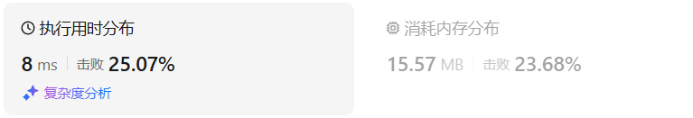
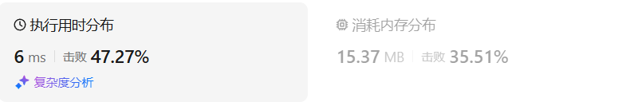
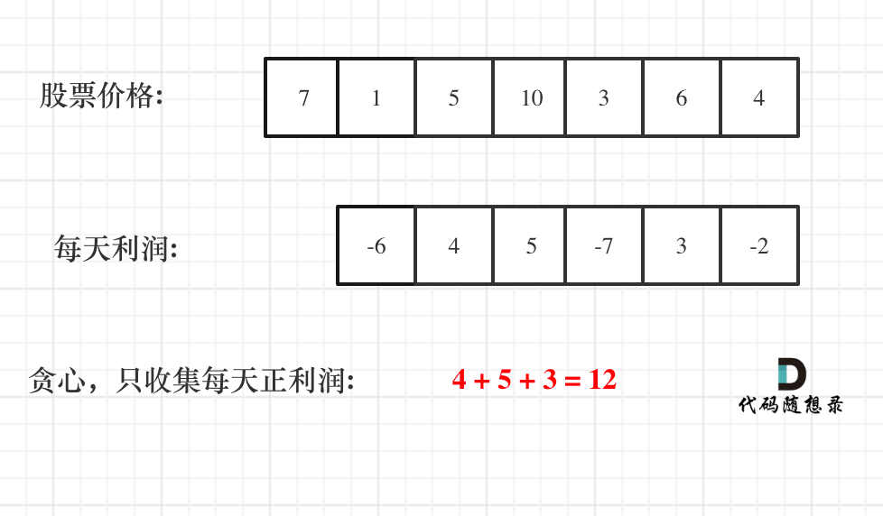
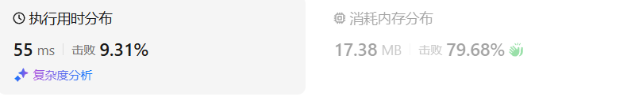

# 122买卖股票的最佳时机II（中等）

[122. 买卖股票的最佳时机 II - 力扣（LeetCode）](https://leetcode.cn/problems/best-time-to-buy-and-sell-stock-ii/description/)

## 题目描述

给你一个整数数组 `prices` ，其中 `prices[i]` 表示某支股票第 `i` 天的价格。

在每一天，你可以决定是否购买和/或出售股票。你在任何时候 **最多** 只能持有 **一股** 股票。你也可以先购买，然后在 **同一天** 出售。

返回 *你能获得的 **最大** 利润* 。

 

**示例 1：**

```
输入：prices = [7,1,5,3,6,4]
输出：7
解释：在第 2 天（股票价格 = 1）的时候买入，在第 3 天（股票价格 = 5）的时候卖出, 这笔交易所能获得利润 = 5 - 1 = 4。
随后，在第 4 天（股票价格 = 3）的时候买入，在第 5 天（股票价格 = 6）的时候卖出, 这笔交易所能获得利润 = 6 - 3 = 3。
最大总利润为 4 + 3 = 7 。
```

**示例 2：**

```
输入：prices = [1,2,3,4,5]
输出：4
解释：在第 1 天（股票价格 = 1）的时候买入，在第 5 天 （股票价格 = 5）的时候卖出, 这笔交易所能获得利润 = 5 - 1 = 4。
最大总利润为 4 。
```

**示例 3：**

```
输入：prices = [7,6,4,3,1]
输出：0
解释：在这种情况下, 交易无法获得正利润，所以不参与交易可以获得最大利润，最大利润为 0。
```

 

**提示：**

- `1 <= prices.length <= 3 * 10^4`
- `0 <= prices[i] <= 10^4`

## 我的C++解法

这个问题可以联想到之前的一个问题

```cpp
class Solution {
public:
    int maxProfit(vector<int>& prices) {
        // 这个问题，如果price有单调不减序列的话，则在波谷买入，波峰卖出
        // 如果单调不增，则不买不卖
        // 可以转化为之前做的摆动序列问题
        if(prices.size()<=1)    return 0;
        int sum=0;
        int low_pos = 0;
        int high_pos = 0;
        int pre_high_pos = 0;
        for(int i=1;i<prices.size();i++){
            if(prices[i]>=prices[i-1]){
                // 递增了
                pre_high_pos = high_pos;
                high_pos = i;
            }
            else if(prices[i]<prices[i-1]){
                // 递减了
                if(pre_high_pos!=high_pos){
                    sum += (prices[high_pos]-prices[low_pos]);
                    pre_high_pos = high_pos;
                }
                low_pos = i;
            }
        }
        if(high_pos==prices.size()-1)  sum += (prices[high_pos]-prices[low_pos]);
        return sum;
    }
};
```

结果：



在编写的时候出了不少错误：

最开始我是用high,low,pre_high三个变量来判断的，

```cpp
        for(int i=1;i<prices.size();i++){
            if(prices[i]>prices[i-1]){
                // 递增了
                prehigh = high;
                high = prices[i];
                count++;
            }
            else if(prices[i]<prices[i-1]){
                // 递减了
                if(prehigh!=high)    sum += (high-low);
                low = prices[i];
            }
        }
        if(count==prices.size()-1)  return prices[count]-prices[0];
        return sum;
```

这样子对示例`[6,1,3,2,4,7]`输出错误，因为从2开始，后面都是递增的，但是在递增的逻辑中并没有修改sum的值，使得最后部分不参与计算

修改后：

```cpp
        for(int i=1;i<prices.size();i++){
            if(prices[i]>prices[i-1]){
                // 递增了
                prehigh = high;
                high = prices[i];
            }
            else if(prices[i]<prices[i-1]){
                // 递减了
                if(prehigh!=high)    sum += (high-low);
                low = prices[i];
            }
        }
        if(high==prices[prices.size()-1])  sum += (high-low);
        return sum;
```

在示例`[2,1,2,0,1]`中输出了1，而不是期望的2，原因在于从2到0，进入递减处理逻辑，但是此时pre_high和high都是数值2，错误地判断为sum不操作，因此少了1，由此发现需要变更数值为位置参数，这样子判断位置关系而不是数值

```cpp
        for(int i=1;i<prices.size();i++){
            if(prices[i]>prices[i-1]){
                // 递增了
                pre_high_pos = high_pos;
                high_pos = i;
            }
            else if(prices[i]<prices[i-1]){
                // 递减了
                if(pre_high_pos!=high_pos)    sum += (prices[high_pos]-prices[low_pos]);
                low_pos = i;
            }
        }
        if(high_pos==prices.size()-1)  sum += (prices[high_pos]-prices[low_pos]);
        return sum;
```

在示例`[3,2,6,5,0,3]`中输出了8而不是期望的7，原因在于从5到0进入递减逻辑，此时pre_high_pos = 0, high_pos=2,low_pos=3,进行了sum加上(6-5)的操作，错在没有及时更新pre_high_pos的大小，使得明明递减了还是进行了加法操作

修改思路：递减操作逻辑中，进行sum操作后吧pre置为当前最大位置

```cpp
        for(int i=1;i<prices.size();i++){
            if(prices[i]>prices[i-1]){
                // 递增了
                pre_high_pos = high_pos;
                high_pos = i;
            }
            else if(prices[i]<prices[i-1]){
                // 递减了
                if(pre_high_pos!=high_pos){
                    sum += (prices[high_pos]-prices[low_pos]);
                    pre_high_pos = high_pos;
                }
                low_pos = i;
            }
        }
        if(high_pos==prices.size()-1)  sum += (prices[high_pos]-prices[low_pos]);
        return sum;
```

在示例`[1,9,6,9,1,7,1,1,5,9,9,9]`中输出17而不是期望的25，原因在于后半部分1,1,5,9,9,9是递增，且最后三个数都是最大的，但是逻辑中只记录了第一个9的位置，这就导致最后返回sum前的判断语句无效了，因此最后的修改意见就是把递增逻辑判断语句改大于号为>=号即可。这样可以保证最后记录的是最后一个9的位置，使得最后的if语句有效，得到最终的正确作答。


解法二：直接进行遍历

```cpp
class Solution {
public:
    int maxProfit(vector<int>& prices) {
        int ans = 0;
        if(prices.size()<=1)    return ans;
        for(int i=1;i<prices.size();i++){
            if(prices[i]>prices[i-1]){
                ans += (prices[i]-prices[i-1]);
            }
        }
        return ans;
    }
};
```

结果：



这可比前一个做法好多了，真的是我把问题想的太复杂了😅

## C++参考答案



```cpp
class Solution {
public:
    int maxProfit(vector<int>& prices) {
        int result = 0;
        for (int i = 1; i < prices.size(); i++) {
            result += max(prices[i] - prices[i - 1], 0);
        }
        return result;
    }
};
```

## C++收获


## 我的python解答

直接遍历，负数删去，正数加进来

```python
class Solution:
    def maxProfit(self, prices: List[int]) -> int:
        # 直接遍历，如果差值为负则不加入ans
        if len(prices)<=1:  return 0
        ans = 0
        for i in range(1,len(prices)):
            if prices[i]-prices[i-1]>0:
                ans += (prices[i]-prices[i-1])
        return ans
```

结果：



## python参考答案

```python
class Solution:
    def maxProfit(self, prices: List[int]) -> int:
        result = 0
        for i in range(1, len(prices)):
            result += max(prices[i] - prices[i - 1], 0)
        return result
```

## python收获