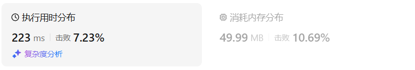

# 55跳跃游戏（中等）

[55. 跳跃游戏 - 力扣（LeetCode）](https://leetcode.cn/problems/jump-game/description/)

## 题目描述

给你一个非负整数数组 `nums` ，你最初位于数组的 **第一个下标** 。数组中的每个元素代表你在该位置可以跳跃的最大长度。

判断你是否能够到达最后一个下标，如果可以，返回 `true` ；否则，返回 `false` 。

 

**示例 1：**

```
输入：nums = [2,3,1,1,4]
输出：true
解释：可以先跳 1 步，从下标 0 到达下标 1, 然后再从下标 1 跳 3 步到达最后一个下标。
```

**示例 2：**

```
输入：nums = [3,2,1,0,4]
输出：false
解释：无论怎样，总会到达下标为 3 的位置。但该下标的最大跳跃长度是 0 ， 所以永远不可能到达最后一个下标。
```

 

**提示：**

- `1 <= nums.length <= 104`
- `0 <= nums[i] <= 105`

## 我的C++解法

看到这个题第一想法是回溯

```cpp
class Solution {
public:
    bool canJump(vector<int>& nums,int start = 0) {
        // 这个题给我的感觉更像是回溯
        int n=nums.size();
        if(start>=n-1)  return true;
        for(int i=start;i<n;i++){
            int sub = n-nums[i]+1;// 距离
            if(sub<=nums[i])    return true;
            for(int j=1;j<nums[i];j++){
                if(canJump(nums,i+j))   return true;
            }
        }
        return false;
    }
};
```

然后报错了，排查了一下是sub距离的计算错了，应该改为`sub = n-i-1;`，然后又报错了，debug了一下，发现是对i的循环终止条件是错误的，应该改为`i<=nums[start]`

但是对于示例`[1,1,1,0]`输出了false

debug了一下发现又是对i的循环出错了，应该改为`i-start<nums[start]`这样该实例就通过了，但是提交后遇到示例`[2,0,6,9,8,4,5,0,8,9,1,2,9,6,8,8,0,6,3,1,2,2,1,2,6,5,3,1,2,2,6,4,2,4,3,0,0,0,3,8,2,4,0,1,2,0,1,4,6,5,8,0,7,9,3,4,6,6,5,8,9,3,4,3,7,0,4,9,0,9,8,4,3,0,7,7,1,9,1,9,4,9,0,1,9,5,7,7,1,5,8,2,8,2,6,8,2,2,7,5,1,7,9,6]`超时了。。。

只能换种思路了

贪心，改来改去，终于A了，对于示例`[4,2,0,0,1,1,4,4,4,0,4,0]`，需要统计当前最大后面是否又连续的num[max_index]个0，如果是的话，则需要更新max为1。

```cpp
class Solution {
public:
    bool canJump(vector<int>& nums) {
        int n = nums.size();
        if(n==1)    return true;
        if(nums[0]==0)  return false;
        int sub = n-1;
        for(int i=0;i<n-1;){
            if(sub-nums[i]<=0)  break;
            if(nums[i]==0)  return false;
            int cur_max = -1;
            int cur_max_index = 0;
            int count_zero = 0;
            for(int j=1;j<=nums[i] && i+j<n;j++){
                if(cur_max_index!=0 && i+j-cur_max_index<=cur_max){
                    if(nums[i+j]==0){
                        count_zero++;
                        continue;
                    }
                }
                if(nums[i+j]>=cur_max || count_zero==nums[cur_max_index]){
                    cur_max=nums[i+j];
                    cur_max_index=i+j;
                    count_zero = 0;
                }
            }
            i=cur_max_index;
            sub = n-i-1;
        }
        return true;
    }
};
```

结果：



## C++参考答案

刚看到本题一开始可能想：当前位置元素如果是 3，我究竟是跳一步呢，还是两步呢，还是三步呢，究竟跳几步才是最优呢？其实跳几步无所谓，关键在于可跳的覆盖范围！不一定非要明确一次究竟跳几步，每次取最大的跳跃步数，这个就是可以跳跃的覆盖范围。这个范围内，别管是怎么跳的，反正一定可以跳过来。

**那么这个问题就转化为跳跃覆盖范围究竟可不可以覆盖到终点！**

每次移动取最大跳跃步数（得到最大的覆盖范围），每移动一个单位，就更新最大覆盖范围。

**贪心算法局部最优解：每次取最大跳跃步数（取最大覆盖范围），整体最优解：最后得到整体最大覆盖范围，看是否能到终点**。

局部最优推出全局最优，找不出反例，试试贪心！


i 每次移动只能在 cover 的范围内移动，每移动一个元素，cover 得到该元素数值（新的覆盖范围）的补充，让 i 继续移动下去。而 cover 每次只取 max(该元素数值补充后的范围, cover 本身范围)。如果 cover 大于等于了终点下标，直接 return true 就可以了。

```cpp
class Solution {
public:
    bool canJump(vector<int>& nums) {
        int cover = 0;
        if (nums.size() == 1) return true; // 只有一个元素，就是能达到
        for (int i = 0; i <= cover; i++) { // 注意这里是小于等于cover
            cover = max(i + nums[i], cover);
            if (cover >= nums.size() - 1) return true; // 说明可以覆盖到终点了
        }
        return false;
    }
};
```

结果：


这道题目关键点在于：不用拘泥于每次究竟跳几步，而是看覆盖范围，覆盖范围内一定是可以跳过来的，不用管是怎么跳的。

```cpp
class Solution {
public:
    bool canJump(vector<int>& nums) {
        int n = nums.size();
        int rightmost = 0;
        for (int i = 0; i < n; ++i) {
            if (i <= rightmost) {
                rightmost = max(rightmost, i + nums[i]);
                if (rightmost >= n - 1) {
                    return true;
                }
            }
        }
        return false;
    }
};
```


## C++收获


## 我的python解答

```python
class Solution:
    def canJump(self, nums: List[int]) -> bool:
        cover = 0
        i=0
        while i<=cover:
            cover = max(cover,i+nums[i])
            i+=1
            if cover>=len(nums)-1:  return True
        return False
```

结果：


## python参考答案

```python
class Solution:
    def canJump(self, nums: List[int]) -> bool:
        cover = 0
        if len(nums) == 1: return True
        i = 0
        # python不支持动态修改for循环中变量,使用while循环代替
        while i <= cover:
            cover = max(i + nums[i], cover)
            if cover >= len(nums) - 1: return True
            i += 1
        return False
```

```python
## for循环
class Solution:
    def canJump(self, nums: List[int]) -> bool:
        cover = 0
        if len(nums) == 1: return True
        for i in range(len(nums)):
            if i <= cover:
                cover = max(i + nums[i], cover)
                if cover >= len(nums) - 1: return True
        return False
```

```python
class Solution:
    def canJump(self, nums: List[int]) -> bool:
        n, rightmost = len(nums), 0
        for i in range(n):
            if i <= rightmost:
                rightmost = max(rightmost, i + nums[i])
                if rightmost >= n - 1:
                    return True
        return False
```

## python收获