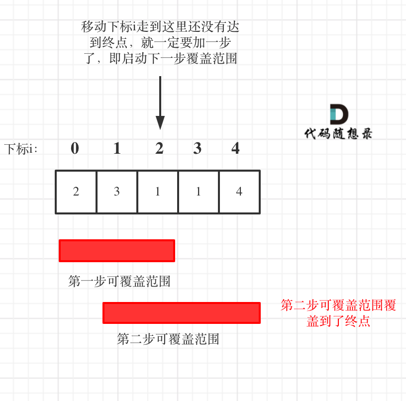
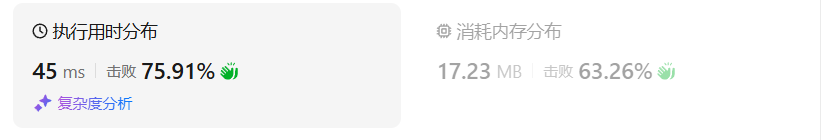

# 45跳跃游戏II（中等）

[45. 跳跃游戏 II - 力扣（LeetCode）](https://leetcode.cn/problems/jump-game-ii/description/)

## 题目描述

给定一个长度为 `n` 的 **0 索引**整数数组 `nums`。初始位置为 `nums[0]`。

每个元素 `nums[i]` 表示从索引 `i` 向前跳转的最大长度。换句话说，如果你在 `nums[i]` 处，你可以跳转到任意 `nums[i + j]` 处:

- `0 <= j <= nums[i]` 
- `i + j < n`

返回到达 `nums[n - 1]` 的最小跳跃次数。生成的测试用例可以到达 `nums[n - 1]`。

 

**示例 1:**

```
输入: nums = [2,3,1,1,4]
输出: 2
解释: 跳到最后一个位置的最小跳跃数是 2。
     从下标为 0 跳到下标为 1 的位置，跳 1 步，然后跳 3 步到达数组的最后一个位置。
```

**示例 2:**

```
输入: nums = [2,3,0,1,4]
输出: 2
```

 

**提示:**

- `1 <= nums.length <= 104`
- `0 <= nums[i] <= 1000`
- 题目保证可以到达 `nums[n-1]`

## 我的C++解法

想到用昨天的方法

```cpp
class Solution {
public:
    int jump(vector<int>& nums) {
        // 既然一定可以到达，那么就用我昨天的做法
        int count = 0;
        for(int i=0;i<nums.size()-1;){
            int max_val = -1;
            int index = 0;
            for(int j=1;j<=nums[i];j++){
                if(i+j>=nums.size()-1)  return count+1;
                if(max_val<=nums[i+j]){
                    max_val = nums[i+j];
                    index = i+j;
                }
            }
            i = index;
            count++;
        }
        return count;
    }
};
```

但是遇到递减的序列出错了`[10,9,8,7,6,5,4,3,2,1,1,0]`，输出了结果10，而不是预期的2

经过思考，得出来一个方法：

计算当前nums[i]所能达到的最大位置end_index，遍历其小区间，寻找能够到达距离end_index最大的点，保留这个点。重复此过程

```cpp
class Solution {
public:
    int jump(vector<int>& nums) {
        // 既然一定可以到达，那么就用我昨天的做法
        int count = 0;
        for(int i=0;i<nums.size()-1;){
            int end_index = min(i+nums[i],int(nums.size()-1));
            // 选择在小区间里面跳跃到距离end最远的点
            int index = 0;
            int diff = INT_MIN;
            for(int j=1;j<=nums[i];j++){
                if(i+j>=nums.size()-1)  return count+1;
                if(diff<=(nums[i+j]+j+i-end_index)){
                    diff = nums[i+j]+j+i-end_index;
                    index = i+j;
                }
            }
            i = index;
            if(i>=nums.size()-1)    return count+1;
            count++;
        }
        return count;
    }
};
```

结果：


## C++参考答案

**要从覆盖范围出发，不管怎么跳，覆盖范围内一定是可以跳到的，以最小的步数增加覆盖范围，覆盖范围一旦覆盖了终点，得到的就是最少步数！**

**这里需要统计两个覆盖范围，当前这一步的最大覆盖和下一步最大覆盖**。如果移动下标达到了当前这一步的最大覆盖最远距离了，还没有到终点的话，那么就必须再走一步来增加覆盖范围，直到覆盖范围覆盖了终点



**图中覆盖范围的意义在于，只要红色的区域，最多两步一定可以到！（不用管具体怎么跳，反正一定可以跳到）**

从图中可以看出来，就是移动下标达到了当前覆盖的最远距离下标时，步数就要加一，来增加覆盖距离。最后的步数就是最少步数。

这里还是有个特殊情况需要考虑，当移动下标达到了当前覆盖的最远距离下标时

- 如果当前覆盖最远距离下标不是是集合终点，步数就加一，还需要继续走。
- 如果当前覆盖最远距离下标就是是集合终点，步数不用加一，因为不能再往后走了。

```cpp
// 版本一
class Solution {
public:
    int jump(vector<int>& nums) {
        if (nums.size() == 1) return 0;
        int curDistance = 0;    // 当前覆盖最远距离下标
        int ans = 0;            // 记录走的最大步数
        int nextDistance = 0;   // 下一步覆盖最远距离下标
        for (int i = 0; i < nums.size(); i++) {
            nextDistance = max(nums[i] + i, nextDistance);  // 更新下一步覆盖最远距离下标
            if (i == curDistance) {                         // 遇到当前覆盖最远距离下标
                ans++;                                  // 需要走下一步
                curDistance = nextDistance;             // 更新当前覆盖最远距离下标（相当于加油了）
                if (nextDistance >= nums.size() - 1) break;  // 当前覆盖最远距到达集合终点，不用做ans++操作了，直接结束
            }
        }
        return ans;
    }
};
```

**针对于方法一的特殊情况，可以统一处理**，即：移动下标只要遇到当前覆盖最远距离的下标，直接步数加一，不考虑是不是终点的情况。

想要达到这样的效果，只要让移动下标，最大只能移动到 nums.size - 2 的地方就可以了。

因为当移动下标指向 nums.size - 2 时：

- 如果移动下标等于当前覆盖最大距离下标， 需要再走一步（即 ans++），因为最后一步一定是可以到的终点。（题目假设总是可以到达数组的最后一个位置），如图：


- 如果移动下标不等于当前覆盖最大距离下标，说明当前覆盖最远距离就可以直接达到终点了，不需要再走一步。如图：


```cpp
// 版本二
class Solution {
public:
    int jump(vector<int>& nums) {
        int curDistance = 0;    // 当前覆盖的最远距离下标
        int ans = 0;            // 记录走的最大步数
        int nextDistance = 0;   // 下一步覆盖的最远距离下标
        for (int i = 0; i < nums.size() - 1; i++) { // 注意这里是小于nums.size() - 1，这是关键所在
            nextDistance = max(nums[i] + i, nextDistance); // 更新下一步覆盖的最远距离下标
            if (i == curDistance) {                 // 遇到当前覆盖的最远距离下标
                curDistance = nextDistance;         // 更新当前覆盖的最远距离下标
                ans++;
            }
        }
        return ans;
    }
};
```


## C++收获


## 我的python解答

```python
class Solution:
    def jump(self, nums: List[int]) -> int:
        if len(nums)==1:    return 0
        if nums[0]>=len(nums)-1:    return 1
        count = 0
        i=0
        while i<len(nums):
            end_index = i+nums[i]
            diff = -1
            index = 0
            for j in range(i+1,i+nums[i]+1):
                if j>=len(nums)-1:  return count+1
                if diff<=j+nums[j]-end_index:
                    diff = j+nums[j]-end_index
                    index = j
            i = index
            count +=1
        return count
```

结果：



## python参考答案

```python
class Solution:
    def jump(self, nums):
        if len(nums) == 1:
            return 0
        
        cur_distance = 0  # 当前覆盖最远距离下标
        ans = 0  # 记录走的最大步数
        next_distance = 0  # 下一步覆盖最远距离下标
        
        for i in range(len(nums)):
            next_distance = max(nums[i] + i, next_distance)  # 更新下一步覆盖最远距离下标
            if i == cur_distance:  # 遇到当前覆盖最远距离下标
                ans += 1  # 需要走下一步
                cur_distance = next_distance  # 更新当前覆盖最远距离下标（相当于加油了）
                if next_distance >= len(nums) - 1:  # 当前覆盖最远距离达到数组末尾，不用再做ans++操作，直接结束
                    break
        
        return ans
```


```python
class Solution:
    def jump(self, nums):
        cur_distance = 0  # 当前覆盖的最远距离下标
        ans = 0  # 记录走的最大步数
        next_distance = 0  # 下一步覆盖的最远距离下标
        
        for i in range(len(nums) - 1):  # 注意这里是小于len(nums) - 1，这是关键所在
            next_distance = max(nums[i] + i, next_distance)  # 更新下一步覆盖的最远距离下标
            if i == cur_distance:  # 遇到当前覆盖的最远距离下标
                cur_distance = next_distance  # 更新当前覆盖的最远距离下标
                ans += 1
        
        return ans
```

```python
class Solution:
    def jump(self, nums) -> int:
        if len(nums)==1:  # 如果数组只有一个元素，不需要跳跃，步数为0
            return 0
        
        i = 0  # 当前位置
        count = 0  # 步数计数器
        cover = 0  # 当前能够覆盖的最远距离
        
        while i <= cover:  # 当前位置小于等于当前能够覆盖的最远距离时循环
            for i in range(i, cover+1):  # 遍历从当前位置到当前能够覆盖的最远距离之间的所有位置
                cover = max(nums[i]+i, cover)  # 更新当前能够覆盖的最远距离
                if cover >= len(nums)-1:  # 如果当前能够覆盖的最远距离达到或超过数组的最后一个位置，直接返回步数+1
                    return count+1
            count += 1  # 每一轮遍历结束后，步数+1
```

```python
class Solution:
    def jump(self, nums: List[int]) -> int:
        result = [10**4+1] * len(nums)  # 初始化结果数组，初始值为一个较大的数
        result[0] = 0  # 起始位置的步数为0

        for i in range(len(nums)):  # 遍历数组
            for j in range(nums[i] + 1):  # 在当前位置能够跳跃的范围内遍历
                if i + j < len(nums):  # 确保下一跳的位置不超过数组范围
                    result[i + j] = min(result[i + j], result[i] + 1)  # 更新到达下一跳位置的最少步数

        return result[-1]  # 返回到达最后一个位置的最少步数
```

## python收获