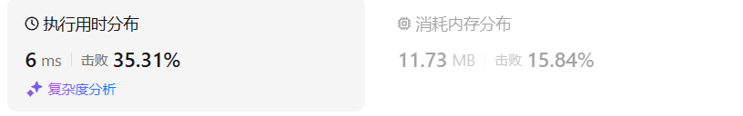
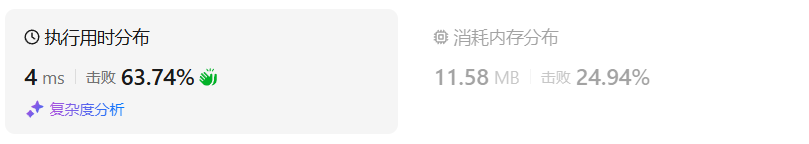
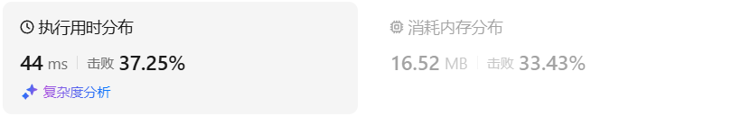

# 1005K次取反后最大化的数组和

[1005. K 次取反后最大化的数组和 - 力扣（LeetCode）](https://leetcode.cn/problems/maximize-sum-of-array-after-k-negations/description/)

## 题目描述

给你一个整数数组 `nums` 和一个整数 `k` ，按以下方法修改该数组：

- 选择某个下标 `i` 并将 `nums[i]` 替换为 `-nums[i]` 。

重复这个过程恰好 `k` 次。可以多次选择同一个下标 `i` 。

以这种方式修改数组后，返回数组 **可能的最大和** 。

 

**示例 1：**

```
输入：nums = [4,2,3], k = 1
输出：5
解释：选择下标 1 ，nums 变为 [4,-2,3] 。
```

**示例 2：**

```
输入：nums = [3,-1,0,2], k = 3
输出：6
解释：选择下标 (1, 2, 2) ，nums 变为 [3,1,0,2] 。
```

**示例 3：**

```
输入：nums = [2,-3,-1,5,-4], k = 2
输出：13
解释：选择下标 (1, 4) ，nums 变为 [2,3,-1,5,4] 。
```

 

**提示：**

- `1 <= nums.length <= 104`
- `-100 <= nums[i] <= 100`
- `1 <= k <= 104`

## 我的C++解法

直接排序，再根据负数的个数确定反转哪些数字

```cpp
class Solution {
public:
    int largestSumAfterKNegations(vector<int>& nums, int k) {
        sort(nums.begin(),nums.end());
        int ans = 0;
        int count_negative = 0;
        for(int i=0;i<nums.size();i++){
            ans += nums[i];
            if(nums[i]<0)   count_negative++;
        }
        if(count_negative==0){
            if(k%2==0){
                //k偶数
                return ans;
            }
            else{
                // k奇数
                return ans-2*nums[0];
            }
        }
        else if(count_negative>=k){
            for(int i=0;i<k;i++){
                ans += (0-nums[i])*2;
            }
            return ans;
        }
        else if(count_negative<k){
            for(int i=0;i<count_negative;i++){
                ans += (0-nums[i])*2;
                nums[i] = 0-nums[i];
            }
            sort(nums.begin(),nums.end());
            k = k-count_negative;
            if(k%2==0){
                //k偶数
                return ans;
            }
            else{
                // k奇数
                return ans-2*nums[0];
            }                
        }
        return ans;
    }
};
```

结果：



其实代码重复的挺多的，可以尝试重构


## C++参考答案

本题的解题步骤为：

- 第一步：将数组按照绝对值大小从大到小排序，**注意要按照绝对值的大小**
- 第二步：从前向后遍历，遇到负数将其变为正数，同时K--
- 第三步：如果K还大于0，那么反复转变数值最小的元素，将K用完
- 第四步：求和

对应C++代码如下：

```cpp
class Solution {
static bool cmp(int a, int b) {
    return abs(a) > abs(b);
}
public:
    int largestSumAfterKNegations(vector<int>& A, int K) {
        sort(A.begin(), A.end(), cmp);       // 第一步
        for (int i = 0; i < A.size(); i++) { // 第二步
            if (A[i] < 0 && K > 0) {
                A[i] *= -1;
                K--;
            }
        }
        if (K % 2 == 1) A[A.size() - 1] *= -1; // 第三步
        int result = 0;
        for (int a : A) result += a;        // 第四步
        return result;
    }
};
```

- 时间复杂度: O(nlogn)
- 空间复杂度: O(1)

结果：



## C++收获

### C++中的accumulate函数

<center>关键词：accumulate<center>

在C++中，`std::accumulate` 是一个函数模板，定义在 `<numeric>` 头文件中，用于计算给定范围内元素的总和。然而，`std::accumulate` 不止可以用来求和，它还可以通过指定不同的二元操作来完成其他类型的累加操作，如乘积、最大值、最小值等。

#### 函数原型：

```cpp
template< class InputIt, class T >
T accumulate( InputIt first, InputIt last, T init );
```

- `InputIt`：输入迭代器类型，可以是任意输入迭代器类型。
- `T`：累加结果的类型，它将作为初始值和累加操作的结果类型。

#### 参数说明：

1. `first`：指向输入范围的开始的迭代器。
2. `last`：指向输入范围的结束的迭代器（不包括）。
3. `init`：初始累加值，累加操作将从这个值开始。

#### 返回值：

- 返回计算得到的累加结果。

#### 使用示例：

##### 求和：

```cpp
#include <iostream>
#include <numeric>
#include <vector>

int main() {
    std::vector<int> nums = {1, 2, 3, 4, 5};
    int sum = std::accumulate(nums.begin(), nums.end(), 0);
    std::cout << "Sum: " << sum << std::endl; // 输出: Sum: 15
    return 0;
}
```

##### 求乘积：

```cpp
#include <iostream>
#include <numeric>

int main() {
    int product = std::accumulate(nums.begin(), nums.end(), 1, std::multiplies<int>());
    std::cout << "Product: " << product << std::endl; // 输出: Product: 120
    return 0;
}
```

在这个例子中，我们使用 `std::multiplies<int>()` 作为二元操作，它将序列中的元素相乘。

##### 求最大值：

```cpp
#include <iostream>
#include <numeric>

int main() {
    int max_value = std::accumulate(nums.begin(), nums.end(), std::numeric_limits<int>::min(), std::greater<int>());
    std::cout << "Max Value: " << max_value << std::endl;
    return 0;
}
```

在这个例子中，我们使用 `std::greater<int>()` 作为二元操作，它会找到序列中的最大值。注意，初始值设置为 `std::numeric_limits<int>::min()`，这是 `int` 类型可能的最小值。

##### 求最小值：

```cpp
#include <iostream>
#include <numeric>

int main() {
    int min_value = std::accumulate(nums.begin(), nums.end(), std::numeric_limits<int>::max(), std::less<int>());
    std::cout << "Min Value: " << min_value << std::endl;
    return 0;
}
```

在这个例子中，我们使用 `std::less<int>()` 作为二元操作，它会找到序列中的最小值。初始值设置为 `std::numeric_limits<int>::max()`，这是 `int` 类型可能的最大值。

`std::accumulate` 是一个非常灵活的函数，可以用于各种类型的累加操作，不仅限于数值类型。通过指定不同的初始值和二元操作，它可以完成求和、求乘积、找最大值、找最小值等多种计算。


## 我的python解答

```python
class Solution:
    def largestSumAfterKNegations(self, nums: List[int], k: int) -> int:
        nums.sort()
        ans = 0
        count = 0
        for x in nums:
            if x<0: count+=1
            ans += x
        if count!=0:
            if count>=k:
                for i in range(k):
                    ans += (0-nums[i])*2
                return ans
            else:
                for i in range(count):
                    ans += (0-nums[i])*2
                    nums[i] = 0-nums[i]
                nums.sort()
                k = k-count
        if k%2==0:
            return ans
        else:
            return ans+(0-nums[0])*2
```

结果：



## python参考答案

```python
class Solution:
    def largestSumAfterKNegations(self, A: List[int], K: int) -> int:
        A.sort(key=lambda x: abs(x), reverse=True)  # 第一步：按照绝对值降序排序数组A

        for i in range(len(A)):  # 第二步：执行K次取反操作
            if A[i] < 0 and K > 0:
                A[i] *= -1
                K -= 1

        if K % 2 == 1:  # 第三步：如果K还有剩余次数，将绝对值最小的元素取反
            A[-1] *= -1

        result = sum(A)  # 第四步：计算数组A的元素和
        return result
```

## python收获