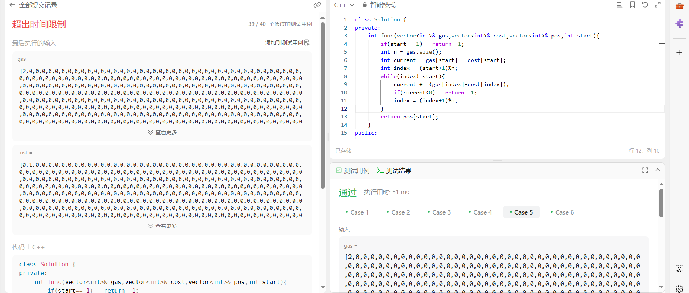
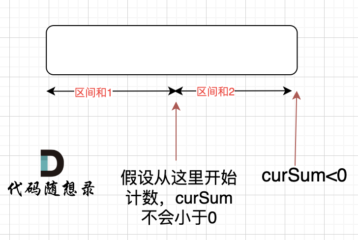

# 134加油站（中等）

[134. 加油站 - 力扣（LeetCode）](https://leetcode.cn/problems/gas-station/description/)

## 题目描述

在一条环路上有 `n` 个加油站，其中第 `i` 个加油站有汽油 `gas[i]` 升。

你有一辆油箱容量无限的的汽车，从第 `i` 个加油站开往第 `i+1` 个加油站需要消耗汽油 `cost[i]` 升。你从其中的一个加油站出发，开始时油箱为空。

给定两个整数数组 `gas` 和 `cost` ，如果你可以按顺序绕环路行驶一周，则返回出发时加油站的编号，否则返回 `-1` 。如果存在解，则 **保证** 它是 **唯一** 的。

 

**示例 1:**

```
输入: gas = [1,2,3,4,5], cost = [3,4,5,1,2]
输出: 3
解释:
从 3 号加油站(索引为 3 处)出发，可获得 4 升汽油。此时油箱有 = 0 + 4 = 4 升汽油
开往 4 号加油站，此时油箱有 4 - 1 + 5 = 8 升汽油
开往 0 号加油站，此时油箱有 8 - 2 + 1 = 7 升汽油
开往 1 号加油站，此时油箱有 7 - 3 + 2 = 6 升汽油
开往 2 号加油站，此时油箱有 6 - 4 + 3 = 5 升汽油
开往 3 号加油站，你需要消耗 5 升汽油，正好足够你返回到 3 号加油站。
因此，3 可为起始索引。
```

**示例 2:**

```
输入: gas = [2,3,4], cost = [3,4,3]
输出: -1
解释:
你不能从 0 号或 1 号加油站出发，因为没有足够的汽油可以让你行驶到下一个加油站。
我们从 2 号加油站出发，可以获得 4 升汽油。 此时油箱有 = 0 + 4 = 4 升汽油
开往 0 号加油站，此时油箱有 4 - 3 + 2 = 3 升汽油
开往 1 号加油站，此时油箱有 3 - 3 + 3 = 3 升汽油
你无法返回 2 号加油站，因为返程需要消耗 4 升汽油，但是你的油箱只有 3 升汽油。
因此，无论怎样，你都不可能绕环路行驶一周。
```

 

**提示:**

- `gas.length == n`
- `cost.length == n`
- `1 <= n <= 105`
- `0 <= gas[i], cost[i] <= 104`

## 我的C++解法

找，如果gas大于等于cost，则以它为起点看看能不能遍历回去

```cpp
class Solution {
public:
    int canCompleteCircuit(vector<int>& gas, vector<int>& cost) {
        // 首先要找到初始的出发站点
        int n = gas.size();
        int start = -1;
        for(int i=0;i<n;i++){
            if(gas[i]>=cost[i]){
                start = i;
                break;
            }
        }
        // start为初始站点
        if(start==-1)   return -1;
        int current = gas[start] - cost[start];
        int index = (start+1)%n;
        while(index!=start){
            current += (gas[index]-cost[index]);
            if(current<0)   return -1;
            index = (index+1)%n;
        }
        return start;
    }
};
```

结果在示例`[5,1,2,3,4]`中输出了-1而不是4。这是因为把开始的位置定为了0，没有考虑其他位置也可以作为开始的位置

因此进行修改，把后面的部分封装到函数中

```cpp
class Solution {
private:
    int func(vector<int>& gas,vector<int>& cost,int start){
        if(start==-1)   return -1;
        int n = gas.size();
        int current = gas[start] - cost[start];
        int index = (start+1)%n;
        while(index!=start){
            current += (gas[index]-cost[index]);
            if(current<0)   return -1;
            index = (index+1)%n;
        }
        return start;        
    }
public:
    int canCompleteCircuit(vector<int>& gas, vector<int>& cost) {
        // 首先要找到初始的出发站点
        int n = gas.size();
        int start = -1;
        for(int i=0;i<n;i++){
            if(gas[i]>=cost[i]){
                start = i;
                int ans = func(gas,cost,start);
                if(ans!=-1)    return ans;
            }
        }
        return -1;
    }
};
```

结果是在gas前面全0，第1000个是2以及cost前面全0，第999个是1的示例中超时了，因为这样会从头到尾进行多次遍历，时间复杂度O(n^2)

把`if(gas[i]>=cost[i])`修改为大于号之后，该实例可以正常通过，但是少考虑了gas和cost都是一个数的两种特殊情况。因此在函数开头添加上判断语句，如果长度为1，且gas>=cost 则返回0 否则返回-1

```cpp
class Solution {
private:
    int func(vector<int>& gas,vector<int>& cost,vector<int>& pos,int start){
        if(start==-1)   return -1;
        int n = gas.size();
        int current = gas[start] - cost[start];
        int index = (start+1)%n;
        while(index!=start){
            current += (gas[index]-cost[index]);
            if(current<0)   return -1;
            index = (index+1)%n;
        }
        return pos[start];
    }
public:
    int canCompleteCircuit(vector<int>& gas, vector<int>& cost) {
        // 首先要找到初始的出发站点
        vector<int> new_gas;
        vector<int> new_cost;
        vector<int> pos;
        int n = gas.size();
        if(n==1 && gas[0]>=cost[0])    return 0;
        if(n==1 && gas[0]<cost[0])  return -1;
        for(int i=0;i<n;i++){
            if(gas[i]!=0 || cost[i]!=0){
                new_cost.push_back(cost[i]);
                new_gas.push_back(gas[i]);
                pos.push_back(i);
            }
        }        
        int start = -1;
        for(int i=0;i<new_cost.size();i++){
            if(new_gas[i]>new_cost[i]){
                start = i;
                int ans = func(new_gas,new_cost,pos,start);
                if(ans!=-1)    return ans;
            }
        }
        return -1;
    }
};
```

由于数组太长，把一些频繁出现的全0组合删除，统计pos，最后返回pos

nmb的，在运行测试例子中都通过了，提交后nm超时了，明明点运行都能正常通过的啊



真的没辙了，我是到这里了。看看参考答案吧


## C++参考答案

暴力

**for循环适合模拟从头到尾的遍历，而while循环适合模拟环形遍历**

```cpp
class Solution {
public:
    int canCompleteCircuit(vector<int>& gas, vector<int>& cost) {
        for (int i = 0; i < cost.size(); i++) {
            int rest = gas[i] - cost[i]; // 记录剩余油量
            int index = (i + 1) % cost.size();
            while (rest > 0 && index != i) { // 模拟以i为起点行驶一圈（如果有rest==0，那么答案就不唯一了）
                rest += gas[index] - cost[index];
                index = (index + 1) % cost.size();
            }
            // 如果以i为起点跑一圈，剩余油量>=0，返回该起始位置
            if (rest >= 0 && index == i) return i;
        }
        return -1;
    }
};
```

也是超时，也是在2后全0上超时了


直接从全局进行贪心选择，情况如下：

- 情况一：如果gas的总和小于cost总和，那么无论从哪里出发，一定是跑不了一圈的
- 情况二：rest[i] = gas[i]-cost[i]为一天剩下的油，i从0开始计算累加到最后一站，如果累加没有出现负数，说明从0出发，油就没有断过，那么0就是起点。
- 情况三：如果累加的最小值是负数，汽车就要从非0节点出发，从后向前，看哪个节点能把这个负数填平，能把这个负数填平的节点就是出发节点。

C++代码如下：

```cpp
class Solution {
public:
    int canCompleteCircuit(vector<int>& gas, vector<int>& cost) {
        int curSum = 0;
        int min = INT_MAX; // 从起点出发，油箱里的油量最小值
        for (int i = 0; i < gas.size(); i++) {
            int rest = gas[i] - cost[i];
            curSum += rest;
            if (curSum < min) {
                min = curSum;
            }
        }
        if (curSum < 0) return -1;  // 情况1
        if (min >= 0) return 0;     // 情况2
                                    // 情况3
        for (int i = gas.size() - 1; i >= 0; i--) {
            int rest = gas[i] - cost[i];
            min += rest;
            if (min >= 0) {
                return i;
            }
        }
        return -1;
    }
};
```

是一个从全局角度选取最优解的模拟操作

结果：


换一个思路，首先如果总油量减去总消耗大于等于零那么一定可以跑完一圈，说明 各个站点的加油站 剩油量rest[i]相加一定是大于等于零的。i从0开始累加rest[i]，和记为curSum，一旦curSum小于零，说明[0, i]区间都不能作为起始位置，因为这个区间选择任何一个位置作为起点，到i这里都会断油，那么起始位置从i+1算起，再从0计算curSum。


那么为什么一旦[0，i] 区间和为负数，起始位置就可以是i+1呢，i+1后面就不会出现更大的负数？

如果出现更大的负数，就是更新i，那么起始位置又变成新的i+1了。

那有没有可能 [0，i] 区间 选某一个作为起点，累加到 i这里 curSum是不会小于零呢？ 如图：



如果 curSum<0 说明 区间和1 + 区间和2 < 0， 那么 假设从上图中的位置开始计数curSum不会小于0的话，就是 区间和2>0。

区间和1 + 区间和2 < 0 同时 区间和2>0，只能说明区间和1 < 0， 那么就会从假设的箭头初就开始从新选择其实位置了。

**那么局部最优：当前累加rest[i]的和curSum一旦小于0，起始位置至少要是i+1，因为从i之前开始一定不行。全局最优：找到可以跑一圈的起始位置**。

局部最优可以推出全局最优，找不出反例，试试贪心！

C++代码如下：

```cpp
class Solution {
public:
    int canCompleteCircuit(vector<int>& gas, vector<int>& cost) {
        int curSum = 0;
        int totalSum = 0;
        int start = 0;
        for (int i = 0; i < gas.size(); i++) {
            curSum += gas[i] - cost[i];
            totalSum += gas[i] - cost[i];
            if (curSum < 0) {   // 当前累加rest[i]和 curSum一旦小于0
                start = i + 1;  // 起始位置更新为i+1
                curSum = 0;     // curSum从0开始
            }
        }
        if (totalSum < 0) return -1; // 说明怎么走都不可能跑一圈了
        return start;
    }
};
```

结果：


## C++收获
