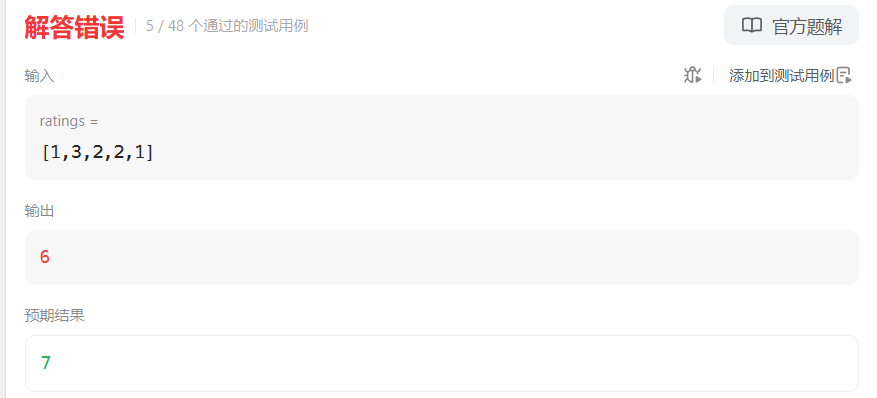
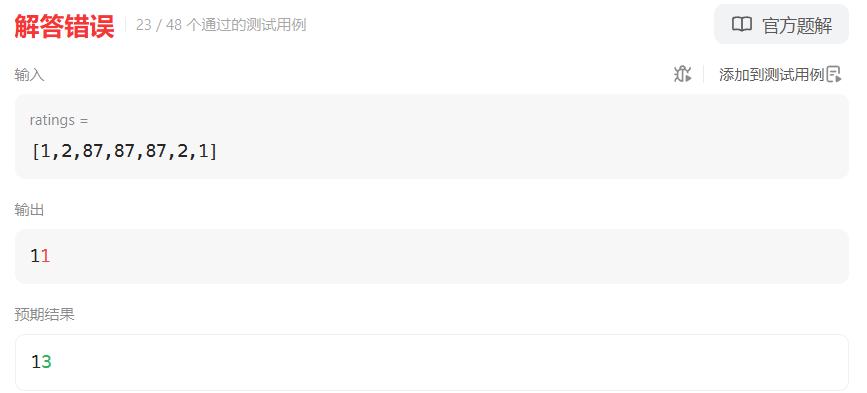
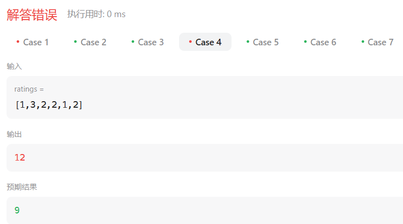

# 135分发糖果（困难）

[135. 分发糖果 - 力扣（LeetCode）](https://leetcode.cn/problems/candy/description/)

## 题目描述

`n` 个孩子站成一排。给你一个整数数组 `ratings` 表示每个孩子的评分。

你需要按照以下要求，给这些孩子分发糖果：

- 每个孩子至少分配到 `1` 个糖果。
- 相邻两个孩子评分更高的孩子会获得更多的糖果。

请你给每个孩子分发糖果，计算并返回需要准备的 **最少糖果数目** 。

 

**示例 1：**

```
输入：ratings = [1,0,2]
输出：5
解释：你可以分别给第一个、第二个、第三个孩子分发 2、1、2 颗糖果。
```

**示例 2：**

```
输入：ratings = [1,2,2]
输出：4
解释：你可以分别给第一个、第二个、第三个孩子分发 1、2、1 颗糖果。
     第三个孩子只得到 1 颗糖果，这满足题面中的两个条件。
```

 

**提示：**

- `n == ratings.length`
- `1 <= n <= 2 * 104`
- `0 <= ratings[i] <= 2 * 104`

## 我的C++解法

所以要获取包含自身的总共三个数字（除了边缘）

滑动窗口？

关键是有可能会产生递增序列，这样的话分配的糖果也需要递增，所以还需要保存前一个分配的糖果数目

应该是只用比较左侧数据即可

```cpp
class Solution {
public:
    int candy(vector<int>& ratings) {
        int ans = ratings.size();
        if(ans==1)  return 1;
        int cur = 0;
        for(int i=0;i<ratings.size();i++){
            if(i==0 && (ratings[0]>ratings[1])){
                // 边缘，只用检测相邻共计两个元素
                cur = 1;
                ans += cur;
                continue;
            }
            if(i==0 && (ratings[0]<ratings[1])){
                cur = 0;
                continue;
            }
            // 突然感觉只用左边一个元素进行比较
            if(ratings[i]>ratings[i-1]){
                cur += 1;
                ans += cur;
            }
            else{
                cur = 0;
                continue;
            }
        }
        return ans;
    }
};
```



 关键是，如果是递减序列，tmd给的糖果数目也是递减的，关键是初始给多少不知道。怎么搞？？？

```cpp
class Solution {
public:
    int candy(vector<int>& ratings) {
        int ans = ratings.size();
        if(ans==1)  return 1;
        int cur = 0;
        for(int i=0;i<ratings.size();i++){
            if(i==0 && (ratings[0]>ratings[1])){
                // 两个边缘，只用检测相邻共计两个元素
                cur = 1;
                ans += cur;
                continue;
            }
            else if(i==0 && (ratings[0]<=ratings[1])){
                cur = 0;
                continue;
            }
            // else if(i==0 && (ratings[0]<ratings[1])){
            //     cur = 0;
            //     continue;
            // }            
            if(i==ratings.size()-1){
                if(ratings[i]>ratings[i-1]){
                    cur += 1;
                    ans += cur;
                    return ans;
                }
                else{
                    return ans;
                }
            }
            // int max_val = max({ratings[i-1],ratings[i],ratings[i+1]});
            if(ratings[i]>ratings[i-1] || (ratings[i]==ratings[i-1] && ratings[i]>ratings[i+1])){
                cur += 1;
                ans += cur;
                continue;
            }
            else if(ratings[i]<=ratings[i-1] || ratings[i]<=ratings[i+1]){
                cur = 0;
                continue;
            }
        }
        return ans;
    }
};
```

结果：



重新想了一个思路，既然每个数都是大于等于0那么直接在数组的最左和最右添加元素-1，然后右侧数据大于左侧数据则在新数组中添加1；等于添加0；小于添加-1

初始cur = 0

1与任何组合都会导致cur++;ans+=cur

00组合使得cur=1；ans+=cur

01组合使得cur=1，ans+=cur

0，-1组合使得cur=1 ans+= cur

0的任何组合都是cur=1，ans+=1

-1的任何组合都是cur++,ans+=cur

这样看来，最后一个元素后面就不需要所谓的添加-1了以及第一个元素前面也不需要添加-1，因为一定是递减和递增，前者对结果没有影响，后者使得cur和ans初始为1

```cpp
class Solution {
public:
    int candy(vector<int>& ratings) {
        // vector<int> judge;
        int ans = 1;
        int cur = 1;
        if(ratings.size()==1)   return 1;
        for(int i=1;i<ratings.size();i++){
            if(ratings[i]>ratings[i-1] || ratings[i]<ratings[i-1]){
                cur += 1;
                ans += cur;
            }
            else{
                cur = 1;
                ans += cur;
            }
        }
        return ans;
    }
};
```

去他妈的



这说明一定需要两次遍历，一次从前到后，一次从后到前

头像了，真A不出来，现在脑子是混的

## C++参考答案

这道题目一定是要确定一边之后，再确定另一边，例如比较每一个孩子的左边，然后再比较右边，**如果两边一起考虑一定会顾此失彼**。

先确定右边评分大于左边的情况（也就是从前向后遍历）

此时局部最优：只要右边评分比左边大，右边的孩子就多一个糖果，全局最优：相邻的孩子中，评分高的右孩子获得比左边孩子更多的糖果

局部最优可以推出全局最优。

如果ratings[i] > ratings[i - 1] 那么[i]的糖 一定要比[i - 1]的糖多一个，所以贪心：candyVec[i] = candyVec[i - 1] + 1

代码如下：

```cpp
// 从前向后
for (int i = 1; i < ratings.size(); i++) {
    if (ratings[i] > ratings[i - 1]) candyVec[i] = candyVec[i - 1] + 1;
}
```


再确定左孩子大于右孩子的情况（从后向前遍历）

遍历顺序这里有同学可能会有疑问，为什么不能从前向后遍历呢？

因为 rating[5]与rating[4]的比较 要利用上 rating[5]与rating[6]的比较结果，所以 要从后向前遍历。

如果从前向后遍历，rating[5]与rating[4]的比较 就不能用上 rating[5]与rating[6]的比较结果了 。如图：


**所以确定左孩子大于右孩子的情况一定要从后向前遍历！**

如果 ratings[i] > ratings[i + 1]，此时candyVec[i]（第i个小孩的糖果数量）就有两个选择了，一个是candyVec[i + 1] + 1（从右边这个加1得到的糖果数量），一个是candyVec[i]（之前比较右孩子大于左孩子得到的糖果数量）。

那么又要贪心了，局部最优：取candyVec[i + 1] + 1 和 candyVec[i] 最大的糖果数量，保证第i个小孩的糖果数量既大于左边的也大于右边的。全局最优：相邻的孩子中，评分高的孩子获得更多的糖果。

局部最优可以推出全局最优。

所以就取candyVec[i + 1] + 1 和 candyVec[i] 最大的糖果数量，**candyVec[i]只有取最大的才能既保持对左边candyVec[i - 1]的糖果多，也比右边candyVec[i + 1]的糖果多**。

如图：


所以该过程代码如下：

```cpp
// 从后向前
for (int i = ratings.size() - 2; i >= 0; i--) {
    if (ratings[i] > ratings[i + 1] ) {
        candyVec[i] = max(candyVec[i], candyVec[i + 1] + 1);
    }
}
```


整体代码如下：

```cpp
class Solution {
public:
    int candy(vector<int>& ratings) {
        vector<int> candyVec(ratings.size(), 1);
        // 从前向后
        for (int i = 1; i < ratings.size(); i++) {
            if (ratings[i] > ratings[i - 1]) candyVec[i] = candyVec[i - 1] + 1;
        }
        // 从后向前
        for (int i = ratings.size() - 2; i >= 0; i--) {
            if (ratings[i] > ratings[i + 1] ) {
                candyVec[i] = max(candyVec[i], candyVec[i + 1] + 1);
            }
        }
        // 统计结果
        int result = 0;
        for (int i = 0; i < candyVec.size(); i++) result += candyVec[i];
        return result;
    }
};
```


难点就在于贪心的策略，如果在考虑局部的时候想两边兼顾，就会顾此失彼。

采用了两次贪心的策略：

- 一次是从左到右遍历，只比较右边孩子评分比左边大的情况。
- 一次是从右到左遍历，只比较左边孩子评分比右边大的情况。

这样从局部最优推出了全局最优，即：相邻的孩子中，评分高的孩子获得更多的糖果

## C++收获

一定要学会创建全1数组，逐步贪心的策略

