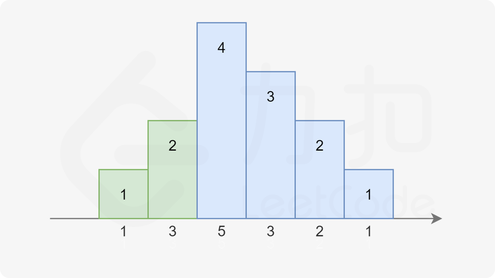

# 135分发糖果（困难）

[135. 分发糖果 - 力扣（LeetCode）](https://leetcode.cn/problems/candy/description/)

## 题目描述

`n` 个孩子站成一排。给你一个整数数组 `ratings` 表示每个孩子的评分。

你需要按照以下要求，给这些孩子分发糖果：

- 每个孩子至少分配到 `1` 个糖果。
- 相邻两个孩子评分更高的孩子会获得更多的糖果。

请你给每个孩子分发糖果，计算并返回需要准备的 **最少糖果数目** 。

 

**示例 1：**

```
输入：ratings = [1,0,2]
输出：5
解释：你可以分别给第一个、第二个、第三个孩子分发 2、1、2 颗糖果。
```

**示例 2：**

```
输入：ratings = [1,2,2]
输出：4
解释：你可以分别给第一个、第二个、第三个孩子分发 1、2、1 颗糖果。
     第三个孩子只得到 1 颗糖果，这满足题面中的两个条件。
```

 

**提示：**

- `n == ratings.length`
- `1 <= n <= 2 * 104`
- `0 <= ratings[i] <= 2 * 104`

## 我的C++解法

```cpp
class Solution {
public:
    int candy(vector<int>& ratings) {
        vector<int> distribute(ratings.size(),1);
        for(int i=1;i<ratings.size();i++){
            if(ratings[i]>ratings[i-1]){
                distribute[i] = distribute[i-1]+1;
            }
        }
        for(int i=ratings.size()-2;i>=0;i--){
            if(ratings[i]>ratings[i+1]){
                distribute[i] = max(distribute[i],distribute[i+1]+1);
            }
        }
        int ans = 0;
        for(int x:distribute){
            ans += x;
        }
        return ans;
    }
};
```

结果：


## C++参考答案


```cpp
class Solution {
public:
    int candy(vector<int>& ratings) {
        int n = ratings.size();
        vector<int> left(n);
        for (int i = 0; i < n; i++) {
            if (i > 0 && ratings[i] > ratings[i - 1]) {
                left[i] = left[i - 1] + 1;
            } else {
                left[i] = 1;
            }
        }
        int right = 0, ret = 0;
        for (int i = n - 1; i >= 0; i--) {
            if (i < n - 1 && ratings[i] > ratings[i + 1]) {
                right++;
            } else {
                right = 1;
            }
            ret += max(left[i], right);
        }
        return ret;
    }
};
```


#### 方法二：常数空间遍历

**思路及解法**

注意到糖果总是尽量少给，且从 1 开始累计，每次要么比相邻的同学多给一个，要么重新置为 1。依据此规则，我们可以画出下图：


其中相同颜色的柱状图的高度总恰好为 1,2,3…。

而高度也不一定一定是升序，也可能是 …3,2,1 的降序：


注意到在上图中，对于第三个同学，他既可以被认为是属于绿色的升序部分，也可以被认为是属于蓝色的降序部分。因为他同时比两边的同学评分更高。我们对序列稍作修改：



注意到右边的升序部分变长了，使得第三个同学不得不被分配 4 个糖果。

依据前面总结的规律，我们可以提出本题的解法。我们从左到右枚举每一个同学，记前一个同学分得的糖果数量为 *pre*：

- 如果当前同学比上一个同学评分高，说明我们就在最近的递增序列中，直接分配给该同学 *pre*+1 个糖果即可。
- 否则我们就在一个递减序列中，我们直接分配给当前同学一个糖果，并把该同学所在的递减序列中所有的同学都再多分配一个糖果，以保证糖果数量还是满足条件。
  - 我们无需显式地额外分配糖果，只需要记录当前的递减序列长度，即可知道需要额外分配的糖果数量。
  - 同时注意当当前的递减序列长度和上一个递增序列等长时，需要把最近的递增序列的最后一个同学也并进递减序列中。

这样，我们只要记录当前递减序列的长度 *dec*，最近的递增序列的长度 *inc* 和前一个同学分得的糖果数量 *pre* 即可。

```cpp
class Solution {
   public int candy(int[] ratings) {
       int n = ratings.length;
       int ret = 1;    //用于记录答案
       //pre用于记录前一个同学分得的糖果数量
       int inc = 1, dec = 0, pre = 1;
       for (int i = 1; i < n; i++) {
           if(ratings[i] >= ratings[i-1]){
               //处于递增序列中
               dec = 0;    //递减序列长度在递增序列中始终为0
               pre = ratings[i] == ratings[i- 1] ? 1 : pre+1;  //当前同学和上一个同学分数相等时，直接分配1个就行，这样满足最小
               ret += pre;
               inc = pre;      //inc用于记录上一个递增序列的长度

           }else {
               //处于递减序列中
               dec++;
               if(dec == inc){
                   //当递减序列长度和递增序列长度相等时，把递增序列的最后一个同学分配到递减序列中
                   dec++;
               }
               ret += dec; //这里加的dec相当于把递减序列翻转后加的每个同学的糖果数量
               pre = 1;    //pre在递减序列中没有意义，因为我肯定比前一个同学少；

           }
       }
       return ret;

   }
}
```


## C++收获


## 我的python解答

```python
class Solution:
    def candy(self, ratings: List[int]) -> int:
        distribute = [1]*len(ratings)
        for i in range(1,len(ratings)):
            if ratings[i]>ratings[i-1]:
                # 从左向右递增
                distribute[i] = distribute[i-1] +1
        for i in range(len(ratings)-2,-1,-1):
            if ratings[i]>ratings[i+1]:
                # 从右向左递增
                distribute[i] = max(distribute[i],distribute[i+1]+1)
        ans = 0
        for x in distribute:
            ans += x
        return ans
```

结果：


## python参考答案

```python
class Solution:
    def candy(self, ratings: List[int]) -> int:
        n = len(ratings)
        left = [0] * n
        for i in range(n):
            if i > 0 and ratings[i] > ratings[i - 1]:
                left[i] = left[i - 1] + 1
            else:
                left[i] = 1
        
        right = ret = 0
        for i in range(n - 1, -1, -1):
            if i < n - 1 and ratings[i] > ratings[i + 1]:
                right += 1
            else:
                right = 1
            ret += max(left[i], right)
        
        return ret
```

结果：


```python
class Solution:
    def candy(self, ratings: List[int]) -> int:
        n = len(ratings)
        ret = 1
        inc, dec, pre = 1, 0, 1

        for i in range(1, n):
            if ratings[i] >= ratings[i - 1]:
                dec = 0
                pre = (1 if ratings[i] == ratings[i - 1] else pre + 1)
                ret += pre
                inc = pre
            else:
                dec += 1
                if dec == inc:
                    dec += 1
                ret += dec
                pre = 1
        
        return ret
```


## python收获