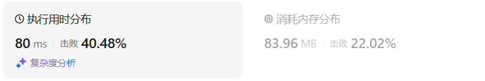
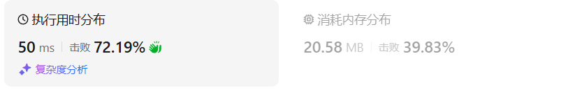

# 860柠檬水找零

[860. 柠檬水找零 - 力扣（LeetCode）](https://leetcode.cn/problems/lemonade-change/description/)

## 题目描述

在柠檬水摊上，每一杯柠檬水的售价为 `5` 美元。顾客排队购买你的产品，（按账单 `bills` 支付的顺序）一次购买一杯。

每位顾客只买一杯柠檬水，然后向你付 `5` 美元、`10` 美元或 `20` 美元。你必须给每个顾客正确找零，也就是说净交易是每位顾客向你支付 `5` 美元。

注意，一开始你手头没有任何零钱。

给你一个整数数组 `bills` ，其中 `bills[i]` 是第 `i` 位顾客付的账。如果你能给每位顾客正确找零，返回 `true` ，否则返回 `false` 。

 

**示例 1：**

```
输入：bills = [5,5,5,10,20]
输出：true
解释：
前 3 位顾客那里，我们按顺序收取 3 张 5 美元的钞票。
第 4 位顾客那里，我们收取一张 10 美元的钞票，并返还 5 美元。
第 5 位顾客那里，我们找还一张 10 美元的钞票和一张 5 美元的钞票。
由于所有客户都得到了正确的找零，所以我们输出 true。
```

**示例 2：**

```
输入：bills = [5,5,10,10,20]
输出：false
解释：
前 2 位顾客那里，我们按顺序收取 2 张 5 美元的钞票。
对于接下来的 2 位顾客，我们收取一张 10 美元的钞票，然后返还 5 美元。
对于最后一位顾客，我们无法退回 15 美元，因为我们现在只有两张 10 美元的钞票。
由于不是每位顾客都得到了正确的找零，所以答案是 false。
```

 

**提示：**

- `1 <= bills.length <= 105`
- `bills[i]` 不是 `5` 就是 `10` 或是 `20` 

## 我的C++解法

直接统计剩余的5和10的个数，如果小于0则false

```cpp
class Solution {
public:
    bool lemonadeChange(vector<int>& bills) {
        // 要不直接把bills直接除以五？
        // 统计left_changes，如果bills[i]-5<=left_changes，则继续
        if(bills[0]!=5) return false;
        // vector<int> left_changes();
        int left_5 = 1; 
        int left_10 = 0;
        // 分别表示剩余5美元和10美元的数目
        for(int i=1;i<bills.size()+1;i++){
            if(left_10<0 || left_5<0)   return false;
            if(i==bills.size()) break;
            switch(bills[i]){
                case 5:
                    left_5++;
                    break;
                case 10:
                    left_5--;
                    left_10++;
                    break;
                case 20:
                    if(left_10==0){
                        left_5 -=3;
                    }
                    else{
                        left_10--;
                        left_5--;
                    }
                    break;
            }
        }
        return true;
    }
};
```

结果：



## C++参考答案

局部最优：遇到账单20，优先消耗美元10，完成本次找零。全局最优：完成全部账单的找零。

```cpp
class Solution {
public:
    bool lemonadeChange(vector<int>& bills) {
        int five = 0, ten = 0, twenty = 0;
        for (int bill : bills) {
            // 情况一
            if (bill == 5) five++;
            // 情况二
            if (bill == 10) {
                if (five <= 0) return false;
                ten++;
                five--;
            }
            // 情况三
            if (bill == 20) {
                // 优先消耗10美元，因为5美元的找零用处更大，能多留着就多留着
                if (five > 0 && ten > 0) {
                    five--;
                    ten--;
                    twenty++; // 其实这行代码可以删了，因为记录20已经没有意义了，不会用20来找零
                } else if (five >= 3) {
                    five -= 3;
                    twenty++; // 同理，这行代码也可以删了
                } else return false;
            }
        }
        return true;
    }
};
```

```cpp
class Solution {
public:
    bool lemonadeChange(vector<int> &bills) {
        int five = 0, ten = 0;
        for (int b: bills) {
            if (b == 5) five++; // 无需找零
            else if (b == 10) five--, ten++; // 返还 5
            else if (ten) five--, ten--; // 此时 b=20，返还 10+5
            else five -= 3; // 此时 b=20，返还 5+5+5
            if (five < 0) return false; // 无法正确找零
        }
        return true;
    }
};
```

```cpp
class Solution {
public:
    bool lemonadeChange(vector<int>& bills) {
        return all_of(bills.cbegin(), bills.cend(), [a = 0, b = 0](int i)mutable { return i == 5 ? ++a : i == 10 ? (++b, a--) : b ? (b-- && a--) : ((a -= 3) > -1); });
    }
};
```

这段代码定义了一个名为 `Solution` 的类，其中包含一个名为 `lemonadeChange` 的成员函数。这个函数用于解决一个特定的问题：给定一系列表示顾客支付的账单（`bills`），判断是否有足够的柠檬水和零钱来满足所有顾客的需求。这个问题通常被称为“柠檬水找零问题”。

下面是对这段代码的详细解读：

1. **函数签名**：
   ```cpp
   bool lemonadeChange(vector<int>& bills)
   ```
   - `lemonadeChange` 是一个返回布尔值的函数。
   - 它接受一个引用参数 `bills`，这是一个整数类型的向量，表示顾客支付的账单。

2. **返回语句**：
   ```cpp
   return all_of(bills.cbegin(), bills.cend(), [a = 0, b = 0](int i)mutable { ... });
   ```
   - `all_of` 是一个C++算法函数，用于检查给定范围内的所有元素是否都满足某个条件。
   - 第一个和第二个参数 `bills.cbegin()` 和 `bills.cend()` 分别是 `bills` 向量的常量迭代器的开始和结束。
   - 第三个参数是一个Lambda表达式，用作检查的条件。

3. **Lambda表达式**：
   ```cpp
   [a = 0, b = 0](int i)mutable { ... }
   ```
   - 这是一个Lambda表达式，捕获了两个默认初始化的局部变量 `a` 和 `b`，分别用于记录5美元和10美元的纸币数量。
   - `int i` 是Lambda表达式的参数，表示当前遍历到的账单金额。
   - `mutable` 关键字表示Lambda表达式可以修改捕获的变量。

4. **条件逻辑**：
   ```cpp
   return i == 5 ? ++a : i == 10 ? (++b, a--) : b ? (b-- && a--) : ((a -= 3) > -1);
   ```
   - 这是一个三元运算符链，用于处理不同的账单金额：
     - 如果 `i` 等于5，说明顾客支付了5美元，此时 `a` 加1。
     - 如果 `i` 等于10，说明顾客支付了10美元，此时 `b` 加1，并且 `a` 减1（因为需要找回5美元）。
     - 如果 `i` 不是5或10，说明顾客支付了20美元，此时需要检查是否有足够的5美元和10美元来找零。如果 `b` 大于0，`b` 减1，`a` 也减1；否则，`a` 需要减去3（因为需要3张5美元来找零），并且检查 `a` 是否大于等于0。

5. **最终返回值**：
   - `all_of` 函数将根据Lambda表达式的结果返回 `true` 或 `false`。如果所有账单都能被满足，`all_of` 返回 `true`，否则返回 `false`。

这个函数的目的是检查是否总是能够用5美元和10美元的纸币来找零，即使在没有额外的5美元纸币的情况下，也能用3张5美元的纸币来满足20美元的账单。如果整个过程中没有任何矛盾，函数将返回 `true`，表示柠檬水店可以完成所有交易；否则，返回 `false`。

## C++收获

### `all_of` 函数

<center>关键词：all_of函数<center>

在C++中，`std::all_of` 是一个算法函数，用于检查给定范围内的所有元素是否都满足某个条件。它是C++17标准引入的，因此需要使用C++17或更新的编译器版本。

#### 函数原型：

```cpp
template< class InputIt, class Pred >
bool all_of( InputIt first, InputIt last, Pred pred );
```

- `InputIt`：输入迭代器类型，可以是任意输入迭代器类型。
- `Pred`：谓词类型，可以是函数、lambda表达式或任何可调用对象。

#### 参数说明：

1. `first`：指向输入范围的开始的迭代器。
2. `last`：指向输入范围的结束的迭代器（不包括）。
3. `pred`：一个谓词，用于检查每个元素是否满足条件。

#### 返回值：

- 如果范围内的所有元素都满足 `pred` 谓词的条件，则返回 `true`。
- 如果至少有一个元素不满足 `pred` 谓词的条件，则返回 `false`。

#### 使用示例：

##### 示例1：检查所有元素是否为正数

```cpp
#include <algorithm> // std::all_of
#include <vector>

bool areAllPositive(const std::vector<int>& nums) {
    return std::all_of(nums.begin(), nums.end(), [](int x) { return x > 0; });
}
```

在这个例子中，我们使用 `std::all_of` 来检查 `nums` 中的所有元素是否都大于0。

##### 示例2：检查字符串范围内的所有字符是否为小写字母

```cpp
#include <algorithm> // std::all_of
#include <string>
#include <cctype> // std::islower

bool areAllLowercase(const std::string& str) {
    return std::all_of(str.begin(), str.end(), [](char c) { return std::islower(c); });
}
```

在这个例子中，我们使用 `std::all_of` 和 `std::islower` 来检查 `str` 中的所有字符是否都是小写字母。

##### 示例3：使用函数作为谓词

```cpp
#include <algorithm> // std::all_of
#include <vector>

bool isEven(int x) {
    return x % 2 == 0;
}

bool areAllEven(const std::vector<int>& nums) {
    return std::all_of(nums.begin(), nums.end(), isEven);
}
```

在这个例子中，我们定义了一个名为 `isEven` 的函数，用作 `std::all_of` 的谓词，来检查 `nums` 中的所有元素是否都是偶数。

#### 注意事项：

- `std::all_of` 是一个短路算法，如果在检查过程中发现有元素不满足条件，它将立即返回 `false` 并停止进一步的检查。
- `std::all_of` 可以应用于任意类型的输入迭代器，包括数组、向量、列表、双端队列等。
- 谓词 `pred` 可以是任何形式的可调用对象，包括函数、lambda表达式、函数对象等。

`std::all_of` 是一个非常有用的函数，用于快速检查一个序列中的所有元素是否满足某个条件，它在需要确保数据集的一致性时非常有用。

### C++中的lambda函数

<center>关键词：lambda函数<center>

在C++中，Lambda函数（也称为匿名函数）是一种简洁的定义函数的方式，它允许你在需要时快速编写小段代码。Lambda函数在C++11标准中被引入，并在后续标准中得到增强。

#### Lambda函数的基本语法：

```cpp
[capture] (parameters) -> return_type { function_body }
```

- `[capture]`：捕获子句，用于定义Lambda函数可以访问的外部变量。可选。
- `(parameters)`：参数列表，定义Lambda函数的输入参数。如果无参数，可以使用`()`或省略。
- `-> return_type`：返回类型推断或指定。C++14开始，可以省略返回类型，编译器将自动推断。
- `{ function_body }`：Lambda函数的代码体。

#### Lambda函数的捕获子句：

- **默认捕获**：`[=]` 表示按值捕获所有外部变量。
- **引用捕获**：`[&]` 表示按引用捕获所有外部变量。
- **单个变量捕获**：例如 `[a, &b]`，表示按值捕获变量`a`，按引用捕获变量`b`。
- **无捕获**：`[]` 表示Lambda不捕获任何外部变量。

#### 使用Lambda函数的示例：

##### 示例1：简单的Lambda表达式

```cpp
#include <algorithm>
#include <vector>

void sortVector(std::vector<int>& v) {
    std::sort(v.begin(), v.end(), [](int a, int b) { return a < b; });
}
```

在这个例子中，Lambda函数用作`std::sort`的谓词参数，用于比较两个整数。

##### 示例2：带有捕获子句的Lambda表达式

```cpp
int value = 10;
auto lambda = [value] { return value * 2; };
```

在这个例子中，Lambda函数捕获了外部变量`value`，并返回它的两倍。

##### 示例3：使用Lambda表达式进行累加操作

```cpp
#include <numeric>
#include <vector>

int sum = std::accumulate(vec.begin(), vec.end(), 0, [](int a, int b) { return a + b; });
```

在这个例子中，Lambda函数用作`std::accumulate`的自定义累加操作。

##### 示例4：使用Lambda表达式作为回调函数

```cpp
#include <functional>

void forEachEven(std::vector<int>& v, std::function<void(int)> callback) {
    for (int num : v) {
        if (num % 2 == 0) callback(num);
    }
}

int main() {
    std::vector<int> vec = {1, 2, 3, 4, 5};
    forEachEven(vec, [](int x) { std::cout << x << " "; });
}
```

在这个例子中，Lambda函数用作`forEachEven`函数的回调函数，用于处理偶数。

#### 关键词

C++中的Lambda函数是一种便捷的匿名函数声明方式，它们在标准库中通过一组特定的语法和关键词实现。以下是C++ Lambda函数中使用的一些关键词和概念：

1. **`[capture]`**：捕获子句，用于指定Lambda函数内部可以访问的外部变量。可以按值（`=`）或按引用（`&`）捕获，也可以不捕获（`[]`）。

2. **`(parameters)`**：参数列表，定义Lambda函数接受的输入参数。如果Lambda没有参数，可以省略括号。

3. **`-> return_type`**：返回类型指定符。在C++14之前，必须指定返回类型。C++14开始，如果Lambda体中只有一条返回语句，编译器可以自动推断返回类型。

4. **`mutable`**：当在捕获子句中使用`mutable`关键字时，允许Lambda函数修改按值捕获的变量。

5. **`constexpr`**：如果Lambda函数是一个常量表达式，可以使用`constexpr`关键字。这意味着Lambda函数可以在编译时求值。

6. **`noexcept`**：指定Lambda函数是否不应该抛出异常。如果Lambda体中没有抛出异常的操作，可以使用`noexcept`。

7. **`operator()`**：Lambda函数的调用操作符，用于调用Lambda函数。

8. **`auto`**：类型自动推导关键字，用于声明Lambda函数的返回类型或参数类型。

9. **`[]`**：用于定义Lambda函数的捕获子句，表示不捕获任何外部变量。

10. **`[=]`**：按值捕获所有外部变量，所有捕获的变量都将被复制。

11. **`[&]`**：按引用捕获所有外部变量，Lambda函数将直接访问原始变量。

12. **`[=, &var]`**：混合捕获，按值捕获所有变量，除了`var`，它将按引用捕获。

13. **`[captures...]`**：自定义捕获列表，可以捕获特定的变量，可以是按值或按引用。

Lambda函数的语法结构非常灵活，可以根据需要捕获外部变量，并且可以用于多种编程场景，如算法的自定义操作、回调函数、事件处理等。

#### 注意事项：

- Lambda函数可以包含零个或多个参数，并可以有零个或一个返回类型。
- Lambda函数可以包含语句、变量声明和异常处理。
- Lambda函数可以捕获外部作用域的变量，但它们不能捕获由值传递的参数。
- Lambda函数可以用于任何需要函数对象的地方，例如算法、回调、事件处理等。

Lambda函数是C++中一个强大的特性，它提供了一种灵活、简洁的方式来编写和使用匿名函数。

## 我的python解答

```python
class Solution:
    def lemonadeChange(self, bills: List[int]) -> bool:
        if bills[0]!=5:  return False
        left_5 = 1
        left_10 = 0
        for i in range(1,len(bills)+1):
            if left_10<0 or left_5<0:   return False
            if i==len(bills):   break
            if bills[i]==5:
                left_5 += 1
                continue
            elif bills[i]==10:
                left_10 += 1
                left_5 -= 1
                continue
            elif bills[i]==20:
                if left_10==0:
                    left_5 -= 3
                    continue
                else:
                    left_10 -= 1
                    left_5 -= 1
                continue
        return True
```

结果：



## python参考答案

```python
class Solution:
    def lemonadeChange(self, bills: List[int]) -> bool:
        five = 0
        ten = 0
        twenty = 0
        
        for bill in bills:
            # 情况一：收到5美元
            if bill == 5:
                five += 1
            
            # 情况二：收到10美元
            if bill == 10:
                if five <= 0:
                    return False
                ten += 1
                five -= 1
            
            # 情况三：收到20美元
            if bill == 20:
                # 先尝试使用10美元和5美元找零
                if five > 0 and ten > 0:
                    five -= 1
                    ten -= 1
                    #twenty += 1
                # 如果无法使用10美元找零，则尝试使用三张5美元找零
                elif five >= 3:
                    five -= 3
                    #twenty += 1
                else:
                    return False
        
        return True
```

```python
class Solution:
    def lemonadeChange(self, bills: List[int]) -> bool:
        five = ten = 0
        for b in bills:
            if b == 5:  # 无需找零
                five += 1
            elif b == 10:  # 返还 5
                five -= 1
                ten += 1
            elif ten:  # 此时 b=20，返还 10+5
                five -= 1
                ten -= 1
            else:  # 此时 b=20，返还 5+5+5
                five -= 3
            if five < 0:  # 无法正确找零
                return False
        return True
```


## python收获