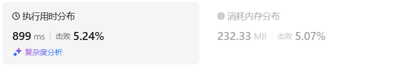
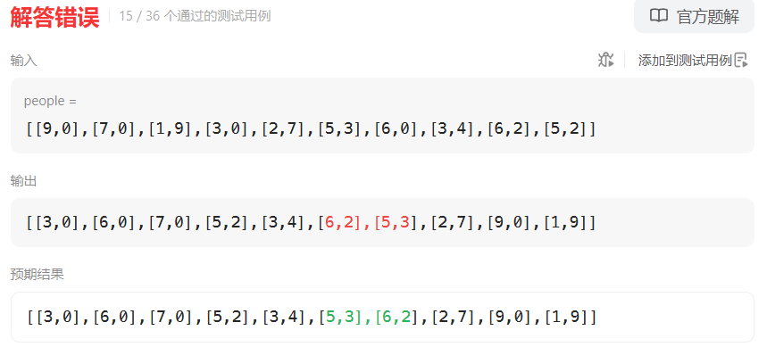
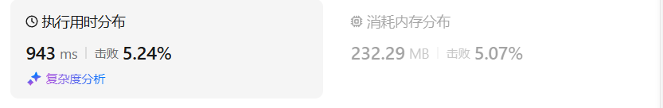
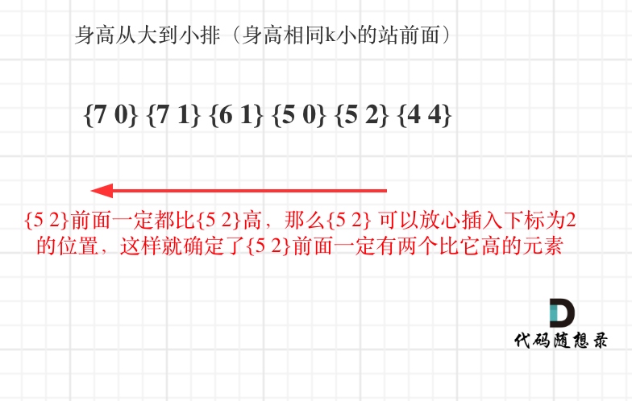
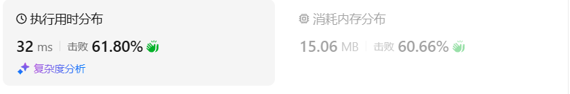
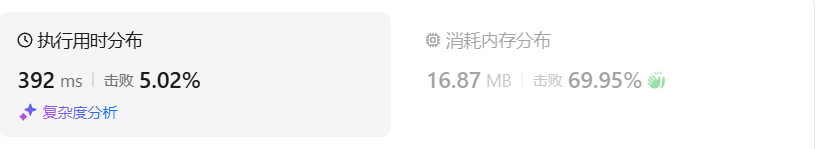

# 406根据身高重建队列（中等）

[406. 根据身高重建队列 - 力扣（LeetCode）](https://leetcode.cn/problems/queue-reconstruction-by-height/description/)

## 题目描述

假设有打乱顺序的一群人站成一个队列，数组 `people` 表示队列中一些人的属性（不一定按顺序）。每个 `people[i] = [hi, ki]` 表示第 `i` 个人的身高为 `hi` ，前面 **正好** 有 `ki` 个身高大于或等于 `hi` 的人。

请你重新构造并返回输入数组 `people` 所表示的队列。返回的队列应该格式化为数组 `queue` ，其中 `queue[j] = [hj, kj]` 是队列中第 `j` 个人的属性（`queue[0]` 是排在队列前面的人）。

 

**示例 1：**

```
输入：people = [[7,0],[4,4],[7,1],[5,0],[6,1],[5,2]]
输出：[[5,0],[7,0],[5,2],[6,1],[4,4],[7,1]]
解释：
编号为 0 的人身高为 5 ，没有身高更高或者相同的人排在他前面。
编号为 1 的人身高为 7 ，没有身高更高或者相同的人排在他前面。
编号为 2 的人身高为 5 ，有 2 个身高更高或者相同的人排在他前面，即编号为 0 和 1 的人。
编号为 3 的人身高为 6 ，有 1 个身高更高或者相同的人排在他前面，即编号为 1 的人。
编号为 4 的人身高为 4 ，有 4 个身高更高或者相同的人排在他前面，即编号为 0、1、2、3 的人。
编号为 5 的人身高为 7 ，有 1 个身高更高或者相同的人排在他前面，即编号为 1 的人。
因此 [[5,0],[7,0],[5,2],[6,1],[4,4],[7,1]] 是重新构造后的队列。
```

**示例 2：**

```
输入：people = [[6,0],[5,0],[4,0],[3,2],[2,2],[1,4]]
输出：[[4,0],[5,0],[2,2],[3,2],[1,4],[6,0]]
```

 

**提示：**

- `1 <= people.length <= 2000`
- `0 <= hi <= 106`
- `0 <= ki < people.length`
- 题目数据确保队列可以被重建

## 我的C++解法

对于people[i] = [hi,ki]，排序后所在的位置应该是要大于等于ki的

如果是逐个遍历，再逐个插入ans中的话，耗费的时间太高，会达到o(n^2)，必定超时

思路：找people中最小的height与pos组合，优先height，height相同才比较取最小的pos

找到后直接遍历queue数组，如果当前height为-1且pos=0，则直接替换；如果当前height为-1而pos不为0，则pos--；如果当前height不为-1，则统计最大数值。

呃呃了，实际上这也是一种o(n^2)的解法啊

```cpp
class Solution {
public:
    vector<vector<int>> reconstructQueue(vector<vector<int>>& people) {
        // 突然想到了基数排列 但是基数排列并不对
        // 首先找到最矮的，若其对应的第二个元素为k，则其索引为k
        vector<vector<int>> queue(people.size(),{-1,-1});
        while(people.size()){
            int min_height = INT_MAX;
            int min_pos = INT_MAX;
            int index = -1;
            for(int i=0;i<people.size();i++){
                auto iter = people[i];
                if(min_height==iter[0]){
                    min_pos>iter[1]? min_pos=iter[1],index=i:min_pos=min_pos;
                    // min_pos = min(min_pos,iter[1]);
                    // index = i;
                    continue;
                }
                if(min_height>iter[0]){
                    min_height = iter[0];
                    min_pos = iter[1];
                    index = i;
                }
            }// 找到最小元素所在位置了
            int max_height=-1;
            int real_min_pos = min_pos;
            // for(int i=0;i+min_pos<queue.size();i++){
            //     if(queue[min_pos+i][0]!=-1){
            //         max_height = max(max_height,queue[min_pos+i][0]);
            //     }
            //     if(queue[min_pos+i][0]==-1 && min_pos==0){
            //         queue[min_pos+i] = {min_height,real_min_pos};
            //         break;
            //     }
            //     else if(queue[min_pos+i][0]==-1 && max_height<min_height){
            //         // 需要空出min_pos个位置
            //         min_pos--;
            //     }
            for(int i=0;i<queue.size();i++){
                if(queue[i][0]!=-1){
                    max_height = max(max_height,queue[i][0]);
                    if(max_height>=min_height){
                        min_pos--;
                        max_height = -1;
                    }
                }
                if(queue[i][0]==-1 && min_pos==0){
                    queue[i] = {min_height,real_min_pos};
                    break;
                }
                else if(queue[i][0]==-1 && max_height<=min_height){
                    // 需要空出min_pos个位置
                    min_pos--;
                }            
            }
            people.erase(people.begin()+index);
        }
        return queue;
    }
};
```

结果双5，也只是勉勉强强A出来了：



简单修改了一下，使得可读性更强

```cpp
class Solution {
public:
    vector<vector<int>> reconstructQueue(vector<vector<int>>& people) {
        // 突然想到了基数排列 但是基数排列并不对
        // 首先找到最矮的，若其对应的第二个元素为k，则其索引为k
        vector<vector<int>> queue(people.size(),{-1,-1});
        while(people.size()){
            int min_height = INT_MAX;
            int min_pos = INT_MAX;
            int index = -1;
            for(int i=0;i<people.size();i++){
                auto iter = people[i];
                if(min_height>=iter[0]){
                    min_height = iter[0];
                    min_pos = iter[1];
                    index = i;
                }
            }// 找到最小元素所在位置了
            int count = 0;
            for(int i=0;i<queue.size();i++){
                if(queue[i][0]!=-1) continue;
                if(min_pos==count){
                    queue[i] = {min_height,min_pos};
                    break;
                }
                else{
                    // 需要空出min_pos个位置
                    count++;
                }
            }
            people.erase(people.begin()+index);
        }
        return queue;
    }
};
```

结果：



模拟了一遍发现是因为没有吧(5,2)给记入一个count++

修改：`if(queue[i][0]!=-1) continue;`修改为`if(queue[i][0]!=-1 && queue[i][0]!=min_height) continue;`

结果：



nm，结果更差了

## C++参考答案

本题有两个维度，h和k，看到这种题目一定要想如何确定一个维度，然后再按照另一个维度重新排列。遇到两个维度权衡的时候，一定要先确定一个维度，再确定另一个维度。**如果两个维度一起考虑一定会顾此失彼**。

如果按照k来从小到大排序，排完之后，会发现k的排列并不符合条件，身高也不符合条件，两个维度哪一个都没确定下来。

那么按照身高h来排序呢，身高一定是从大到小排（身高相同的话则k小的站前面），让高个子在前面。

**此时我们可以确定一个维度了，就是身高，前面的节点一定都比本节点高！那么只需要按照k为下标重新插入队列就可以了，为什么呢？**

以图中{5,2} 为例：



按照身高排序之后，优先按身高高的people的k来插入，后序插入节点也不会影响前面已经插入的节点，最终按照k的规则完成了队列。所以在按照身高从大到小排序后：

**局部最优：优先按身高高的people的k来插入。插入操作过后的people满足队列属性**

**全局最优：最后都做完插入操作，整个队列满足题目队列属性**

局部最优可推出全局最优，找不出反例，那就试试贪心。

整个插入过程如下：

排序完的people： [[7,0], [7,1], [6,1], [5,0], [5,2]，[4,4]]

插入的过程：

- 插入[7,0]：[[7,0]]
- 插入[7,1]：[[7,0],[7,1]]
- 插入[6,1]：[[7,0],[6,1],[7,1]]
- 插入[5,0]：[[5,0],[7,0],[6,1],[7,1]]
- 插入[5,2]：[[5,0],[7,0],[5,2],[6,1],[7,1]]
- 插入[4,4]：[[5,0],[7,0],[5,2],[6,1],[4,4],[7,1]]

此时就按照题目的要求完成了重新排列。

C++代码如下：

```cpp
// 版本一
class Solution {
public:
    static bool cmp(const vector<int>& a, const vector<int>& b) {
        if (a[0] == b[0]) return a[1] < b[1];
        return a[0] > b[0];
    }
    vector<vector<int>> reconstructQueue(vector<vector<int>>& people) {
        sort (people.begin(), people.end(), cmp);
        vector<vector<int>> que;
        for (int i = 0; i < people.size(); i++) {
            int position = people[i][1];
            que.insert(que.begin() + position, people[i]);
        }
        return que;
    }
};
```

- 时间复杂度：O(nlog n + n^2)
- 空间复杂度：O(n)

结果：



但使用vector是非常费时的，C++中vector（可以理解是一个动态数组，底层是普通数组实现的）如果插入元素大于预先普通数组大小，vector底部会有一个扩容的操作，即申请两倍于原先普通数组的大小，然后把数据拷贝到另一个更大的数组上。

所以使用vector（动态数组）来insert，是费时的，插入再拷贝的话，单纯一个插入的操作就是O(n^2)了，甚至可能拷贝好几次，就不止O(n^2)了。

改成链表之后，C++代码如下：

```cpp
// 版本二
class Solution {
public:
    // 身高从大到小排（身高相同k小的站前面）
    static bool cmp(const vector<int>& a, const vector<int>& b) {
        if (a[0] == b[0]) return a[1] < b[1];
        return a[0] > b[0];
    }
    vector<vector<int>> reconstructQueue(vector<vector<int>>& people) {
        sort (people.begin(), people.end(), cmp);
        list<vector<int>> que; // list底层是链表实现，插入效率比vector高的多
        for (int i = 0; i < people.size(); i++) {
            int position = people[i][1]; // 插入到下标为position的位置
            std::list<vector<int>>::iterator it = que.begin();
            while (position--) { // 寻找在插入位置
                it++;
            }
            que.insert(it, people[i]);
        }
        return vector<vector<int>>(que.begin(), que.end());
    }
};
```

- 时间复杂度：O(nlog n + n^2)
- 空间复杂度：O(n)

结果：


## C++收获


## 我的python解答

```python
class Solution:
    def reconstructQueue(self, people: List[List[int]]) -> List[List[int]]:
        queue= []
        for i in range(len(people)):
            queue.append([-1,-1])
        while len(people):
            min_height,k,index = 10e6,-1,-1
            for i in range(len(people)):
                if min_height>=people[i][0]:
                    min_height = people[i][0]
                    k = people[i][1]
                    index = i
            count = 0
            for i in range(len(queue)):
                if queue[i][0]!=-1 and queue[i][0]!=min_height:
                    continue
                if count==k:
                    queue[i] = [min_height,k]
                    break
                else:
                    count+=1
            del people[index]
        return queue
```

真是烂完了。

结果：



## python参考答案

```python
class Solution:
    def reconstructQueue(self, people: List[List[int]]) -> List[List[int]]:
    	# 先按照h维度的身高顺序从高到低排序。确定第一个维度
        # lambda返回的是一个元组：当-x[0](维度h）相同时，再根据x[1]（维度k）从小到大排序
        people.sort(key=lambda x: (-x[0], x[1]))
        que = []
	
	# 根据每个元素的第二个维度k，贪心算法，进行插入
        # people已经排序过了：同一高度时k值小的排前面。
        for p in people:
            que.insert(p[1], p)
        return que
```

结果：


## python收获