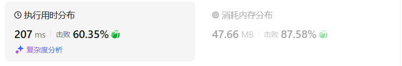

# 452用最少数量的箭引爆气球（中等）

[452. 用最少数量的箭引爆气球 - 力扣（LeetCode）](https://leetcode.cn/problems/minimum-number-of-arrows-to-burst-balloons/description/)

## 题目描述

有一些球形气球贴在一堵用 XY 平面表示的墙面上。墙面上的气球记录在整数数组 `points` ，其中`points[i] = [xstart, xend]` 表示水平直径在 `xstart` 和 `xend`之间的气球。你不知道气球的确切 y 坐标。

一支弓箭可以沿着 x 轴从不同点 **完全垂直** 地射出。在坐标 `x` 处射出一支箭，若有一个气球的直径的开始和结束坐标为 `x``start`，`x``end`， 且满足  `xstart ≤ x ≤ x``end`，则该气球会被 **引爆** 。可以射出的弓箭的数量 **没有限制** 。 弓箭一旦被射出之后，可以无限地前进。

给你一个数组 `points` ，*返回引爆所有气球所必须射出的 **最小** 弓箭数* 。

 

**示例 1：**

```
输入：points = [[10,16],[2,8],[1,6],[7,12]]
输出：2
解释：气球可以用2支箭来爆破:
-在x = 6处射出箭，击破气球[2,8]和[1,6]。
-在x = 11处发射箭，击破气球[10,16]和[7,12]。
```

**示例 2：**

```
输入：points = [[1,2],[3,4],[5,6],[7,8]]
输出：4
解释：每个气球需要射出一支箭，总共需要4支箭。
```

**示例 3：**

```
输入：points = [[1,2],[2,3],[3,4],[4,5]]
输出：2
解释：气球可以用2支箭来爆破:
- 在x = 2处发射箭，击破气球[1,2]和[2,3]。
- 在x = 4处射出箭，击破气球[3,4]和[4,5]。
```

 


**提示:**

- `1 <= points.length <= 105`
- `points[i].length == 2`
- `-231 <= xstart < xend <= 231 - 1`

## 我的C++解法

昨天被拷打过，今天就好很多了，一二十分钟就A出来了

```cpp
class Solution {
public:
    static bool cmp(const vector<int>&a,const vector<int>&b){
        if(a[0]==b[0])  return a[1]<b[1];
        return a[0]<b[0];
    }

    int findMinArrowShots(vector<vector<int>>& points) {
        // 给我的感觉是要先排序，感觉要拍两次序
        // 第一次依据第一个元素 第二次依据第二个元素
        // 可以认为如果有交集就可以用一根完成贯穿
        sort(points.begin(),points.end(),cmp);
        int ans = 1;
        int min = points[0][0];
        int max = points[0][1];
        // 说白了min是绝对不会变小的，只会递增
        for(int i=1;i<points.size();i++){
            if(max<points[i][0]){
                ans++;
                min = points[i][0];
                max = points[i][1];
                continue;
            }
            if(min<points[i][0]){
                min = points[i][0];
            }
            if(max>points[i][1]){
                max = points[i][1];
            }
        }
        return ans;
    }
};
```

结果：


## C++参考答案


```cpp
class Solution {
private:
    static bool cmp(const vector<int>& a, const vector<int>& b) {
        return a[0] < b[0];
    }
public:
    int findMinArrowShots(vector<vector<int>>& points) {
        if (points.size() == 0) return 0;
        sort(points.begin(), points.end(), cmp);

        int result = 1; // points 不为空至少需要一支箭
        for (int i = 1; i < points.size(); i++) {
            if (points[i][0] > points[i - 1][1]) {  // 气球i和气球i-1不挨着，注意这里不是>=
                result++; // 需要一支箭
            }
            else {  // 气球i和气球i-1挨着
                points[i][1] = min(points[i - 1][1], points[i][1]); // 更新重叠气球最小右边界
            }
        }
        return result;
    }
};
```


## C++收获


## 我的python解答

```python
class Solution:
    def findMinArrowShots(self, points: List[List[int]]) -> int:
        points.sort(key = lambda x:(x[0],x[1]))
        ans = 1
        cur_min = points[0][0]
        cur_max = points[0][1]
        for i in range(1,len(points)):
            if cur_max<points[i][0]:
                ans += 1
                cur_min = points[i][0]
                cur_max = points[i][1]
                continue
            if cur_max>points[i][1]:
                cur_max = points[i][1]
            if cur_min<points[i][0]:
                cur_min = points[i][0]
        return ans
```

结果：


## python参考答案

```python
class Solution:
    def findMinArrowShots(self, points: List[List[int]]) -> int:
        if len(points) == 0: return 0
        points.sort(key=lambda x: x[0])
        result = 1
        for i in range(1, len(points)):
            if points[i][0] > points[i - 1][1]: # 气球i和气球i-1不挨着，注意这里不是>=
                result += 1     
            else:
                points[i][1] = min(points[i - 1][1], points[i][1]) # 更新重叠气球最小右边界
        return result
```

结果：



```python
class Solution: # 不改变原数组
    def findMinArrowShots(self, points: List[List[int]]) -> int:
        points.sort(key = lambda x: x[0])
        sl,sr = points[0][0],points[0][1]
        count = 1
        for i in points:
            if i[0]>sr:
                count+=1
                sl,sr = i[0],i[1]
            else:
                sl = max(sl,i[0])
                sr = min(sr,i[1])
        return count
```


## python收获