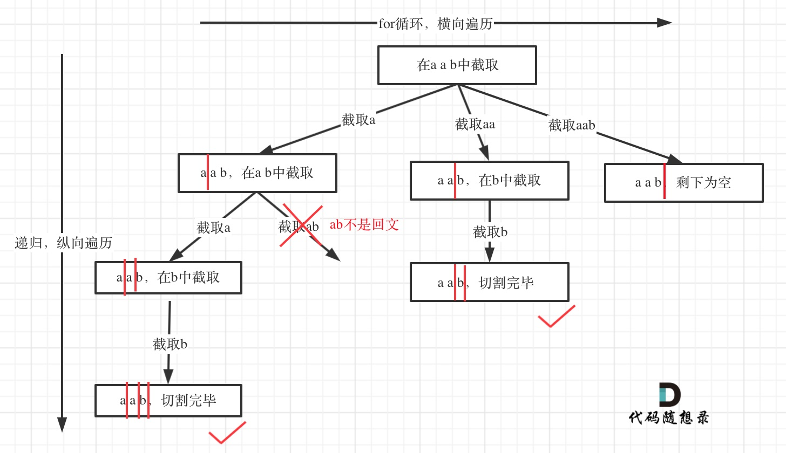

# 131分割回文串（中等）

[131. 分割回文串 - 力扣（LeetCode）](https://leetcode.cn/problems/palindrome-partitioning/description/)

## 题目描述

给你一个字符串 `s`，请你将 `s` 分割成一些子串，使每个子串都是 

**回文串**

 。返回 `s` 所有可能的分割方案。


 

**示例 1：**

```
输入：s = "aab"
输出：[["a","a","b"],["aa","b"]]
```

**示例 2：**

```
输入：s = "a"
输出：[["a"]]
```

 

**提示：**

- `1 <= s.length <= 16`
- `s` 仅由小写英文字母组成

## 我的C++解法

最难的一集，思路一直是乱的，下面是胡写的

```cpp
class Solution {
private:
    vector<string> tmp;
    vector<vector<string>> ans;
    int sum;
    void backtrack(string& s,int start,int lenth){
        if(lenth <= 0)    return;
        string subs = s.substr(start,lenth);// 第二个参数是长度
        if(sum==s.size()){
            ans.push_back(tmp);
            return;
        }
        for(;start<s.size();start++){// 元素个数的遍历
            if(isPal(subs)){
                sum += subs.size();
                tmp.push_back(subs);
                // backtrack(s,start+subs.size(),lenth-subs.size());
                backtrack(s,start+subs.size(),s.size()-sum);
                sum -= subs.size();
                tmp.pop_back();
            }
            else{
                lenth--;
                backtrack(s,start,lenth);
            }
        }
        return;
    }
    bool isPal(string subs){
        for(int i=0,j=subs.size()-1;i<j;i++,j--){
            if(subs[i]==subs[j]) continue;
            else    return false;
        }
        return true;
    }

public:
    vector<vector<string>> partition(string s) {
        // 首先，每一个字母都是一个结果
        // 其次，tmp数组正反相同。可以使用双指针
        // 非空字符串必定有一个答案是所有字符的分隔
        sum = 0;
        backtrack(s,0,s.size());
        return ans;
    }
};
```

执行出错

重新推倒重来，整体的思路：

定义函数回溯，需要传入原字符串s，子串的开始位置start，以及字串的长度length。

最外层循环：（管理start）

从0号开始位置到最后的开始位置

内层循环：（管理长度length）

对于每一个给定初始索引的子串，需要length逐渐递减，来模拟字串的缩短，此时依据start和length生成子串，如果字串的长度为1或者是回文串，则直接压字串入tmp数组中，统计数组tmp中有效字符的个数sum则进行加length操作，然后递归遍历，递归的参数：

递归start：当前的i值（开始索引）+length

递归length：字符串s的长度减去sum总和

 = 回文字串之后的子串。对该新的字串进行递归判断是否是回文串。

递归返回之后，sum-length，tmp出元素，实现回溯


压入ans的条件：sum和s长度相等

直接返回（终止）的条件：length<=0

```cpp
class Solution {
private:
    vector<string> tmp;// 内部数组
    vector<vector<string>> ans;
    int sum; // tmp是否存入了所有的子串
    void backtrack(string& s,int start,int lenth){
        // 压入答案条件：tmp中所有字符串的长度总和为s.size(),需要一个sum来标识
        if(sum == s.size()){
            ans.push_back(tmp);
            return;
        }
        // 终止条件：长度为空
        if(lenth<=0)    return;
        // 循环：
        for(int i = start;i<s.size();i++){
            for(;lenth>0;lenth--){
                string sub_str = s.substr(i,lenth);
                bool flag = (lenth==1 || isPal(sub_str));
                if(flag){
                    tmp.push_back(sub_str);
                    sum+=lenth;
                    backtrack(s,i+lenth,s.size()-sum);
                    sum-=lenth;
                    tmp.pop_back();
                }
            }
        }
    }
    bool isPal(string subs){
        // 判断字符串是否是回文串
        // return s == reverse(s.begin(),s.end());
        for(int i=0,j=subs.size()-1;i<j;i++,j--){
            if(subs[i]==subs[j]) continue;
            else    return false;
        }
        return true;        
    }

public:
    vector<vector<string>> partition(string s) {
        tmp.clear();
        ans.clear();
        sum = 0;
        backtrack(s,0,s.size());
        return ans;
    }
};
```

结果：


## C++参考答案

本题这涉及到两个关键问题：

1. 切割问题，有不同的切割方式
2. 判断回文

这种题目，想用for循环暴力解法，可能都不那么容易写出来，所以要换一种暴力的方式，就是回溯。

回溯究竟是如何切割字符串呢？分析一下切割，**其实切割问题类似组合问题**。

例如对于字符串abcdef：

- 组合问题：选取一个a之后，在bcdef中再去选取第二个，选取b之后在cdef中再选取第三个.....。
- 切割问题：切割一个a之后，在bcdef中再去切割第二段，切割b之后在cdef中再切割第三段.....。

所以切割问题，也可以抽象为一棵树形结构，如图：


递归用来纵向遍历，for循环用来横向遍历，切割线（就是图中的红线）切割到字符串的结尾位置，说明找到了一个切割方法。

终止条件：

从树形结构的图中可以看出：切割线切到了字符串最后面，说明找到了一种切割方法，此时就是本层递归的终止条件。



在处理组合问题的时候，递归参数需要传入startIndex，表示下一轮递归遍历的起始位置，这个startIndex就是切割线。

所以终止条件代码如下：

```cpp
void backtracking (const string& s, int startIndex) {
    // 如果起始位置已经大于s的大小，说明已经找到了一组分割方案了
    if (startIndex >= s.size()) {
        result.push_back(path);
        return;
    }
}
```

单层搜索逻辑：

**在递归循环中如何截取子串呢？**在`for (int i = startIndex; i < s.size(); i++)`循环中，我们 定义了起始位置startIndex，那么 [startIndex, i] 就是要截取的子串。首先判断这个子串是不是回文，如果是回文，就加入在`vector<string> path`中，path用来记录切割过的回文子串。

```cpp
for (int i = startIndex; i < s.size(); i++) {
    if (isPalindrome(s, startIndex, i)) { // 是回文子串
        // 获取[startIndex,i]在s中的子串
        string str = s.substr(startIndex, i - startIndex + 1);
        path.push_back(str);
    } else {                // 如果不是则直接跳过
        continue;
    }
    backtracking(s, i + 1); // 寻找i+1为起始位置的子串
    path.pop_back();        // 回溯过程，弹出本次已经添加的子串
}
```

整合后：

```cpp
class Solution {
private:
    vector<vector<string>> result;
    vector<string> path; // 放已经回文的子串
    void backtracking (const string& s, int startIndex) {
        // 如果起始位置已经大于s的大小，说明已经找到了一组分割方案了
        if (startIndex >= s.size()) {
            result.push_back(path);
            return;
        }
        for (int i = startIndex; i < s.size(); i++) {
            if (isPalindrome(s, startIndex, i)) {   // 是回文子串
                // 获取[startIndex,i]在s中的子串
                string str = s.substr(startIndex, i - startIndex + 1);
                path.push_back(str);
            } else {                                // 不是回文，跳过
                continue;
            }
            backtracking(s, i + 1); // 寻找i+1为起始位置的子串
            path.pop_back(); // 回溯过程，弹出本次已经添加的子串
        }
    }
    bool isPalindrome(const string& s, int start, int end) {
        for (int i = start, j = end; i < j; i++, j--) {
            if (s[i] != s[j]) {
                return false;
            }
        }
        return true;
    }
public:
    vector<vector<string>> partition(string s) {
        result.clear();
        path.clear();
        backtracking(s, 0);
        return result;
    }
};
```

在回文串上进行优化：

例如给定字符串`"abcde"`, 在已知`"bcd"`不是回文字串时, 不再需要去双指针操作`"abcde"`而可以直接判定它一定不是回文字串。具体来说, 给定一个字符串`s`, 长度为`n`, 它成为回文字串的充分必要条件是`s[0] == s[n-1]`且`s[1:n-1]`是回文字串。

```cpp
vector<vector<bool>> isPalindrome; // 放事先计算好的是否回文子串的结果
void computePalindrome(const string& s) {
    // isPalindrome[i][j] 代表 s[i:j](双边包括)是否是回文字串 
    isPalindrome.resize(s.size(), vector<bool>(s.size(), false)); // 根据字符串s, 刷新布尔矩阵的大小
    for (int i = s.size() - 1; i >= 0; i--) { 
        // 需要倒序计算, 保证在i行时, i+1行已经计算好了
        for (int j = i; j < s.size(); j++) {
            if (j == i) {isPalindrome[i][j] = true;}
            else if (j - i == 1) {isPalindrome[i][j] = (s[i] == s[j]);}
            else {isPalindrome[i][j] = (s[i] == s[j] && isPalindrome[i+1][j-1]);}
        }
    }
}
```


## C++收获


## 我的python解答

```python
class Solution:
    def __init__(self):
        self.tmp = []
        self.ans = []
        self.sum = 0

    def isPal(self,s:str):
        return s==s[::-1]

    def backtrack(self,s:str,start:int,length:int):
        if self.sum == len(s):
            self.ans.append(self.tmp[:])
            return
        if length<=0:
            return
        for i in range(start,len(s)):
            while length:
                sub_str = s[i:i+length] # 左闭右开[start,end)
                if length==1 or self.isPal(sub_str):
                    self.tmp.append(sub_str)
                    self.sum += length
                    self.backtrack(s,i+length,len(s)-self.sum)
                    self.sum -= length
                    self.tmp.pop()
                length -=1


    def partition(self, s: str) -> List[List[str]]:
        self.tmp = []
        self.ans = []
        self.sum = 0
        self.backtrack(s,0,len(s))
        return self.ans
```

结果：


## python参考答案

```python
class Solution:

    def partition(self, s: str) -> List[List[str]]:
        '''
        递归用于纵向遍历
        for循环用于横向遍历
        当切割线迭代至字符串末尾，说明找到一种方法
        类似组合问题，为了不重复切割同一位置，需要start_index来做标记下一轮递归的起始位置(切割线)
        '''
        result = []
        self.backtracking(s, 0, [], result)
        return result

    def backtracking(self, s, start_index, path, result ):
        # Base Case
        if start_index == len(s):
            result.append(path[:])
            return
        
        # 单层递归逻辑
        for i in range(start_index, len(s)):
            # 此次比其他组合题目多了一步判断：
            # 判断被截取的这一段子串([start_index, i])是否为回文串
            if self.is_palindrome(s, start_index, i):
                path.append(s[start_index:i+1])
                self.backtracking(s, i+1, path, result)   # 递归纵向遍历：从下一处进行切割，判断其余是否仍为回文串
                path.pop()             # 回溯


    def is_palindrome(self, s: str, start: int, end: int) -> bool:
        i: int = start        
        j: int = end
        while i < j:
            if s[i] != s[j]:
                return False
            i += 1
            j -= 1
        return True 
```

```python
class Solution:

    def partition(self, s: str) -> List[List[str]]:
        result = []
        self.backtracking(s, 0, [], result)
        return result

    def backtracking(self, s, start_index, path, result ):
        # Base Case
        if start_index == len(s):
            result.append(path[:])
            return
        
        # 单层递归逻辑
        for i in range(start_index, len(s)):
            # 若反序和正序相同，意味着这是回文串
            if s[start_index: i + 1] == s[start_index: i + 1][::-1]:
                path.append(s[start_index:i+1])
                self.backtracking(s, i+1, path, result)   # 递归纵向遍历：从下一处进行切割，判断其余是否仍为回文串
                path.pop()             # 回溯
```

```python
class Solution:
    def partition(self, s: str) -> List[List[str]]:
        result = []
        isPalindrome = [[False] * len(s) for _ in range(len(s))]  # 初始化isPalindrome矩阵
        self.computePalindrome(s, isPalindrome)
        self.backtracking(s, 0, [], result, isPalindrome)
        return result

    def backtracking(self, s, startIndex, path, result, isPalindrome):
        if startIndex >= len(s):
            result.append(path[:])
            return

        for i in range(startIndex, len(s)):
            if isPalindrome[startIndex][i]:   # 是回文子串
                substring = s[startIndex:i + 1]
                path.append(substring)
                self.backtracking(s, i + 1, path, result, isPalindrome)  # 寻找i+1为起始位置的子串
                path.pop()           # 回溯过程，弹出本次已经添加的子串

    def computePalindrome(self, s, isPalindrome):
        for i in range(len(s) - 1, -1, -1):  # 需要倒序计算，保证在i行时，i+1行已经计算好了
            for j in range(i, len(s)):
                if j == i:
                    isPalindrome[i][j] = True
                elif j - i == 1:
                    isPalindrome[i][j] = (s[i] == s[j])
                else:
                    isPalindrome[i][j] = (s[i] == s[j] and isPalindrome[i+1][j-1])
```

```python
class Solution:
    def partition(self, s: str) -> List[List[str]]:
        result = []
        self.partition_helper(s, 0, [], result)
        return result

    def partition_helper(self, s, start_index, path, result):
        if start_index == len(s):
            result.append(path[:])
            return

        for i in range(start_index + 1, len(s) + 1):
            sub = s[start_index:i]
            if self.isPalindrome(sub):
                path.append(sub)
                self.partition_helper(s, i, path, result)
                path.pop()

    def isPalindrome(self, s):
        return all(s[i] == s[len(s) - 1 - i] for i in range(len(s) // 2))
```

```python
class Solution:
    def partition(self, s: str) -> List[List[str]]:
        ans = []
        path = []
        n = len(s)
        def dfs(i: int) -> None:
            if i == n:
                ans.append(path.copy())  # 复制 path
                return
            for j in range(i, n):  # 枚举子串的结束位置
                t = s[i: j + 1]
                if t == t[::-1]:  # 判断是否回文
                    path.append(t)
                    dfs(j + 1)
                    path.pop()  # 恢复现场
        dfs(0)
        return ans

# 作者：灵茶山艾府
```


## python收获