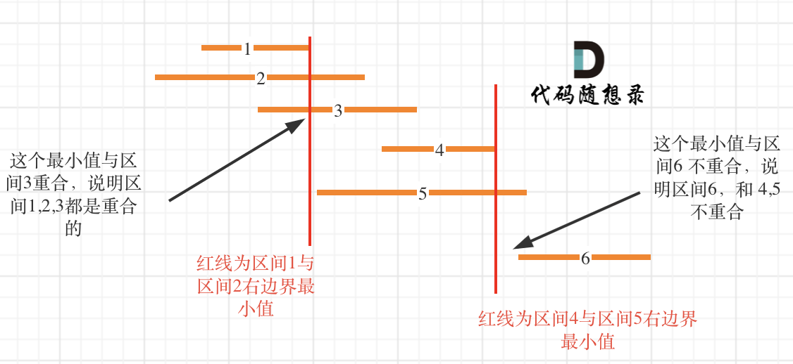

# 435无重叠区间（中等）

[435. 无重叠区间 - 力扣（LeetCode）](https://leetcode.cn/problems/non-overlapping-intervals/description/)

## 题目描述

给定一个区间的集合 `intervals` ，其中 `intervals[i] = [starti, endi]` 。返回 *需要移除区间的最小数量，使剩余区间互不重叠* 。

 

**示例 1:**

```
输入: intervals = [[1,2],[2,3],[3,4],[1,3]]
输出: 1
解释: 移除 [1,3] 后，剩下的区间没有重叠。
```

**示例 2:**

```
输入: intervals = [ [1,2], [1,2], [1,2] ]
输出: 2
解释: 你需要移除两个 [1,2] 来使剩下的区间没有重叠。
```

**示例 3:**

```
输入: intervals = [ [1,2], [2,3] ]
输出: 0
解释: 你不需要移除任何区间，因为它们已经是无重叠的了。
```

 

**提示:**

- `1 <= intervals.length <= 105`
- `intervals[i].length == 2`
- `-5 * 104 <= starti < endi <= 5 * 104`

## 我的C++解法

```cpp
class Solution {
static bool cmp(const vector<int>&a,const vector<int>&b){
    if(a[0]==b[0])  return a[1]<b[1];
    return a[0]<b[0];
}


public:
    int eraseOverlapIntervals(vector<vector<int>>& intervals) {
        sort(intervals.begin(),intervals.end(),cmp);
        int ans = 0;
        int max = intervals[0][1];
        for(int i=1;i<intervals.size();i++){
            if(intervals[i][0]>=max){
                max = intervals[i][1];
                continue;
            }
            ans++;
        }
        return ans;
    }
};
```

错误了


直接用昨天的方法逆过来。昨天是相当于求交集的个数，今天直接把总数减去这个交集的个数即可

```cpp
class Solution {
static bool cmp(const vector<int>&a,const vector<int>&b){
    if(a[0]==b[0])  return a[1]<b[1];
    return a[0]<b[0];
}

public:
    int eraseOverlapIntervals(vector<vector<int>>& intervals) {
        sort(intervals.begin(),intervals.end(),cmp);
        // 昨天的是找有多少个交集，今天也这样，最后拿size做减法试试
        int ans = 1;
        int right = intervals[0][1];
        for(int i=1;i<intervals.size();i++){
            if(intervals[i][0]>=right){
                right = intervals[i][1];
                ans++;
                continue;
            }
            right = min(right,intervals[i][1]);
        }
        return intervals.size()-ans;
    }
};
```

结果：


## C++参考答案

**按照右边界排序，从左向右记录非交叉区间的个数。最后用区间总数减去非交叉区间的个数就是需要移除的区间个数了**。

此时问题就是要求非交叉区间的最大个数。

这里记录非交叉区间的个数还是有技巧的，如图：



区间，1，2，3，4，5，6都按照右边界排好序。

当确定区间 1 和 区间2 重叠后，如何确定是否与 区间3 也重贴呢？

就是取 区间1 和 区间2 右边界的最小值，因为这个最小值之前的部分一定是 区间1 和区间2 的重合部分，如果这个最小值也触达到区间3，那么说明 区间 1，2，3都是重合的。

接下来就是找大于区间1结束位置的区间，是从区间4开始。**那有同学问了为什么不从区间5开始？别忘了已经是按照右边界排序的了**。

区间4结束之后，再找到区间6，所以一共记录非交叉区间的个数是三个。

总共区间个数为6，减去非交叉区间的个数3。移除区间的最小数量就是3。

C++代码如下：

```cpp
class Solution {
public:
    // 按照区间右边界排序
    static bool cmp (const vector<int>& a, const vector<int>& b) {
        return a[1] < b[1];
    }
    int eraseOverlapIntervals(vector<vector<int>>& intervals) {
        if (intervals.size() == 0) return 0;
        sort(intervals.begin(), intervals.end(), cmp);
        int count = 1; // 记录非交叉区间的个数
        int end = intervals[0][1]; // 记录区间分割点
        for (int i = 1; i < intervals.size(); i++) {
            if (end <= intervals[i][0]) {
                end = intervals[i][1];
                count++;
            }
        }
        return intervals.size() - count;
    }
};
```

- 时间复杂度：O(nlog n) ，有一个快排
- 空间复杂度：O(n)，有一个快排，最差情况(倒序)时，需要n次递归调用。因此确实需要O(n)的栈空间


左边界排序：

左边界排序我们就是直接求 重叠的区间，count为记录重叠区间数。

```cpp
class Solution {
public:
    static bool cmp (const vector<int>& a, const vector<int>& b) {
        return a[0] < b[0]; // 改为左边界排序
    }
    int eraseOverlapIntervals(vector<vector<int>>& intervals) {
        if (intervals.size() == 0) return 0;
        sort(intervals.begin(), intervals.end(), cmp);
        int count = 0; // 注意这里从0开始，因为是记录重叠区间
        int end = intervals[0][1]; // 记录区间分割点
        for (int i = 1; i < intervals.size(); i++) {   
            if (intervals[i][0] >= end)  end = intervals[i][1]; // 无重叠的情况
            else { // 重叠情况 
                end = min(end, intervals[i][1]);
                count++;
            }
        }
        return count;
    }
};
```

精简一下， 用 intervals[i][1] 替代 end变量，只判断 重叠情况就好

```cpp
class Solution {
public:
    static bool cmp (const vector<int>& a, const vector<int>& b) {
        return a[0] < b[0]; // 改为左边界排序
    }
    int eraseOverlapIntervals(vector<vector<int>>& intervals) {
        if (intervals.size() == 0) return 0;
        sort(intervals.begin(), intervals.end(), cmp);
        int count = 0; // 注意这里从0开始，因为是记录重叠区间
        for (int i = 1; i < intervals.size(); i++) {
            if (intervals[i][0] < intervals[i - 1][1]) { //重叠情况
                intervals[i][1] = min(intervals[i - 1][1], intervals[i][1]);
                count++;
            }
        }
        return count;
    }
};
```


## C++收获


## 我的python解答

```python
class Solution:
    def eraseOverlapIntervals(self, intervals: List[List[int]]) -> int:
        intervals.sort(key=lambda x:(x[0],x[1]))
        right = intervals[0][1];
        count = 1
        for i in range(1,len(intervals)):
            if intervals[i][0]>=right:
                right = intervals[i][1]
                count+=1
            else:
                right = min(right,intervals[i][1])
        return len(intervals)-count

```

结果：


## python参考答案

```python
class Solution:
    def eraseOverlapIntervals(self, intervals: List[List[int]]) -> int:
        if not intervals:
            return 0
        
        intervals.sort(key=lambda x: x[0])  # 按照左边界升序排序
        count = 0  # 记录重叠区间数量
        
        for i in range(1, len(intervals)):
            if intervals[i][0] < intervals[i - 1][1]:  # 存在重叠区间
                intervals[i][1] = min(intervals[i - 1][1], intervals[i][1])  # 更新重叠区间的右边界
                count += 1
        
        return count
```

```python
class Solution:
    def eraseOverlapIntervals(self, intervals: List[List[int]]) -> int:
        if not intervals:
            return 0
        
        intervals.sort(key=lambda x: x[0])  # 按照左边界升序排序
        
        result = 1  # 不重叠区间数量，初始化为1，因为至少有一个不重叠的区间
        
        for i in range(1, len(intervals)):
            if intervals[i][0] >= intervals[i - 1][1]:  # 没有重叠
                result += 1
            else:  # 重叠情况
                intervals[i][1] = min(intervals[i - 1][1], intervals[i][1])  # 更新重叠区间的右边界
        
        return len(intervals) - result
```


## python收获