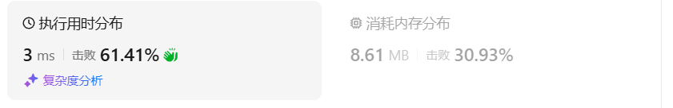

# 763划分字母区间（中等）

[763. 划分字母区间 - 力扣（LeetCode）](https://leetcode.cn/problems/partition-labels/description/)

## 题目描述

给你一个字符串 `s` 。我们要把这个字符串划分为尽可能多的片段，同一字母最多出现在一个片段中。

注意，划分结果需要满足：将所有划分结果按顺序连接，得到的字符串仍然是 `s` 。

返回一个表示每个字符串片段的长度的列表。

 

**示例 1：**

```
输入：s = "ababcbacadefegdehijhklij"
输出：[9,7,8]
解释：
划分结果为 "ababcbaca"、"defegde"、"hijhklij" 。
每个字母最多出现在一个片段中。
像 "ababcbacadefegde", "hijhklij" 这样的划分是错误的，因为划分的片段数较少。 
```

**示例 2：**

```
输入：s = "eccbbbbdec"
输出：[10]
```

 

**提示：**

- `1 <= s.length <= 500`
- `s` 仅由小写英文字母组成

## 我的C++解法

整体思路和前两题一致，需要一次遍历维护一个二维数组，里面存储了每个字母的初始位置和末尾位置，初始化元素均为-1

对二维数组排序，也是找边界变化的地方。

```cpp
class Solution {
public:
    static bool cmp(const vector<int>& a,const vector<int>& b){
        if(a[0]==b[0])  return a[1]<b[1];
        return a[0]<b[0];
    }
    vector<int> partitionLabels(string s) {
        // 感觉只能维护一个二维数组了，存储的是当前字母的第一个索引和最后一个位置索引
        vector<vector<int>> pos(26,{-1,-1});
        for(int i=0;i<s.size();i++){
            int alphabat_index = s[i] - 'a';
            if(pos[alphabat_index][0]==-1)    pos[alphabat_index][0] = i;
            else    pos[alphabat_index][1] = i;
        }
        // 已经创建了初始到结束的位置
        sort(pos.begin(),pos.end(),cmp);
        int start;
        for(int i=0;i<26;i++){
            if(pos[i][0]==-1)   continue;
            start = i;
            break;
        }
        vector<int> ans;
        int start_index=pos[start][0];
        for(int i=start+1;i<26;i++){
            if(pos[i][0]>pos[i-1][1]){
                ans.push_back(pos[i][0]-start_index);
                start_index = pos[i][0];
            }
            else{
                pos[i][1] = max(pos[i-1][1],pos[i][1]);
            }
        }
        ans.push_back(s.size()-start_index);
        return ans;
    }
};
```

结果：



## C++参考答案

在遍历的过程中相当于是要找每一个字母的边界，**如果找到之前遍历过的所有字母的最远边界，说明这个边界就是分割点了**。此时前面出现过所有字母，最远也就到这个边界了。

可以分为如下两步：

- 统计每一个字符最后出现的位置
- 从头遍历字符，并更新字符的最远出现下标，如果找到字符最远出现位置下标和当前下标相等了，则找到了分割点

如图：


```cpp
class Solution {
public:
    vector<int> partitionLabels(string S) {
        int hash[27] = {0}; // i为字符，hash[i]为字符出现的最后位置
        for (int i = 0; i < S.size(); i++) { // 统计每一个字符最后出现的位置
            hash[S[i] - 'a'] = i;
        }
        vector<int> result;
        int left = 0;
        int right = 0;
        for (int i = 0; i < S.size(); i++) {
            right = max(right, hash[S[i] - 'a']); // 找到字符出现的最远边界
            if (i == right) {
                result.push_back(right - left + 1);
                left = i + 1;
            }
        }
        return result;
    }
};
```

结果：


## C++收获


## 我的python解答

```python
class Solution:
    def partitionLabels(self, s: str) -> List[int]:
        pos = []
        for i in range(26):
            pos.append([-1,-1])
        for i in range(len(s)):
            if pos[ord(s[i])-ord('a')][0]==-1:
                pos[ord(s[i])-ord('a')][0]=i
            else:
                pos[ord(s[i])-ord('a')][1]=i
        pos.sort(key = lambda x:(x[0],x[1]))
        start = 0
        for i in range(26):
            if pos[i][0]==-1:
                continue
            start = i
            break
        start_index = 0
        ans = []
        for i in range(start+1,26):
            if pos[i][0]>pos[i-1][1]:
                ans.append(pos[i][0]-start_index)
                start_index = pos[i][0]
            else:
                pos[i][1] = max(pos[i-1][1],pos[i][1])
        ans.append(len(s)-start_index)
        return ans
```

结果：


## python参考答案

```python
class Solution:
    def partitionLabels(self, s: str) -> List[int]:
        last_occurrence = {}  # 存储每个字符最后出现的位置
        for i, ch in enumerate(s):
            last_occurrence[ch] = i

        result = []
        start = 0
        end = 0
        for i, ch in enumerate(s):
            end = max(end, last_occurrence[ch])  # 找到当前字符出现的最远位置
            if i == end:  # 如果当前位置是最远位置，表示可以分割出一个区间
                result.append(end - start + 1)
                start = i + 1

        return result
```

结果：


## python收获