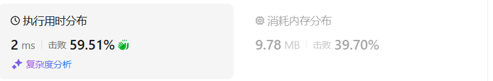
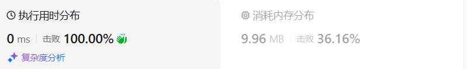

# 93复原IP地址（中等）

[93. 复原 IP 地址 - 力扣（LeetCode）](https://leetcode.cn/problems/restore-ip-addresses/description/)

## 题目描述

**有效 IP 地址** 正好由四个整数（每个整数位于 `0` 到 `255` 之间组成，且不能含有前导 `0`），整数之间用 `'.'` 分隔。

- 例如：`"0.1.2.201"` 和` "192.168.1.1"` 是 **有效** IP 地址，但是 `"0.011.255.245"`、`"192.168.1.312"` 和 `"192.168@1.1"` 是 **无效** IP 地址。

给定一个只包含数字的字符串 `s` ，用以表示一个 IP 地址，返回所有可能的**有效 IP 地址**，这些地址可以通过在 `s` 中插入 `'.'` 来形成。你 **不能** 重新排序或删除 `s` 中的任何数字。你可以按 **任何** 顺序返回答案。

 

**示例 1：**

```
输入：s = "25525511135"
输出：["255.255.11.135","255.255.111.35"]
```

**示例 2：**

```
输入：s = "0000"
输出：["0.0.0.0"]
```

**示例 3：**

```
输入：s = "101023"
输出：["1.0.10.23","1.0.102.3","10.1.0.23","10.10.2.3","101.0.2.3"]
```

 

**提示：**

- `1 <= s.length <= 20`
- `s` 仅由数字组成

## 我的C++解法

首先，每一部分最大三位数，其次，数字介于0，255.

我的想法是维护一个插入点位置索引的数组，依据字串，如果子串合法，则把位置压入数组中。

终止条件：截断点startindex大于等于s长度，数组大小为4，最后一个数等于s长度。在编写这句话的时候突然意识到判断条件startindex可以不需要。

维护一个插入点函数，返回字符串，压入ans。


编写时遇到的错误：

没有写插入数组的长度大于等于4的时候直接返回，没有写长度为3时，如果剩余长度大于3则返回；判断sub子串的时候没有对判断sub首元素时0时的处理上添加或者sub长度为1；逆序插入点，把`i>=0`错写成`i<=0`，导致ans直接获取的是s原字符串；

最致命的错误：在for循环中，对i的判断，却少`&& i<=s.size()`导致stoll函数一直报错，因为i会溢出，得到空字符，无法转化数字。

```cpp
class Solution {
private:
    vector<string> ans;
    vector<int> insertPos;// 插入位点
    void backtrack(string& s, int startIndex){// 不改变原s
        if(insertPos.size()==4 && insertPos[3]==s.size()){
            string new_s = s;
            ans.push_back(insertDot(new_s,insertPos));
            return;
        }
        if(insertPos.size()==3){
            // 已经有三个位点了
            if(s.size()-insertPos[2] > 3)   return;
        }
        if(insertPos.size()>=4) return;
        for(int i = startIndex;i<startIndex+3 && i<=s.size();i++){//最多三个数字
            string sub = s.substr(startIndex-1,i-startIndex+1);
            long long num = stoll(sub);
            if(num<=255 && ((sub[0]!='0' && sub.size()>1) || (sub.size()==1))){
                // 正确分类
                insertPos.push_back(i);
                backtrack(s,i+1);
                insertPos.pop_back();
            }
        }
        return;
    }
    string insertDot(string s,vector<int>& insertPos){
        // 逆序插入点
        for(int i = 2;i>=0;i--){
            s.insert(insertPos[i],".");// 在指定索引处插入点,总共插入三个
        }
        return s;
    }


public:
    vector<string> restoreIpAddresses(string s) {
        // 和昨天的分割回文串很相似，这个是判断每一部分是否介于0，255
        // 只能插入三个点，把整个字符串分割为四个部分
        // 如果首元素为0，则只能是0，不能带有其他数字
        // 每一个数字最大是三位
        ans.clear();
        insertPos.clear();
        backtrack(s,1);
        return ans;
    }
};
```

结果：



删除终止条件中的`startIndex>=s.size() && `之后的结果：



## C++参考答案

切割问题可以抽象为树型结构，如图：


- 递归参数

startIndex一定是需要的，因为不能重复分割，记录下一层递归分割的起始位置。

本题我们还需要一个变量pointNum，记录添加逗点的数量。

```cpp
vector<string> result;// 记录结果
// startIndex: 搜索的起始位置，pointNum:添加逗点的数量
void backtracking(string& s, int startIndex, int pointNum) {
```

- 递归终止条件

只会分成4段，所以不能用切割线切到最后作为终止条件，而是分割的段数作为终止条件。

pointNum表示逗点数量，pointNum为3说明字符串分成了4段了，然后验证一下第四段是否合法，如果合法就加入到结果集里

```cpp
if (pointNum == 3) { // 逗点数量为3时，分隔结束
    // 判断第四段子字符串是否合法，如果合法就放进result中
    if (isValid(s, startIndex, s.size() - 1)) {
        result.push_back(s);
    }
    return;
}
```

- 单层搜索的逻辑

在`for (int i = startIndex; i < s.size(); i++)`循环中 [startIndex, i] 这个区间就是截取的子串，需要判断这个子串是否合法。

如果合法就在字符串后面加上符号`.`表示已经分割。

如果不合法就结束本层循环，如图中剪掉的分支：


递归和回溯的过程：

递归调用时，下一层递归的startIndex要从i+2开始（因为需要在字符串中加入了分隔符`.`），同时记录分割符的数量pointNum 要 +1。

回溯的时候，就将刚刚加入的分隔符`.` 删掉就可以了，pointNum也要-1。

```cpp
for (int i = startIndex; i < s.size(); i++) {
    if (isValid(s, startIndex, i)) { // 判断 [startIndex,i] 这个区间的子串是否合法
        s.insert(s.begin() + i + 1 , '.');  // 在i的后面插入一个逗点
        pointNum++;
        backtracking(s, i + 2, pointNum);   // 插入逗点之后下一个子串的起始位置为i+2
        pointNum--;                         // 回溯
        s.erase(s.begin() + i + 1);         // 回溯删掉逗点
    } else break; // 不合法，直接结束本层循环
}
```

判断段位是否是有效段位

主要考虑到如下三点：

- 段位以0为开头的数字不合法
- 段位里有非正整数字符不合法
- 段位如果大于255了不合法

代码如下：

```cpp
// 判断字符串s在左闭又闭区间[start, end]所组成的数字是否合法
bool isValid(const string& s, int start, int end) {
    if (start > end) {
        return false;
    }
    if (s[start] == '0' && start != end) { // 0开头的数字不合法
            return false;
    }
    int num = 0;
    for (int i = start; i <= end; i++) {
        if (s[i] > '9' || s[i] < '0') { // 遇到非数字字符不合法
            return false;
        }
        num = num * 10 + (s[i] - '0');
        if (num > 255) { // 如果大于255了不合法
            return false;
        }
    }
    return true;
}
```

```cpp
class Solution {
private:
    vector<string> result;// 记录结果
    // startIndex: 搜索的起始位置，pointNum:添加逗点的数量
    void backtracking(string& s, int startIndex, int pointNum) {
        if (pointNum == 3) { // 逗点数量为3时，分隔结束
            // 判断第四段子字符串是否合法，如果合法就放进result中
            if (isValid(s, startIndex, s.size() - 1)) {
                result.push_back(s);
            }
            return;
        }
        for (int i = startIndex; i < s.size(); i++) {
            if (isValid(s, startIndex, i)) { // 判断 [startIndex,i] 这个区间的子串是否合法
                s.insert(s.begin() + i + 1 , '.');  // 在i的后面插入一个逗点
                pointNum++;
                backtracking(s, i + 2, pointNum);   // 插入逗点之后下一个子串的起始位置为i+2
                pointNum--;                         // 回溯
                s.erase(s.begin() + i + 1);         // 回溯删掉逗点
            } else break; // 不合法，直接结束本层循环
        }
    }
    // 判断字符串s在左闭又闭区间[start, end]所组成的数字是否合法
    bool isValid(const string& s, int start, int end) {
        if (start > end) {
            return false;
        }
        if (s[start] == '0' && start != end) { // 0开头的数字不合法
                return false;
        }
        int num = 0;
        for (int i = start; i <= end; i++) {
            if (s[i] > '9' || s[i] < '0') { // 遇到非数字字符不合法
                return false;
            }
            num = num * 10 + (s[i] - '0');
            if (num > 255) { // 如果大于255了不合法
                return false;
            }
        }
        return true;
    }
public:
    vector<string> restoreIpAddresses(string s) {
        result.clear();
        if (s.size() < 4 || s.size() > 12) return result; // 算是剪枝了
        backtracking(s, 0, 0);
        return result;
    }
};
```


## C++收获


## 我的python解答

越搞越乱，甚至更错了

```python
class Solution:
    def restoreIpAddresses(self, s: str) -> List[str]:
        ans = []
        tmp = [] # 存储四部分数据 最后用'.'.join(tmp)即可，tmp存储string类型部分
        sub = str()
        total = 0
        def backtrack(s:str,startIndex:int,total:int):
            # 每部分数据长度从0到3
            if total==len(s) and startIndex == len(s) and len(tmp)==4:
                ans.append('.'.join(tmp))
                return
            for i in range(1,4):
                # if i+startIndex > len(s):
                if total == len(s) and len(tmp)<4:
                    break
                if len(tmp)==3:
                    # 已经有三个部分了，最后一个直接到结束
                    sub = s[startIndex:]
                    # startIndex = len(s)
                else:
                    sub = s[startIndex:i+startIndex]
                    # startIndex = i+startIndex
                if int(sub)<=255 and ((sub[0]=='0' and len(sub)>1) or len(sub)==1):
                  
                    tmp.append(sub[:])
                    total += len(sub)
                    startIndex = total
                    backtrack(s,startIndex,total)
                    total -= len(sub)
                    startIndex = total
                    tmp.pop()
            return

        backtrack(s,0,total)
        return ans
```

结果全部出错。

真的没办法了，看参考答案了


## python参考答案

```python
class Solution:
    def restoreIpAddresses(self, s: str) -> List[str]:
        result = []
        self.backtracking(s, 0, 0, "", result)
        return result

    def backtracking(self, s, start_index, point_num, current, result):
        if point_num == 3:  # 逗点数量为3时，分隔结束
            if self.is_valid(s, start_index, len(s) - 1):  # 判断第四段子字符串是否合法
                current += s[start_index:]  # 添加最后一段子字符串
                result.append(current)
            return

        for i in range(start_index, len(s)):
            if self.is_valid(s, start_index, i):  # 判断 [start_index, i] 这个区间的子串是否合法
                sub = s[start_index:i + 1]
                self.backtracking(s, i + 1, point_num + 1, current + sub + '.', result)
            else:
                break

    def is_valid(self, s, start, end):
        if start > end:
            return False
        if s[start] == '0' and start != end:  # 0开头的数字不合法
            return False
        num = 0
        for i in range(start, end + 1):
            if not s[i].isdigit():  # 遇到非数字字符不合法
                return False
            num = num * 10 + int(s[i])
            if num > 255:  # 如果大于255了不合法
                return False
        return True
```

```python
class Solution:
    def restoreIpAddresses(self, s: str) -> List[str]:
        results = []
        self.backtracking(s, 0, [], results)
        return results

    def backtracking(self, s, index, path, results):
        if index == len(s) and len(path) == 4:
            results.append('.'.join(path))
            return

        if len(path) > 4:  # 剪枝
            return

        for i in range(index, min(index + 3, len(s))):
            if self.is_valid(s, index, i):
                sub = s[index:i+1]
                path.append(sub)
                self.backtracking(s, i+1, path, results)
                path.pop()

    def is_valid(self, s, start, end):
        if start > end:
            return False
        if s[start] == '0' and start != end:  # 0开头的数字不合法
            return False
        num = int(s[start:end+1])
        return 0 <= num <= 255
```


## python收获