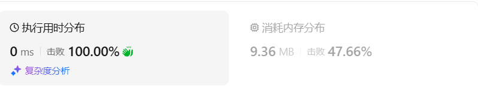
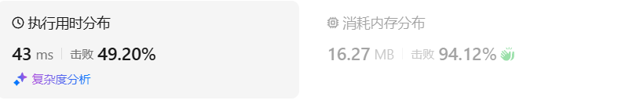

# 93复原IP地址（中等）

[93. 复原 IP 地址 - 力扣（LeetCode）](https://leetcode.cn/problems/restore-ip-addresses/description/)

## 题目描述

**有效 IP 地址** 正好由四个整数（每个整数位于 `0` 到 `255` 之间组成，且不能含有前导 `0`），整数之间用 `'.'` 分隔。

- 例如：`"0.1.2.201"` 和` "192.168.1.1"` 是 **有效** IP 地址，但是 `"0.011.255.245"`、`"192.168.1.312"` 和 `"192.168@1.1"` 是 **无效** IP 地址。

给定一个只包含数字的字符串 `s` ，用以表示一个 IP 地址，返回所有可能的**有效 IP 地址**，这些地址可以通过在 `s` 中插入 `'.'` 来形成。你 **不能** 重新排序或删除 `s` 中的任何数字。你可以按 **任何** 顺序返回答案。

 

**示例 1：**

```
输入：s = "25525511135"
输出：["255.255.11.135","255.255.111.35"]
```

**示例 2：**

```
输入：s = "0000"
输出：["0.0.0.0"]
```

**示例 3：**

```
输入：s = "101023"
输出：["1.0.10.23","1.0.102.3","10.1.0.23","10.10.2.3","101.0.2.3"]
```

 

**提示：**

- `1 <= s.length <= 20`
- `s` 仅由数字组成

## 我的C++解法

在写完py之后又重新写了一下C++解法

期间出现的问题：

对s删除点的时候，使用了`s.erase(i+start)`，缺少了第二个参数1，导致从索引i+start之后的所有都被删除了

使用了stoi，对于示例"0279245587303"，会导致int无法存储，溢出，改为stoll即可

```cpp
class Solution {
private:
    vector<string> ans;
    int count_dots;
    int n;
    bool isValid(string s){
        if(s=="")   return false;
        if(s.size()==1) return true;
        return (stoll(s)<=255 && stoll(s)>9 && s[0]!='0');
    }
    void backtrack(string& s,int start, int& count_dots){
        if(count_dots==3){
            if(start>=s.size()) return;
            if(isValid(s.substr(start,n))){
                ans.push_back(s);
            }
            return;
        }
        for(int i = 1;i<4;i++){
            if(i+start>=s.size())   break;
            string sub = s.substr(start,i);
            if(isValid(sub)){
                count_dots += 1;
                s.insert(start+i,".");
                n-=i;
                backtrack(s,start+i+1,count_dots);
                n+=i;
                s.erase(start+i,1);
                count_dots -= 1;
            }
        }
        return;
    }

public:
    vector<string> restoreIpAddresses(string s) {
        ans.clear();
        count_dots = 0;
        n = s.size();
        backtrack(s,0,count_dots);
        return ans;
    }
};
```

结果：比昨天好很多了。



## C++参考答案


## C++收获


## 我的python解答

昨天多方面因素，导致脑子混的很，没有做出来python版本的答案，今天清醒了不少，也是终于做出来了：


编写过程有一个重大错误，就是再for循环中没有添加溢出判断`if i+start>=len(s): break`，导致遍历的最后面字符会出现小数点，无法转化为int，因此报错。添加之后就好了。

```python
class Solution:
    def isValid(self,s:str):
        # 判断否有效
        if s == "":
            return False
        if len(s)==1:   return True
        return 9<int(s)<=255 and s[0]!='0'
    def restoreIpAddresses(self, s: str) -> List[str]:
        ans = []
        count_dot = 0
        def dfs(s:string,start:int,count_dot:int):
            if count_dot==3:
                if start>=len(s):
                    return
                if self.isValid(s[start:]):
                    ans.append(s[:])
                return
            for i in range(1,4):
                # 横向for循环，最大三位数
                if i+start>=len(s):
                    break
                sub = s[start:i+start]
                if self.isValid(sub):
                    # 当前子串有效
                    count_dot+=1
                    s = s[:i+start] + '.' + s[i+start:] # 添加一个点
                    dfs(s,i+start+1,count_dot)
                    s = s[:i+start] + s[i+start+1:] # 删除点
                    count_dot-=1
        dfs(s,0,count_dot)
        return ans
```

结果：（这个结果我还是比较满意的）



## python参考答案


## python收获

### py对字符串的操作

<center>关键词：字符串操作<center>

<center>关键词：string操作<center>

Python中的字符串操作非常丰富，因为字符串在Python中是不可变的（immutable），这意味着一旦创建就不能更改。但即便如此，Python提供了大量的方法来处理字符串。以下是一些常用的字符串操作：

#### 1. 访问字符串中的字符
可以通过索引访问字符串中的每个字符，索引从0开始。

```python
s = "Hello, World!"
print(s[0])  # 输出: H
```

#### 2. 切片操作
切片操作允许你获取字符串的一部分。

```python
print(s[1:5])  # 输出: ello
print(s[-6:-1])  # 输出: World
```

#### 3. 字符串连接
使用`+`操作符或`join()`方法连接字符串。

```python
name = "John"
greeting = "Hello, " + name + "!"
print(greeting)  # 输出: Hello, John!

# 使用 join()
items = ["apple", "banana", "cherry"]
fruits = ", ".join(items)  # 输出: apple, banana, cherry
```

#### 4. 字符串长度
使用`len()`函数获取字符串的长度。

```python
print(len(s))  # 输出: 13
```

#### 5. 大小写转换
使用`upper()`和`lower()`方法转换字符串的大小写。

```python
print(s.upper())  # 输出: HELLO, WORLD!
print(s.lower())  # 输出: hello, world!
```

#### 6. 字符串查找
使用`find()`或`index()`方法查找子字符串的位置。

```python
pos = s.find("World")
print(pos)  # 输出: 7

# 如果子字符串不存在，index() 会抛出 ValueError
# pos = s.index("Python")  # 抛出 ValueError
```

#### 7. 字符串替换
使用`replace()`方法替换字符串中的某些字符或子字符串。

```python
modified = s.replace("World", "Python")
print(modified)  # 输出: Hello, Python!
```

#### 8. 字符串分割
使用`split()`方法按分隔符分割字符串。

```python
parts = s.split(", ")
print(parts)  # 输出: ['Hello', 'World!']
```

#### 9. 字符串格式化
使用`format()`方法或f-string（Python 3.6+）进行字符串格式化。

```python
name = "Alice"
age = 30
print("Name: {}, Age: {}".format(name, age))  # 输出: Name: Alice, Age: 30

# 使用 f-string
print(f"Name: {name}, Age: {age}")  # 输出: Name: Alice, Age: 30
```

#### 10. 字符串去除空白
使用`strip()`, `rstrip()`, `lstrip()`去除字符串两端或一端的空白字符。

```python
s = "  Hello, World!  "
print(s.strip())  # 输出: 'Hello, World!'
print(s.lstrip())  # 输出: 'Hello, World!  '
print(s.rstrip())  # 输出: '  Hello, World!'
```

#### 11. 字符串比较
使用`==`和`!=`操作符比较字符串。

```python
print("Hello" == "hello")  # 输出: False
print("Hello".lower() == "hello")  # 输出: True
```

#### 12. 字符串遍历
使用循环遍历字符串中的每个字符。

```python
for char in s:
    print(char)
```

#### 13. 字符串方法链
可以像链式调用一样，连续调用字符串的方法。

```python
print(s.strip().upper()[:5])  # 输出: 'HELLO'
```

Python的字符串操作非常灵活，由于字符串的不可变性，很多操作会返回新的字符串而不是修改原始字符串。这保证了字符串操作的安全性和可预测性。