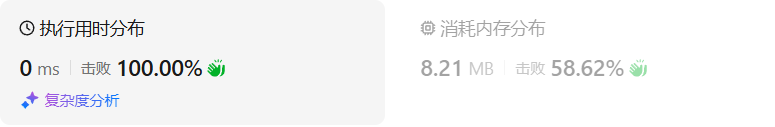
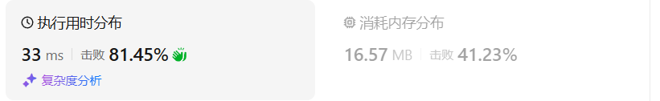
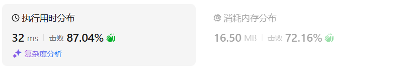

# 78子集（中等）

[78. 子集 - 力扣（LeetCode）](https://leetcode.cn/problems/subsets/description/)

## 题目描述

给你一个整数数组 `nums` ，数组中的元素 **互不相同** 。返回该数组所有可能的

子集

（幂集）。


解集 **不能** 包含重复的子集。你可以按 **任意顺序** 返回解集。

 

**示例 1：**

```
输入：nums = [1,2,3]
输出：[[],[1],[2],[1,2],[3],[1,3],[2,3],[1,2,3]]
```

**示例 2：**

```
输入：nums = [0]
输出：[[],[0]]
```

 

**提示：**

- `1 <= nums.length <= 10`
- `-10 <= nums[i] <= 10`
- `nums` 中的所有元素 **互不相同**

## 我的C++解法

递归回溯即可。判断结束，只需要start和size比较即可。递归只用传入i+1即可

```cpp
class Solution {
private:
    vector<int> path;
    vector<vector<int>> ans;
    void backtrack(vector<int>& nums,int start){
        if(start <= nums.size()){
            ans.push_back(path);
        }
        for(int i = start;i<nums.size();i++){
            // 长度从1到size
            path.push_back(nums[i]);
            backtrack(nums,i+1);
            path.pop_back();
        }
        return;
    }

public:
    vector<vector<int>> subsets(vector<int>& nums) {
        path.clear();
        ans.clear();
        backtrack(nums,0);
        return ans;
    }
};
```

结果：



## C++参考答案

如果把 子集问题、组合问题、分割问题都抽象为一棵树的话，**那么组合问题和分割问题都是收集树的叶子节点，而子集问题是找树的所有节点！**

**那么既然是无序，取过的元素不会重复取，写回溯算法的时候，for就要从startIndex开始，而不是从0开始！**

求排列问题的时候，就要从0开始，因为集合是有序的，{1, 2} 和{2, 1}是两个集合


```cpp
class Solution {
private:
    vector<vector<int>> result;
    vector<int> path;
    void backtracking(vector<int>& nums, int startIndex) {
        result.push_back(path); // 收集子集，要放在终止添加的上面，否则会漏掉自己
        if (startIndex >= nums.size()) { // 终止条件可以不加
            return;
        }
        for (int i = startIndex; i < nums.size(); i++) {
            path.push_back(nums[i]);
            backtracking(nums, i + 1);
            path.pop_back();
        }
    }
public:
    vector<vector<int>> subsets(vector<int>& nums) {
        result.clear();
        path.clear();
        backtracking(nums, 0);
        return result;
    }
};
```

可以不写终止条件，因为本来我们就要遍历整棵树


二进制视角：

使用一个循环，从 `0` 到 `2^n - 1`（包括 `2^n - 1`）

每个数字 `mask` 代表一个子集，其中 `mask` 的二进制位表示 `nums` 中元素的选中状态（1 表示选中，0 表示未选中）


```cpp
class Solution {
public:
    vector<int> t;
    vector<vector<int>> ans;

    vector<vector<int>> subsets(vector<int>& nums) {
        int n = nums.size();
        for (int mask = 0; mask < (1 << n); ++mask) {
            t.clear();
            for (int i = 0; i < n; ++i) {
                if (mask & (1 << i)) {
                    t.push_back(nums[i]);
                }
            }
            ans.push_back(t);
        }
        return ans;
    }
};
```

在C++中，`1 << n` 是一个位操作表达式，表示将整数 `1` 的二进制表示向左移动 `n` 位。这种操作通常用于生成一个二进制数，其中最高位是1，其余位都是0。

例如，如果 `n` 是3，那么 `1 << 3` 的结果将是 `1000`（二进制）或者说是 `1 * 2^3`，等于8（十进制）。

这个操作在计算机科学中经常用于生成位掩码（bitmasks）或在处理位字段（bit fields）时。

在你的代码示例中：

```cpp
for (int mask = 0; mask < (1 << n); ++mask)
```

这行代码创建了一个从0到 `(1 << n) - 1` 的循环计数器 `mask`。由于 `1 << n` 生成一个有 `n` 个0和1的最高位的二进制数，这个循环将迭代 `2^n` 次，正好是 `n` 位二进制数的所有可能组合的数量。这意味着对于数组中的每个元素，你都可以有一个子集，其中每个元素都可能出现或不出现，从而生成所有可能的子集。

例如，如果 `n` 是2，那么循环将执行4次，对应于以下子集：
- `mask = 00`（二进制）或 `0`（十进制）：子集 `[ ]`（空集）
- `mask = 01`：子集 `[ nums[1] ]`
- `mask = 10`：子集 `[ nums[0] ]`
- `mask = 11`：子集 `[ nums[0], nums[1] ]`

这种技术在生成所有组合或子集时非常有用，特别是在涉及位操作的算法中，如计算幂集或实现回溯算法。

## C++收获


## 我的python解答

```python
class Solution:
    def subsets(self, nums: List[int]) -> List[List[int]]:
        path = []
        ans = []
        def backtrack(nums:list,start:int):
            if start <= len(nums):
                ans.append(path[:])
            for i in range(start,len(nums)):
                path.append(nums[i])
                backtrack(nums,i+1)
                path.pop()
            return
        backtrack(nums,0)
        return ans
```

结果：



其实参数可以不传入nums

```python
class Solution:
    def subsets(self, nums: List[int]) -> List[List[int]]:
        path = []
        ans = []
        def backtrack(start:int):
            if start <= len(nums):
                ans.append(path[:])
            for i in range(start,len(nums)):
                path.append(nums[i])
                backtrack(i+1)
                path.pop()
            return
        backtrack(0)
        return ans
```

结果：



## python参考答案

```python
class Solution:
    def subsets(self, nums):
        result = []
        path = []
        self.backtracking(nums, 0, path, result)
        return result

    def backtracking(self, nums, startIndex, path, result):
        result.append(path[:])  # 收集子集，要放在终止添加的上面，否则会漏掉自己
        # if startIndex >= len(nums):  # 终止条件可以不加
        #     return
        for i in range(startIndex, len(nums)):
            path.append(nums[i])
            self.backtracking(nums, i + 1, path, result)
            path.pop()
```

在原来的数组中不断追加下一个：

```python
class Solution:
    def subsets(self, nums: List[int]) -> List[List[int]]:
        res = [[]]
        for i in range(len(nums)):
            for j in range(len(res)):
                res.append(res[j]+[nums[i]])
        return res
```


## python收获