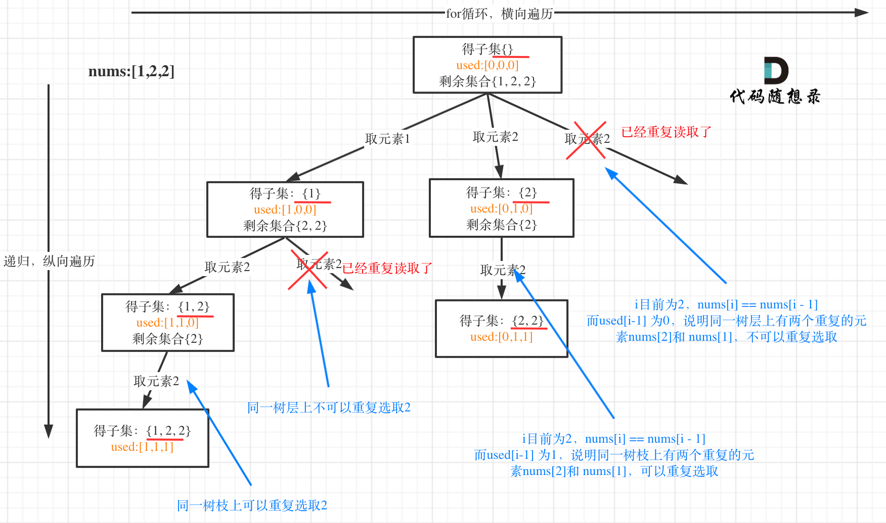
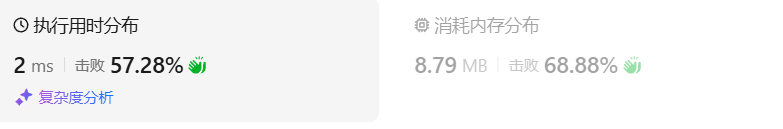
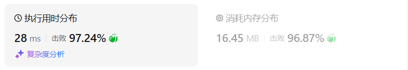

# 90子集II（中等）

[90. 子集 II - 力扣（LeetCode）](https://leetcode.cn/problems/subsets-ii/)

## 题目描述

给你一个整数数组 `nums` ，其中可能包含重复元素，请你返回该数组所有可能的 

子集

（幂集）。


解集 **不能** 包含重复的子集。返回的解集中，子集可以按 **任意顺序** 排列。

 

**示例 1：**

```
输入：nums = [1,2,2]
输出：[[],[1],[1,2],[1,2,2],[2],[2,2]]
```

**示例 2：**

```
输入：nums = [0]
输出：[[],[0]]
```

 

**提示：**

- `1 <= nums.length <= 10`
- `-10 <= nums[i] <= 10`

## 我的C++解法

如果使用昨天一样的解法，会出现相同元素，可以采用find操作来判断是否压入ans

```cpp
class Solution {
private:
    // 按照昨天题目的写法，会出现重复元素
    vector<int> path;
    vector<vector<int>> ans;
    int pre = INT_MIN;
    void backtrack(vector<int>& nums,int start){
        if(find(ans.begin(),ans.end(),path)==ans.end()){
            ans.push_back(path);
        }
        for(int i = start;i<nums.size();i++){
            path.push_back(nums[i]);
            backtrack(nums,i+1);
            path.pop_back();
        }
        return;
    }


public:
    vector<vector<int>> subsetsWithDup(vector<int>& nums) {
        path.clear();
        ans.clear();
        sort(nums.begin(),nums.end());// 递增排列
        backtrack(nums,0);
        return ans;
    }
};
```

结果：


如果不用find操作呢？

想了半天没实现出来

看看答案吧

## C++参考答案

集合里有重复元素了，而且求取的子集要去重

**排列问题里去重也是这个套路**

用示例中的[1, 2, 2] 来举例，如图所示： （**注意去重需要先对集合排序**）



```cpp
class Solution {
private:
    vector<vector<int>> result;
    vector<int> path;
    void backtracking(vector<int>& nums, int startIndex, vector<bool>& used) {
        result.push_back(path);
        for (int i = startIndex; i < nums.size(); i++) {
            // used[i - 1] == true，说明同一树枝candidates[i - 1]使用过
            // used[i - 1] == false，说明同一树层candidates[i - 1]使用过
            // 而我们要对同一树层使用过的元素进行跳过
            if (i > 0 && nums[i] == nums[i - 1] && used[i - 1] == false) {
                continue;
            }
            path.push_back(nums[i]);
            used[i] = true;
            backtracking(nums, i + 1, used);
            used[i] = false;
            path.pop_back();
        }
    }

public:
    vector<vector<int>> subsetsWithDup(vector<int>& nums) {
        result.clear();
        path.clear();
        vector<bool> used(nums.size(), false);
        sort(nums.begin(), nums.end()); // 去重需要排序
        backtracking(nums, 0, used);
        return result;
    }
};
```

使用set去重的版本。

```cpp
class Solution {
private:
    vector<vector<int>> result;
    vector<int> path;
    void backtracking(vector<int>& nums, int startIndex) {
        result.push_back(path);
        unordered_set<int> uset;
        for (int i = startIndex; i < nums.size(); i++) {
            if (uset.find(nums[i]) != uset.end()) {
                continue;
            }
            uset.insert(nums[i]);
            path.push_back(nums[i]);
            backtracking(nums, i + 1);
            path.pop_back();
        }
    }

public:
    vector<vector<int>> subsetsWithDup(vector<int>& nums) {
        result.clear();
        path.clear();
        sort(nums.begin(), nums.end()); // 去重需要排序
        backtracking(nums, 0);
        return result;
    }
};
```

可以不使用used数组来去重，因为递归的时候下一个startIndex是i+1而不是0。

如果要是全排列的话，每次要从0开始遍历，为了跳过已入栈的元素，需要使用used。

```cpp
class Solution {
private:
    vector<vector<int>> result;
    vector<int> path;
    void backtracking(vector<int>& nums, int startIndex) {
        result.push_back(path);
        for (int i = startIndex; i < nums.size(); i++) {
            // 而我们要对同一树层使用过的元素进行跳过
            if (i > startIndex && nums[i] == nums[i - 1] ) { // 注意这里使用i > startIndex
                continue;
            }
            path.push_back(nums[i]);
            backtracking(nums, i + 1);
            path.pop_back();
        }
    }

public:
    vector<vector<int>> subsetsWithDup(vector<int>& nums) {
        result.clear();
        path.clear();
        sort(nums.begin(), nums.end()); // 去重需要排序
        backtracking(nums, 0);
        return result;
    }
};
```

结果：



## C++收获


## 我的python解答

首先排好序，然后如果path不在ans，则压入

```python
class Solution:
    def subsetsWithDup(self, nums: List[int]) -> List[List[int]]:
        path =[]
        ans = []
        nums.sort()
        def dfs(start:int):
            if path not in ans:
                ans.append(path[:])
            for i in range(start,len(nums)):
                path.append(nums[i])
                dfs(i+1)
                path.pop()
        dfs(0)
        return ans
```

结果：



## python参考答案

回溯 利用used数组去重

```python
class Solution:
    def subsetsWithDup(self, nums):
        result = []
        path = []
        used = [False] * len(nums)
        nums.sort()  # 去重需要排序
        self.backtracking(nums, 0, used, path, result)
        return result

    def backtracking(self, nums, startIndex, used, path, result):
        result.append(path[:])  # 收集子集
        for i in range(startIndex, len(nums)):
            # used[i - 1] == True，说明同一树枝 nums[i - 1] 使用过
            # used[i - 1] == False，说明同一树层 nums[i - 1] 使用过
            # 而我们要对同一树层使用过的元素进行跳过
            if i > 0 and nums[i] == nums[i - 1] and not used[i - 1]:
                continue
            path.append(nums[i])
            used[i] = True
            self.backtracking(nums, i + 1, used, path, result)
            used[i] = False
            path.pop()
```

回溯 利用集合去重

```python
class Solution:
    def subsetsWithDup(self, nums):
        result = []
        path = []
        nums.sort()  # 去重需要排序
        self.backtracking(nums, 0, path, result)
        return result

    def backtracking(self, nums, startIndex, path, result):
        result.append(path[:])  # 收集子集
        uset = set()
        for i in range(startIndex, len(nums)):
            if nums[i] in uset:
                continue
            uset.add(nums[i])
            path.append(nums[i])
            self.backtracking(nums, i + 1, path, result)
            path.pop()
```

回溯 利用递归的时候下一个startIndex是i+1而不是0去重

```python
class Solution:
    def subsetsWithDup(self, nums):
        result = []
        path = []
        nums.sort()  # 去重需要排序
        self.backtracking(nums, 0, path, result)
        return result

    def backtracking(self, nums, startIndex, path, result):
        result.append(path[:])  # 收集子集
        for i in range(startIndex, len(nums)):
            # 而我们要对同一树层使用过的元素进行跳过
            if i > startIndex and nums[i] == nums[i - 1]:
                continue
            path.append(nums[i])
            self.backtracking(nums, i + 1, path, result)
            path.pop()
```


## python收获