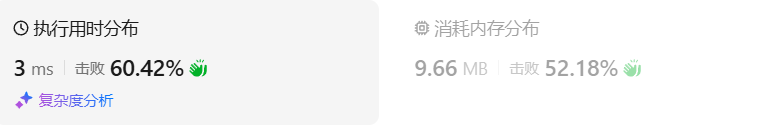
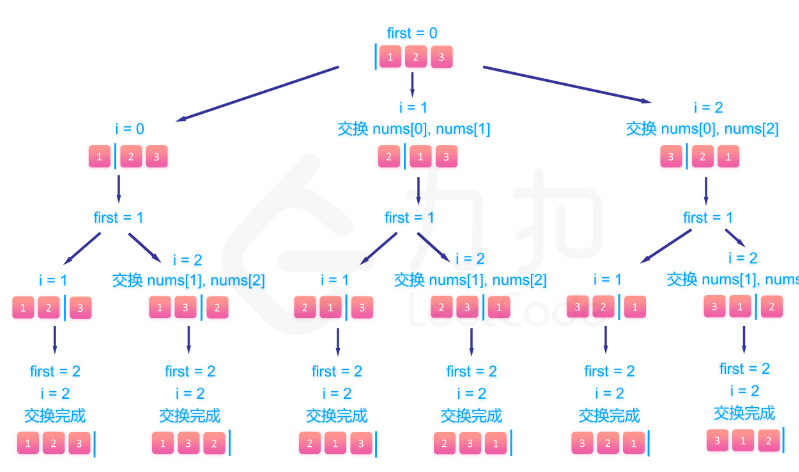
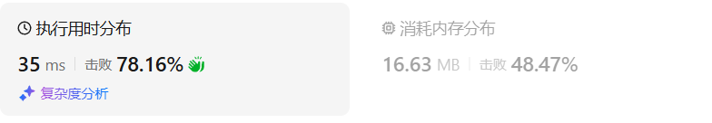

# 46全排列（中等）

[46. 全排列 - 力扣（LeetCode）](https://leetcode.cn/problems/permutations/description/)

## 题目描述

给定一个不含重复数字的数组 `nums` ，返回其 *所有可能的全排列* 。你可以 **按任意顺序** 返回答案。

 

**示例 1：**

```
输入：nums = [1,2,3]
输出：[[1,2,3],[1,3,2],[2,1,3],[2,3,1],[3,1,2],[3,2,1]]
```

**示例 2：**

```
输入：nums = [0,1]
输出：[[0,1],[1,0]]
```

**示例 3：**

```
输入：nums = [1]
输出：[[1]]
```

 

**提示：**

- `1 <= nums.length <= 6`
- `-10 <= nums[i] <= 10`
- `nums` 中的所有整数 **互不相同**

## 我的C++解法

没有办法，那就对nums数组进行改变，每次选出一个元素之后就把它在数组中删除，回溯后添加元素。

```cpp
class Solution {
private:
    vector<int> tmp;
    vector<vector<int>> ans;
    void backtrack(vector<int>& nums,int n){
        if(tmp.size()==n){
            ans.push_back(tmp);
            return;
        }
        // vector<int> new_nums = nums;
        for(int i = 0;i<nums.size();i++){
            tmp.push_back(nums[i]);
            int cur = nums[i];
            nums.erase(nums.begin()+i);
            backtrack(nums,n);
            nums.insert(nums.begin()+i,cur);
            tmp.pop_back();
        }
        return;
    }

public:
    vector<vector<int>> permute(vector<int>& nums) {
        // 最终的结果个数：A(n,n)
        tmp.clear();
        ans.clear();
        int n = nums.size();
        backtrack(nums,n);
        return ans;
    }
};
```

结果：



## C++参考答案

**首先排列是有序的，也就是说 [1,2] 和 [2,1] 是两个集合，这和之前分析的子集以及组合所不同的地方**。可以看出元素1在[1,2]中已经使用过了，但是在[2,1]中还要在使用一次1，所以处理排列问题就不用使用startIndex了。但排列问题需要一个used数组，标记已经选择的元素，如图橘黄色部分所示:


```cpp
class Solution {
public:
    vector<vector<int>> result;
    vector<int> path;
    void backtracking (vector<int>& nums, vector<bool>& used) {
        // 此时说明找到了一组
        if (path.size() == nums.size()) {
            result.push_back(path);
            return;
        }
        for (int i = 0; i < nums.size(); i++) {
            if (used[i] == true) continue; // path里已经收录的元素，直接跳过
            used[i] = true;
            path.push_back(nums[i]);
            backtracking(nums, used);
            path.pop_back();
            used[i] = false;
        }
    }
    vector<vector<int>> permute(vector<int>& nums) {
        result.clear();
        path.clear();
        vector<bool> used(nums.size(), false);
        backtracking(nums, used);
        return result;
    }
};
```

- 时间复杂度: O(n!)
- 空间复杂度: O(n)



```cpp
class Solution {
public:
    void backtrack(vector<vector<int>>& res, vector<int>& output, int first, int len){
        // 所有数都填完了
        if (first == len) {
            res.emplace_back(output);
            return;
        }
        for (int i = first; i < len; ++i) {
            // 动态维护数组
            swap(output[i], output[first]);
            // 继续递归填下一个数
            backtrack(res, output, first + 1, len);
            // 撤销操作
            swap(output[i], output[first]);
        }
    }
    vector<vector<int>> permute(vector<int>& nums) {
        vector<vector<int> > res;
        backtrack(res, nums, 0, (int)nums.size());
        return res;
    }
};
```


## C++收获


## 我的python解答

```python
class Solution:
    def permute(self, nums: List[int]) -> List[List[int]]:
        tmp = []
        ans = []
        def dfs(n:int):
            if len(tmp)==n:
                ans.append(tmp[:])
                return
            for i in range(0,len(nums)):
                tmp.append(nums[i])
                cur = nums[i]
                del nums[i]
                dfs(n)
                nums.insert(i,cur)
                tmp.pop()
            return
        dfs(len(nums))
        return ans
```

结果：



## python参考答案

```python
class Solution:
    def permute(self, nums):
        result = []
        self.backtracking(nums, [], [False] * len(nums), result)
        return result

    def backtracking(self, nums, path, used, result):
        if len(path) == len(nums):
            result.append(path[:])
            return
        for i in range(len(nums)):
            if used[i]:
                continue
            used[i] = True
            path.append(nums[i])
            self.backtracking(nums, path, used, result)
            path.pop()
            used[i] = False
```


## python收获

### 对list型数据的操作

<center>关键词：list<center>

<center>关键词：对list的操作<center>

Python中的`list`是一种非常灵活的数据结构，支持广泛的操作。以下是一些常用的列表操作：

#### 创建列表
```python
empty_list = []
number_list = [1, 2, 3]
string_list = ["apple", "banana", "cherry"]
```

#### 访问列表元素
```python
first_element = number_list[0]  # 获取第一个元素
last_element = number_list[-1]  # 获取最后一个元素
```

#### 修改列表元素
```python
number_list[1] = 10  # 将第二个元素修改为10
```

#### 列表切片
```python
sub_list = number_list[1:3]  # 获取从第二个到第三个元素的切片
full_slice = number_list[:]  # 获取整个列表的副本
```

#### 添加元素
```python
number_list.append(4)  # 在列表末尾添加一个元素
number_list.insert(1, 9)  # 在指定位置插入一个元素
```

#### 删除元素
```python
del number_list[0]  # 删除指定位置的元素
popped_element = number_list.pop()  # 删除并返回列表的最后一个元素
```

#### 列表遍历
```python
for element in number_list:
    print(element)
```

#### 列表长度
```python
length = len(number_list)
```

#### 列表排序
```python
number_list.sort()  # 原地排序
sorted_list = sorted(number_list)  # 返回一个新的排序列表
```

#### 列表反转
```python
number_list.reverse()  # 原地反转
reversed_list = number_list[::-1]  # 返回一个新的反转列表
```

#### 列表连接
```python
combined_list = number_list + [5, 6, 7]
```

#### 列表复制
```python
list_copy = number_list.copy()  # 返回列表的浅拷贝
```

#### 列表推导式
```python
squared_list = [x**2 for x in number_list]
```

#### 列表成员资格
```python
if 2 in number_list:
    print("2 is in the list")
```

#### 列表统计
```python
count = number_list.count(2)  # 统计元素出现的次数
```

#### 列表去重
```python
unique_list = list(set(number_list))  # 使用集合去除重复元素
```

#### 列表合并与扩展
```python
list1 = [1, 2, 3]
list2 = [4, 5, 6]
list1.extend(list2)  # 将list2的元素添加到list1的末尾
```

#### 列表元素位置
```python
position = number_list.index(2)  # 查找元素的索引位置
```

#### 列表清空
```python
number_list.clear()  # 清空列表中的所有元素
```

#### 列表乘法
```python
repeated_list = number_list * 3  # 将列表重复3次
```

#### 列表与字符串转换
```python
str_list = str(number_list)  # 将列表转换为字符串
list_from_str = list("hello")  # 将字符串转换为字符列表
```

这些操作覆盖了列表的基本使用场景，包括创建、访问、修改、遍历、排序、筛选和转换等。Python的列表是动态类型的，可以容纳不同类型的元素，但通常最佳实践是让列表保持元素类型的一致性。