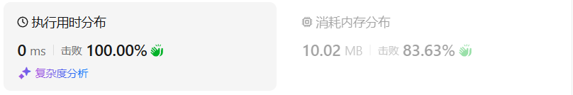

# 47全排列II（中等）

[47. 全排列 II - 力扣（LeetCode）](https://leetcode.cn/problems/permutations-ii/description/)

## 题目描述

给定一个可包含重复数字的序列 `nums` ，***按任意顺序*** 返回所有不重复的全排列。

 

**示例 1：**

```
输入：nums = [1,1,2]
输出：
[[1,1,2],
 [1,2,1],
 [2,1,1]]
```

**示例 2：**

```
输入：nums = [1,2,3]
输出：[[1,2,3],[1,3,2],[2,1,3],[2,3,1],[3,1,2],[3,2,1]]
```

 

**提示：**

- `1 <= nums.length <= 8`
- `-10 <= nums[i] <= 10`

## 我的C++解法

如果使用find函数的话就比较常规了，昨天学到的是借助used数组，不用对原数组进行删除和增加

```cpp
class Solution {
private:
    vector<int> tmp;
    vector<vector<int>> ans;
    void backtrack(vector<int>& nums,vector<int>& used){
        if(tmp.size()==nums.size() && find(ans.begin(),ans.end(),tmp)==ans.end()){
            ans.push_back(tmp);
            return;
        }
        for(int i = 0;i<nums.size();i++){
            if(used[i]==1)  continue;
            used[i]=1;
            tmp.push_back(nums[i]);
            backtrack(nums,used);
            tmp.pop_back();
            used[i]=0;
        }
    }


public:
    vector<vector<int>> permuteUnique(vector<int>& nums) {
        tmp.clear();
        ans.clear();
        vector<int> used(nums.size());
        backtrack(nums,used);
        return ans;
    }
};
```

结果：


想了一下，是需要对同一层元素进行去重，如果同一层中，前一次的选择和当前的选择一致，则跳过。

```cpp
class Solution {
private:
    vector<int> tmp;
    vector<vector<int>> ans;
    
    void backtrack(vector<int>& nums,vector<int>& used){
        if(tmp.size()==nums.size()){
            ans.push_back(tmp);
            return;
        }
        int pre = INT_MIN;
        for(int i = 0;i<nums.size();i++){   
            if(used[i]==1)  continue;
            if(pre==nums[i])    continue;// 剪枝操作
            used[i]=1;
            tmp.push_back(nums[i]);
            pre = nums[i];// 剪枝操作
            backtrack(nums,used);
            tmp.pop_back();
            used[i]=0;
        }
        return;
    }


public:
    vector<vector<int>> permuteUnique(vector<int>& nums) {
        tmp.clear();
        ans.clear();
        vector<int> used(nums.size());
        sort(nums.begin(),nums.end());
        backtrack(nums,used);
        return ans;
    }
};
```

哎，我的能力还是不太够，就这两行的剪枝操作硬控我半小时。

结果：



## C++参考答案

ss的作答：

```cpp
class Solution {
    vector<int> vis;

public:
    void backtrack(vector<int>& nums, vector<vector<int>>& ans, int idx, vector<int>& perm) {
        if (idx == nums.size()) {
            ans.emplace_back(perm);
            return;
        }
        for (int i = 0; i < (int)nums.size(); ++i) {
            if (vis[i] || (i > 0 && nums[i] == nums[i - 1] && !vis[i - 1])) {
                continue;
            }
            perm.emplace_back(nums[i]);
            vis[i] = 1;
            backtrack(nums, ans, idx + 1, perm);
            vis[i] = 0;
            perm.pop_back();
        }
    }

    vector<vector<int>> permuteUnique(vector<int>& nums) {
        vector<vector<int>> ans;
        vector<int> perm;
        vis.resize(nums.size());
        sort(nums.begin(), nums.end());
        backtrack(nums, ans, 0, perm);
        return ans;
    }
};
```

结果：


使用了++i的方法，空间消耗会更少

```cpp
class Solution {
private:
    vector<vector<int>> result;
    vector<int> path;
    void backtracking (vector<int>& nums, vector<bool>& used) {
        // 此时说明找到了一组
        if (path.size() == nums.size()) {
            result.push_back(path);
            return;
        }
        for (int i = 0; i < nums.size(); i++) {
            // used[i - 1] == true，说明同一树枝nums[i - 1]使用过
            // used[i - 1] == false，说明同一树层nums[i - 1]使用过
            // 如果同一树层nums[i - 1]使用过则直接跳过
            if (i > 0 && nums[i] == nums[i - 1] && used[i - 1] == false) {
                continue;
            }
            if (used[i] == false) {
                used[i] = true;
                path.push_back(nums[i]);
                backtracking(nums, used);
                path.pop_back();
                used[i] = false;
            }
        }
    }
public:
    vector<vector<int>> permuteUnique(vector<int>& nums) {
        result.clear();
        path.clear();
        sort(nums.begin(), nums.end()); // 排序
        vector<bool> used(nums.size(), false);
        backtracking(nums, used);
        return result;
    }
};
```


## C++收获


## 我的python解答

```python
class Solution:
    def permuteUnique(self, nums: List[int]) -> List[List[int]]:
        tmp = []
        ans = []
        used = [0]*len(nums)
        def dfs():
            if len(tmp)==len(nums):
                ans.append(tmp[:])
                return
            pre = 20
            for i in range(0,len(nums)):
                if used[i]==1:  continue
                if pre == nums[i]:  continue
                tmp.append(nums[i])
                pre = nums[i]
                used[i]=1
                dfs()
                used[i]=0
                tmp.pop()
            return
        nums.sort()
        dfs()
        return ans
```

结果：


## python参考答案

```python
class Solution:
    def permuteUnique(self, nums):
        nums.sort()  # 排序
        result = []
        self.backtracking(nums, [], [False] * len(nums), result)
        return result

    def backtracking(self, nums, path, used, result):
        if len(path) == len(nums):
            result.append(path[:])
            return
        for i in range(len(nums)):
            if (i > 0 and nums[i] == nums[i - 1] and not used[i - 1]) or used[i]:
                continue
            used[i] = True
            path.append(nums[i])
            self.backtracking(nums, path, used, result)
            path.pop()
            used[i] = False
```

## python收获