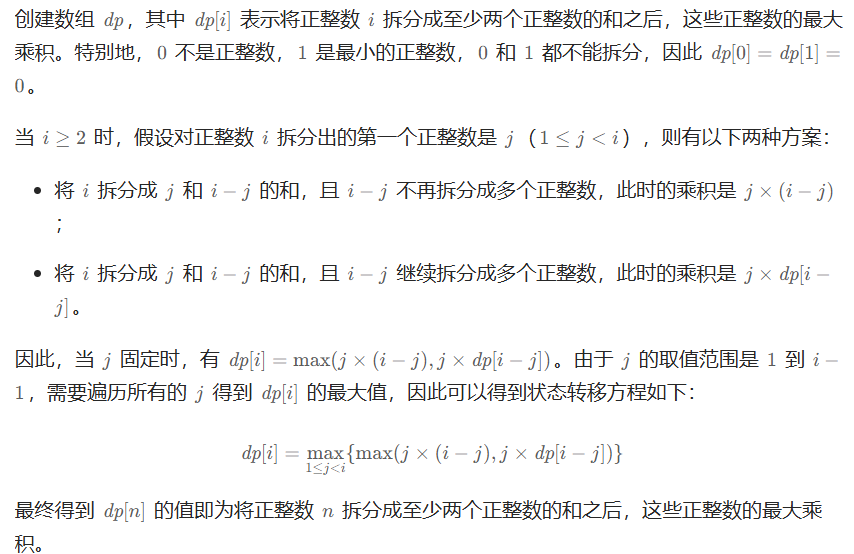

# 343整数拆分（中等）

[343. 整数拆分 - 力扣（LeetCode）](https://leetcode.cn/problems/integer-break/description/)

## 题目描述

给定一个正整数 `n` ，将其拆分为 `k` 个 **正整数** 的和（ `k >= 2` ），并使这些整数的乘积最大化。

返回 *你可以获得的最大乘积* 。

 

**示例 1:**

```
输入: n = 2
输出: 1
解释: 2 = 1 + 1, 1 × 1 = 1。
```

**示例 2:**

```
输入: n = 10
输出: 36
解释: 10 = 3 + 3 + 4, 3 × 3 × 4 = 36。
```

 

**提示:**

- `2 <= n <= 58`

## 我的C++解法

并没有用到所谓的动态规划，反而是使用了数学推导的方法

```cpp
#include <algorithm>
class Solution {
public:
    int integerBreak(int n) {
        // 首先，根据贪心的策略，使得拆分出来的数字尽可能的相近
        // 比如说拆分为2类，1和9的收益是低于2和8的收益的
        // 也就是说有一个n维长方体，已知长方体的棱长总和，求最大的体积，这个问题的解就是越接近正方体越对
        // 拆分维度从二维到n-1维，因为n维全为1，成绩为1
        int res = 1;// 最小是1
        for(int i=2;i<n;i++){
            int times = n/i;
            int left = n%i;
            res = max(res,int(pow(times,i-left)*pow(times+1,left)));
        }
        return res;
    }
};
```

结果：


## C++参考答案

动规五部曲

### 确定dp数组（dp table）以及下标的含义

dp[i]：分拆数字i，可以得到的最大乘积为dp[i]。

dp[i]的定义将贯彻整个解题过程，下面哪一步想不懂了，就想想dp[i]究竟表示的是啥！

### 确定递推公式



### dp的初始化

有的题解里会给出dp[0] = 1，dp[1] = 1的初始化，但解释比较牵强，主要还是因为这么初始化可以把题目过了。

严格从dp[i]的定义来说，dp[0] dp[1] 就不应该初始化，也就是没有意义的数值。

拆分0和拆分1的最大乘积是多少？

这是无解的。

这里我只初始化dp[2] = 1，从dp[i]的定义来说，拆分数字2，得到的最大乘积是1，这个没有任何异议！

### 确定遍历顺序

确定遍历顺序，先来看看递归公式：dp[i] = max(dp[i], max((i - j) * j, dp[i - j] * j));

dp[i] 是依靠 dp[i - j]的状态，所以遍历i一定是从前向后遍历，先有dp[i - j]再有dp[i]。

所以遍历顺序为：

```cpp
for (int i = 3; i <= n ; i++) {
    for (int j = 1; j < i - 1; j++) {
        dp[i] = max(dp[i], max((i - j) * j, dp[i - j] * j));
    }
}
```

注意 枚举j的时候，是从1开始的。从0开始的话，那么让拆分一个数拆个0，求最大乘积就没有意义了。

j的结束条件是 j < i - 1 ，其实 j < i 也是可以的，不过可以节省一步，例如让j = i - 1，的话，其实在 j = 1的时候，这一步就已经拆出来了，重复计算，所以 j < i - 1

至于 i是从3开始，这样dp[i - j]就是dp[2]正好可以通过我们初始化的数值求出来。

更优化一步，可以这样：

```cpp
for (int i = 3; i <= n ; i++) {
    for (int j = 1; j <= i / 2; j++) {
        dp[i] = max(dp[i], max((i - j) * j, dp[i - j] * j));
    }
}
```

因为拆分一个数n 使之乘积最大，那么一定是拆分成m个近似相同的子数相乘才是最大的。

例如 6 拆成 3 * 3， 10 拆成 3 * 3 * 4。 100的话 也是拆成m个近似数组的子数 相乘才是最大的。

只不过我们不知道m究竟是多少而已，但可以明确的是m一定大于等于2，既然m大于等于2，也就是 最差也应该是拆成两个相同的 可能是最大值。

那么 j 遍历，只需要遍历到 n/2 就可以，后面就没有必要遍历了，一定不是最大值。

至于 “拆分一个数n 使之乘积最大，那么一定是拆分成m个近似相同的子数相乘才是最大的” 这个我就不去做数学证明了，感兴趣的同学，可以自己证明。

### 举例推导dp数组

举例当n为10 的时候，dp数组里的数值，如下：


```cpp
class Solution {
public:
    int integerBreak(int n) {
        vector<int> dp(n + 1);
        dp[2] = 1;
        for (int i = 3; i <= n ; i++) {
            for (int j = 1; j <= i / 2; j++) {
                dp[i] = max(dp[i], max((i - j) * j, dp[i - j] * j));
            }
        }
        return dp[n];
    }
};
```

- 时间复杂度：O(n^2)
- 空间复杂度：O(n)

结果：


## C++收获


## 我的python解答

```python
class Solution:
    def integerBreak(self, n: int) -> int:
        res = 1
        for i in range(2,n):
            times = n//i
            left = n%i
            res = max(res,(times**(i-left))*((times+1)**left))
        return res
```

结果：


## python参考答案

```python
class Solution:
         # 假设对正整数 i 拆分出的第一个正整数是 j（1 <= j < i），则有以下两种方案：
        # 1) 将 i 拆分成 j 和 i−j 的和，且 i−j 不再拆分成多个正整数，此时的乘积是 j * (i-j)
        # 2) 将 i 拆分成 j 和 i−j 的和，且 i−j 继续拆分成多个正整数，此时的乘积是 j * dp[i-j]
    def integerBreak(self, n):
        dp = [0] * (n + 1)   # 创建一个大小为n+1的数组来存储计算结果
        dp[2] = 1  # 初始化dp[2]为1，因为当n=2时，只有一个切割方式1+1=2，乘积为1
       
        # 从3开始计算，直到n
        for i in range(3, n + 1):
            # 遍历所有可能的切割点
            for j in range(1, i // 2 + 1):

                # 计算切割点j和剩余部分(i-j)的乘积，并与之前的结果进行比较取较大值
                
                dp[i] = max(dp[i], (i - j) * j, dp[i - j] * j)
        
        return dp[n]  # 返回最终的计算结果
```

```python
class Solution:
    def integerBreak(self, n):
        if n <= 3:
            return 1 * (n - 1)  # 对于n小于等于3的情况，返回1 * (n - 1)

        dp = [0] * (n + 1)  # 创建一个大小为n+1的数组来存储最大乘积结果
        dp[1] = 1  # 当n等于1时，最大乘积为1
        dp[2] = 2  # 当n等于2时，最大乘积为2
        dp[3] = 3  # 当n等于3时，最大乘积为3

        # 从4开始计算，直到n
        for i in range(4, n + 1):
            # 遍历所有可能的切割点
            for j in range(1, i // 2 + 1):
                # 计算切割点j和剩余部分(i - j)的乘积，并与之前的结果进行比较取较大值
                dp[i] = max(dp[i], dp[i - j] * dp[j])

        return dp[n]  # 返回整数拆分的最大乘积结果
```


## python收获