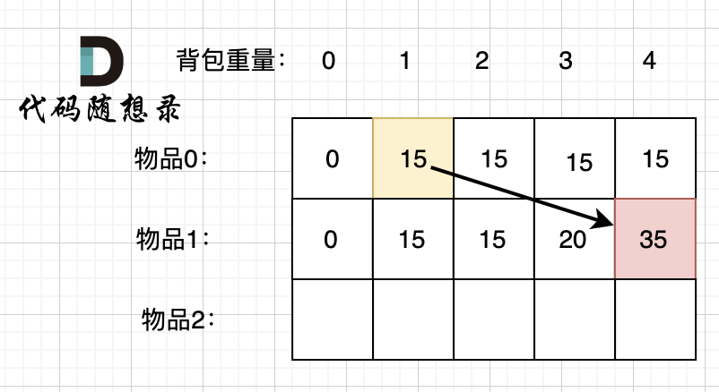
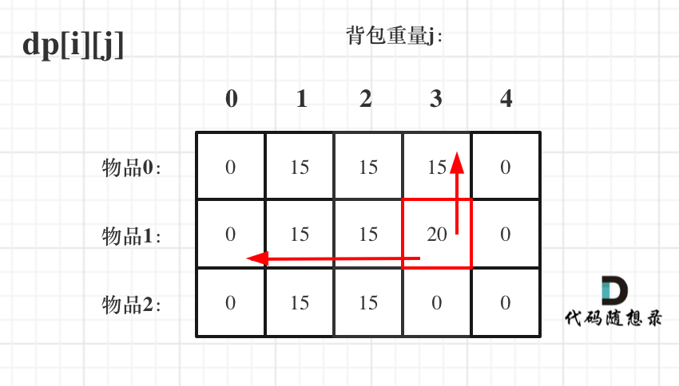
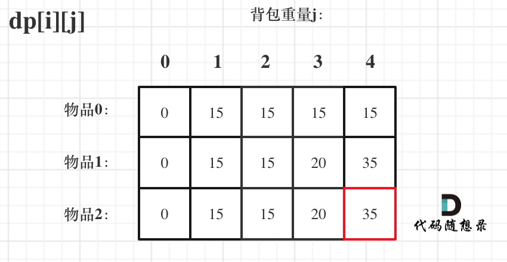

# 46携带研究材料（第六期模拟笔试）

[46. 携带研究材料（第六期模拟笔试） (kamacoder.com)](https://kamacoder.com/problempage.php?pid=1046)

## 题目描述

###### 题目描述

小明是一位科学家，他需要参加一场重要的国际科学大会，以展示自己的最新研究成果。他需要带一些研究材料，但是他的行李箱空间有限。这些研究材料包括实验设备、文献资料和实验样本等等，它们各自占据不同的空间，并且具有不同的价值。 

小明的行李空间为 N，问小明应该如何抉择，才能携带最大价值的研究材料，每种研究材料只能选择一次，并且只有选与不选两种选择，不能进行切割。

###### 输入描述

第一行包含两个正整数，第一个整数 M 代表研究材料的种类，第二个正整数 N，代表小明的行李空间。

第二行包含 M 个正整数，代表每种研究材料的所占空间。 

第三行包含 M 个正整数，代表每种研究材料的价值。

###### 输出描述

输出一个整数，代表小明能够携带的研究材料的最大价值。

###### 输入示例

```
6 1
2 2 3 1 5 2
2 3 1 5 4 3
```

###### 输出示例

```
5
```

###### 提示信息

小明能够携带 6 种研究材料，但是行李空间只有 1，而占用空间为 1 的研究材料价值为 5，所以最终答案输出 5。 

数据范围：
1 <= N <= 5000
1 <= M <= 5000
研究材料占用空间和价值都小于等于 1000

## 我的C++解法

```cpp
#include <iostream>
#include <vector>
#include <algorithm>
using namespace std;

class Solution{
public:
    int backpack(int m,int n,std::vector<std::vector<int>>& map){
        // 是一个0-1背包问题，使用动态规划
        // 初始化数组dp[n+1],dp[i]的意义是背包已用容量为i时的最大价值
        // dp[0] = 0
        std::vector<int> dp(n+1);
        for(int i=1;i<n+1;i++){
            for(int j=0;j<m;j++){
                // 遍历map二维数组
                if(i-map[j][0] >= 0){
                    dp[i] = max(dp[i],dp[i-map[j][0]]+map[j][1]);
                }
                else    break;
            }
        }
        return dp.back();
    }
    
};

bool cmp(const std::vector<int>& a,const std::vector<int>& b){
    if(a[0]==b[0])  return a[1]<b[1];
    return a[0]<b[0];
}

int main(){
    int m;
    int n;
    cin>>m>>n;
    // 获取一个数组，这样就可以进行排序了
    std::vector<std::vector<int>> map(m,std::vector<int>(m,0));
    for(int i=0;i<m;i++){
        int tmp;
        cin>>tmp;
        map[i][0] = tmp;
    }// .first是占用空间
    for(int j=0;j<m;j++){
        int tmp;
        cin>>tmp;
        map[j][1] = tmp;
    }// .second是价值
    sort(map.begin(),map.end(),cmp);
    auto solution = Solution();
    int ans = solution.backpack(m,n,map);
    cout<<ans;
    return ans;
}
```

结果：运行错误


感觉错因在于没有对map中添加used标识

但是加上used标识数组之后感觉更麻烦了，因为不一定非要把容量为i的时候装满，这就导致如果更新的dp[i]，不知道具体应该把哪个位置给标识为used，哪个位置重新标注为not-used。

先看参考答案吧，第一次遇见0-1背包问题做不出来并不难看

从参考答案中得知，其实一维的dp数组也是可以的，但是现在的我弄不太清楚，先把二维搞明白再说

## C++参考答案


### 01 背包

有n件物品和一个最多能背重量为w 的背包。第i件物品的重量是weight[i]，得到的价值是value[i] 。**每件物品只能用一次**，求解将哪些物品装入背包里物品价值总和最大。


这是标准的背包问题，以至于很多同学看了这个自然就会想到背包，甚至都不知道暴力的解法应该怎么解了。这样其实是没有从底向上去思考，而是习惯性想到了背包，那么暴力的解法应该是怎么样的呢？每一件物品其实只有两个状态，取或者不取，所以可以使用回溯法搜索出所有的情况，那么时间复杂度就是O(2^n)，这里的n表示物品数量。**所以暴力的解法是指数级别的时间复杂度。进而才需要动态规划的解法来进行优化！**

举一个例子：背包最大重量为4。

物品为：

|       | 重量 | 价值 |
| ----- | ---- | ---- |
| 物品0 | 1    | 15   |
| 物品1 | 3    | 20   |
| 物品2 | 4    | 30   |

问背包能背的物品最大价值是多少？

以下讲解和图示中出现的数字都是以这个例子为例。

### 二维dp数组01背包

依然动规五部曲分析一波。

- 确定dp数组以及下标的含义

我们需要使用二维数组，为什么呢？

因为有两个维度需要表示，分别是：物品 和 背包容量

如图，二维数组为 dp\[i][j]。


那么这里 i 、j、dp\[i][j] 分别表示什么呢？

i 来表示物品、j表示背包容量。

（如果想用j 表示物品，j表示背包容量 行不行？ 都可以的，个人习惯而已）

我们来尝试把上面的 二维表格填写一下。

动态规划的思路是根据子问题的求解推导出整体的最优解。

我们先看把物品0 放入背包的情况：


背包容量为0，放不下物品0，此时背包里的价值为0。

背包容量为1，可以放下物品0，此时背包里的价值为15.

背包容量为2，依然可以放下物品0 （注意 01背包里物品只有一个），此时背包里的价值为15。

以此类推。

再看把物品1 放入背包：


背包容量为 0，放不下物品0 或者物品1，此时背包里的价值为0。

背包容量为 1，只能放下物品1，背包里的价值为15。

背包容量为 2，只能放下物品1，背包里的价值为15。

背包容量为 3，上一行同一状态，背包只能放物品0，这次也可以选择物品1了，背包可以放物品2 或者 物品1，物品2价值更大，背包里的价值为20。

背包容量为 4，上一行同一状态，背包只能放物品0，这次也可以选择物品1了，背包都可都放下，背包价值为35。

以上举例，是比较容易看懂，我主要是通过这个例子，来帮助大家明确dp数组的含义。

上图中，我们看 dp[1][4] 表示什么意思呢。

任取 物品0，物品1 放进容量为4的背包里，最大价值是 dp\[1][4]。

通过这个举例，我们来进一步明确dp数组的含义。

即**dp\[i][j] 表示从下标为[0-i]的物品里任意取，放进容量为j的背包，价值总和最大是多少**。

**要时刻记着这个dp数组的含义，下面的一些步骤都围绕这dp数组的含义进行的**，如果哪里看懵了，就来回顾一下i代表什么，j又代表什么。

- 确定递推公式

这里在把基本信息给出来：

|       | 重量 | 价值 |
| ----- | ---- | ---- |
| 物品0 | 1    | 15   |
| 物品1 | 3    | 20   |
| 物品2 | 4    | 30   |

对于递推公式，首先我们要明确有哪些方向可以推导出 dp\[i][j]。

这里我们dp\[1][4]的状态来举例：

绝对 dp\[1][4]，就是放物品1 ，还是不放物品1。

如果不放物品1， 那么背包的价值应该是 dp[0][4] 即 容量为4的背包，只放物品0的情况。

推导方向如图：


如果放物品1， **那么背包要先留出物品1的容量**，目前容量是4，物品1 需要重量为3，此时背包剩下容量为1。

容量为1，只考虑放物品0 的最大价值是 dp\[0][1]，这个值我们之前就计算过。

所以 放物品1 的情况 = dp\[0][1] + 物品1 的重量，推导方向如图：



两种情况，分别是放物品1 和 不放物品1，我们要取最大值（毕竟求的是最大价值）

```
dp[1][4] = max(dp[0][4], dp[0][1] + 物品1 的重量)
```

以上过程，抽象化如下：

- **不放物品i**：由dp\[i - 1][j]推出，即背包容量为j，里面不放物品i的最大价值，此时dp[i][j]就是dp\[i - 1][j]。
- **放物品i**：由dp\[i - 1][j - weight[i]]推出，dp\[i - 1][j - weight[i]] 为背包容量为j - weight[i]的时候不放物品i的最大价值，那么dp\[i - 1][j - weight[i]] + value[i] （物品i的价值），就是背包放物品i得到的最大价值

递归公式： `dp[i][j] = max(dp[i - 1][j], dp[i - 1][j - weight[i]] + value[i]);`

- dp数组如何初始化

**关于初始化，一定要和dp数组的定义吻合，否则到递推公式的时候就会越来越乱**。

首先从dp[i][j]的定义出发，如果背包容量j为0的话，即dp[i][0]，无论是选取哪些物品，背包价值总和一定为0。如图：


看其他情况。

状态转移方程 `dp[i][j] = max(dp[i - 1][j], dp[i - 1][j - weight[i]] + value[i]);` 可以看出i 是由 i-1 推导出来，那么i为0的时候就一定要初始化。

dp\[0][j]，即：i为0，存放编号0的物品的时候，各个容量的背包所能存放的最大价值。

那么很明显当 `j < weight[0]`的时候，dp[0][j] 应该是 0，因为背包容量比编号0的物品重量还小。

当`j >= weight[0]`时，dp[0][j] 应该是value[0]，因为背包容量放足够放编号0物品。

代码初始化如下：

```text
for (int j = 0 ; j < weight[0]; j++) {  // 当然这一步，如果把dp数组预先初始化为0了，这一步就可以省略，但很多同学应该没有想清楚这一点。
    dp[0][j] = 0;
}
// 正序遍历
for (int j = weight[0]; j <= bagweight; j++) {
    dp[0][j] = value[0];
}
```

此时dp数组初始化情况如图所示：


dp\[0][j] 和 dp\[i][0] 都已经初始化了，那么其他下标应该初始化多少呢？

其实从递归公式： dp\[i][j] = max(dp\[i - 1][j], dp\[i - 1][j - weight[i]] + value[i]); 可以看出dp[i][j] 是由左上方数值推导出来了，那么 其他下标初始为什么数值都可以，因为都会被覆盖。

**初始-1，初始-2，初始100，都可以！**

但只不过一开始就统一把dp数组统一初始为0，更方便一些。

如图：


最后初始化代码如下：

```cpp
// 初始化 dp
vector<vector<int>> dp(weight.size(), vector<int>(bagweight + 1, 0));
for (int j = weight[0]; j <= bagweight; j++) {
    dp[0][j] = value[0];
}
```

- 确定遍历顺序

在如下图中，可以看出，有两个遍历的维度：物品与背包重量


那么问题来了，**先遍历 物品还是先遍历背包重量呢？**

**其实都可以！！ 但是先遍历物品更好理解**。

那么我先给出先遍历物品，然后遍历背包重量的代码。

```cpp
// weight数组的大小 就是物品个数
for(int i = 1; i < weight.size(); i++) { // 遍历物品
    for(int j = 0; j <= bagweight; j++) { // 遍历背包容量
        if (j < weight[i]) dp[i][j] = dp[i - 1][j];
        else dp[i][j] = max(dp[i - 1][j], dp[i - 1][j - weight[i]] + value[i]);

    }
}
```

**先遍历背包，再遍历物品，也是可以的！（注意我这里使用的二维dp数组）**

例如这样：

```cpp
// weight数组的大小 就是物品个数
for(int j = 0; j <= bagweight; j++) { // 遍历背包容量
    for(int i = 1; i < weight.size(); i++) { // 遍历物品
        if (j < weight[i]) dp[i][j] = dp[i - 1][j];
        else dp[i][j] = max(dp[i - 1][j], dp[i - 1][j - weight[i]] + value[i]);
    }
}
```

为什么也是可以的呢？

**要理解递归的本质和递推的方向**。

`dp[i][j] = max(dp[i - 1][j], dp[i - 1][j - weight[i]] + value[i]);` 递归公式中可以看出dp[i][j]是靠dp\[i-1][j]和dp\[i - 1][j - weight[i]]推导出来的。

dp\[i-1][j]和dp\[i - 1][j - weight[i]] 都在dp[i][j]的左上角方向（包括正上方向），那么先遍历物品，再遍历背包的过程如图所示：


来看看先遍历背包，再遍历物品呢，如图：



**大家可以看出，虽然两个for循环遍历的次序不同，但是dp\[i][j]所需要的数据就是左上角，根本不影响dp\[i][j]公式的推导！**

但先遍历物品再遍历背包这个顺序更好理解。

**其实背包问题里，两个for循环的先后循序是非常有讲究的，理解遍历顺序其实比理解推导公式难多了**。

- 举例推导dp数组

来看一下对应的dp数组的数值，如图：



最终结果就是dp\[2][4]。

**做动态规划的题目，最好的过程就是自己在纸上举一个例子把对应的dp数组的数值推导一下，然后在动手写代码！**

```cpp
#include <bits/stdc++.h>
using namespace std;

int main() {
    int n, bagweight;// bagweight代表行李箱空间

    cin >> n >> bagweight;

    vector<int> weight(n, 0); // 存储每件物品所占空间
    vector<int> value(n, 0);  // 存储每件物品价值

    for(int i = 0; i < n; ++i) {
        cin >> weight[i];
    }
    for(int j = 0; j < n; ++j) {
        cin >> value[j];
    }
    // dp数组, dp[i][j]代表行李箱空间为j的情况下,从下标为[0, i]的物品里面任意取,能达到的最大价值
    vector<vector<int>> dp(weight.size(), vector<int>(bagweight + 1, 0));

    // 初始化, 因为需要用到dp[i - 1]的值
    // j < weight[0]已在上方被初始化为0
    // j >= weight[0]的值就初始化为value[0]
    for (int j = weight[0]; j <= bagweight; j++) {
        dp[0][j] = value[0];
    }

    for(int i = 1; i < weight.size(); i++) { // 遍历科研物品
        for(int j = 0; j <= bagweight; j++) { // 遍历行李箱容量
            if (j < weight[i]) dp[i][j] = dp[i - 1][j]; // 如果装不下这个物品,那么就继承dp[i - 1][j]的值
            else {
                dp[i][j] = max(dp[i - 1][j], dp[i - 1][j - weight[i]] + value[i]);
            }
        }
    }
    cout << dp[n - 1][bagweight] << endl;

    return 0;
}
```

## C++收获


