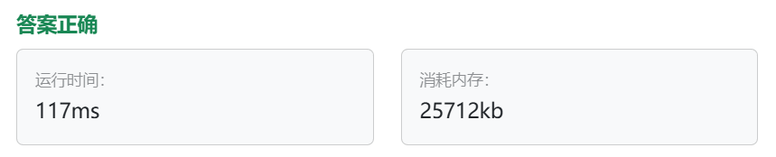
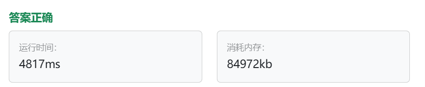

# 携带研究材料（第六期模拟笔试）

## 题目描述

###### 题目描述

小明是一位科学家，他需要参加一场重要的国际科学大会，以展示自己的最新研究成果。他需要带一些研究材料，但是他的行李箱空间有限。这些研究材料包括实验设备、文献资料和实验样本等等，它们各自占据不同的空间，并且具有不同的价值。 

小明的行李空间为 N，问小明应该如何抉择，才能携带最大价值的研究材料，每种研究材料只能选择一次，并且只有选与不选两种选择，不能进行切割。

###### 输入描述

第一行包含两个正整数，第一个整数 M 代表研究材料的种类，第二个正整数 N，代表小明的行李空间。

第二行包含 M 个正整数，代表每种研究材料的所占空间。 

第三行包含 M 个正整数，代表每种研究材料的价值。

###### 输出描述

输出一个整数，代表小明能够携带的研究材料的最大价值。

###### 输入示例

```
6 1
2 2 3 1 5 2
2 3 1 5 4 3
```

###### 输出示例

```
5
```

###### 提示信息

小明能够携带 6 种研究材料，但是行李空间只有 1，而占用空间为 1 的研究材料价值为 5，所以最终答案输出 5。 

数据范围：
1 <= N <= 5000
1 <= M <= 5000
研究材料占用空间和价值都小于等于 1000

## 我的C++解法

```cpp
#include <iostream>
#include <vector>
#include <algorithm>
using namespace std;

class Solution{
public:
    int backpack(int m,int n,vector<vector<int>>& map){
        vector<vector<int>> dp(m,vector<int>(n+1,0));
        // 初始化
        for(int i=1;i<n+1;i++){
            // 对第一行初始化即可
            if(map[0][0]<=i)    dp[0][i] = map[0][1];
        }
        for(int i=1;i<m;i++){//i遍历行，即物品
            for(int j=0;j<n+1;j++){//J遍历列，即背包容量
                // 遍历dp二维数组
                if(map[i][0]<=j){
                    // 物品可以放入背包
                    dp[i][j] = max(dp[i-1][j],dp[i-1][j-map[i][0]]+map[i][1]);
                }
                else    dp[i][j] = dp[i-1][j];
            }
        }
        return dp[m-1][n];
    }
    
};

bool cmp(const vector<int>& a,const vector<int>& b){
    if(a[0]==b[0])  return a[1]<b[1];
    return a[0]<b[0];
}

int main(){
    int m;
    int n;
    cin>>m>>n;
    // 获取一个数组，这样就可以进行排序了
    vector<vector<int>> map(m,vector<int>(m,0));
    for(int i=0;i<m;i++){
        int tmp;
        cin>>tmp;
        map[i][0] = tmp;
    }// .first是占用空间
    for(int j=0;j<m;j++){
        int tmp;
        cin>>tmp;
        map[j][1] = tmp;
    }// .second是价值
    sort(map.begin(),map.end(),cmp);
    auto solution = Solution();
    int ans = solution.backpack(m,n,map);
    cout<<ans;
    return ans;
}
```

真是奇了怪了，怎么审核都感觉没错，提交就是运行错误


滚他妈的，把最后改为return 0;就tm通过了。



学习完毕之后尝试手动修改为一维数组：

```cpp
#include <iostream>
#include <vector>
#include <algorithm>
using namespace std;

class Solution{
public:
    int backpack(int m,int n,vector<int>& space,vector<int>& value){
        vector<int> dp(n+1,0);
        // 初始化
        for(int i=1;i<n+1;i++){
            // 初始化
            if(space[0]<=i)    dp[i] = value[0];
        }
        for(int i=1;i<m;i++){//i遍历行，即物品
            for(int j=n;j>=space[i];j--){//J遍历列，即背包容量
                if(space[i]<=j){
                    // 物品可以放入背包
                    dp[j] = max(dp[j],dp[j-space[i]]+value[i]);
                }
            }
        }
        return dp[n];
    }
    
};

int main(){
    int m;
    int n;
    cin>>m>>n;
    vector<int> space(m,0);
    vector<int> value(m,0);
    for(int i=0;i<m;i++){
        cin>>space[i];
    }
    for(int j=0;j<m;j++){
        cin>>value[j];
    }
    auto solution = Solution();
    int ans = solution.backpack(m,n,space,value);
    cout<<ans;
    return 0;
}
```

结果：


## C++参考答案

一维dp数组思路讲解：

[代码随想录 (programmercarl.com)](https://programmercarl.com/背包理论基础01背包-2.html#思路)

```cpp
// 一维dp数组实现
#include <iostream>
#include <vector>
using namespace std;

int main() {
    // 读取 M 和 N
    int M, N;
    cin >> M >> N;

    vector<int> costs(M);
    vector<int> values(M);

    for (int i = 0; i < M; i++) {
        cin >> costs[i];
    }
    for (int j = 0; j < M; j++) {
        cin >> values[j];
    }

    // 创建一个动态规划数组dp，初始值为0
    vector<int> dp(N + 1, 0);

    // 外层循环遍历每个类型的研究材料
    for (int i = 0; i < M; ++i) {
        // 内层循环从 N 空间逐渐减少到当前研究材料所占空间
        for (int j = N; j >= costs[i]; --j) {
            // 考虑当前研究材料选择和不选择的情况，选择最大值
            dp[j] = max(dp[j], dp[j - costs[i]] + values[i]);
        }
    }

    // 输出dp[N]，即在给定 N 行李空间可以携带的研究材料最大价值
    cout << dp[N] << endl;

    return 0;
}
```

## C++收获


## 我的python解答

```python
class Solution:
    def backage(m,n,space,value):
        dp = [[0]*(n+1) for _ in range(m)]
        for i in range(n+1):
            if i>=space[i]:
                dp[0][i] = value[i]
        for i in range(1,m):
            # 遍历物品类型
            for j in range(n+1):
                # 遍历背包空间数目
                if space[i] < j:
                    dp[i][j] = dp[i-1][j]
                else:
                    dp[i][j] = max(dp[i-1][j],dp[i-1][j-space[i]]+value[i])
        return dp[m-1][n]
        

m = int(input())
n = int(input())
space = [0]*m
value = [0]*m
for i in range(m):
    space[i] = input()
for i in range(m):
    value[i] = input()
solution = Solution()
print(solution.backage(m,n,space,value))
```

然而输入是只输入三行数据的，因此需要split划分一下

其次，在初始化第一行数据的时候也出错了。

```python
class Solution:
    def backage(self,m,n,space,value):
        dp = [[0]*(n+1) for _ in range(m)]
        for i in range(n+1):
            if i>=space[0]:
                dp[0][i] = value[0]
        for i in range(1,m):
            # 遍历物品类型
            for j in range(n+1):
                # 遍历背包空间数目
                if space[i] > j:
                    dp[i][j] = dp[i-1][j]
                else:
                    dp[i][j] = max(dp[i-1][j],dp[i-1][j-space[i]]+value[i])
        return dp[m-1][n]
        

m, n = map(int, input().split())
space = list(map(int, input().split()))
value = list(map(int, input().split()))
solution = Solution()
print(solution.backage(m,n,space,value))
```

结果：



修改为一维数组：

```python
class Solution:
    def backage(self,m,n,space,value):
        dp = [0]*(n+1)
        for i in range(n+1):
            if i>=space[0]:
                dp[i] = value[0]
        for i in range(1,m):
            # 遍历物品类型
            for j in range(n,-1,-1):
                # 遍历背包空间数目
                if space[i] <= j:
                    dp[j] = max(dp[j],dp[j-space[i]]+value[i])
        return dp[n]
        

m, n = map(int, input().split())
space = list(map(int, input().split()))
value = list(map(int, input().split()))
solution = Solution()
print(solution.backage(m,n,space,value))
```

结果：


## python参考答案

```python
n, bagweight = map(int, input().split())

weight = list(map(int, input().split()))
value = list(map(int, input().split()))

dp = [[0] * (bagweight + 1) for _ in range(n)]

for j in range(weight[0], bagweight + 1):
    dp[0][j] = value[0]

for i in range(1, n):
    for j in range(bagweight + 1):
        if j < weight[i]:
            dp[i][j] = dp[i - 1][j]
        else:
            dp[i][j] = max(dp[i - 1][j], dp[i - 1][j - weight[i]] + value[i])

print(dp[n - 1][bagweight])
```

## python收获