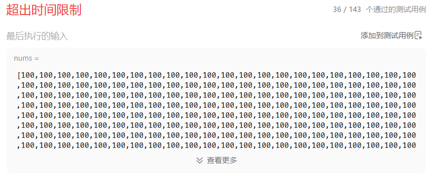
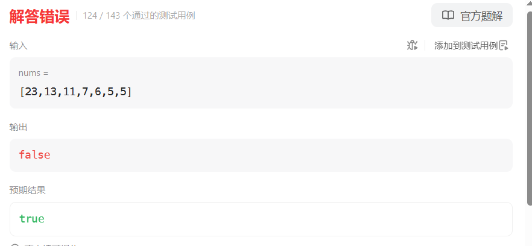

# 416分割等和子集（中等）

[416. 分割等和子集 - 力扣（LeetCode）](https://leetcode.cn/problems/partition-equal-subset-sum/description/)

## 题目描述

给你一个 **只包含正整数** 的 **非空** 数组 `nums` 。请你判断是否可以将这个数组分割成两个子集，使得两个子集的元素和相等。

 

**示例 1：**

```
输入：nums = [1,5,11,5]
输出：true
解释：数组可以分割成 [1, 5, 5] 和 [11] 。
```

**示例 2：**

```
输入：nums = [1,2,3,5]
输出：false
解释：数组不能分割成两个元素和相等的子集。
```

 

**提示：**

- `1 <= nums.length <= 200`
- `1 <= nums[i] <= 100`

## 我的C++解法

这个题给我的第一感觉就是回溯，但是大概率会超时

```cpp
class Solution {
private:
    bool backtrack(vector<int>& nums,int sum,int total,int start){
        if(sum == total-sum)    return true;
        if(start>=nums.size())  return false;
        for(int i=start;i<nums.size();i++){
            sum += nums[i];
            if(backtrack(nums,sum,total,i+1))   return true;
            sum -= nums[i];
        }
        return false;
    }

public:
    bool canPartition(vector<int>& nums) {
        // 感觉这个题是回溯啊
        sort(nums.begin(),nums.end());
        int sum = 0;
        int total = 0;
        for(int x:nums){
            total += x;
        }
        return backtrack(nums,sum,total,0);
    }
};
```

结果真超时了：



想着使用01背包解决

```cpp
class Solution {
public:
    bool canPartition(vector<int>& nums) {
        // 回溯会超时，尝试使用01背包的思想来解答
        // 可以认为有这样的背包：可以容纳的容量最大为nums.size()-1。
        // 耗费空间均为1，权重为nums数组。寻找存放组合，使得背包内权重和背包外等同，也就是说
        // 使得背包内的权重为总权重的一半，即可返回true。否则返回false
        // 使用一维数组dp[nums.size()]
        vector<int> dp(nums.size(),0);
        int total = 0;
        for(int x:nums){
            total += x;
        }
        int target = 0;
        if(total%2 !=0) return false;
        else{
            target = total/2;
        }
        // 初始化一维dp数组
        int n = nums.size();
        sort(nums.begin(),nums.end(),[](int a,int b){return a>=b;});//降序排列
        if(nums[0]==target) return true;
        if(nums[0]>target)  return false;
        for(int i=1;i<n;i++){
            dp[i] = nums[0];
        }
        for(int j=n-1;j>=0;j--){
            for(int i=1;i<n;i++){
                if(dp[j]+nums[i]<=target){
                    dp[j] = dp[j]+nums[i];
                    if(dp[j]==target)   return true;
                }
            }
        }
        return false;
    }
};
```

结果遇到刚才的错误实例的时候，nm的sort函数报错了

```cpp
class Solution {
public:
    bool canPartition(vector<int>& nums) {
        // 回溯会超时，尝试使用01背包的思想来解答
        // 可以认为有这样的背包：可以容纳的容量最大为nums.size()-1。
        // 耗费空间均为1，权重为nums数组。寻找存放组合，使得背包内权重和背包外等同，也就是说
        // 使得背包内的权重为总权重的一半，即可返回true。否则返回false
        // 使用一维数组dp[nums.size()]
        vector<int> dp(nums.size(),0);
        int total = 0;
        for(int x:nums){
            total += x;
        }
        int target = 0;
        if(total%2 !=0) return false;
        else{
            target = total/2;
        }
        // 初始化一维dp数组
        int n = nums.size();
        sort(nums.begin(),nums.end());//排列
        if(nums[n-1]==target) return true;
        if(nums[n-1]>target)  return false;
        for(int i=1;i<n;i++){
            dp[i] = nums[n-1];
        }
        for(int j=n-1;j>=0;j--){
            for(int i=1;i<n;i++){
                if(dp[i]+nums[j]<=target){
                    dp[i] = dp[i]+nums[j];
                    if(dp[i]==target)   return true;
                }
            }
        }
        return false;
    }
};
```

结果：



真是操了，搞了一个多钟头什么都没搞出来


## C++参考答案

### 01背包问题

背包问题，大家都知道，有N件物品和一个最多能背重量为W 的背包。第i件物品的重量是weight[i]，得到的价值是value[i] 。每件物品只能用一次，求解将哪些物品装入背包里物品价值总和最大。

**背包问题有多种背包方式，常见的有：01背包、完全背包、多重背包、分组背包和混合背包等等。**

要注意题目描述中商品是不是可以重复放入。

**即一个商品如果可以重复多次放入是完全背包，而只能放入一次是01背包，写法还是不一样的。**

**要明确本题中我们要使用的是01背包，因为元素我们只能用一次。**

回归主题：首先，本题要求集合里能否出现总和为 sum / 2 的子集。

那么来一一对应一下本题，看看背包问题如何来解决。

**只有确定了如下四点，才能把01背包问题套到本题上来。**

- 背包的体积为sum / 2
- 背包要放入的商品（集合里的元素）重量为 元素的数值，价值也为元素的数值
- 背包如果正好装满，说明找到了总和为 sum / 2 的子集。
- 背包中每一个元素是不可重复放入。

以上分析完，我们就可以套用01背包，来解决这个问题了。

动规五部曲分析如下：


01背包中，dp[j] 表示： 容量为j的背包，所背的物品价值最大可以为dp[j]。

本题中每一个元素的数值既是重量，也是价值。

**套到本题，dp[j]表示 背包总容量（所能装的总重量）是j，放进物品后，背的最大重量为dp[j]**。

那么如果背包容量为target， dp[target]就是装满 背包之后的重量，所以 当 dp[target] == target 的时候，背包就装满了。

那还有装不满的时候？

拿输入数组 [1, 5, 11, 5]，举例， dp[7] 只能等于 6，因为 只能放进 1 和 5。

而dp[6] 就可以等于6了，放进1 和 5，那么dp[6] == 6，说明背包装满了。


01背包的递推公式为：dp[j] = max(dp[j], dp[j - weight[i]] + value[i]);

本题，相当于背包里放入数值，那么物品i的重量是nums[i]，其价值也是nums[i]。

所以递推公式：dp[j] = max(dp[j], dp[j - nums[i]] + nums[i]);


在01背包，一维dp如何初始化，已经讲过，

从dp[j]的定义来看，首先dp[0]一定是0。

如果题目给的价值都是正整数那么非0下标都初始化为0就可以了，如果题目给的价值有负数，那么非0下标就要初始化为负无穷。

**这样才能让dp数组在递推的过程中取得最大的价值，而不是被初始值覆盖了**。

本题题目中 只包含正整数的非空数组，所以非0下标的元素初始化为0就可以了。

```cpp
// 题目中说：每个数组中的元素不会超过 100，数组的大小不会超过 200
// 总和不会大于20000，背包最大只需要其中一半，所以10001大小就可以了
vector<int> dp(10001, 0);
```


如果使用一维dp数组，物品遍历的for循环放在外层，遍历背包的for循环放在内层，且内层for循环倒序遍历！

```cpp
// 开始 01背包
for(int i = 0; i < nums.size(); i++) {
    for(int j = target; j >= nums[i]; j--) { // 每一个元素一定是不可重复放入，所以从大到小遍历
        dp[j] = max(dp[j], dp[j - nums[i]] + nums[i]);
    }
}
```


dp[j]的数值一定是小于等于j的。

**如果dp[j] == j 说明，集合中的子集总和正好可以凑成总和j，理解这一点很重要。**

用例1，输入[1,5,11,5] 为例，如图：


最后dp[11] == 11，说明可以将这个数组分割成两个子集，使得两个子集的元素和相等。

综上分析完毕，C++代码如下：

```cpp
class Solution {
public:
    bool canPartition(vector<int>& nums) {
        int sum = 0;

        // dp[i]中的i表示背包内总和
        // 题目中说：每个数组中的元素不会超过 100，数组的大小不会超过 200
        // 总和不会大于20000，背包最大只需要其中一半，所以10001大小就可以了
        vector<int> dp(10001, 0);
        for (int i = 0; i < nums.size(); i++) {
            sum += nums[i];
        }
        // 也可以使用库函数一步求和
        // int sum = accumulate(nums.begin(), nums.end(), 0);
        if (sum % 2 == 1) return false;
        int target = sum / 2;

        // 开始 01背包
        for(int i = 0; i < nums.size(); i++) {
            for(int j = target; j >= nums[i]; j--) { // 每一个元素一定是不可重复放入，所以从大到小遍历
                dp[j] = max(dp[j], dp[j - nums[i]] + nums[i]);
            }
        }
        // 集合中的元素正好可以凑成总和target
        if (dp[target] == target) return true;
        return false;
    }
};
```

结果：


## C++收获


## 我的python解答


## python参考答案

```python
class Solution:
    def canPartition(self, nums: List[int]) -> bool:
        _sum = 0

        # dp[i]中的i表示背包内总和
        # 题目中说：每个数组中的元素不会超过 100，数组的大小不会超过 200
        # 总和不会大于20000，背包最大只需要其中一半，所以10001大小就可以了
        dp = [0] * 10001
        for num in nums:
            _sum += num
        # 也可以使用内置函数一步求和
        # _sum = sum(nums)
        if _sum % 2 == 1:
            return False
        target = _sum // 2

        # 开始 0-1背包
        for num in nums:
            for j in range(target, num - 1, -1):  # 每一个元素一定是不可重复放入，所以从大到小遍历
                dp[j] = max(dp[j], dp[j - num] + num)

        # 集合中的元素正好可以凑成总和target
        if dp[target] == target:
            return True
        return False
```

```python
class Solution:
    def canPartition(self, nums: List[int]) -> bool:
        if sum(nums) % 2 != 0:
            return False
        target = sum(nums) // 2
        dp = [0] * (target + 1)
        for num in nums:
            for j in range(target, num-1, -1):
                dp[j] = max(dp[j], dp[j-num] + num)
        return dp[-1] == target
```

结果：


```python
class Solution:
    def canPartition(self, nums: List[int]) -> bool:
        
        total_sum = sum(nums)

        if total_sum % 2 != 0:
            return False

        target_sum = total_sum // 2
        dp = [[False] * (target_sum + 1) for _ in range(len(nums) + 1)]

        # 初始化第一行（空子集可以得到和为0）
        for i in range(len(nums) + 1):
            dp[i][0] = True

        for i in range(1, len(nums) + 1):
            for j in range(1, target_sum + 1):
                if j < nums[i - 1]:
                    # 当前数字大于目标和时，无法使用该数字
                    dp[i][j] = dp[i - 1][j]
                else:
                    # 当前数字小于等于目标和时，可以选择使用或不使用该数字
                    dp[i][j] = dp[i - 1][j] or dp[i - 1][j - nums[i - 1]]

        return dp[len(nums)][target_sum]
```

```python
class Solution:
    def canPartition(self, nums: List[int]) -> bool:

        total_sum = sum(nums)

        if total_sum % 2 != 0:
            return False

        target_sum = total_sum // 2
        dp = [False] * (target_sum + 1)
        dp[0] = True

        for num in nums:
            # 从target_sum逆序迭代到num，步长为-1
            for i in range(target_sum, num - 1, -1):
                dp[i] = dp[i] or dp[i - num]
        return dp[target_sum]
```


## python收获