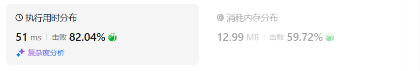
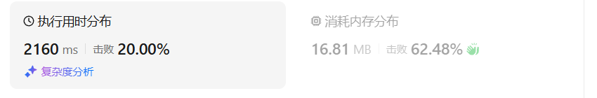
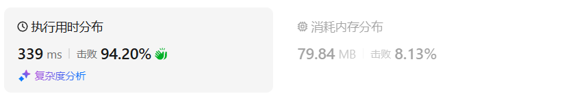
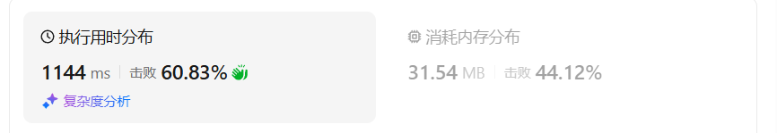
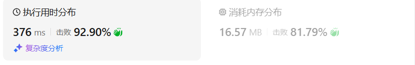

# 416分割等和子集（中等）

[416. 分割等和子集 - 力扣（LeetCode）](https://leetcode.cn/problems/partition-equal-subset-sum/description/)

## 题目描述

给你一个 **只包含正整数** 的 **非空** 数组 `nums` 。请你判断是否可以将这个数组分割成两个子集，使得两个子集的元素和相等。

 

**示例 1：**

```
输入：nums = [1,5,11,5]
输出：true
解释：数组可以分割成 [1, 5, 5] 和 [11] 。
```

**示例 2：**

```
输入：nums = [1,2,3,5]
输出：false
解释：数组不能分割成两个元素和相等的子集。
```

 

**提示：**

- `1 <= nums.length <= 200`
- `1 <= nums[i] <= 100`

## 我的C++解法

首先要求和，如果和为奇数则直接返回false

目标为总和的一半，声明动态规划数组dp[targte+1] 索引从0到target

外层循环正向遍历nums数组

内层循环倒向遍历，遍历到nums[i]，使得当前dp数值为本身和dp[j-nums[i]]+nums[i]的最大值

其实也就是说本题中的weight数组和value数组都是nums数组本身

dp[j]表示背包容量为j时，所能装下的最大value

```cpp
class Solution {
public:
    bool canPartition(vector<int>& nums) {
        int total = accumulate(nums.begin(),nums.end(),0);
        if(total%2!=0)  return false;
        int target = total/2;
        vector<int> dp(target+1);
        for(int num:nums){
            for(int j=target;j>=num;j--){
                dp[j] = max(dp[j],dp[j-num] + num);
            }
        }
        return dp.back() == target;
    }
};
```

结果：



## C++参考答案

### 记忆化搜索

定义 *dfs*(*i*,*j*) 表示能否从 *nums*[0] 到 *nums*[*i*] 中选出一个和**恰好等于** *j* 的子序列。

考虑 *nums*[*i*] 选或不选：

- 选：问题变成能否从 *nums*[0] 到 *nums*[*i*−1] 中选出一个和**恰好等于** *j*−*nums*[*i*] 的子序列，即 *dfs*(*i*−1,*j*−*nums*[*i*])。
- 不选：问题变成能否从 *nums*[0] 到 *nums*[*i*−1] 中选出一个和**恰好等于** *j* 的子序列，即 *dfs*(*i*−1,*j*)。

这两个只要有一个成立，*dfs*(*i*,*j*) 就是 true。所以有

*dfs*(*i*,*j*)=*dfs*(*i*−1,*j*−*nums*[*i*])∨*dfs*(*i*−1,*j*)

其中 ∨ 即编程语言中的 `||`。代码实现时，可以只在 *j*≥*nums*[*i*] 时才调用 *dfs*(*i*−1,*j*−*nums*[*i*])，因为任何子序列的和都不会是负的。

递归边界：*dfs*(−1,0)=true, *dfs*(−1,>0)=false。

递归入口：*dfs*(*n*−1,*s*/2)，即答案。

```cpp
class Solution {
public:
    bool canPartition(vector<int>& nums) {
        int s = reduce(nums.begin(), nums.end());
        if (s % 2) {
            return false;
        }
        int n = nums.size();
        vector<vector<int>> memo(n, vector<int>(s / 2 + 1, -1)); // -1 表示没有计算过
        function<bool(int, int)> dfs = [&](int i, int j) -> bool {
            if (i < 0) {
                return j == 0;
            }
            int& res = memo[i][j]; // 注意这里是引用
            if (res != -1) { // 之前计算过
                return res;
            }
            return res = j >= nums[i] && dfs(i - 1, j - nums[i]) || dfs(i - 1, j);
        };
        return dfs(n - 1, s / 2);
    }
};
```

结果：


- 时间复杂度：O(*n**s*)，其中 *n* 是 *nums* 的长度，*s* 是 *nums* 的元素和（的一半）。由于每个状态只会计算一次，动态规划的时间复杂度 = 状态个数 × 单个状态的计算时间。本题状态个数等于 O(*n**s*)，单个状态的计算时间为 O(1)，所以动态规划的时间复杂度为 O(*n**s*)。
- 空间复杂度：O(*n**s*)。保存多少状态，就需要多少空间。

### 1:1 翻译成递推

我们可以去掉递归中的「递」，只保留「归」的部分，即自底向上计算。

具体来说，*f*[*i*][*j*] 的定义和 *dfs*(*i*,*j*) 的定义是一样的，都表示能否从 *nums*[0] 到 *nums*[*i*] 中选出一个和**恰好等于** *j* 的子序列。

相应的递推式（状态转移方程）也和 *dfs* 一样：

*f*[*i*][*j*]=*f*\[*i*−1][*j*−*nums*[*i*]]∨*f*\[*i*−1][*j*]

但是，这种定义方式**没有状态能表示递归边界**，即 *i*=−1 的情况。

解决办法：在二维数组 *f* 的最上边插入一排状态，那么其余状态全部向下偏移一位，把 *f*[*i*] 改为 *f*[*i*+1]，把 *f*[*i*−1] 改为 *f*[*i*]。

修改后 *f*\[*i*+1][*j*] 表示能否从 *nums*[0] 到 *nums*[*i*] 中选出一个和为 *j* 的子序列。*f*[0] 对应递归边界。

修改后的递推式为

*f*\[*i*+1][*j*]=*f*[*i*][*j*−*nums*[*i*]]∨*f*[*i*][*j*]

> **问**：为什么 *nums* 的下标不用变？
>
> **答**：既然是在 *f* 的最上边插入一排状态，那么就只需要修改和 *f* 有关的下标，其余任何逻辑都无需修改。或者说，如果把 *nums*[*i*] 也改成 *nums*[*i*+1]，那么 *nums*[0] 就被我们给忽略掉了。

初始值 *f*\[0][0]=true，翻译自递归边界 *dfs*(−1,0)=true。其余值初始化成 false。

答案为 *f*\[*n*][*s*/2]，翻译自递归入口 *dfs*(*n*−1,*s*/2)。

```cpp
class Solution {
public:
    bool canPartition(vector<int>& nums) {
        int s = reduce(nums.begin(), nums.end());
        if (s % 2) {
            return false;
        }
        s /= 2; // 注意这里把 s 减半了
        int n = nums.size();
        vector<vector<int>> f(n + 1, vector<int>(s + 1));
        f[0][0] = true;
        for (int i = 0; i < n; i++) {
            int x = nums[i];
            for (int j = 0; j <= s; j++) {
                f[i + 1][j] = j >= x && f[i][j - x] || f[i][j];
            }
        }
        return f[n][s];
    }
};
```

- 时间复杂度：O(*n**s*)，其中 *n* 是 *nums* 的长度，*s* 是 *nums* 的元素和（的一半）。
- 空间复杂度：O(*n**s*)。

### 空间优化

观察上面的状态转移方程，在计算 *f*[*i*+1] 时，只会用到 *f*[*i*]，不会用到比 *i* 更早的状态。

因此可以去掉第一个维度，反复利用同一个一维数组。

状态转移方程改为

*f*[*j*]=*f*[*j*]∨*f*[*j*−*nums*[*i*]]

初始值 *f*[0]=true。

答案为 *f*[*s*/2]。

具体例子，以及为什么要倒序遍历 *j*，请看 [0-1 背包视频讲解](https://leetcode.cn/link/?target=https%3A%2F%2Fwww.bilibili.com%2Fvideo%2FBV16Y411v7Y6%2F)。

此外，设前 *i* 个数的和为 *s*′，由于子序列的元素和不可能比 *s*′ 还大，*j* 可以从 min(*s*′,*s*/2) 开始倒着枚举。比如 *nums* 前两个数的和等于 5，那么我们无法在前两个数中，选出一个元素和大于 5 的子序列，所以对于 *j*>5 的 *f* 值，一定是 false，无需计算。

```cpp
class Solution {
public:
    bool canPartition(vector<int>& nums) {
        int s = reduce(nums.begin(), nums.end());
        if (s % 2) {
            return false;
        }
        s /= 2; // 注意这里把 s 减半了
        vector<int> f(s + 1);
        f[0] = true;
        int s2 = 0;
        for (int x : nums) {
            s2 = min(s2 + x, s);
            for (int j = s2; j >= x; j--) {
                f[j] |= f[j - x];
            }
        }
        return f[s];
    }
};
```

- 时间复杂度：O(*n**s*)，其中 *n* 是 *nums* 的长度，*s* 是 *nums* 的元素和（的一半）。
- 空间复杂度：O(*s*)。

## C++收获


## 我的python解答

```python
class Solution:
    def canPartition(self, nums: List[int]) -> bool:
        if sum(nums) % 2 != 0:
            return False
        target = sum(nums) // 2
        dp = [0] * (target + 1)
        for num in nums:
            for j in range(target, num-1, -1):
                dp[j] = max(dp[j], dp[j-num] + num)
        return dp[-1] == target
```

结果：



## python参考答案

```python
class Solution:
    def canPartition(self, nums: List[int]) -> bool:
        @cache  # 缓存装饰器，避免重复计算 dfs 的结果（记忆化）
        def dfs(i: int, j: int) -> bool:
            if i < 0:
                return j == 0
            return j >= nums[i] and dfs(i - 1, j - nums[i]) or dfs(i - 1, j)

        s = sum(nums)
        return s % 2 == 0 and dfs(len(nums) - 1, s // 2)
```

结果：



```python
class Solution:
    def canPartition(self, nums: List[int]) -> bool:
        s = sum(nums)
        if s % 2:
            return False
        s //= 2  # 注意这里把 s 减半了
        n = len(nums)
        f = [[False] * (s + 1) for _ in range(n + 1)]
        f[0][0] = True
        for i, x in enumerate(nums):
            for j in range(s + 1):
                f[i + 1][j] = j >= x and f[i][j - x] or f[i][j]
        return f[n][s]
```

结果：



```python
class Solution:
    def canPartition(self, nums: List[int]) -> bool:
        s = sum(nums)
        if s % 2:
            return False
        s //= 2  # 注意这里把 s 减半了
        f = [True] + [False] * s
        s2 = 0
        for i, x in enumerate(nums):
            s2 = min(s2 + x, s)
            for j in range(s2, x - 1, -1):
                f[j] = f[j] or f[j - x]
        return f[s]
```

结果：



无敌了

## python收获