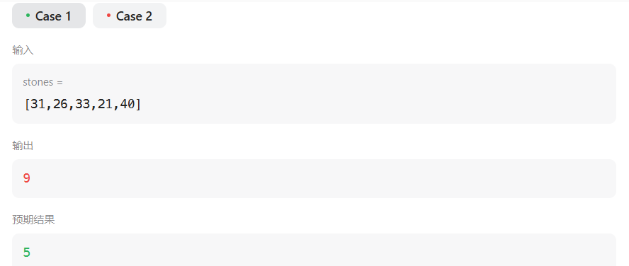
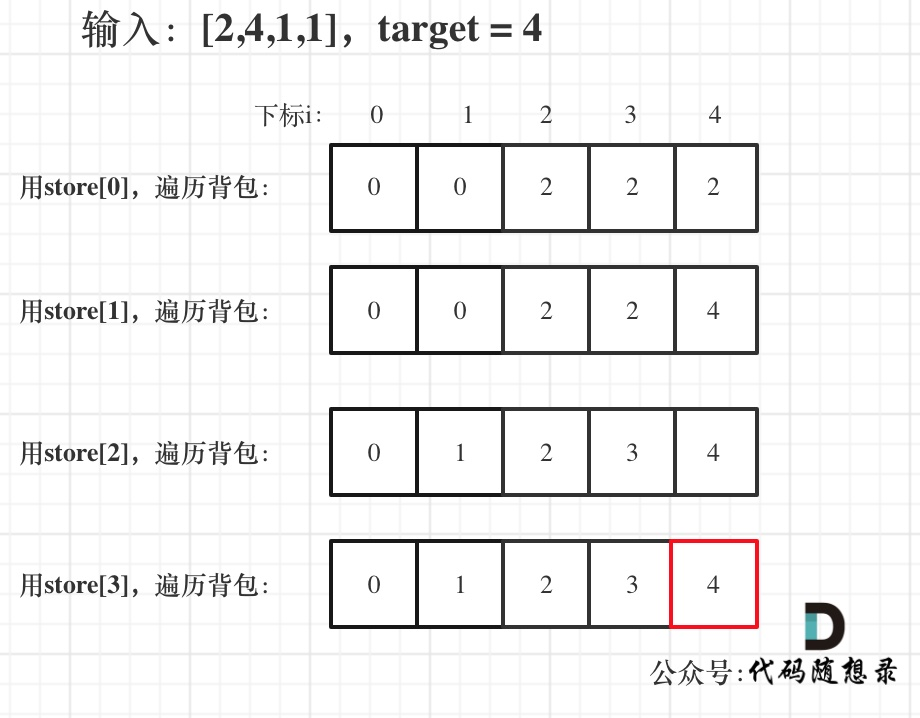

# 1049最后一块石头的重量II（中等）

[1049. 最后一块石头的重量 II - 力扣（LeetCode）](https://leetcode.cn/problems/last-stone-weight-ii/description/)

## 题目描述

有一堆石头，用整数数组 `stones` 表示。其中 `stones[i]` 表示第 `i` 块石头的重量。

每一回合，从中选出**任意两块石头**，然后将它们一起粉碎。假设石头的重量分别为 `x` 和 `y`，且 `x <= y`。那么粉碎的可能结果如下：

- 如果 `x == y`，那么两块石头都会被完全粉碎；
- 如果 `x != y`，那么重量为 `x` 的石头将会完全粉碎，而重量为 `y` 的石头新重量为 `y-x`。

最后，**最多只会剩下一块** 石头。返回此石头 **最小的可能重量** 。如果没有石头剩下，就返回 `0`。

 

**示例 1：**

```
输入：stones = [2,7,4,1,8,1]
输出：1
解释：
组合 2 和 4，得到 2，所以数组转化为 [2,7,1,8,1]，
组合 7 和 8，得到 1，所以数组转化为 [2,1,1,1]，
组合 2 和 1，得到 1，所以数组转化为 [1,1,1]，
组合 1 和 1，得到 0，所以数组转化为 [1]，这就是最优值。
```

**示例 2：**

```
输入：stones = [31,26,33,21,40]
输出：5
```

 

**提示：**

- `1 <= stones.length <= 30`
- `1 <= stones[i] <= 100`

## 我的C++解法

最开始的想法就是排序后把最大两个元素进行碰撞，最终只留下一个元素

```cpp
class Solution {
public:
    int lastStoneWeightII(vector<int>& stones) {
        // 给我的感觉就是先排序，把两个最大的进行碰撞，得到的结果加入数组中，使得数组仍然有序
        while(stones.size()!=1){
            sort(stones.begin(),stones.end());
            int y = stones.back();
            stones.pop_back();
            int x = stones.back();
            stones.pop_back();
            if(x==y)    continue;
            else{
                stones.push_back(y-x);
            }
        }
        return stones.back();
    }
};
```

结果:



真做不出来。

分析dp数组及其意义分析了tm一个多小时，真的一点也想不到，就连最开始的思路：把石头分成两个尽可能总重量相近的堆我都想不到，感觉到这里是一团浆糊，从01背包最开始的部分都没有弄明白

明天务必从0开始再看一遍01背包的递推过程


真tm无语了，看完代码回想录的答案发现确实如此，直接顺着思路就写出来了。现在我的问题在于对题目信息的解读能力不达标，甚至都不知道题目是想要干什么的，不知道自己的目标是什么。根据代码随想录的参考答案，本题的问题就是当背包容量为total/2时所能装下的最大价值。这一步就完成了题目的转化。这才是关键。

```cpp
class Solution {
public:
    int lastStoneWeightII(vector<int>& stones) {
        int total = accumulate(stones.begin(),stones.end(),0);
        int target = total/2;
        vector<int> dp(target+1);
        for(int i=0;i<stones.size();i++){
            for(int j=target;j>=stones[i];j--){
                dp[j] = max(dp[j],dp[j-stones[i]]+stones[i]);
            }
        }
        return total-2*dp.back();
    }
};
```

结果；


## C++参考答案

本题其实就是尽量让石头分成重量相同的两堆，相撞之后剩下的石头最小，**这样就化解成01背包问题了**。和昨天讲解的[416. 分割等和子集 (opens new window)](https://programmercarl.com/0416.分割等和子集.html)非常像了。

本题物品的重量为stones[i]，物品的价值也为stones[i]。对应着01背包里的物品重量weight[i]和 物品价值value[i]。


**dp[j]表示容量（这里说容量更形象，其实就是重量）为j的背包，最多可以背最大重量为dp[j]**。可以回忆一下01背包中，dp[j]的含义，容量为j的背包，最多可以装的价值为 dp[j]。相对于 01背包，本题中，石头的重量是 stones[i]，石头的价值也是 stones[i] ，可以 “最多可以装的价值为 dp[j]” == “最多可以背的重量为dp[j]”


01背包的递推公式为：dp[j] = max(dp[j], dp[j - weight[i]] + value[i]);

本题则是：**dp[j] = max(dp[j], dp[j - stones[i]] + stones[i]);**


既然 dp[j]中的j表示容量，那么最大容量（重量）是多少呢，就是所有石头的重量和。

因为提示中给出1 <= stones.length <= 30，1 <= stones[i] <= 1000，所以最大重量就是30 * 1000 。

而我们要求的target其实只是最大重量的一半，所以dp数组开到15000大小就可以了。

当然也可以把石头遍历一遍，计算出石头总重量 然后除2，得到dp数组的大小。如何初始化dp[j]呢，因为重量都不会是负数，所以dp[j]都初始化为0就可以了，这样在递归公式dp[j] = max(dp[j], dp[j - stones[i]] + stones[i]);中dp[j]才不会初始值所覆盖。


如果使用一维dp数组，物品遍历的for循环放在外层，遍历背包的for循环放在内层，且内层for循环倒序遍历！


举例，输入：[2,4,1,1]，此时target = (2 + 4 + 1 + 1)/2 = 4 ，dp数组状态图如下：



最后dp[target]里是容量为target的背包所能背的最大重量。那么分成两堆石头，一堆石头的总重量是dp[target]，另一堆就是sum - dp[target]。**在计算target的时候，target = sum / 2 因为是向下取整，所以sum - dp[target] 一定是大于等于dp[target]的**。

那么相撞之后剩下的最小石头重量就是 (sum - dp[target]) - dp[target]。

```cpp
class Solution {
public:
    int lastStoneWeightII(vector<int>& stones) {
        vector<int> dp(15001, 0);
        int sum = 0;
        for (int i = 0; i < stones.size(); i++) sum += stones[i];
        int target = sum / 2;
        for (int i = 0; i < stones.size(); i++) { // 遍历物品
            for (int j = target; j >= stones[i]; j--) { // 遍历背包
                dp[j] = max(dp[j], dp[j - stones[i]] + stones[i]);
            }
        }
        return sum - dp[target] - dp[target];
    }
};
```

- 时间复杂度：O(m × n) , m是石头总重量（准确的说是总重量的一半），n为石头块数
- 空间复杂度：O(m)

## C++收获


## 我的python解答

在阅读了C++参考答案后：

```python
class Solution:
    def lastStoneWeightII(self, stones: List[int]) -> int:
        total = sum(stones)
        target = total//2
        dp = [0]*(target+1)
        for i in range(len(stones)):
            for j in range(target,stones[i]-1,-1):
                dp[j] = max(dp[j],dp[j-stones[i]]+stones[i])
        return total-2*dp[-1]
```

结果：


## python参考答案

```python
class Solution:
    def lastStoneWeightII(self, stones: List[int]) -> int:
        dp = [0] * 15001
        total_sum = sum(stones)
        target = total_sum // 2

        for stone in stones:  # 遍历物品
            for j in range(target, stone - 1, -1):  # 遍历背包
                dp[j] = max(dp[j], dp[j - stone] + stone)

        return total_sum - dp[target] - dp[target]
```

```python
class Solution:
    def lastStoneWeightII(self, stones):
        total_sum = sum(stones)
        target = total_sum // 2
        dp = [0] * (target + 1)
        for stone in stones:
            for j in range(target, stone - 1, -1):
                dp[j] = max(dp[j], dp[j - stone] + stone)
        return total_sum - 2* dp[-1]
```

```python
class Solution:
    def lastStoneWeightII(self, stones: List[int]) -> int:
        total_sum = sum(stones)
        target = total_sum // 2
        
        # 创建二维dp数组，行数为石头的数量加1，列数为target加1
        # dp[i][j]表示前i个石头能否组成总重量为j
        dp = [[False] * (target + 1) for _ in range(len(stones) + 1)]
        
        # 初始化第一列，表示总重量为0时，前i个石头都能组成
        for i in range(len(stones) + 1):
            dp[i][0] = True
        
        for i in range(1, len(stones) + 1):
            for j in range(1, target + 1):
                # 如果当前石头重量大于当前目标重量j，则无法选择该石头
                if stones[i - 1] > j:
                    dp[i][j] = dp[i - 1][j]
                else:
                    # 可选择该石头或不选择该石头
                    dp[i][j] = dp[i - 1][j] or dp[i - 1][j - stones[i - 1]]
        
        # 找到最大的重量i，使得dp[len(stones)][i]为True
        # 返回总重量减去两倍的最接近总重量一半的重量
        for i in range(target, -1, -1):
            if dp[len(stones)][i]:
                return total_sum - 2 * i
        
        return 0
```

```python
class Solution:
    def lastStoneWeightII(self, stones):
        total_sum = sum(stones)
        target = total_sum // 2
        dp = [False] * (target + 1)
        dp[0] = True

        for stone in stones:
            for j in range(target, stone - 1, -1):
                # 判断当前重量是否可以通过选择之前的石头得到或选择当前石头和之前的石头得到
                dp[j] = dp[j] or dp[j - stone]

        for i in range(target, -1, -1):
            if dp[i]:
                # 返回剩余石头的重量，即总重量减去两倍的最接近总重量一半的重量
                return total_sum - 2 * i

        return 0
```

## python收获