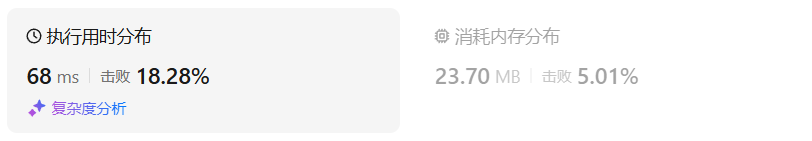
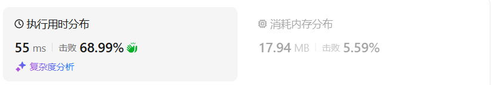
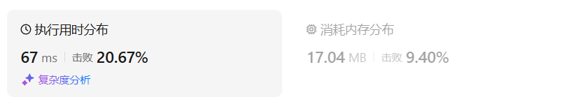
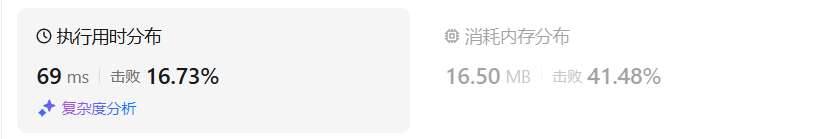
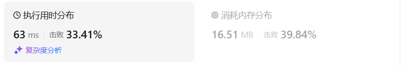

# 1049最后一块石头的重量II（中等）

[1049. 最后一块石头的重量 II - 力扣（LeetCode）](https://leetcode.cn/problems/last-stone-weight-ii/description/)

## 题目描述

有一堆石头，用整数数组 `stones` 表示。其中 `stones[i]` 表示第 `i` 块石头的重量。

每一回合，从中选出**任意两块石头**，然后将它们一起粉碎。假设石头的重量分别为 `x` 和 `y`，且 `x <= y`。那么粉碎的可能结果如下：

- 如果 `x == y`，那么两块石头都会被完全粉碎；
- 如果 `x != y`，那么重量为 `x` 的石头将会完全粉碎，而重量为 `y` 的石头新重量为 `y-x`。

最后，**最多只会剩下一块** 石头。返回此石头 **最小的可能重量** 。如果没有石头剩下，就返回 `0`。

 

**示例 1：**

```
输入：stones = [2,7,4,1,8,1]
输出：1
解释：
组合 2 和 4，得到 2，所以数组转化为 [2,7,1,8,1]，
组合 7 和 8，得到 1，所以数组转化为 [2,1,1,1]，
组合 2 和 1，得到 1，所以数组转化为 [1,1,1]，
组合 1 和 1，得到 0，所以数组转化为 [1]，这就是最优值。
```

**示例 2：**

```
输入：stones = [31,26,33,21,40]
输出：5
```

 

**提示：**

- `1 <= stones.length <= 30`
- `1 <= stones[i] <= 100`

## 我的python解答

今天优先从python来看，因为0x3f的视频讲解里面是py的

首先是第一种递归的思路，必须要时刻明确递归的返回值是什么，递归划分的子问题是什么

按照递归三部曲分析就不容易弄乱弄错

- 当前操作：枚举第i个石头选或者不选
- 子问题：从前i-1个石头中得到的最接近target的和
- 下一个子问题：
- 选：从前i-1个石头中找到最接近target-stones[i]的总和
- 不选：从前i-1个石头中找到最接近target的总和

```python
class Solution:
    def lastStoneWeightII(self, stones: List[int]) -> int:
        # 尝试按照0x3f的思路来过一遍
        # 题目的首要步骤是把石头分为大小尽可能接近的两堆
        # 首先是普通的递归思想
        total = sum(stones)
        target = total//2
        n = len(stones)
        def dfs(i:int,target:int) -> int:
            #当前操作：枚举第i个石头选或者不选
            # 子问题：从前i-1个石头中得到的最接近target的和
            # 下一个子问题：
            # 选：从前i-1个石头中找到最接近target-stones[i]的总和
            # 不选：从前i-1个石头中找到最接近target的总和
            if i<0: return 0
            res = 0
            if target<stones[i]:
                # 本身就选不了
                res = dfs(i-1,target)
            else:
                # 可以选可以不选
                res = max(dfs(i-1,target),dfs(i-1,target-stones[i])+stones[i])
            return res
        res = dfs(n-1,target)
        return total-2*res
```

当然，这个样子的时间复杂度是指数级别的，必然超时，优化方案：记忆化搜索。保存每次递归传入参数和输出结果，在py中使用@cache修饰词即可。

```python
class Solution:
    def lastStoneWeightII(self, stones: List[int]) -> int:
        total = sum(stones)
        target = total//2
        n = len(stones)
        @cache
        def dfs(i:int,target:int) -> int:
            if i<0: return 0
            res = 0
            if target<stones[i]:
                # 本身就选不了
                res = dfs(i-1,target)
            else:
                # 可以选可以不选
                res = max(dfs(i-1,target),dfs(i-1,target-stones[i])+stones[i])
            return res
        res = dfs(n-1,target)
        return total-2*res
```

结果：



在其他语言中则是创建哈希表，如果无映射结果，则添加映射；如果有映射结果则直接调用。也可以用数组来实现

```python
class Solution:
    def lastStoneWeightII(self, stones: List[int]) -> int:
        total = sum(stones)
        target = total//2
        n = len(stones)
        # 递归的输入是两个数据，因此cache数组也要是二维的
        cache = [[-1]*(target+1) for _ in range(n)]
        def dfs(i:int,target:int) -> int:
            if i<0: return 0
            res = 0
            if cache[i][target]!=-1:
                # 之前计算过
                return cache[i][target]
            if target<stones[i]:
                # 本身就选不了
                res = dfs(i-1,target)
            else:
                # 可以选可以不选
                res = max(dfs(i-1,target),dfs(i-1,target-stones[i])+stones[i])
            cache[i][target] = res # 没有计算过则存入数组
            return res
        res = dfs(n-1,target)
        return total-2*res
```

结果：



再次优化的思路：

计算max发生在调用dfs之后，即发生在递归的“归”过程当中，去掉向下传递的过程，保留向上层归的过程，此即递推（从底向上）

从顶向下计算是记忆化搜索的过程

把记忆化搜索修改为递推：

- dfs->f数组
- 递归->循环
- 递归边界->数组初始值

在上面的解答中，关键递归公式：`dfs(i,target) = max(dfs(i-1,target),dfs(i-1,target-stones[i])+stones[i]) if target>=stones[i] else dfs(i-1,target)`

修改为：`f(i,target) = max(f(i-1,target),f(i-1,target-stones[i])+stones[i]) if target>=stones[i] else f(i-1,target)`

防止出现负数下标， 选择把f数组中所有的i用i+1替换，而不改变stone数组中调用的i。可以理解为在f数组前面插入了一个空余值，防止出现负数下标：

`f(i+1,target) = max(f(i,target),f(i,target-stones[i+1])+stones[i]) if target>=stones[i] else f(i,target)`

```python
class Solution:
    def lastStoneWeightII(self, stones: List[int]) -> int:
        total = sum(stones)
        target = total//2
        n = len(stones)
        # 递归的输入是两个数据，因此数组也要是二维的
        f = [[0]*(target+1) for _ in range(n+1)] # 插入了一个空余元素防止索引为负数，初始化为dfs的边界
        for i,stone in enumerate(stones):
            for j in range(0,target+1):
                f[i+1][j] = max(f[i][j],f[i][j-stone]+stone) if j>=stone else f[i][j]            
        return total-f[n][target]*2
```

结果：



把递推式进行空间优化：

第一次优化：二维滚动数组，把上面的f中有i的全部模2处理

```python
class Solution:
    def lastStoneWeightII(self, stones: List[int]) -> int:
        total = sum(stones)
        target = total//2
        n = len(stones)
        # 递归的输入是两个数据，因此数组也要是二维的
        f = [[0]*(target+1) for _ in range(2)] # 插入了一个空余元素防止索引为负数，初始化为dfs的边界
        for i,stone in enumerate(stones):
            for j in range(0,target+1):
                f[(i+1)%2][j] = max(f[i%2][j],f[i%2][j-stone]+stone) if j>=stone else f[i%2][j]            
        return total-f[n%2][target]*2
```

结果：肉眼可见的空间复杂度变低了



再次优化空间：

使用一个一维数组

```python
class Solution:
    def lastStoneWeightII(self, stones: List[int]) -> int:
        total = sum(stones)
        target = total//2
        n = len(stones)
        # 在之前的基础上使用一维数组优化空间复杂度
        # 由于如果正序改变数据，会导致数据计算错误，因此对j逆向遍历
        f = [0]*(target+1)
        for stone in stones:
            for j in range(target,stone-1,-1):
                f[j] = max(f[j],f[j-stone]+stone)
        return total-f[target]*2
```

结果：



这就是昨天看完代码随想录后得到的答案


至此，完成了从回溯（递归）到01背包问题的过渡，也算是01背包入门了

依据代码随想录的讲解思路，可以比较快速地得到最后空间优化到一维数组的结果

代码随想录的思路：

物品的重量和价值等大，都是stones数组的内容，那么问题就转化为在背包容量为target下所能装下的最大价值。直接套公式就出来了