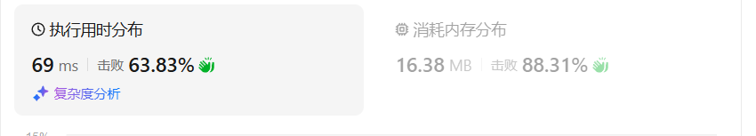
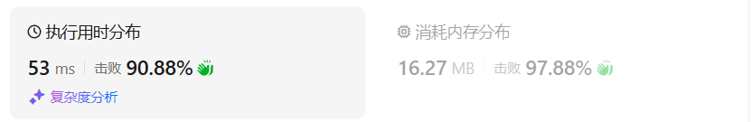
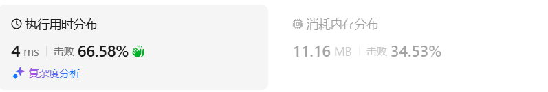

# 494目标和（中等）

[494. 目标和 - 力扣（LeetCode）](https://leetcode.cn/problems/target-sum/description/)

## 题目描述

给你一个非负整数数组 `nums` 和一个整数 `target` 。

向数组中的每个整数前添加 `'+'` 或 `'-'` ，然后串联起所有整数，可以构造一个 **表达式** ：

- 例如，`nums = [2, 1]` ，可以在 `2` 之前添加 `'+'` ，在 `1` 之前添加 `'-'` ，然后串联起来得到表达式 `"+2-1"` 。

返回可以通过上述方法构造的、运算结果等于 `target` 的不同 **表达式** 的数目。

 

**示例 1：**

```
输入：nums = [1,1,1,1,1], target = 3
输出：5
解释：一共有 5 种方法让最终目标和为 3 。
-1 + 1 + 1 + 1 + 1 = 3
+1 - 1 + 1 + 1 + 1 = 3
+1 + 1 - 1 + 1 + 1 = 3
+1 + 1 + 1 - 1 + 1 = 3
+1 + 1 + 1 + 1 - 1 = 3
```

**示例 2：**

```
输入：nums = [1], target = 1
输出：1
```

 

**提示：**

- `1 <= nums.length <= 20`
- `0 <= nums[i] <= 1000`
- `0 <= sum(nums[i]) <= 1000`
- `-1000 <= target <= 1000`

## 我的python解答

先考虑回溯，无非就是对当前元素选择取正或者取负。

```python
class Solution:
    def findTargetSumWays(self, nums: List[int], target: int) -> int:
        n = len(nums)
        # 先考虑回溯
        def dfs(nums,i:int,target:int):
            if target==0 and i<0:   return 1
            if i<0: return 0
            # 对于数据num，有选正和选负之分
            res = dfs(nums,i-1,target-nums[i]) + dfs(nums,i-1,target+nums[i])
            return res
        return dfs(nums,n-1,target)
```

回溯大概率会超时，就不提交了。

记忆化搜索：添加@cache关键字

```python
class Solution:
    def findTargetSumWays(self, nums: List[int], target: int) -> int:
        n = len(nums)
        # 先考虑回溯
        @cache
        def dfs(i:int,target:int):
            if target==0 and i<0:   return 1
            if i<0: return 0
            # 对于数据num，有选正和选负之分
            res = dfs(i-1,target-nums[i]) + dfs(i-1,target+nums[i])
            return res
        res = dfs(n-1,target)
        return res
```

结果：


翻译为递推：

```python
class Solution:
    def findTargetSumWays(self, nums: List[int], target: int) -> int:
        n = len(nums)
        total = sum(nums)-abs(target)
        if total<0 or total%2:  return 0
        # sum = p+q 其中p为前面加正号的，q为需要添加负号的
        # target = p-q = sum-2*q
        # q = (sum-target)/2 表示需要变为负数的所有的原来数据之和
        m = total//2
        
        # 变成递推：
        f = [[0]*(m+1) for _ in range(n+1)]
        f[0][0] = 1
        for i,num in enumerate(nums):
            # 把f插入一个元素防止出现下标为负数
            for j in range(m+1):
                if j<num:
                    f[i+1][j] = f[i][j]
                else:
                    f[i+1][j] = f[i][j-num] + f[i][j]

        return f[n][m]
```

结果：



使用两个滚动数组：

```python
class Solution:
    def findTargetSumWays(self, nums: List[int], target: int) -> int:
        n = len(nums)
        total = sum(nums)-abs(target)
        if total<0 or total%2:  return 0
        # sum = p+q 其中p为前面加正号的，q为需要添加负号的
        # target = p-q = sum-2*q
        # q = (sum-target)/2 表示需要变为负数的所有的原来数据之和
        m = total//2
        
        # 递推的优化：使用两个滚动数组，把n+1换为2，f的第一个参数对2求余
        f = [[0]*(m+1) for _ in range(2)]
        f[0][0] = 1
        for i,num in enumerate(nums):
            # 把f插入一个元素防止出现下标为负数
            for j in range(m+1):
                if j<num:
                    f[(i+1)%2][j] = f[i%2][j]
                else:
                    f[(i+1)%2][j] = f[i%2][j-num] + f[i%2][j]

        return f[n%2][m]
```

结果：


继续优化：把两个数组换为一个数组

```python
class Solution:
    def findTargetSumWays(self, nums: List[int], target: int) -> int:
        n = len(nums)
        total = sum(nums)-abs(target)
        if total<0 or total%2:  return 0
        # sum = p+q 其中p为前面加正号的，q为需要添加负号的
        # target = p-q = sum-2*q
        # q = (sum-target)/2 表示需要变为负数的所有的原来数据之和
        m = total//2
        
        f = [0]*(m+1)
        f[0] = 1
        for num in nums:
            # 把f插入一个元素防止出现下标为负数
            for j in range(m,-1,-1):
                if j<num:
                    f[j] = f[j]
                else:
                    f[j] = f[j-num] + f[j]
        return f[m]
```

结果：



nb

## python参考答案

```python
class Solution:
    def findTargetSumWays(self, nums: List[int], target: int) -> int:
        total_sum = sum(nums)  # 计算nums的总和
        if abs(target) > total_sum:
            return 0  # 此时没有方案
        if (target + total_sum) % 2 == 1:
            return 0  # 此时没有方案
        target_sum = (target + total_sum) // 2  # 目标和
        dp = [0] * (target_sum + 1)  # 创建动态规划数组，初始化为0
        dp[0] = 1  # 当目标和为0时，只有一种方案，即什么都不选
        for num in nums:
            for j in range(target_sum, num - 1, -1):
                dp[j] += dp[j - num]  # 状态转移方程，累加不同选择方式的数量
        return dp[target_sum]  # 返回达到目标和的方案数
```

### 记忆化搜索

```py
# 记忆化搜索
class Solution:
    def findTargetSumWays(self, nums: List[int], target: int) -> int:
        s = sum(nums) - abs(target)
        if s < 0 or s % 2:
            return 0
        m = s // 2  # 背包容量

        @cache  # 缓存装饰器，避免重复计算 dfs 的结果（记忆化）
        def dfs(i: int, c: int) -> int:
            if i < 0:
                return 1 if c == 0 else 0
            if c < nums[i]:
                return dfs(i - 1, c)  # 只能不选
            return dfs(i - 1, c) + dfs(i - 1, c - nums[i])  # 不选 + 选
        return dfs(len(nums) - 1, m)
```

- 时间复杂度：O(*nm*)，其中 *n* 为 *nums* 的长度，*m* 为 *nums* 的元素和减去 *target* 的绝对值。由于每个状态只会计算一次，动态规划的时间复杂度 = 状态个数 × 单个状态的计算时间。本题状态个数等于 O(*nm*)，单个状态的计算时间为 O(1)，所以动态规划的时间复杂度为 O(*nm*)。
- 空间复杂度：O(*nm*)。保存多少状态，就需要多少空间。

### 1:1 翻译成递推

```py
class Solution:
    def findTargetSumWays(self, nums: List[int], target: int) -> int:
        s = sum(nums) - abs(target)
        if s < 0 or s % 2:
            return 0
        m = s // 2  # 背包容量

        n = len(nums)
        f = [[0] * (m + 1) for _ in range(n + 1)]
        f[0][0] = 1
        for i, x in enumerate(nums):
            for c in range(m + 1):
                if c < x:
                    f[i + 1][c] = f[i][c]  # 只能不选
                else:
                    f[i + 1][c] = f[i][c] + f[i][c - x]  # 不选 + 选
        return f[n][m]
```

- 时间复杂度：O(*nm*)，其中 *n* 为 *nums* 的长度，*m* 为 *nums* 的元素和减去 *target* 的绝对值。
- 空间复杂度：O(*nm*)。

### 空间优化：两个数组（滚动数组）

```py
class Solution:
    def findTargetSumWays(self, nums: List[int], target: int) -> int:
        s = sum(nums) - abs(target)
        if s < 0 or s % 2:
            return 0
        m = s // 2  # 背包容量

        n = len(nums)
        f = [[0] * (m + 1) for _ in range(2)]
        f[0][0] = 1
        for i, x in enumerate(nums):
            for c in range(m + 1):
                if c < x:
                    f[(i + 1) % 2][c] = f[i % 2][c]  # 只能不选
                else:
                    f[(i + 1) % 2][c] = f[i % 2][c] + f[i % 2][c - x]  # 不选 + 选
        return f[n % 2][m]
```

- 时间复杂度：O(*nm*)，其中 *n* 为 *nums* 的长度，*m* 为 *nums* 的元素和减去 *target* 的绝对值。
- 空间复杂度：O(*m*)。

### 空间优化：一个数组

```py
class Solution:
    def findTargetSumWays(self, nums: List[int], target: int) -> int:
        s = sum(nums) - abs(target)
        if s < 0 or s % 2:
            return 0
        m = s // 2  # 背包容量

        f = [1] + [0] * m
        for x in nums:
            for c in range(m, x - 1, -1):
                f[c] += f[c - x]
        return f[m]
```

- 时间复杂度：O(*nm*)，其中 *n* 为 *nums* 的长度，*m* 为 *nums* 的元素和减去 *target* 的绝对值。
- 空间复杂度：O(*m*)。


## python收获


## 我的C++解法

```cpp
class Solution {
public:
    int findTargetSumWays(vector<int>& nums, int target) {
        int s = accumulate(nums.begin(),nums.end(),0) - abs(target);
        if(s<0 || s%2)  return 0;
        int n = nums.size();
        int m = s/2;
        vector<int> dp(m+1);
        dp[0] = 1;
        for(int i=0;i<n;i++){
            for(int j=m;j>=0;j--){
                if(j>=nums[i]){
                    dp[j] = dp[j] + dp[j-nums[i]];
                }
            }
        }
        return dp[m];
    }
};
```

结果：


## C++参考答案

本题要如何使表达式结果为target，

既然为target，那么就一定有 left组合 - right组合 = target。

left + right = sum，而sum是固定的。right = sum - left

公式来了， left - (sum - left) = target 推导出 left = (target + sum)/2 。

target是固定的，sum是固定的，left就可以求出来。

此时问题就是在集合nums中找出和为left的组合。

如何转化为01背包问题呢。

假设加法的总和为x，那么减法对应的总和就是sum - x。

所以我们要求的是 x - (sum - x) = target

x = (target + sum) / 2

**此时问题就转化为，装满容量为x的背包，有几种方法**。

这里的x，就是bagSize，也就是我们后面要求的背包容量。

大家看到(target + sum) / 2 应该担心计算的过程中向下取整有没有影响。

这么担心就对了，例如sum是5，target是2 的话其实就是无解的，所以：

```cpp
if ((target + sum) % 2 == 1) return 0; // 此时没有方案
```

同时如果target 的绝对值已经大于sum，那么也是没有方案的。

```cpp
if (abs(target) > sum) return 0; // 此时没有方案
```


dp[j] 表示：填满j（包括j）这么大容积的包，有dp[j]种方法

其实也可以使用二维dp数组来求解本题，dp[i][j]：使用 下标为[0, i]的nums[i]能够凑满j（包括j）这么大容量的包，有dp\[i][j]种方法。


有哪些来源可以推出dp[j]呢？

只要搞到nums[i]，凑成dp[j]就有dp[j - nums[i]] 种方法。

例如：dp[j]，j 为5，

- 已经有一个1（nums[i]） 的话，有 dp[4]种方法 凑成 容量为5的背包。
- 已经有一个2（nums[i]） 的话，有 dp[3]种方法 凑成 容量为5的背包。
- 已经有一个3（nums[i]） 的话，有 dp[2]种方法 凑成 容量为5的背包
- 已经有一个4（nums[i]） 的话，有 dp[1]种方法 凑成 容量为5的背包
- 已经有一个5 （nums[i]）的话，有 dp[0]种方法 凑成 容量为5的背包

那么凑整dp[5]有多少方法呢，也就是把 所有的 dp[j - nums[i]] 累加起来。

所以求组合类问题的公式，都是类似这种：

```text
dp[j] += dp[j - nums[i]]
```


从递推公式可以看出，在初始化的时候dp[0] 一定要初始化为1，因为dp[0]是在公式中一切递推结果的起源，如果dp[0]是0的话，递推结果将都是0。


对于01背包问题一维dp的遍历，nums放在外循环，target在内循环，且内循环倒序。


输入：nums: [1, 1, 1, 1, 1], target: 3

bagSize = (target + sum) / 2 = (3 + 5) / 2 = 4

dp数组状态变化如下：


```cpp
class Solution {
public:
    int findTargetSumWays(vector<int>& nums, int target) {
        int sum = 0;
        for (int i = 0; i < nums.size(); i++) sum += nums[i];
        if (abs(target) > sum) return 0; // 此时没有方案
        if ((target + sum) % 2 == 1) return 0; // 此时没有方案
        int bagSize = (target + sum) / 2;
        vector<int> dp(bagSize + 1, 0);
        dp[0] = 1;
        for (int i = 0; i < nums.size(); i++) {
            for (int j = bagSize; j >= nums[i]; j--) {
                dp[j] += dp[j - nums[i]];
            }
        }
        return dp[bagSize];
    }
};
```

结果：



- 时间复杂度：O(n × m)，n为正数个数，m为背包容量
- 空间复杂度：O(m)，m为背包容量


### 记忆化搜索

```cpp
class Solution {
public:
    int findTargetSumWays(vector<int>& nums, int target) {
        int s = reduce(nums.begin(), nums.end()) - abs(target);
        if (s < 0 || s % 2) {
            return 0;
        }
        int m = s / 2; // 背包容量

        int n = nums.size();
        vector<vector<int>> memo(n, vector<int>(m + 1, -1)); // -1 表示没有计算过
        auto dfs = [&](auto&& dfs, int i, int c) -> int {
            if (i < 0) {
                return c == 0;
            }
            int& res = memo[i][c]; // 注意这里是引用
            if (res != -1) { // 之前计算过
                return res;
            }
            if (c < nums[i]) {
                return res = dfs(dfs, i - 1, c); // 只能不选
            }
            return res = dfs(dfs, i - 1, c) + dfs(dfs, i - 1, c - nums[i]); // 不选 + 选
        };
        return dfs(dfs, n - 1, m);
    }
};
```

### 1:1 翻译成递推

```cpp
class Solution {
public:
    int findTargetSumWays(vector<int>& nums, int target) {
        int s = reduce(nums.begin(), nums.end()) - abs(target);
        if (s < 0 || s % 2) {
            return 0;
        }
        int m = s / 2; // 背包容量

        int n = nums.size();
        vector<vector<int>> f(n + 1, vector<int>(m + 1));
        f[0][0] = 1;
        for (int i = 0; i < n; i++) {
            for (int c = 0; c <= m; c++) {
                if (c < nums[i]) {
                    f[i + 1][c] = f[i][c]; // 只能不选
                } else {
                    f[i + 1][c] = f[i][c] + f[i][c - nums[i]]; // 不选 + 选
                }
            }
        }
        return f[n][m];
    }
};
```

### 空间优化：两个数组（滚动数组）

```cpp
class Solution {
public:
    int findTargetSumWays(vector<int>& nums, int target) {
        int s = reduce(nums.begin(), nums.end()) - abs(target);
        if (s < 0 || s % 2) {
            return 0;
        }
        int m = s / 2; // 背包容量

        int n = nums.size();
        vector<vector<int>> f(2, vector<int>(m + 1));
        f[0][0] = 1;
        for (int i = 0; i < n; i++) {
            for (int c = 0; c <= m; c++) {
                if (c < nums[i]) {
                    f[(i + 1) % 2][c] = f[i % 2][c]; // 只能不选
                } else {
                    f[(i + 1) % 2][c] = f[i % 2][c] + f[i % 2][c - nums[i]]; // 不选 + 选
                }
            }
        }
        return f[n % 2][m];
    }
};
```

### 空间优化：一个数组

```cpp
class Solution {
public:
    int findTargetSumWays(vector<int>& nums, int target) {
        int s = reduce(nums.begin(), nums.end()) - abs(target);
        if (s < 0 || s % 2) {
            return 0;
        }
        int m = s / 2; // 背包容量

        vector<int> f(m + 1);
        f[0] = 1;
        for (int x : nums) {
            for (int c = m; c >= x; c--) {
                f[c] += f[c - x];
            }
        }
        return f[m];
    }
};
```

## C++收获