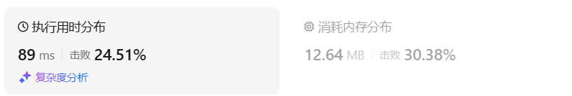
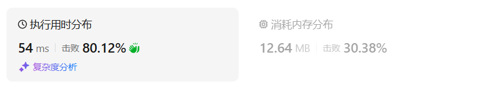
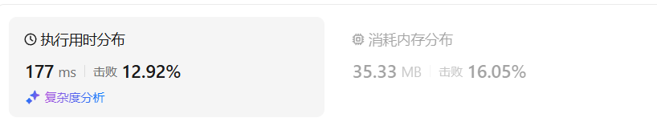
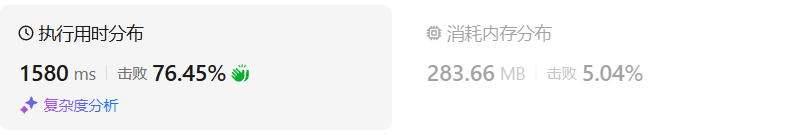
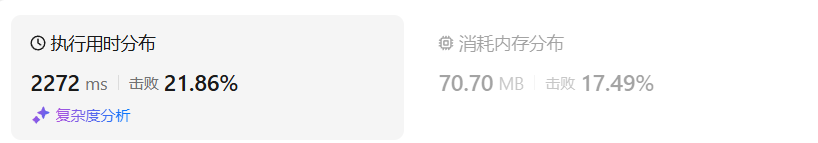
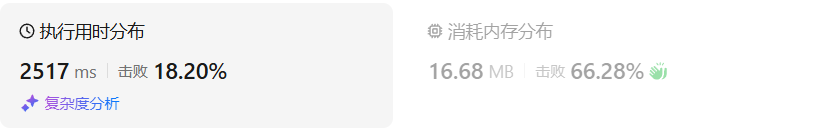
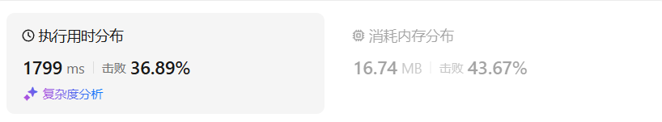

# 474一和零（中等）

[474. 一和零 - 力扣（LeetCode）](https://leetcode.cn/problems/ones-and-zeroes/description/)

## 题目描述

给你一个二进制字符串数组 `strs` 和两个整数 `m` 和 `n` 。

请你找出并返回 `strs` 的最大子集的长度，该子集中 **最多** 有 `m` 个 `0` 和 `n` 个 `1` 。

如果 `x` 的所有元素也是 `y` 的元素，集合 `x` 是集合 `y` 的 **子集** 。

 

**示例 1：**

```
输入：strs = ["10", "0001", "111001", "1", "0"], m = 5, n = 3
输出：4
解释：最多有 5 个 0 和 3 个 1 的最大子集是 {"10","0001","1","0"} ，因此答案是 4 。
其他满足题意但较小的子集包括 {"0001","1"} 和 {"10","1","0"} 。{"111001"} 不满足题意，因为它含 4 个 1 ，大于 n 的值 3 。
```

**示例 2：**

```
输入：strs = ["10", "0", "1"], m = 1, n = 1
输出：2
解释：最大的子集是 {"0", "1"} ，所以答案是 2 。
```

 

**提示：**

- `1 <= strs.length <= 600`
- `1 <= strs[i].length <= 100`
- `strs[i]` 仅由 `'0'` 和 `'1'` 组成
- `1 <= m, n <= 100`

## 我的C++解法

我的这个解法是依据python解法的逐步优化得到的。

```cpp
class Solution {
public:
    int findMaxForm(vector<string>& strs, int m, int n) {
        vector<vector<int>> dp(m+1,vector<int>(n+1,0));
        for(string s:strs){
            int m_i = 0;
            int n_i = 0;
            for(char ch:s){
                if(ch=='0') m_i++;
                else   n_i++;
            }
            for(int i=m;i>=0;i--){
                for(int j=n;j>=0;j--){
                    if(m_i<=i && n_i<=j){
                        dp[i][j] = max(dp[i][j],dp[i-m_i][j-n_i]+1);
                    }
                }
            }
        }
        return dp[m][n];
    }
};
```

结果：



再优化：循环中的i和j无需遍历到0，只用遍历到m_i和n_i即可

```cpp
class Solution {
public:
    int findMaxForm(vector<string>& strs, int m, int n) {
        vector<vector<int>> dp(m+1,vector<int>(n+1,0));
        for(string s:strs){
            int m_i = 0;
            int n_i = 0;
            for(char ch:s){
                if(ch=='0') m_i++;
                else   n_i++;
            }
            for(int i=m;i>=m_i;i--){
                for(int j=n;j>=n_i;j--){
                    dp[i][j] = max(dp[i][j],dp[i-m_i][j-n_i]+1);
                }
            }
        }
        return dp[m][n];
    }
};
```

结果：



## C++参考答案

背包有两个维度，一个是m 一个是n，而不同长度的字符串就是不同大小的待装物品


**dp\[i][j]：最多有i个0和j个1的strs的最大子集的大小为dp\[i][j]**。


dp[i][j] 可以由前一个strs里的字符串推导出来，strs里的字符串有zeroNum个0，oneNum个1。

dp\[i][j] 就可以是 dp\[i - zeroNum][j - oneNum] + 1。

然后我们在遍历的过程中，取dp\[i][j]的最大值。

所以递推公式：dp\[i][j] = max(dp\[i][j], dp\[i - zeroNum][j - oneNum] + 1);

此时大家可以回想一下01背包的递推公式：dp[j] = max(dp[j], dp[j - weight[i]] + value[i]);

对比一下就会发现，字符串的zeroNum和oneNum相当于物品的重量（weight[i]），字符串本身的个数相当于物品的价值（value[i]）。

**这就是一个典型的01背包！** 只不过物品的重量有了两个维度而已


01背包的dp数组初始化为0就可以。因为物品价值不会是负数，初始为0，保证递推的时候dp[i][j]不会被初始值覆盖。


外层for循环遍历物品，内层for循环遍历背包容量且从后向前遍历。那么本题也是，物品就是strs里的字符串，背包容量就是题目描述中的m和n。

```cpp
for (string str : strs) { // 遍历物品
    int oneNum = 0, zeroNum = 0;
    for (char c : str) {
        if (c == '0') zeroNum++;
        else oneNum++;
    }
    for (int i = m; i >= zeroNum; i--) { // 遍历背包容量且从后向前遍历！
        for (int j = n; j >= oneNum; j--) {
            dp[i][j] = max(dp[i][j], dp[i - zeroNum][j - oneNum] + 1);
        }
    }
}
```

遍历背包容量的两层for循环先后循序没讲究，都是物品重量的一个维度，先遍历哪个都行


以输入：["10","0001","111001","1","0"]，m = 3，n = 3为例，最后dp数组的状态如下所示：


```cpp
class Solution {
public:
    int findMaxForm(vector<string>& strs, int m, int n) {
        vector<vector<int>> dp(m + 1, vector<int> (n + 1, 0)); // 默认初始化0
        for (string str : strs) { // 遍历物品
            int oneNum = 0, zeroNum = 0;
            for (char c : str) {
                if (c == '0') zeroNum++;
                else oneNum++;
            }
            for (int i = m; i >= zeroNum; i--) { // 遍历背包容量且从后向前遍历！
                for (int j = n; j >= oneNum; j--) {
                    dp[i][j] = max(dp[i][j], dp[i - zeroNum][j - oneNum] + 1);
                }
            }
        }
        return dp[m][n];
    }
};
```

- 时间复杂度: O(kmn)，k 为strs的长度
- 空间复杂度: O(mn)

记忆化搜索

```cpp
class Solution {
public:
    int findMaxForm(vector<string>& strs, int m, int n) {
        // C++记忆化搜索
        int len = strs.size();
        int memo[len][m+1][n+1];// 用于记忆化
        memset(memo,-1,sizeof(memo));// 把memo数组初始值设为-1 表示当前节点未访问
        function<int(int,int,int)> dfs = [&](int i,int c0,int c1) ->int{
            if(i<0) return 0;
            if(memo[i][c0][c1] != -1)   return memo[i][c0][c1];
            auto [count0,count1] = countZeroAndOne(strs[i]);
            // 取出当前位置i，0和1的个数
            if(c0<count0 || c1<count1)  memo[i][c0][c1] = dfs(i-1,c0,c1);
            else    memo[i][c0][c1] = max(dfs(i-1,c0,c1),dfs(i-1,c0-count0,c1-count1)+1);
            return memo[i][c0][c1];
        };
        return dfs(len-1,m,n);
    }
    // 统计0和1
    pair<int,int> countZeroAndOne(string & str){
        int one = 0,zero = 0;
        for(char c:str){
            if(c=='0')  zero++;
            else    one++;
        }
        return {zero,one};
    }
};
```

结果：



## C++收获

C++创建多维数组是正序，先dim=0，再dim=1，...

比如在本题中构造二维数组，目标dp\[m][n]，则构造方法：

`vector<vector<int>> dp(m+1,vector<int>(n+1,0));`

## 我的python解答

回溯：

```python
class Solution:
    def findMaxForm(self, strs: List[str], m: int, n: int) -> int:
        size = len(strs)
        def dfs(i:int,m:int,n:int):
            if i<0: return 0
            res = m_i = n_i = 0
            for ch in strs[i]:
                if ch=='0': m_i+=1
                else:   n_i+=1
            if m_i>m or n_i>n:
                res = dfs(i-1,m,n)
            else:
                res = max(dfs(i-1,m,n),dfs(i-1,m-m_i,n-n_i)+1)
            return res
        res = dfs(size-1,m,n)
        return res
```

结果超时

记忆化搜索：

```python
class Solution:
    def findMaxForm(self, strs: List[str], m: int, n: int) -> int:
        size = len(strs)
        @cache
        def dfs(i:int,m:int,n:int):
            if i<0: return 0
            res = m_i = n_i = 0
            for ch in strs[i]:
                if ch=='0': m_i+=1
                else:   n_i+=1
            if m_i>m or n_i>n:
                res = dfs(i-1,m,n)
            else:
                res = max(dfs(i-1,m,n),dfs(i-1,m-m_i,n-n_i)+1)
            return res
        res = dfs(size-1,m,n)
        return res
```

结果：



变为递推：

因为dfs传入了三个参数，因此需要一个三维数组

```python
class Solution:
    def findMaxForm(self, strs: List[str], m: int, n: int) -> int:
        size = len(strs)
        f = [[[0]*(n+1) for i in range(m+1)] for j in range(size+1)]
        for i,string in enumerate(strs):
            m_i = n_i = 0
            for ch in strs[i]:
                if ch=='0': m_i+=1
                else:   n_i+=1
            for j in range(m+1):
                for k in range(n+1):
                    if n_i>k or m_i>j:
                        f[i+1][j][k] = f[i][j][k]
                    else:
                        f[i+1][j][k] = max(f[i][j][k],f[i][j-m_i][k-n_i]+1)
        return f[size][m][n]
```

结果：



继续优化空间，把维度优化为：（2，m+1，n+1）：

```python
class Solution:
    def findMaxForm(self, strs: List[str], m: int, n: int) -> int:
        size = len(strs)
        f = [[[0]*(n+1) for i in range(m+1)] for j in range(2)]
        for i,string in enumerate(strs):
            m_i = n_i = 0
            for ch in strs[i]:
                if ch=='0': m_i+=1
                else:   n_i+=1
            for j in range(m+1):
                for k in range(n+1):
                    if n_i>k or m_i>j:
                        f[(i+1)%2][j][k] = f[i%2][j][k]
                    else:
                        f[(i+1)%2][j][k] = max(f[i%2][j][k],f[i%2][j-m_i][k-n_i]+1)
        return f[size%2][m][n]
```

结果：



继续优化空间，缩小数组f的维度为2维（因为需要m和n两个有效数据）：

```python
class Solution:
    def findMaxForm(self, strs: List[str], m: int, n: int) -> int:
        size = len(strs)
        f = [[0]*(n+1) for i in range(m+1)]
        for string in strs:
            m_i = n_i = 0
            for ch in string:
                if ch=='0': m_i+=1
                else:   n_i+=1
            for j in range(m,-1,-1):
                for k in range(n,-1,-1):
                    if n_i>k or m_i>j:
                        f[j][k] = f[j][k]
                    else:
                        f[j][k] = max(f[j][k],f[j-m_i][k-n_i]+1)
        return f[m][n]
```

结果：



## python参考答案

```python
class Solution:
    def findMaxForm(self, strs: List[str], m: int, n: int) -> int:
        dp = [[0] * (n + 1) for _ in range(m + 1)]  # 创建二维动态规划数组，初始化为0
        for s in strs:  # 遍历物品
            zeroNum = s.count('0')  # 统计0的个数
            oneNum = len(s) - zeroNum  # 统计1的个数
            for i in range(m, zeroNum - 1, -1):  # 遍历背包容量且从后向前遍历
                for j in range(n, oneNum - 1, -1):
                    dp[i][j] = max(dp[i][j], dp[i - zeroNum][j - oneNum] + 1)  # 状态转移方程
        return dp[m][n]
```

```python
class Solution:
    def findMaxForm(self, strs: List[str], m: int, n: int) -> int:
        dp = [[0] * (n + 1) for _ in range(m + 1)]  # 创建二维动态规划数组，初始化为0
        # 遍历物品
        for s in strs:
            ones = s.count('1')  # 统计字符串中1的个数
            zeros = s.count('0')  # 统计字符串中0的个数
            # 遍历背包容量且从后向前遍历
            for i in range(m, zeros - 1, -1):
                for j in range(n, ones - 1, -1):
                    dp[i][j] = max(dp[i][j], dp[i - zeros][j - ones] + 1)  # 状态转移方程
        return dp[m][n]
```

## python收获

py使用循环构造多维数组是反着来的，dim=0是在list最外层。dim最大是在最内层

比如本题中目标f\[m][n]，构造二维数组的方法：

`f = [[0]*(n+1) for i in range(m+1)]`