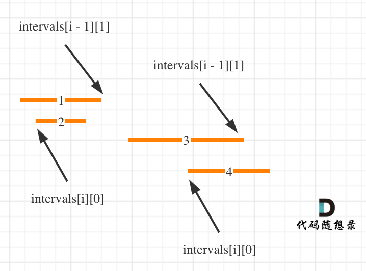

# 56合并区间（中等）

[56. 合并区间 - 力扣（LeetCode）](https://leetcode.cn/problems/merge-intervals/description/)

## 题目描述

以数组 `intervals` 表示若干个区间的集合，其中单个区间为 `intervals[i] = [starti, endi]` 。请你合并所有重叠的区间，并返回 *一个不重叠的区间数组，该数组需恰好覆盖输入中的所有区间* 。

 

**示例 1：**

```
输入：intervals = [[1,3],[2,6],[8,10],[15,18]]
输出：[[1,6],[8,10],[15,18]]
解释：区间 [1,3] 和 [2,6] 重叠, 将它们合并为 [1,6].
```

**示例 2：**

```
输入：intervals = [[1,4],[4,5]]
输出：[[1,5]]
解释：区间 [1,4] 和 [4,5] 可被视为重叠区间。
```

 

**提示：**

- `1 <= intervals.length <= 104`
- `intervals[i].length == 2`
- `0 <= starti <= endi <= 104`

## 我的C++解法

和之前的思路一致

```cpp
class Solution {
public:
    static bool cmp(const vector<int>& a,const vector<int>& b){
        if(a[0]==b[0])  return a[1]<b[1];
        return a[0]<b[0];
    }
    vector<vector<int>> merge(vector<vector<int>>& intervals) {
        sort(intervals.begin(),intervals.end(),cmp);
        vector<vector<int>> ans;
        vector<int> tmp;
        tmp.push_back(intervals[0][0]);
        tmp.push_back(intervals[0][1]);
        for(int i=1;i<intervals.size();i++){
            if(intervals[i][0]<=tmp[1]){
                tmp[1] = max(tmp[1],intervals[i][1]);
            }
            else{
                ans.push_back(tmp);
                tmp[0] = intervals[i][0];
                tmp[1] = intervals[i][1];
            }
        }
        ans.push_back(tmp);
        return ans;
    }
};
```

结果：


## C++参考答案

按照左边界从小到大排序之后，如果 `intervals[i][0] <= intervals[i - 1][1]` 即intervals[i]的左边界 <= intervals[i - 1]的右边界，则一定有重叠。（本题相邻区间也算重贴，所以是<=）

这么说有点抽象，看图：（**注意图中区间都是按照左边界排序之后了**）



用合并区间后左边界和右边界，作为一个新的区间，加入到result数组里就可以了。如果没有合并就把原区间加入到result数组。

```cpp
class Solution {
public:
    vector<vector<int>> merge(vector<vector<int>>& intervals) {
        vector<vector<int>> result;
        if (intervals.size() == 0) return result; // 区间集合为空直接返回
        // 排序的参数使用了lambda表达式
        sort(intervals.begin(), intervals.end(), [](const vector<int>& a, const vector<int>& b){return a[0] < b[0];});

        // 第一个区间就可以放进结果集里，后面如果重叠，在result上直接合并
        result.push_back(intervals[0]); 

        for (int i = 1; i < intervals.size(); i++) {
            if (result.back()[1] >= intervals[i][0]) { // 发现重叠区间
                // 合并区间，只更新右边界就好，因为result.back()的左边界一定是最小值，因为我们按照左边界排序的
                result.back()[1] = max(result.back()[1], intervals[i][1]); 
            } else {
                result.push_back(intervals[i]); // 区间不重叠 
            }
        }
        return result;
    }
};
```

- 时间复杂度: O(nlogn)
- 空间复杂度: O(logn)，排序需要的空间开销

结果：


## C++收获


## 我的python解答

```python
class Solution:
    def merge(self, intervals: List[List[int]]) -> List[List[int]]:
        intervals.sort(key = lambda x:x[0])
        ans = []
        tmp = []
        tmp.append(intervals[0][0])
        tmp.append(intervals[0][1])
        for i in range(1,len(intervals)):
            if intervals[i][0]<=tmp[1]:
                tmp[1] = max(tmp[1],intervals[i][1])
            else:
                ans.append(tmp[:])
                tmp[0] = intervals[i][0]
                tmp[1] = intervals[i][1]
        ans.append(tmp)
        return ans
```

结果：


## python参考答案

```python
class Solution:
    def merge(self, intervals):
        result = []
        if len(intervals) == 0:
            return result  # 区间集合为空直接返回

        intervals.sort(key=lambda x: x[0])  # 按照区间的左边界进行排序

        result.append(intervals[0])  # 第一个区间可以直接放入结果集中

        for i in range(1, len(intervals)):
            if result[-1][1] >= intervals[i][0]:  # 发现重叠区间
                # 合并区间，只需要更新结果集最后一个区间的右边界，因为根据排序，左边界已经是最小的
                result[-1][1] = max(result[-1][1], intervals[i][1])
            else:
                result.append(intervals[i])  # 区间不重叠

        return result
```

结果：


## python收获