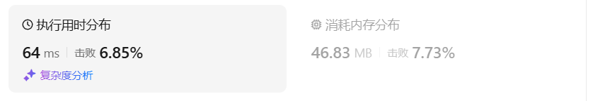
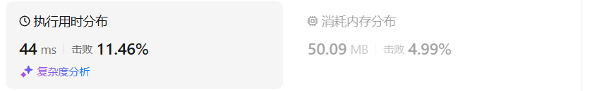
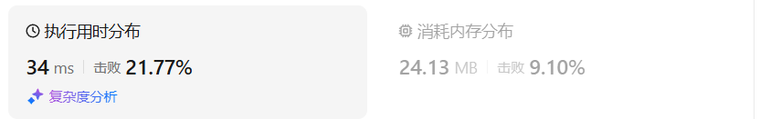
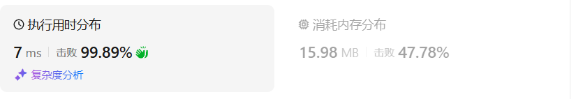
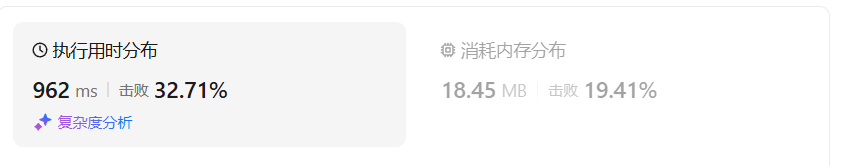
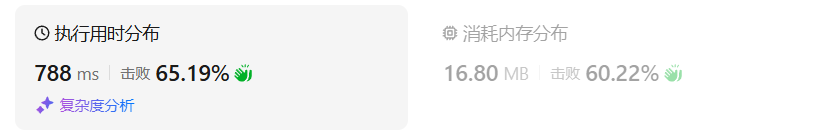

# 322零钱兑换（中等）

[322. 零钱兑换 - 力扣（LeetCode）](https://leetcode.cn/problems/coin-change/description/)

## 题目描述

给你一个整数数组 `coins` ，表示不同面额的硬币；以及一个整数 `amount` ，表示总金额。

计算并返回可以凑成总金额所需的 **最少的硬币个数** 。如果没有任何一种硬币组合能组成总金额，返回 `-1` 。

你可以认为每种硬币的数量是无限的。

 

**示例 1：**

```
输入：coins = [1, 2, 5], amount = 11
输出：3 
解释：11 = 5 + 5 + 1
```

**示例 2：**

```
输入：coins = [2], amount = 3
输出：-1
```

**示例 3：**

```
输入：coins = [1], amount = 0
输出：0
```

 

**提示：**

- `1 <= coins.length <= 12`
- `1 <= coins[i] <= 231 - 1`
- `0 <= amount <= 104`

## 我的C++解法

```cpp
class Solution {
public:
    int coinChange(vector<int>& coins, int amount) {
        vector<int> dp(amount+1,INT_MAX/2);
        dp[0] = 0;
        for(int coin:coins){
            for(int j=coin;j<=amount;j++){
                dp[j] = min(dp[j],dp[j-coin]+1);
            }
        }
        if(dp[amount]<INT_MAX/2)  return dp[amount];
        else    return -1;
    }
};
```

结果：


## C++参考答案

### 记忆化搜索

```cpp
class Solution {
public:
    int coinChange(vector<int>& coins, int amount) {
        int n = coins.size();
        vector<vector<int>> memo(n, vector<int>(amount + 1, -1)); // -1 表示没有访问过
        auto dfs = [&](auto&& dfs, int i, int c) -> int {
            if (i < 0) {
                return c == 0 ? 0 : INT_MAX / 2; // 除 2 防止下面 + 1 溢出
            }
            int &res = memo[i][c]; // 注意这里是引用
            if (res != -1) { // 之前计算过
                return res;
            }
            if (c < coins[i]) {
                return res = dfs(dfs, i - 1, c);
            }
            return res = min(dfs(dfs, i - 1, c), dfs(dfs, i, c - coins[i]) + 1);
        };
        int ans = dfs(dfs, n - 1, amount);
        return ans < INT_MAX / 2 ? ans : -1;
    }
};
```

结果：



### 递推

```cpp
class Solution {
public:
    int coinChange(vector<int> &coins, int amount) {
        int n = coins.size();
        vector<vector<int>> f(n + 1, vector<int>(amount + 1, INT_MAX / 2)); // 除 2 防止下面 + 1 溢出
        f[0][0] = 0;
        for (int i = 0; i < n; i++) {
            for (int c = 0; c <= amount; c++) {
                if (c < coins[i]) f[i + 1][c] = f[i][c];
                else f[i + 1][c] = min(f[i][c], f[i + 1][c - coins[i]] + 1);
            }
        }
        int ans = f[n][amount];
        return ans < INT_MAX / 2 ? ans : -1;
    }
};
```

结果：



### 两个数组（滚动数组）

```cpp
class Solution {
public:
    int coinChange(vector<int> &coins, int amount) {
        int n = coins.size();
        vector<vector<int>> f(2, vector<int>(amount + 1, INT_MAX / 2));
        f[0][0] = 0;
        for (int i = 0; i < n; i++) {
            for (int c = 0; c <= amount; c++) {
                if (c < coins[i]) f[(i + 1) % 2][c] = f[i % 2][c];
                else f[(i + 1) % 2][c] = min(f[i % 2][c], f[(i + 1) % 2][c - coins[i]] + 1);
            }
        }
        int ans = f[n % 2][amount];
        return ans < INT_MAX / 2 ? ans : -1;
    }
};
```

结果：



### 一个数组

```cpp
class Solution {
public:
    int coinChange(vector<int> &coins, int amount) {
        vector<int> f(amount + 1, INT_MAX / 2);
        f[0] = 0;
        for (int x : coins) {
            for (int c = x; c <= amount; c++) {
                f[c] = min(f[c], f[c - x] + 1);
            }
        }
        int ans = f[amount];
        return ans < INT_MAX / 2 ? ans : -1;
    }
};
```

结果：



## C++收获


## 我的python解答

先从递归来考虑：

类似01背包，此时无非就是个数变成了种类数目。

- 当前操作：枚举第i种物品选一个或者不选：如果不选，则剩余容量不变；如果选，则剩余容量减少w[i]
- 子问题：当剩余容量为c的时候从前i中物品中能够得到的最大价值和
- 下一个子问题：分类讨论。不选：在剩余容量为c的时候，从前i-1种物品种得到的最大价值和；选一个：在剩余容量为c-w[i]时，从前i种物品种得到的最大价值和

`dfs(i,c) = max(dfs(i-1,c),dfs(i,c-w[i])+v[i])`

在本题中，由于要返回的是最少的硬币个数，那么就要使用min而不是max了，所谓的v[i]就固定为1，表示选择了一个硬币。

既然要进行比较，取最小，那么最开始的想法：当i<0时返回-1或者0，就不可取了，因为0或者-1才是最小的，因此需要使用inf来作为边界的返回值。inf相当于C++种的INT_MAX。

```python
class Solution:
    def coinChange(self, coins: List[int], amount: int) -> int:
        # 首先从回溯开始考虑
        n = len(coins)
        def dfs(i:int,amount:int):
            if i<0:
                return 0 if amount==0 else inf
            if amount<coins[i]:
                return dfs(i-1,amount)
            return min(dfs(i-1,amount),dfs(i,amount-coins[i])+1)

        ans = dfs(n-1,amount)
        return ans if ans<inf else -1
```

不出意外绝对超时，因此添加修饰符，使得变为记忆化搜索

```python
class Solution:
    def coinChange(self, coins: List[int], amount: int) -> int:
        # 首先从回溯开始考虑
        n = len(coins)
        @cache
        def dfs(i:int,amount:int):
            if i<0:
                return 0 if amount==0 else inf
            if amount<coins[i]:
                return dfs(i-1,amount)
            return min(dfs(i-1,amount),dfs(i,amount-coins[i])+1)

        ans = dfs(n-1,amount)
        return ans if ans<inf else -1
```

结果：


只能说是勉强不超时

把递归改为递推：使用f数组

```python
class Solution:
    def coinChange(self, coins: List[int], amount: int) -> int:
        # 首先从回溯开始考虑
        n = len(coins)
        f = [[inf]*(amount+1) for _ in range(n+1)]
        f[0][0] = 0
        for i,coin in enumerate(coins):
            for j in range(amount+1):
                if j<coin:
                    f[i+1][j] = f[i][j]
                else:
                    f[i+1][j] = min(f[i][j],f[i+1][j-coin]+1)
        return f[n][amount] if f[n][amount]<inf else -1
```

结果：



继续优化：使用 一个数组空间。和01背包不同的是，这里使用数组双层for循环遍历是不需要内循环倒置的。

因为状态转移方程用到的是f[c+w[i]]或者是f[c]本身，则后面的数据鲜卑调用后被更新，使用正序遍历；而01背包问题中使用的状态转移方程用到的是f[c-w]，前面的数据先被使用后被更新，使用倒叙遍历

（可以尝试手动模拟来确定遍历顺序）、

也就是说有dp数组，已知定义状态转移方程

如果是依据左上部分的原始数据来确定当前的结果，则内部循环使用倒序

如果是依据右上部分的原始数据来确定当前的结果，则内部循环使用正序。

```python
class Solution:
    def coinChange(self, coins: List[int], amount: int) -> int:
        # 递推的空间优化：使用一维数组
        n = len(coins)
        f = [inf]*(amount+1)
        f[0] = 0
        for coin in coins:
            for j in range(coin,amount+1):
                f[j] = min(f[j],f[j-coin]+1)
        return f[amount] if f[amount]<inf else -1
```

结果：



## python参考答案

和我的py作答一致

## python收获