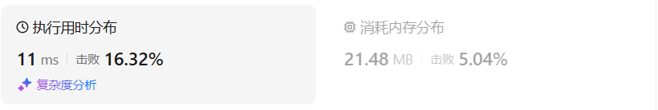
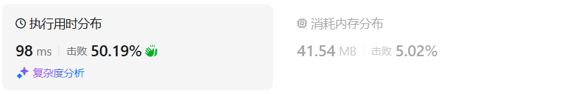
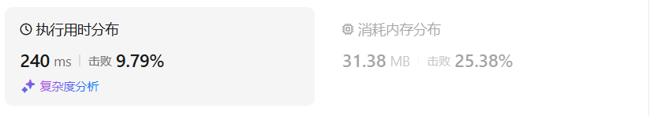
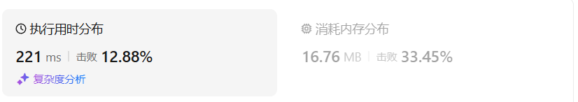
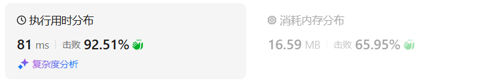

# 518零钱兑换II（中等）

[518. 零钱兑换 II - 力扣（LeetCode）](https://leetcode.cn/problems/coin-change-ii/description/)

## 题目描述

给你一个整数数组 `coins` 表示不同面额的硬币，另给一个整数 `amount` 表示总金额。

请你计算并返回可以凑成总金额的硬币组合数。如果任何硬币组合都无法凑出总金额，返回 `0` 。

假设每一种面额的硬币有无限个。 

题目数据保证结果符合 32 位带符号整数。

 

**示例 1：**

```
输入：amount = 5, coins = [1, 2, 5]
输出：4
解释：有四种方式可以凑成总金额：
5=5
5=2+2+1
5=2+1+1+1
5=1+1+1+1+1
```

**示例 2：**

```
输入：amount = 3, coins = [2]
输出：0
解释：只用面额 2 的硬币不能凑成总金额 3 。
```

**示例 3：**

```
输入：amount = 10, coins = [10] 
输出：1
```

 

**提示：**

- `1 <= coins.length <= 300`
- `1 <= coins[i] <= 5000`
- `coins` 中的所有值 **互不相同**
- `0 <= amount <= 5000`

## 我的C++解法

```cpp
class Solution {
public:
    int change(int amount, vector<int>& coins) {
        vector<int> dp(amount+1);
        dp[0] = 1;
        for(int coin:coins){
            for(int j=coin;j<=amount;j++){
                dp[j] = dp[j] + dp[j-coin];
            }
        }
        return dp.back();
    }
};
```

结果：


- 时间复杂度：O(*n*⋅*amount*)，其中 *n* 为 *coins* 的长度。
- 空间复杂度：O(*amount*)。

## C++参考答案

### 记忆化搜索

```cpp
class Solution {
public:
    int change(int amount, vector<int> &coins) {
        int n = coins.size();
        vector<vector<int>> memo(n, vector<int>(amount + 1, -1)); // -1 表示没有访问过
        function<int(int, int)> dfs = [&](int i, int c) -> int {
            if (i < 0) {
                return c == 0 ? 1 : 0;
            }
            int &res = memo[i][c]; // 注意这里是引用
            if (res != -1) { // 之前算过了
                return res;
            }
            if (c < coins[i]) {
                return res = dfs(i - 1, c);
            }
            return res = dfs(i - 1, c) + dfs(i, c - coins[i]);
        };
        return dfs(n - 1, amount);
    }
};
```

结果：



- 时间复杂度：O(*n*⋅*amount*)，其中 *n* 为 *coins* 的长度。由于每个状态只会计算一次，动态规划的时间复杂度 = 状态个数 × 单个状态的计算时间。本题状态个数等于 O(*n*⋅*amount*)，单个状态的计算时间为 O(1)，所以动态规划的时间复杂度为 O(*n*⋅*amount*)。
- 空间复杂度：O(*n*⋅*amount*)。

### 递推

```cpp
class Solution {
public:
    int change(int amount, vector<int> &coins) {
        int n = coins.size();
        vector<vector<int>> f(n + 1, vector<int>(amount + 1));
        f[0][0] = 1;
        for (int i = 0; i < n; i++) {
            for (int c = 0; c <= amount; c++) {
                if (c < coins[i]) {
                    f[i + 1][c] = f[i][c];
                } else {
                    f[i + 1][c] = f[i][c] + f[i + 1][c - coins[i]];
                }
            }
        }
        return f[n][amount];
    }
};
```

- 时间复杂度：O(*n*⋅*amount*)，其中 *n* 为 *coins* 的长度。
- 空间复杂度：O(*n*⋅*amount*)。

## C++收获


## 我的python解答

```python
class Solution:
    def change(self, amount: int, coins: List[int]) -> int:
        n = len(coins)
        @cache
        def dfs(i:int,amount:int):
            if i<0:
                return 1 if amount==0 else 0
            if amount>=coins[i]:
                res = dfs(i,amount-coins[i]) + dfs(i-1,amount)
                return res
            else:
                res = dfs(i-1,amount)
                return res
        res = dfs(n-1,amount)
        return res
```

结果：



```python
class Solution:
    def change(self, amount: int, coins: List[int]) -> int:
        n = len(coins)
        f = [[0]*(amount+1) for _ in range(n+1)]
        f[0][0] = 1
        for i,coin in enumerate(coins):
            for j in range(amount+1):
                if j<coin:  f[i+1][j] = f[i][j]
                else:   f[i+1][j] = f[i+1][j-coin] + f[i][j]
        return f[n][amount]
```

结果：



```python
class Solution:
    def change(self, amount: int, coins: List[int]) -> int:
        n = len(coins)
        f = [[0]*(amount+1) for _ in range(2)]
        f[0][0] = 1
        for i,coin in enumerate(coins):
            for j in range(amount+1):
                if j<coin:  f[(i+1)%2][j] = f[i%2][j]
                else:   f[(i+1)%2][j] = f[(i+1)%2][j-coin] + f[i%2][j]
        return f[n%2][amount]
```

结果：



```python
class Solution:
    def change(self, amount: int, coins: List[int]) -> int:
        # n = len(coins)
        f = [0]*(amount+1)
        f[0] = 1
        for coin in coins:
            for j in range(coin,amount+1):
                f[j] = f[j-coin] + f[j]
        return f[-1]
```

结果：



## python参考答案

略

## python收获