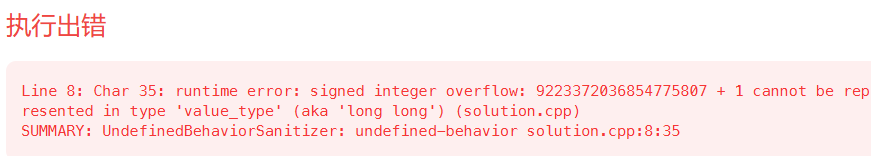
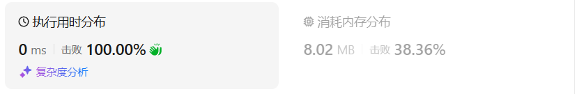
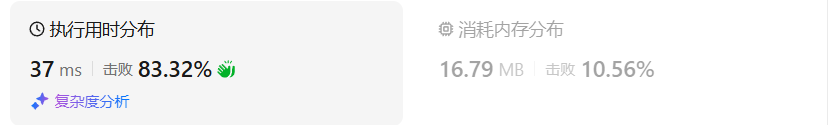

# 377组合总和IV（中等）

[377. 组合总和 Ⅳ - 力扣（LeetCode）](https://leetcode.cn/problems/combination-sum-iv/description/)

## 题目描述

给你一个由 **不同** 整数组成的数组 `nums` ，和一个目标整数 `target` 。请你从 `nums` 中找出并返回总和为 `target` 的元素组合的个数。

题目数据保证答案符合 32 位整数范围。

 

**示例 1：**

```
输入：nums = [1,2,3], target = 4
输出：7
解释：
所有可能的组合为：
(1, 1, 1, 1)
(1, 1, 2)
(1, 2, 1)
(1, 3)
(2, 1, 1)
(2, 2)
(3, 1)
请注意，顺序不同的序列被视作不同的组合。
```

**示例 2：**

```
输入：nums = [9], target = 3
输出：0
```

 

**提示：**

- `1 <= nums.length <= 200`
- `1 <= nums[i] <= 1000`
- `nums` 中的所有元素 **互不相同**
- `1 <= target <= 1000`

 

**进阶：**如果给定的数组中含有负数会发生什么？问题会产生何种变化？如果允许负数出现，需要向题目中添加哪些限制条件？

## 我的C++解法

```cpp
class Solution {
public:
    int combinationSum4(vector<int>& nums, int target) {
        vector<long long> dp(target+1);
        dp[0] = 1;
        for(int i=0;i<=target;i++){
            for(int num:nums){
                if(num<=i)  dp[i] += dp[i-num];
            }
        }
        return dp.back();
    }
};
```

滚他妈的，溢出了



## C++参考答案

本题题目描述说是求组合，但又说是可以元素相同顺序不同的组合算两个组合，**其实就是求排列！**

本质是本题求的是排列总和，而且仅仅是求排列总和的个数，并不是把所有的排列都列出来。**如果本题要把排列都列出来的话，只能使用回溯算法爆搜**。


**dp[i]: 凑成目标正整数为i的排列个数为dp[i]**


dp[i]（考虑nums[j]）可以由 dp[i - nums[j]]（不考虑nums[j]） 推导出来。因为只要得到nums[j]，排列个数dp[i - nums[j]]，就是dp[i]的一部分。求装满背包有几种方法，递推公式一般都是dp[i] += dp[i - nums[j]];


因为递推公式dp[i] += dp[i - nums[j]]的缘故，dp[0]要初始化为1，这样递归其他dp[i]的时候才会有数值基础。


个数可以不限使用，说明这是一个完全背包。得到的集合是排列，说明需要考虑元素之间的顺序。

在[动态规划：518.零钱兑换II (opens new window)](https://programmercarl.com/0518.零钱兑换II.html)中就已经讲过了。**如果求组合数就是外层for循环遍历物品，内层for遍历背包**。**如果求排列数就是外层for遍历背包，内层for循环遍历物品**。

如果把遍历nums（物品）放在外循环，遍历target的作为内循环的话，举一个例子：计算dp[4]的时候，结果集只有 {1,3} 这样的集合，不会有{3,1}这样的集合，因为nums遍历放在外层，3只能出现在1后面！所以本题遍历顺序最终遍历顺序：**target（背包）放在外循环，将nums（物品）放在内循环，内循环从前到后遍历**。

```cpp
class Solution {
public:
    int combinationSum4(vector<int>& nums, int target) {
        vector<int> dp(target + 1, 0);
        dp[0] = 1;
        for (int i = 0; i <= target; i++) { // 遍历背包
            for (int j = 0; j < nums.size(); j++) { // 遍历物品
                if (i - nums[j] >= 0 && dp[i] < INT_MAX - dp[i - nums[j]]) {
                    dp[i] += dp[i - nums[j]];
                }
            }
        }
        return dp[target];
    }
};
```

- 时间复杂度: O(target * n)，其中 n 为 nums 的长度
- 空间复杂度: O(target)

C++测试用例有两个数相加超过int的数据，所以需要在if里加上dp[i] < INT_MAX - dp[i - num]。

结果：




本题其实就是 [70. 爬楼梯](https://leetcode.cn/problems/climbing-stairs/)，我们每次从 *nums* 中选一个数，作为往上爬的台阶数，问爬 *target* 个台阶有多少种方案。70 那题可以看作 *nums*=[1,2]，因为每次只能爬 1 个或 2 个台阶。

### 记忆化搜索

和爬楼梯一样，定义 *dfs*(*i*) 表示爬 *i* 个台阶的方案数。考虑最后一步爬了 *x*=*nums*[*j*] 个台阶，那么问题变成爬 *i*−*x* 个台阶的方案数，即 *dfs*(*i*−*x*)。所以有$dfs(i)=\sum^{n-1}_{j=0}dfs(i−nums[j])$

注：如果 *nums*[*j*]>*i* 则跳过。回顾一下，70 那题可以看作 *nums*=[1,2]，有*dfs*(*i*)=*dfs*(*i*−1)+*dfs*(*i*−2)

递归边界：*dfs*(0)=1。爬 0 个台阶的方案数是 1。也可以这样理解，我们从 *target* 开始往下爬，刚好爬到底部（递归边界）此时就找到了一个合法的方案，返回 1。

递归入口：*dfs*(*target*)，也就是答案。

用**记忆化搜索**来优化：

- 如果一个状态（递归入参）是第一次遇到，那么可以在返回前，把状态及其结果记到一个 *memo* 数组中。
- 如果一个状态不是第一次遇到（*memo* 中保存的结果不等于 *memo* 的初始值），那么可以直接返回 *memo* 中保存的结果。

**注意**：*memo* 数组的**初始值**一定不能等于要记忆化的值！例如初始值设置为 0，并且要记忆化的 *dfs*(*i*) 也等于 0，那就没法判断 0 到底表示第一次遇到这个状态，还是表示之前遇到过了，从而导致记忆化失效。一般把初始值设置为 −1。

```cpp
class Solution {
    int dfs(int i, vector<int> &nums, vector<int> &memo) {
        if (i == 0) { // 爬完了
            return 1;
        }
        int &res = memo[i]; // 注意这里是引用
        if (res != -1) { // 之前计算过
            return res;
        }
        res = 0;
        for (int x : nums) {
            if (x <= i) {
                res += dfs(i - x, nums, memo);
            }
        }
        return res;
    }

public:
    int combinationSum4(vector<int> &nums, int target) {
        vector<int> memo(target + 1, -1); // -1 表示没有计算过
        return dfs(target, nums, memo);
    }
};
```

- 时间复杂度：O(*target*⋅*n*)，其中 *n* 为 *nums* 的长度。由于每个状态只会计算一次，动态规划的时间复杂度 = 状态个数 × 单个状态的计算时间。本题状态个数等于 O(*target*)，单个状态的计算时间为 O(*n*)，所以动态规划的时间复杂度为 O(*target*⋅*n*)。
- 空间复杂度：O(*target*)。有多少个状态，*memo* 数组的大小就是多少。

结果：


### 翻译为递推

去掉递归中的「递」，只保留「归」的部分，即自底向上计算。具体来说，*f*[*i*] 的定义和 *dfs*(*i*) 的定义是一样的，都表示表示爬 *i* 个台阶的方案数。相应的递推式（状态转移方程）也和 *dfs* 一样：$f[i]=\sum^{n-1}_{j=0}f[i-nums[j]]$

如果 *nums*[*j*]>*i* 则跳过。

```cpp
class Solution {
public:
    int combinationSum4(vector<int> &nums, int target) {
        // 使用 unsigned 可以让溢出不报错
        // 对于溢出的数据，不会影响答案的正确性（题目保证）
        vector<unsigned> f(target + 1);
        f[0] = 1;
        for (int i = 1; i <= target; i++) {
            for (int x : nums) {
                if (x <= i) {
                    f[i] += f[i - x];
                }
            }
        }
        return f[target];
    }
};
```

- 时间复杂度：O(*target*⋅*n*)，其中 *n* 为 *nums* 的长度。
- 空间复杂度：O(*target*)。

结果：


## C++收获


## 我的python解答

 只要组合，使用递归。而本题需要排列，因此需要的是回溯。回溯还要回归到和开始一样的位置才可以。

```python
class Solution:
    def combinationSum4(self, nums: List[int], target: int) -> int:
        # res = 0
        @cache
        def dfs(i:int):
            if i==0:
                return 1
            res = 0
            for num in nums:# 回溯的体现，重新开始遍历nums数组
                if num<=i:
                    res += dfs(i-num)
            return res
        return dfs(target)
```

结果：


```python
class Solution:
    def combinationSum4(self, nums: List[int], target: int) -> int:
        @cache
        def dfs(i:int):
            if i==0:
                return 1
            return sum(dfs(i-num) for num in nums if num<=i)
        return dfs(target)
```

结果：



翻译为递推：

```python
class Solution:
    def combinationSum4(self, nums: List[int], target: int) -> int:
        f = [0]*(target+1)
        f[0] = 1
        for i in range(target+1):
            for num in nums:
                if num<=i:
                    f[i] += f[i-num]
        return f[target]
```

结果：


## python参考答案

```py
class Solution:
    def combinationSum4(self, nums: List[int], target: int) -> int:
        @cache  # 缓存装饰器，避免重复计算 dfs 的结果
        def dfs(i: int) -> int:
            if i == 0:  # 爬完了
                return 1
            return sum(dfs(i - x) for x in nums if x <= i)  # 枚举所有可以爬的台阶数
        return dfs(target)
```

```py
class Solution:
    def combinationSum4(self, nums: List[int], target: int) -> int:
        f = [1] + [0] * target
        for i in range(1, target + 1):
            f[i] = sum(f[i - x] for x in nums if x <= i)
        return f[target]
```

```python
class Solution:
    def combinationSum4(self, nums: List[int], target: int) -> int:
        dp = [0] * (target + 1)
        dp[0] = 1
        for i in range(1, target + 1):  # 遍历背包
            for j in range(len(nums)):  # 遍历物品
                if i - nums[j] >= 0:
                    dp[i] += dp[i - nums[j]]
        return dp[target]
```

```python
class Solution:
    def combinationSum4(self, nums: List[int], target: int) -> int:
        dp = [0] * (target + 1)  # 创建动态规划数组，用于存储组合总数
        dp[0] = 1  # 初始化背包容量为0时的组合总数为1

        for i in range(1, target + 1):  # 遍历背包容量
            for j in nums:  # 遍历物品列表
                if i >= j:  # 当背包容量大于等于当前物品重量时
                    dp[i] += dp[i - j]  # 更新组合总数

        return dp[-1]  # 返回背包容量为target时的组合总数
```

```python
class Solution:
    def combinationSum4(self, nums: List[int], target: int) -> int:
        # dp[][j]和为j的组合的总数
        dp = [[0] * (target+1) for _ in nums]
        
        for i in range(len(nums)):
            dp[i][0] = 1
            
        # 这里不能初始化dp[0][j]。dp[0][j]的值依赖于dp[-1][j-nums[0]]
            
        for j in range(1, target+1):
            for i in range(len(nums)):
                
                if j - nums[i] >= 0:
                    dp[i][j] = (
                        # 不放nums[i]
                        # i = 0 时，dp[-1][j]恰好为0，所以没有特殊处理
                        dp[i-1][j] +
                        # 放nums[i]。对于和为j的组合，只有试过全部物品，才能知道有几种组合方式。所以取最后一个物品dp[-1][j-nums[i]]
                        dp[-1][j-nums[i]]
                    )
                else:
                    dp[i][j] = dp[i-1][j]
        return dp[-1][-1]
```

## python收获