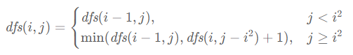
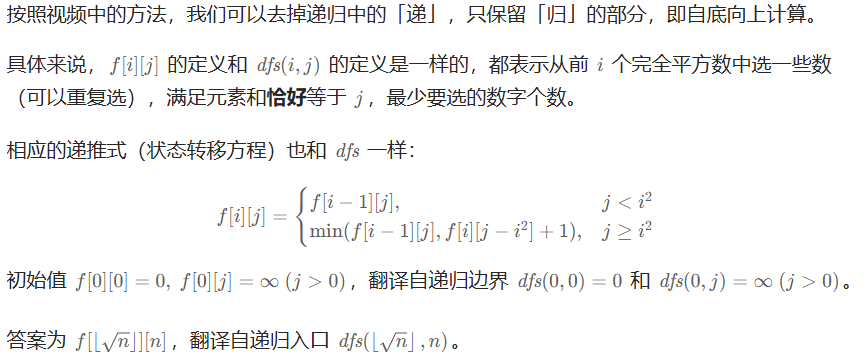
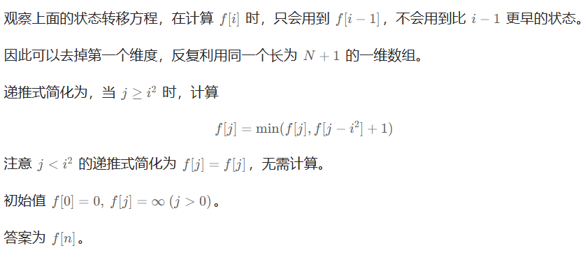

# 279完全平方数（中等）

[279. 完全平方数 - 力扣（LeetCode）](https://leetcode.cn/problems/perfect-squares/description/)

## 题目描述

给你一个整数 `n` ，返回 *和为 `n` 的完全平方数的最少数量* 。

**完全平方数** 是一个整数，其值等于另一个整数的平方；换句话说，其值等于一个整数自乘的积。例如，`1`、`4`、`9` 和 `16` 都是完全平方数，而 `3` 和 `11` 不是。

 

**示例 1：**

```
输入：n = 12
输出：3 
解释：12 = 4 + 4 + 4
```

**示例 2：**

```
输入：n = 13
输出：2
解释：13 = 4 + 9
```

 

**提示：**

- `1 <= n <= 104`

## 我的C++解法

```cpp
class Solution {
public:
    int numSquares(int n) {
        // int num = sqrt(n);
        vector<int> dp(n+1);
        for(int i=0;i<=n;i++){
            dp[i] = i;
        }
        for(int i=1;i<n+1;i++){
            for(int j=1;j<=sqrt(i);j++){
                if(i>=j*j){
                    dp[i] = min(dp[i-j*j]+1,dp[i]);
                }
            }
        }
        return dp.back();
    }
};
```

结果：


## C++参考答案

**dp[j]：和为j的完全平方数的最少数量为dp[j]**


dp[j] 可以由dp[j - i * i]推出， dp[j - i * i] + 1 便可以凑成dp[j]。此时我们要选择最小的dp[j]，所以递推公式：dp[j] = min(dp[j - i * i] + 1, dp[j]);


dp[0]表示 和为0的完全平方数的最小数量，那么dp[0]一定是0。从递归公式dp[j] = min(dp[j - i * i] + 1, dp[j]);中可以看出每次dp[j]都要选最小的，**所以非0下标的dp[j]一定要初始为最大值，这样dp[j]在递推的时候才不会被初始值覆盖**。


完全背包，如果求组合数就是外层for循环遍历物品，内层for遍历背包。如果求排列数就是外层for遍历背包，内层for循环遍历物品。

```cpp
class Solution {
public:
    int numSquares(int n) {
        vector<int> dp(n + 1, INT_MAX);
        dp[0] = 0;
        for (int i = 0; i <= n; i++) { // 遍历背包
            for (int j = 1; j * j <= i; j++) { // 遍历物品
                dp[i] = min(dp[i - j * j] + 1, dp[i]);
            }
        }
        return dp[n];
    }
};
```

- 时间复杂度: O(n * √n)
- 空间复杂度: O(n)

结果：


先遍历物品，在遍历背包的代码

```cpp
class Solution {
public:
    int numSquares(int n) {
        vector<int> dp(n + 1, INT_MAX);
        dp[0] = 0;
        for (int i = 1; i * i <= n; i++) { // 遍历物品
            for (int j = i * i; j <= n; j++) { // 遍历背包
                dp[j] = min(dp[j - i * i] + 1, dp[j]);
            }
        }
        return dp[n];
    }
};
```

结果：


### 记忆化搜索

```cpp
// 写在外面，多个测试数据之间可以共享，减少计算量
int memo[101][10001];

auto init = [] {
    memset(memo, -1, sizeof(memo)); // -1 表示没有计算过
    return 0;
}();

int dfs(int i, int j) {
    if (i == 0) {
        return j == 0 ? 0 : INT_MAX;
    }
    int& res = memo[i][j]; // 注意这里是引用
    if (res != -1) { // 之前计算过
        return res;
    }
    if (j < i * i) {
        res = dfs(i - 1, j); // 只能不选
    } else {
        res = min(dfs(i - 1, j), dfs(i, j - i * i) + 1); // 不选 vs 选
    }
    return res;
}

class Solution {
public:
    int numSquares(int n) {
        return dfs(sqrt(n), n);
    }
};
```

结果：


### 递推

```cpp
const int N = 10000;
int f[101][N + 1];

auto init = [] {
    ranges::fill(f[0], INT_MAX);
    f[0][0] = 0;
    for (int i = 1; i * i <= N; i++) {
        for (int j = 0; j <= N; j++) {
            if (j < i * i) {
                f[i][j] = f[i - 1][j]; // 只能不选
            } else {
                f[i][j] = min(f[i - 1][j], f[i][j - i * i] + 1); // 不选 vs 选
            }
        }
    }
    return 0;
}();

class Solution {
public:
    int numSquares(int n) {
        return f[(int) sqrt(n)][n]; // 也可以写 f[100][n]
    }
};
```

结果：


### 空间优化

```cpp
const int N = 10000;
int f[N + 1];

auto init = [] {
    ranges::fill(f, INT_MAX);
    f[0] = 0;
    for (int i = 1; i * i <= N; i++) {
        for (int j = i * i; j <= N; j++) {
            f[j] = min(f[j], f[j - i * i] + 1); // 不选 vs 选
        }
    }
    return 0;
}();

class Solution {
public:
    int numSquares(int n) {
        return f[n];
    }
};
```

结果：


## C++收获

### ranges::fll函数

<center>关键词：fill函数<center>

<center>关键词：ranges::fill函数<center>

`ranges::fill` 是 C++20 标准库中 `ranges` 命名空间下的一个函数模板，用于将指定范围内的所有元素填充为相同的值。这个函数可以看作是 `std::fill` 的一个更现代、更灵活的版本，它提供了对范围（例如数组、向量等容器）的填充操作。

#### 详细解释 `ranges::fill`：

1. **函数原型：**
   `ranges::fill` 的函数原型如下：
   ```cpp
   template<class Iterator, class T>
   Iterator fill(Iterator first, Iterator last, const T& value);
   ```
   - `Iterator`：迭代器类型，用于遍历要填充的范围。
   - `T`：要填充的值的类型。

2. **参数说明：**
   - `first`：指向要填充范围的开始的迭代器。
   - `last`：指向要填充范围的结束的迭代器（不包括）。
   - `value`：要填充的值。

3. **返回值：**
   - 返回一个迭代器，指向填充范围的末尾。

4. **使用示例：**
   在您提供的代码中，`ranges::fill` 用于初始化整个数组 `f`，将其所有元素设置为 `INT_MAX`：
   ```cpp
   ranges::fill(f, INT_MAX);
   ```
   这里 `f` 是一个整数数组，`INT_MAX` 是一个宏，表示 `int` 类型能表示的最大值。这种初始化通常用于标记数组元素尚未计算或不可达的状态。

5. **目的：**
   - 使用 `ranges::fill` 初始化数组 `f` 的目的是为后续的算法逻辑做准备，确保所有元素在开始计算之前都有一个统一的“初始状态”。

6. **算法上下文：**
   - 在初始化之后，代码中的循环将根据特定算法逻辑更新数组 `f` 的值。这个逻辑通常涉及动态规划或数学计算，用于确定达到每个索引值的最少操作数或其他优化问题。

7. **C++20 特性：**
   - `ranges::fill` 是 C++20 的一部分，因此需要 C++20 兼容的编译器和 `<ranges>` 头文件。

8. **替代方法：**
   - 如果你使用的是 C++20 之前的 C++ 标准，可以使用 `<algorithm>` 头文件中的 `std::fill` 函数来达到类似的效果。

通过使用 `ranges::fill`，代码可以高效地初始化数组，并为之后的计算步骤做好准备。这种方法在处理需要优化或查找最小值/最大值问题的算法中非常有用。

## 我的python解答

记忆化搜索：

```python
import math
class Solution:
    def numSquares(self, n: int) -> int:
        @cache
        def dfs(target:int):
            if target==0:   return 0
            res = target # 最大结果是其本身，全1组成
            i = int(math.sqrt(target))
            for j in range(i,0,-1):
                res = min(dfs(target-j**2)+1,res)
            return res
        res = dfs(n)
        return res
```

结果：


在阅读完毕灵神的解答后，学到了一点：既然dfs的结果是重复使用的，那就把@cache和dfs函数放在整个类的外面，这样就使得多个测试数据之间共享记忆化搜索的结果，才是真正的减少时间。而我上面的作答实际上加不加@cache没有区别，都是完全再次递归重新计算。

修改后：

```python
@cache
def dfs(target:int):
    if target==0:   return 0
    res = target # 最大结果是其本身，全1组成
    i = int(math.sqrt(target))
    for j in range(i,0,-1):
        res = min(dfs(target-j**2)+1,res)
    return res

class Solution:
    def numSquares(self, n: int) -> int:
        res = dfs(n)
        return res
```

结果：


递推：

```python
import math
class Solution:
    def numSquares(self, n: int) -> int:
        #从1到100的遍历 难道要存储100个平方数的数组？
        num = int(math.sqrt(n))
        f = [0]*(n+1)
        for i in range(n+1):
            f[i] = i
        # f[0] = 0
        for i in range(1,n+1):
            for j in range(1,int(math.sqrt(i))+1):
                if i>=j**2:
                    f[i] = min(f[i-j**2]+1,f[i])
        return f[n]
```

结果：


删去开头的`import math`之后，耗时和消耗空间略有下降


## python参考答案

### 记忆化搜索

把 1,4,9,16,⋯ 这些完全平方数视作物品体积，物品价值都是 1。由于每个数（物品）选的次数没有限制，所以本题是一道标准的**完全背包问题**。

定义 *dfs*(*i*,*j*) 表示从前 *i* 个完全平方数中选一些数（可以重复选），满足元素和**恰好**等于 *j*，最少要选的数字个数。

考虑第 *i* 个完全平方数 *i*^2 选或不选：

- 不选：问题变成从前 *i*−1 个完全平方数中选一些数（可以重复选），满足元素和**恰好**等于 *j*，最少要选的数字个数，即 *dfs*(*i*,*j*)=*dfs*(*i*−1,*j*)。
- 选：前提是 *j*≥*i*^2。问题变成从前 *i* 个完全平方数中选一些数（可以重复选），满足元素和**恰好**等于 *j*−*i*^2，最少要选的数字个数，即 *dfs*(*i*,*j*)=*dfs*(*i*,*j*−*i^*2)+1。注意这里是 *i* 而不是 *i*−1，因为我们可以**继续选**第 *i* 个完全平方数。

这两种情况取最小值，就得到了 *dfs*(*i*,*j*)，即



**递归边界**：*dfs*(0,0)=0，因为没有数可以选了，且要得到的数等于 0，那么答案为 0。如果 *j*>0，那么 *dfs*(0,*j*)=∞，这里用 ∞ 表示不合法的状态，从而保证上式中的 min 取到合法的状态。注意本题是一定有解的，因为 1 是完全平方数。

**递归入口**：由于 *i*2≤*n*，所以 *i*≤⌊*$\sqrt{n}$*⌋，所以递归入口为 *dfs*(⌊*$\sqrt{n}$*⌋,*n*)，也就是答案。

在计算 *n*=7 的时候，如果选了 4，会递归到 *n*=3 的情况。这个例子意味着**多个测试数据之间可以共享记忆化搜索的结果**。因此，把记忆化搜索的 *memo* 数组声明为全局变量，这样可以在多个测试数据之间共享，从而**减少计算量**。Python 可以把 *dfs* 写在类外面。

```py
# 写在外面，多个测试数据之间可以共享，减少计算量
@cache  # 缓存装饰器，避免重复计算 dfs 的结果（记忆化）
def dfs(i: int, j: int) -> int:
    if i == 0:
        return inf if j else 0
    if j < i * i:
        return dfs(i - 1, j)  # 只能不选
    return min(dfs(i - 1, j), dfs(i, j - i * i) + 1)  # 不选 vs 选

class Solution:
    def numSquares(self, n: int) -> int:
        return dfs(isqrt(n), n)
```

结果：


- 时间复杂度：O(*n*$\sqrt{n}$)。由于每个状态只会计算一次，动态规划的时间复杂度 = 状态个数 × 单个状态的计算时间。本题状态个数等于 O(*n$\sqrt{n}$*)，单个状态的计算时间为 O(1)，所以动态规划的时间复杂度为 O(*n$\sqrt{n}$*)。
- 空间复杂度：O(*n$\sqrt{n}$*)。保存多少状态，就需要多少空间。

### 递推



```py
N = 10000
f = [[0] * (N + 1) for _ in range(isqrt(N) + 1)]
f[0] = [0] + [inf] * N
for i in range(1, len(f)):
    for j in range(N + 1):
        if j < i * i:
            f[i][j] = f[i - 1][j]  # 只能不选
        else:
            f[i][j] = min(f[i - 1][j], f[i][j - i * i] + 1)  # 不选 vs 选

class Solution:
    def numSquares(self, n: int) -> int:
        return f[isqrt(n)][n]  # 也可以写 f[-1][n]
```

结果：


- 时间复杂度：O(*N$\sqrt{N}$*)。其中 *N*=104。
- 空间复杂度：O(*N$\sqrt{N}$*)。

### 空间优化



```py
N = 10000
f = [0] + [inf] * N
for i in range(1, isqrt(N) + 1):
    for j in range(i * i, N + 1):
        f[j] = min(f[j], f[j - i * i] + 1)  # 不选 vs 选

class Solution:
    def numSquares(self, n: int) -> int:
        return f[n]
```

- 时间复杂度：O($N\sqrt{N}$)。其中 *N*=104。
- 空间复杂度：O(*N*)。

结果：


## python收获

### 装饰器@cache

<center>关键词：@cache<center>

<center>关键词：装饰器<center>

在Python中，`@cache` 是一个装饰器，它是 `functools.lru_cache` 装饰器的别名。`lru_cache` 代表 "Least Recently Used"（最近最少使用），它是一种缓存机制，用于存储函数的调用结果，以便在后续调用时能够快速返回结果，从而避免重复计算。这对于性能优化尤其有用，特别是对于计算成本高昂的函数。

#### 如何使用 `@cache`：

1. **导入装饰器**：首先，你需要从 `functools` 模块导入 `lru_cache`。

   ```python
   from functools import lru_cache
   ```

2. **应用装饰器**：将 `@cache` 装饰器应用于你想要缓存结果的函数。

   ```python
   @lru_cache(maxsize=None)  # maxsize=None 表示缓存大小没有限制
   def your_function(args):
       # 函数体
       return result
   ```

3. **函数调用**：当你调用这个函数时，如果之前已经计算过相同的参数组合，它将返回缓存的结果，而不是重新执行函数体。

#### 示例：

```python
from functools import lru_cache

@lru_cache(maxsize=None)
def fib(n):
    if n < 2:
        return n
    return fib(n - 1) + fib(n - 2)

# 调用 fib 函数
print(fib(10))  # 输出: 55
```

在这个例子中，`fib` 函数计算斐波那契数列的第 `n` 项。使用 `@lru_cache` 装饰器可以缓存每一项的计算结果，从而提高计算效率。

#### 注意事项：

- `maxsize` 参数：你可以设置 `maxsize` 为一个正整数，以限制缓存的大小。如果设置为 `None`（默认值），缓存可以无限大，直到内存耗尽。
- 线程安全：`lru_cache` 默认不是线程安全的。如果你需要在多线程环境中使用它，可以设置 `lru_cache` 的 `typed` 参数为 `True`，以使缓存键考虑参数的类型。
- 缓存失效：`lru_cache` 仅缓存调用的结果，不跟踪参数对象的内部变化。如果参数是可变对象，它们的内部状态变化不会影响缓存。

`@cache`（即 `lru_cache`）是一个非常有用的工具，可以显著提高具有重复计算的函数的性能，尤其是在处理递归或动态规划问题时。