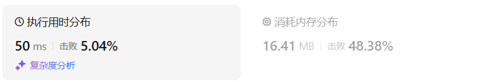

# 198打家劫舍（中等）

[198. 打家劫舍 - 力扣（LeetCode）](https://leetcode.cn/problems/house-robber/description/)

## 题目描述

你是一个专业的小偷，计划偷窃沿街的房屋。每间房内都藏有一定的现金，影响你偷窃的唯一制约因素就是相邻的房屋装有相互连通的防盗系统，**如果两间相邻的房屋在同一晚上被小偷闯入，系统会自动报警**。

给定一个代表每个房屋存放金额的非负整数数组，计算你 **不触动警报装置的情况下** ，一夜之内能够偷窃到的最高金额。

 

**示例 1：**

```
输入：[1,2,3,1]
输出：4
解释：偷窃 1 号房屋 (金额 = 1) ，然后偷窃 3 号房屋 (金额 = 3)。
     偷窃到的最高金额 = 1 + 3 = 4 。
```

**示例 2：**

```
输入：[2,7,9,3,1]
输出：12
解释：偷窃 1 号房屋 (金额 = 2), 偷窃 3 号房屋 (金额 = 9)，接着偷窃 5 号房屋 (金额 = 1)。
     偷窃到的最高金额 = 2 + 9 + 1 = 12 。
```

 

**提示：**

- `1 <= nums.length <= 100`
- `0 <= nums[i] <= 400`

## 我的C++解法

```cpp
class Solution {
public:
    int rob(vector<int>& nums) {
        int n = nums.size();
        vector<int> dp(n+2);
        for(int i=0;i<n;i++){
            dp[i+2] = max(dp[i+1],dp[i]+nums[i]);
        }
        return dp.back();
    }
};
```

结果：


## C++参考答案

### 记忆化搜索

```cpp
class Solution {
public:
    int rob(vector<int>& nums) {
        int n = nums.size();
        vector<int> memo(n, -1); // -1 表示没有计算过
        // dfs(i) 表示从 nums[0] 到 nums[i] 最多能偷多少
        auto dfs = [&](auto&& dfs, int i) -> int {
            if (i < 0) return 0; // 递归边界（没有房子）
            if (memo[i] != -1) return memo[i]; // 之前计算过
            return memo[i] = max(dfs(dfs, i - 1), dfs(dfs, i - 2) + nums[i]);
        };
        return dfs(dfs, n - 1); // 从最后一个房子开始思考
    }
};
```

结果：


### 递推

```cpp
class Solution {
public:
    int rob(vector<int>& nums) {
        int n = nums.size();
        vector<int> f(n + 2);
        for (int i = 0; i < n; i++) {
            f[i + 2] = max(f[i + 1], f[i] + nums[i]);
        }
        return f[n + 1];
    }
};
```

### 节省空间

```cpp
class Solution {
public:
    int rob(vector<int>& nums) {
        int f0 = 0, f1 = 0;
        for (int x : nums) {
            int new_f = max(f1, f0 + x);
            f0 = f1;
            f1 = new_f;
        }
        return f1;
    }
};
```

## C++收获


## 我的python解答

```python
class Solution:
    def rob(self, nums: List[int]) -> int:
        n = len(nums)
        @cache
        def dfs(i:int):
            if i<0: return 0
            return max(dfs(i-1),dfs(i-2)+nums[i])
        return dfs(n-1)
```

结果：


```python
class Solution:
    def rob(self, nums: List[int]) -> int:
        n = len(nums)
        f = [0]*(n+2)
        for i in range(n):
            f[i+2] = max(f[i+1],f[i]+nums[i])
        return f[-1]
```

结果：


```python
class Solution:
    def rob(self, nums: List[int]) -> int:
        n = len(nums)
        f0 = f1 = 0
        for x in nums:
            # f0,f1 = f1,max(f1,f0+x)
            tmp = f0
            f0 = f1
            f1 = max(f1,tmp+x)
        return f1
```

结果：



## python参考答案

```py
class Solution:
    def rob(self, nums: List[int]) -> int:
        @cache  # 缓存装饰器，避免重复计算 dfs 的结果
        def dfs(i: int) -> int:  # dfs(i) 表示从 nums[0] 到 nums[i] 最多能偷多少
            if i < 0:  # 递归边界（没有房子）
                return 0
            return max(dfs(i - 1), dfs(i - 2) + nums[i])
        return dfs(len(nums) - 1)  # 从最后一个房子开始思考
```

```py
class Solution:
    def rob(self, nums: List[int]) -> int:
        f = [0] * (len(nums) + 2)
        for i, x in enumerate(nums):
            f[i + 2] = max(f[i + 1], f[i] + x)
        return f[-1]
```

```py
class Solution:
    def rob(self, nums: List[int]) -> int:
        f0 = f1 = 0
        for x in nums:
            f0, f1 = f1, max(f1, f0 + x)
        return f1
```

## python收获