# 213打家劫舍II（中等）

[213. 打家劫舍 II - 力扣（LeetCode）](https://leetcode.cn/problems/house-robber-ii/description/)

## 题目描述

你是一个专业的小偷，计划偷窃沿街的房屋，每间房内都藏有一定的现金。这个地方所有的房屋都 **围成一圈** ，这意味着第一个房屋和最后一个房屋是紧挨着的。同时，相邻的房屋装有相互连通的防盗系统，**如果两间相邻的房屋在同一晚上被小偷闯入，系统会自动报警** 。

给定一个代表每个房屋存放金额的非负整数数组，计算你 **在不触动警报装置的情况下** ，今晚能够偷窃到的最高金额。

 

**示例 1：**

```
输入：nums = [2,3,2]
输出：3
解释：你不能先偷窃 1 号房屋（金额 = 2），然后偷窃 3 号房屋（金额 = 2）, 因为他们是相邻的。
```

**示例 2：**

```
输入：nums = [1,2,3,1]
输出：4
解释：你可以先偷窃 1 号房屋（金额 = 1），然后偷窃 3 号房屋（金额 = 3）。
     偷窃到的最高金额 = 1 + 3 = 4 。
```

**示例 3：**

```
输入：nums = [1,2,3]
输出：3
```

 

**提示：**

- `1 <= nums.length <= 100`
- `0 <= nums[i] <= 1000`

## 我的C++解法

```cpp
class Solution {
public:
    int rob(vector<int>& nums) {
        int n = nums.size();
        if(n==1)    return nums[0];
        vector<vector<int>> dp(2,vector<int>(n+1,0));
        for(int i=0;i<n-1;i++){
            dp[0][i+2] = max(dp[0][i+1],dp[0][i]+nums[i]);
            dp[1][i+2] = max(dp[1][i+1],dp[1][i]+nums[i+1]);
        }
        return max(dp[0][n],dp[1][n]);
    }
};
```

结果：

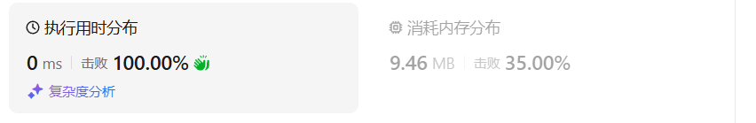

使用一个数组：

```cpp
class Solution {
public:
    int rob(vector<int>& nums) {
        int n = nums.size();
        if(n==1)    return nums[0];
        vector<int> dp(n+1,0);
        for(int i=0;i<n-1;i++){
            dp[i+2] = max(dp[i+1],dp[i]+nums[i]);
        }
        int tmp = dp.back();
        for(int i=0;i<=n;i++){
            dp[i] = 0;
        }
        for(int i=0;i<n-1;i++){
            dp[i+2] = max(dp[i+1],dp[i]+nums[i+1]);
        }
        return max(tmp,dp.back());
    }
};
```

结果：

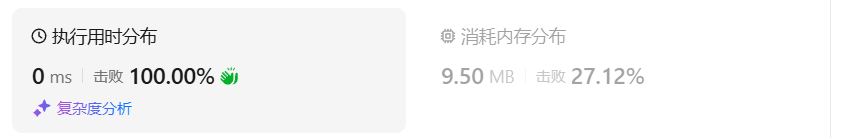

使用两个变量：

```cpp
class Solution {
public:
    int rob(vector<int>& nums) {
        int n = nums.size();
        if(n==1)    return nums[0];
        int f0=0, f1=0;
        int tmp;
        for(int i=0;i<n-1;i++){
            tmp = f0;
            f0 = f1;
            f1 = max(f1,tmp+nums[i]);
        }
        int a = f1;
        f0 = f1 = 0;
        for(int i=0;i<n-1;i++){
            tmp = f0;
            f0 = f1;
            f1 = max(f1,tmp+nums[i+1]);
        }
        return max(a,f1);
    }
};
```

结果：

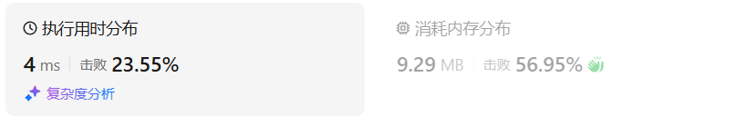

## C++参考答案

这道题目和[198.打家劫舍 (opens new window)](https://programmercarl.com/0198.打家劫舍.html)是差不多的，唯一区别就是成环了。

对于一个数组，成环的话主要有如下三种情况：

- 情况一：考虑不包含首尾元素


- 情况二：考虑包含首元素，不包含尾元素


- 情况三：考虑包含尾元素，不包含首元素

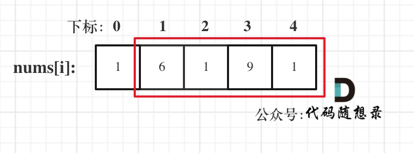

```cpp
// 注意注释中的情况二情况三，以及把198.打家劫舍的代码抽离出来了
class Solution {
public:
    int rob(vector<int>& nums) {
        if (nums.size() == 0) return 0;
        if (nums.size() == 1) return nums[0];
        int result1 = robRange(nums, 0, nums.size() - 2); // 情况二
        int result2 = robRange(nums, 1, nums.size() - 1); // 情况三
        return max(result1, result2);
    }
    // 198.打家劫舍的逻辑
    int robRange(vector<int>& nums, int start, int end) {
        if (end == start) return nums[start];
        vector<int> dp(nums.size());
        dp[start] = nums[start];
        dp[start + 1] = max(nums[start], nums[start + 1]);
        for (int i = start + 2; i <= end; i++) {
            dp[i] = max(dp[i - 2] + nums[i], dp[i - 1]);
        }
        return dp[end];
    }
};
```

- 时间复杂度: O(n)
- 空间复杂度: O(n)

结果：

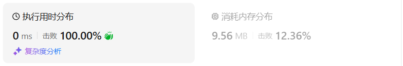

```cpp
class Solution {
    // 198. 打家劫舍
    int rob1(vector<int> &nums, int start, int end) { // [start,end) 左闭右开
        int f0 = 0, f1 = 0;
        for (int i = start; i < end; i++) {
            int new_f = max(f1, f0 + nums[i]);
            f0 = f1;
            f1 = new_f;
        }
        return f1;
    }

public:
    int rob(vector<int> &nums) {
        int n = nums.size();
        return max(nums[0] + rob1(nums, 2, n - 1), rob1(nums, 1, n));
    }
};
```

- 时间复杂度：O(*n*)。其中 *n* 为 *nums* 的长度。
- 空间复杂度：O(1)。仅用到若干额外变量。为了写起来方便，Python 和 JS 使用了切片（忽略带来的空间），不使用切片的写法请参考其它语言。

结果：

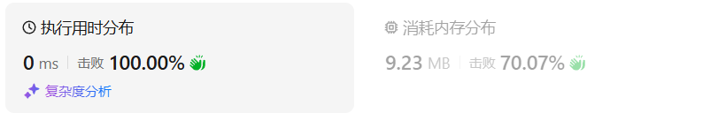

## C++收获


## 我的python解答

记忆化搜索：

我的思路是，需要起始和终止。如果是最后一个元素，那么就需要额外的判断

```python
class Solution:
    def rob(self, nums: List[int]) -> int:
        n = len(nums)
        # 如果n为奇数，那么就边界只能选其一
        # 如果n是偶数，则就和普通的打家劫舍一样
        @cache
        def dfs(start:int,i:int):
            if i<start:
                return 0
            if i%(n-1)==0:
                return max(dfs(0,i-1),dfs(0,i-2),dfs(1,i-1),dfs(1,i-2)+nums[i])
            return max(dfs(start,i-1),dfs(start,i-2)+nums[i])
        if n==1:    return nums[0]
        return dfs(0,n-1)
```

结果：

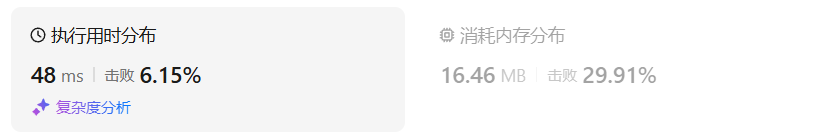

问题的关键在于第一个和最后一个选还是不选

```python
class Solution:
    def rob(self, nums: List[int]) -> int:
        n = len(nums)
        # 问题的关键在于第一个和最后一个选还是不选，这是两个边界条件
        # 如果选第一个，那么最后一个不能选
        # 如果选最后一个，那么第一个不能选
        @cache
        def dfs(start:int,i:int):
            if i<start:
                return 0
            return max(dfs(start,i-1),dfs(start,i-2)+nums[i])
        if n==1:    return nums[0]
        return max(dfs(0,n-2),dfs(1,n-1))
```

结果：

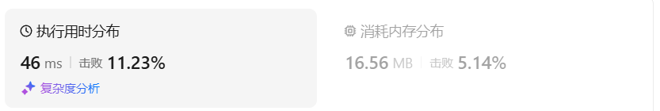

 递推：

```python
class Solution:
    def rob(self, nums: List[int]) -> int:
        n = len(nums)
        if n==1:    return nums[0]
        f = [[0]*(n+1) for _ in range(2)]
        # 第一行表示从第一个到倒数第二个
        # 第二行表示从第二个到最后一个
        for i in range(n-1):
            f[0][i+2] = max(f[0][i+1],f[0][i]+nums[i])
            f[1][i+2] = max(f[1][i+1],f[1][i]+nums[i+1])
        return max(f[0][-1],f[1][-1])
```

结果：

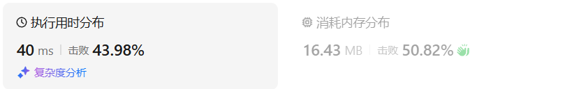

优化空间：使用一个数组

```python
class Solution:
    def rob(self, nums: List[int]) -> int:
        n = len(nums)
        if n==1:    return nums[0]
        f = [0]*(n+1)
        # 第一行表示从第一个到倒数第二个
        # 第二行表示从第二个到最后一个
        for i in range(n-1):
            f[i+2] = max(f[i+1],f[i]+nums[i])
        tmp = f[-1]
        f = [0 for _ in f]
        for i in range(n-1):
            f[i+2] = max(f[i+1],f[i]+nums[i+1])
        return max(f[-1],tmp)
```

结果：

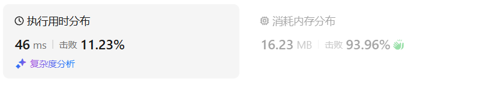

继续优化空间：

```python
class Solution:
    def rob(self, nums: List[int]) -> int:
        n = len(nums)
        if n==1:    return nums[0]
        f0 = f1 = 0
        for i in range(n-1):
            f0, f1 = f1, max(f1,f0+nums[i])
        tmp = f1
        f0 = f1 = 0
        for i in range(n-1):
            f0, f1 = f1, max(f1,f0+nums[i+1])
        return max(f1,tmp)
```

结果：

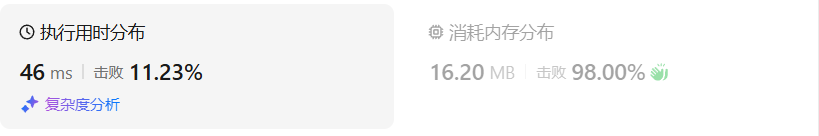

## python参考答案

```python
class Solution:
    def rob(self, nums: List[int]) -> int:
        if len(nums) == 0:
            return 0
        if len(nums) == 1:
            return nums[0]
        
        result1 = self.robRange(nums, 0, len(nums) - 2)  # 情况二
        result2 = self.robRange(nums, 1, len(nums) - 1)  # 情况三
        return max(result1, result2)
    # 198.打家劫舍的逻辑
    def robRange(self, nums: List[int], start: int, end: int) -> int:
        if end == start:
            return nums[start]
        
        prev_max = nums[start]
        curr_max = max(nums[start], nums[start + 1])
        
        for i in range(start + 2, end + 1):
            temp = curr_max
            curr_max = max(prev_max + nums[i], curr_max)
            prev_max = temp
        
        return curr_max
```


```python
class Solution:
    def rob(self, nums: List[int]) -> int:
        if len(nums) < 3:
            return max(nums)

        # 情况二：不抢劫第一个房屋
        result1 = self.robRange(nums[:-1])

        # 情况三：不抢劫最后一个房屋
        result2 = self.robRange(nums[1:])

        return max(result1, result2)

    def robRange(self, nums):
        dp = [[0, 0] for _ in range(len(nums))]
        dp[0][1] = nums[0]

        for i in range(1, len(nums)):
            dp[i][0] = max(dp[i - 1])
            dp[i][1] = dp[i - 1][0] + nums[i]

        return max(dp[-1])
```


分类讨论，考虑是否偷 *nums*[0]：

- 如果偷 *nums*[0]，那么 *nums*[1] 和 *nums*[*n*−1] 不能偷，问题变成从 *nums*[2] 到 *nums*[*n*−2] 的非环形版本，调用 198 题的代码解决；
- 如果不偷 *nums*[0]，那么问题变成从 *nums*[1] 到 *nums*[*n*−1] 的非环形版本，同样调用 198 题的代码解决。

这两种方案覆盖了所有情况（毕竟 *nums*[0] 只有偷与不偷，没有第三种选择），所以取两种方案的最大值，即为答案。

```py
class Solution:
    # 198. 打家劫舍
    def rob1(self, nums: List[int]) -> int:
        f0 = f1 = 0
        for x in nums:
            f0, f1 = f1, max(f1, f0 + x)
        return f1

    def rob(self, nums: List[int]) -> int:
        return max(nums[0] + self.rob1(nums[2:-1]), self.rob1(nums[1:]))
```

结果：

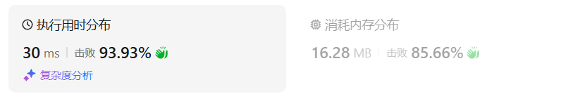

## python收获