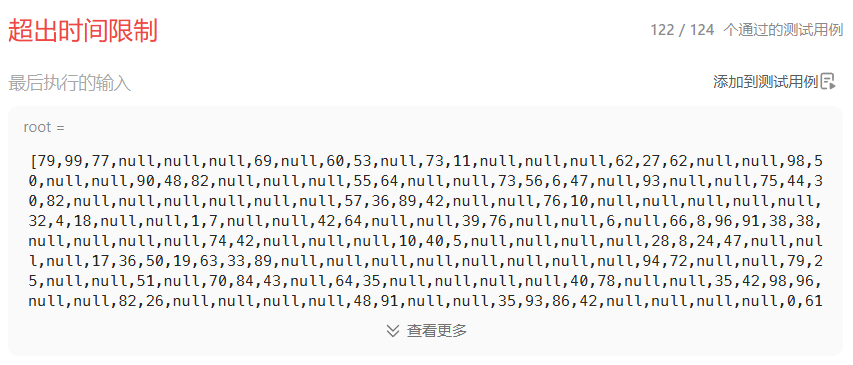
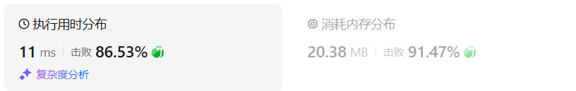
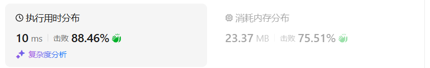
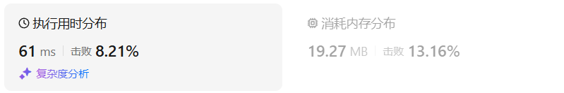
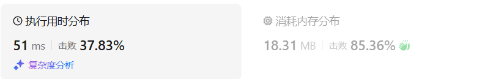

# 337打家劫舍III（中等）

[337. 打家劫舍 III - 力扣（LeetCode）](https://leetcode.cn/problems/house-robber-iii/description/)

## 题目描述

小偷又发现了一个新的可行窃的地区。这个地区只有一个入口，我们称之为 `root` 。

除了 `root` 之外，每栋房子有且只有一个“父“房子与之相连。一番侦察之后，聪明的小偷意识到“这个地方的所有房屋的排列类似于一棵二叉树”。 如果 **两个直接相连的房子在同一天晚上被打劫** ，房屋将自动报警。

给定二叉树的 `root` 。返回 ***在不触动警报的情况下** ，小偷能够盗取的最高金额* 。

 

**示例 1:**


```
输入: root = [3,2,3,null,3,null,1]
输出: 7 
解释: 小偷一晚能够盗取的最高金额 3 + 3 + 1 = 7
```

**示例 2:**


```
输入: root = [3,4,5,1,3,null,1]
输出: 9
解释: 小偷一晚能够盗取的最高金额 4 + 5 = 9
```

 

**提示：**


- 树的节点数在 `[1, 104]` 范围内
- `0 <= Node.val <= 104`

## 我的C++解法

```cpp
/**
 * Definition for a binary tree node.
 * struct TreeNode {
 *     int val;
 *     TreeNode *left;
 *     TreeNode *right;
 *     TreeNode() : val(0), left(nullptr), right(nullptr) {}
 *     TreeNode(int x) : val(x), left(nullptr), right(nullptr) {}
 *     TreeNode(int x, TreeNode *left, TreeNode *right) : val(x), left(left), right(right) {}
 * };
 */
class Solution {
private:
    pair<int,int> dfs(TreeNode* node){
        if(node==nullptr)   return make_pair(0,0);
        int l_rob = dfs(node->left).first, l_not_rob = dfs(node->left).second;
        int r_rob = dfs(node->right).first, r_not_rob = dfs(node->right).second;
        int rob = l_not_rob+r_not_rob+node->val;
        int not_rob = max(l_not_rob,l_rob) + max(r_not_rob,r_rob);
        return make_pair(rob,not_rob);
    }


public:
    int rob(TreeNode* root) {
        auto ans = dfs(root);
        return max(ans.first,ans.second);
    }
};
```

结果：



感觉上超时的原因是求l_rob,l_not_rob的时候调用了两次dfs，没有把一次dfs的结果保存下来

```cpp
/**
 * Definition for a binary tree node.
 * struct TreeNode {
 *     int val;
 *     TreeNode *left;
 *     TreeNode *right;
 *     TreeNode() : val(0), left(nullptr), right(nullptr) {}
 *     TreeNode(int x) : val(x), left(nullptr), right(nullptr) {}
 *     TreeNode(int x, TreeNode *left, TreeNode *right) : val(x), left(left), right(right) {}
 * };
 */
class Solution {
private:
    pair<int,int> dfs(TreeNode* node){
        if(node==nullptr)   return make_pair(0,0);
        // int l_rob = dfs(node->left).first, l_not_rob = dfs(node->left).second;
        // int r_rob = dfs(node->right).first, r_not_rob = dfs(node->right).second;
        auto [l_rob,l_not_rob] = dfs(node->left);
        auto [r_rob,r_not_rob] = dfs(node->right);
        int rob = l_not_rob+r_not_rob+node->val;
        int not_rob = max(l_not_rob,l_rob) + max(r_not_rob,r_rob);
        return make_pair(rob,not_rob);
    }


public:
    int rob(TreeNode* root) {
        auto ans = dfs(root);
        return max(ans.first,ans.second);
    }
};
```

结果：



**灵神牛逼**

## C++参考答案

**本题一定是要后序遍历，因为通过递归函数的返回值来做下一步计算**。关键是要讨论当前节点抢还是不抢。如果抢了当前节点，两个孩子就不能动，如果没抢当前节点，就可以考虑抢左右孩子（**注意这里说的是“考虑”**）

### 暴力递归

```cpp
class Solution {
public:
    int rob(TreeNode* root) {
        if (root == NULL) return 0;
        if (root->left == NULL && root->right == NULL) return root->val;
        // 偷父节点
        int val1 = root->val;
        if (root->left) val1 += rob(root->left->left) + rob(root->left->right); // 跳过root->left，相当于不考虑左孩子了
        if (root->right) val1 += rob(root->right->left) + rob(root->right->right); // 跳过root->right，相当于不考虑右孩子了
        // 不偷父节点
        int val2 = rob(root->left) + rob(root->right); // 考虑root的左右孩子
        return max(val1, val2);
    }
};
```

- 时间复杂度：O(n^2)，这个时间复杂度不太标准，也不容易准确化，例如越往下的节点重复计算次数就越多
- 空间复杂度：O(log n)，算上递推系统栈的空间

超时，这个递归的过程中其实是有重复计算了

我们计算了root的四个孙子（左右孩子的孩子）为头结点的子树的情况，又计算了root的左右孩子为头结点的子树的情况，计算左右孩子的时候其实又把孙子计算了一遍。

### 记忆化递推

可以使用一个map把计算过的结果保存一下，这样如果计算过孙子了，那么计算孩子的时候可以复用孙子节点的结果。

```cpp
class Solution {
public:
    unordered_map<TreeNode* , int> umap; // 记录计算过的结果
    int rob(TreeNode* root) {
        if (root == NULL) return 0;
        if (root->left == NULL && root->right == NULL) return root->val;
        if (umap[root]) return umap[root]; // 如果umap里已经有记录则直接返回
        // 偷父节点
        int val1 = root->val;
        if (root->left) val1 += rob(root->left->left) + rob(root->left->right); // 跳过root->left
        if (root->right) val1 += rob(root->right->left) + rob(root->right->right); // 跳过root->right
        // 不偷父节点
        int val2 = rob(root->left) + rob(root->right); // 考虑root的左右孩子
        umap[root] = max(val1, val2); // umap记录一下结果
        return max(val1, val2);
    }
};
```

- 时间复杂度：O(n)
- 空间复杂度：O(log n)，算上递推系统栈的空间

结果：



### 动态规划

面两种方法，其实对一个节点 偷与不偷得到的最大金钱都没有做记录，而是需要实时计算。

而动态规划其实就是使用状态转移容器来记录状态的变化，这里可以使用一个长度为2的数组，记录当前节点偷与不偷所得到的的最大金钱。


文字解析见[代码随想录 (programmercarl.com)](https://programmercarl.com/0337.打家劫舍III.html#思路)


```cpp
class Solution {
public:
    int rob(TreeNode* root) {
        vector<int> result = robTree(root);
        return max(result[0], result[1]);
    }
    // 长度为2的数组，0：不偷，1：偷
    vector<int> robTree(TreeNode* cur) {
        if (cur == NULL) return vector<int>{0, 0};
        vector<int> left = robTree(cur->left);
        vector<int> right = robTree(cur->right);
        // 偷cur，那么就不能偷左右节点。
        int val1 = cur->val + left[0] + right[0];
        // 不偷cur，那么可以偷也可以不偷左右节点，则取较大的情况
        int val2 = max(left[0], left[1]) + max(right[0], right[1]);
        return {val2, val1};
    }
};
```

- 时间复杂度：O(n)，每个节点只遍历了一次
- 空间复杂度：O(log n)，算上递推系统栈的空间


https://www.bilibili.com/video/BV1vu4y1f7dn

灵神的解析神中神

```cpp
class Solution {
    pair<int, int> dfs(TreeNode *node) {
        if (node == nullptr) { // 递归边界
            return {0, 0}; // 没有节点，怎么选都是 0
        }
        auto [l_rob, l_not_rob] = dfs(node->left); // 递归左子树
        auto [r_rob, r_not_rob] = dfs(node->right); // 递归右子树
        int rob = l_not_rob + r_not_rob + node->val; // 选
        int not_rob = max(l_rob, l_not_rob) + max(r_rob, r_not_rob); // 不选
        return {rob, not_rob};
    }

public:
    int rob(TreeNode *root) {
        auto [root_rob, root_not_rob] = dfs(root);
        return max(root_rob, root_not_rob); // 根节点选或不选的最大值
    }
};
```

## C++收获


## 我的python解答

记忆化搜索：

```python
# Definition for a binary tree node.
# class TreeNode:
#     def __init__(self, val=0, left=None, right=None):
#         self.val = val
#         self.left = left
#         self.right = right
class Solution:
    def rob(self, root: Optional[TreeNode]) -> int:
        @cache
        def dfs(node):
            if node is None:    return 0
            # 对于当前节点，只有选和不选两种方案
            # 如果选，则返回的是其孙子节点的最大截获值+本身的值
            # 如果不选，则返回其子节点的最大截获值
            if node.left!=None and node.right!=None:
                # 非叶节点
                return max(dfs(node.left.left)+dfs(node.left.right)+dfs(node.right.left)+dfs(node.right.right)+node.val,dfs(node.left)+dfs(node.right))
            elif node.left==None and node.right!=None:
                return max(dfs(node.right.left)+dfs(node.right.right)+node.val,dfs(node.right))
            elif node.left!=None and node.right==None:
                return max(dfs(node.left.left)+dfs(node.left.right)+node.val,dfs(node.left))
            return node.val # 是叶节点，返回本身
        return dfs(root)
```

结果：



翻译为递推，从底向上：

树型结构如何翻译为递推？

实际上这个题并没有所谓的翻译为递推

观看了灵神的解析视频之后发现他的思路是真的清晰，尝试自己复现一遍

```python
# Definition for a binary tree node.
# class TreeNode:
#     def __init__(self, val=0, left=None, right=None):
#         self.val = val
#         self.left = left
#         self.right = right
class Solution:
    def rob(self, root: Optional[TreeNode]) -> int:
        def dfs(node):
            # 整体思路：返回的是选择该节点和不选择该节点得到的最大截获值
            if node is None:
                return 0,0
            l_rob, l_not_rob = dfs(node.left) # 左子树
            r_rob, r_not_rob = dfs(node.right) # 右子树
            # 这样写的好处是不用再像之前的解法那样判断孙子节点，而是直接判断子节点的两种返回结果即可
            rob = l_not_rob+r_not_rob+node.val
            not_rob = max(l_rob,l_not_rob)+max(r_not_rob,r_rob)
            return rob,not_rob
        return max(dfs(root))
```

神中神

结果：



## python参考答案

### 暴力

```python
class Solution:
    def rob(self, root: TreeNode) -> int:
        if root is None:
            return 0
        if root.left is None and root.right  is None:
            return root.val
        # 偷父节点
        val1 = root.val
        if root.left:
            val1 += self.rob(root.left.left) + self.rob(root.left.right)
        if root.right:
            val1 += self.rob(root.right.left) + self.rob(root.right.right)
        # 不偷父节点
        val2 = self.rob(root.left) + self.rob(root.right)
        return max(val1, val2)
```

### 记忆化搜索

```python
class Solution:
    memory = {}
    def rob(self, root: TreeNode) -> int:
        if root is None:
            return 0
        if root.left is None and root.right  is None:
            return root.val
        if self.memory.get(root) is not None:
            return self.memory[root]
        # 偷父节点
        val1 = root.val
        if root.left:
            val1 += self.rob(root.left.left) + self.rob(root.left.right)
        if root.right:
            val1 += self.rob(root.right.left) + self.rob(root.right.right)
        # 不偷父节点
        val2 = self.rob(root.left) + self.rob(root.right)
        self.memory[root] = max(val1, val2)
        return max(val1, val2)
```

### 树型dp

```python
class Solution:
    def rob(self, root: Optional[TreeNode]) -> int:
        # dp数组（dp table）以及下标的含义：
        # 1. 下标为 0 记录 **不偷该节点** 所得到的的最大金钱
        # 2. 下标为 1 记录 **偷该节点** 所得到的的最大金钱
        dp = self.traversal(root)
        return max(dp)

    # 要用后序遍历, 因为要通过递归函数的返回值来做下一步计算
    def traversal(self, node):
        
        # 递归终止条件，就是遇到了空节点，那肯定是不偷的
        if not node:
            return (0, 0)

        left = self.traversal(node.left)
        right = self.traversal(node.right)

        # 不偷当前节点, 偷子节点
        val_0 = max(left[0], left[1]) + max(right[0], right[1])

        # 偷当前节点, 不偷子节点
        val_1 = node.val + left[0] + right[0]

        return (val_0, val_1)
```


```py
class Solution:
    def rob(self, root: Optional[TreeNode]) -> int:
        def dfs(node: Optional[TreeNode]) -> (int, int):
            if node is None:  # 递归边界
                return 0, 0  # 没有节点，怎么选都是 0
            l_rob, l_not_rob = dfs(node.left)  # 递归左子树
            r_rob, r_not_rob = dfs(node.right)  # 递归右子树
            rob = l_not_rob + r_not_rob + node.val  # 选
            not_rob = max(l_rob, l_not_rob) + max(r_rob, r_not_rob)  # 不选
            return rob, not_rob
        return max(dfs(root))  # 根节点选或不选的最大值
```

## python收获