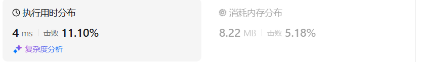

# 738单调递增的数字（中等）

[738. 单调递增的数字 - 力扣（LeetCode）](https://leetcode.cn/problems/monotone-increasing-digits/description/)

## 题目描述

当且仅当每个相邻位数上的数字 `x` 和 `y` 满足 `x <= y` 时，我们称这个整数是**单调递增**的。

给定一个整数 `n` ，返回 *小于或等于 `n` 的最大数字，且数字呈 **单调递增*** 。

 

**示例 1:**

```
输入: n = 10
输出: 9
```

**示例 2:**

```
输入: n = 1234
输出: 1234
```

**示例 3:**

```
输入: n = 332
输出: 299
```

 

**提示:**

- `0 <= n <= 109`

## 我的C++解法

我的想法是：从前向后找第一个不满足递增的元素的位置，把从它开始到后面全部置为9。然后把s[pos-1]进行减一操作，再次递归调用函数本身。

```cpp
class Solution {
private:
    int pos = -1;// 不满足递增的索引位置
    bool judge(int n){
        pos = -1;
        string s = to_string(n);
        for(int i=1;i<s.size();i++){
            if(s[i]<s[i-1]){
                pos = i;
                return false;
            }
        }
        return true;
    }


public:
    int monotoneIncreasingDigits(int n) {
        if(judge(n))    return n;
        string s = to_string(n);
        int length = s.size();
        if(pos<=1){
            if(s[pos-1]=='1'){
                s[0] = '0';
                for(int i=1;i<length;i++){
                    s[i] = '9';
                }
                return stoi(s);
            }
            int start = s[0]-'0';
            return start*pow(10,length-1) - 1;
        }
        else{
            for(int i=pos;i<length;i++){
                s[i] = '9';
            }
            if(s[pos-2]<s[pos-1]){
                s[pos-1] -= 1;
                return stoi(s);
            }
            // s[pos-2]==s[pos-1]
            s[pos-1] -= 1;
            return monotoneIncreasingDigits(stoi(s));
        }
    }
};
```

结果：



修改的做法是首先判断是否是递增的，如果是，则直接返回原数字；否则继续进行下一步，并记录从左到右第一个不满足递增的位置pos

从后向前，到pos之前都把数字置为'9'，从pos开始判断，如果前一项大于当前项，则当前项置9，前一项-1处理，如果前项是0（就不可能，因为如果前项是 0，则pos一定小于等于该项0的索引。）则置为‘9’。最后转化为数字输出即可

```cpp
class Solution {
public:
    int pos = -1;
    bool judge(string s){
        for(int i=1;i<s.size();i++){
            if(s[i]<s[i-1]) {
                pos = i;
                return false;
            }
        }
        return true;
    }
    int monotoneIncreasingDigits(int n) {
        string s = to_string(n);
        if(judge(s))    return n;
        for(int i=s.size()-1;i>0;i--){
            if(i>pos){
                s[i] = '9';
                continue;
            }
            if(s[i]<s[i-1]){
                s[i] = '9';
                if(s[i-1]!='0') s[i-1] -= 1;
                else    s[i-1] = '9';
            }
        }
        return stoi(s);
    }
};
```

结果：


## C++参考答案

### 暴力解法

```cpp
class Solution {
private:
    // 判断一个数字的各位上是否是递增
    bool checkNum(int num) {
        int max = 10;
        while (num) {
            int t = num % 10;
            if (max >= t) max = t;
            else return false;
            num = num / 10;
        }
        return true;
    }
public:
    int monotoneIncreasingDigits(int N) {
        for (int i = N; i > 0; i--) { // 从大到小遍历
            if (checkNum(i)) return i;
        }
        return 0;
    }
};
```

- 时间复杂度：O(n × m) m为n的数字长度
- 空间复杂度：O(1)

### 贪心算法

例如：98，一旦出现strNum[i - 1] > strNum[i]的情况（非单调递增），首先想让strNum[i - 1]--，然后strNum[i]给为9，这样这个整数就是89，即小于98的最大的单调递增整数。

从前向后遍历的话，遇到strNum[i - 1] > strNum[i]的情况，让strNum[i - 1]减一，但此时如果strNum[i - 1]减一了，可能又小于strNum[i - 2]。

从后向前遍历，就可以重复利用上次比较得出的结果了，从后向前遍历332的数值变化为：332 -> 329 -> 299

```cpp
class Solution {
public:
    int monotoneIncreasingDigits(int N) {
        string strNum = to_string(N);
        // flag用来标记赋值9从哪里开始
        // 设置为这个默认值，为了防止第二个for循环在flag没有被赋值的情况下执行
        int flag = strNum.size();
        for (int i = strNum.size() - 1; i > 0; i--) {
            if (strNum[i - 1] > strNum[i] ) {
                flag = i;
                strNum[i - 1]--;
            }
        }
        for (int i = flag; i < strNum.size(); i++) {
            strNum[i] = '9';
        }
        return stoi(strNum);
    }
};
```

- 时间复杂度：O(n)，n 为数字长度
- 空间复杂度：O(n)，需要一个字符串，转化为字符串操作更方便

结果：


## C++收获


## 我的python解答

py无法直接实现对字符串元素的修改，因此采用了数组的方式

```python
class Solution:
    def monotoneIncreasingDigits(self, n: int) -> int:
        pos = -1
        digits = [int(digit) for digit in str(n)]
        def judge(s):
            for i in range(1,len(s)):
                if s[i]<s[i-1]:
                    nonlocal pos
                    pos = i
                    return False
            return True
        if judge(digits):    return n
        for i in range(len(digits)-1,0,-1):
            if i>pos:
                digits[i] = 9
                continue
            if digits[i]<digits[i-1]:
                digits[i] = 9
                digits[i-1] -= 1
        return int(''.join(map(str,digits)))

```


## python参考答案

暴力

```python
class Solution:
    def checkNum(self, num):
        max_digit = 10
        while num:
            digit = num % 10
            if max_digit >= digit:
                max_digit = digit
            else:
                return False
            num //= 10
        return True

    def monotoneIncreasingDigits(self, N):
        for i in range(N, 0, -1):
            if self.checkNum(i):
                return i
        return 0
```

贪心

```python
class Solution:
    def monotoneIncreasingDigits(self, N: int) -> int:
        # 将整数转换为字符串
        strNum = str(N)
        # flag用来标记赋值9从哪里开始
        # 设置为字符串长度，为了防止第二个for循环在flag没有被赋值的情况下执行
        flag = len(strNum)
        
        # 从右往左遍历字符串
        for i in range(len(strNum) - 1, 0, -1):
            # 如果当前字符比前一个字符小，说明需要修改前一个字符
            if strNum[i - 1] > strNum[i]:
                flag = i  # 更新flag的值，记录需要修改的位置
                # 将前一个字符减1，以保证递增性质
                strNum = strNum[:i - 1] + str(int(strNum[i - 1]) - 1) + strNum[i:]
        
        # 将flag位置及之后的字符都修改为9，以保证最大的递增数字
        for i in range(flag, len(strNum)):
            strNum = strNum[:i] + '9' + strNum[i + 1:]
        
        # 将最终的字符串转换回整数并返回
        return int(strNum)
```

```python
class Solution:
    def monotoneIncreasingDigits(self, N: int) -> int:
        # 将整数转换为字符串
        strNum = list(str(N))

        # 从右往左遍历字符串
        for i in range(len(strNum) - 1, 0, -1):
            # 如果当前字符比前一个字符小，说明需要修改前一个字符
            if strNum[i - 1] > strNum[i]:
                strNum[i - 1] = str(int(strNum[i - 1]) - 1)  # 将前一个字符减1
                # 将修改位置后面的字符都设置为9，因为修改前一个字符可能破坏了递增性质
                for j in range(i, len(strNum)):
                    strNum[j] = '9'

        # 将列表转换为字符串，并将字符串转换为整数并返回
        return int(''.join(strNum))
```

```python
class Solution:
    def monotoneIncreasingDigits(self, N: int) -> int:
        # 将整数转换为字符串
        strNum = list(str(N))

        # 从右往左遍历字符串
        for i in range(len(strNum) - 1, 0, -1):
            # 如果当前字符比前一个字符小，说明需要修改前一个字符
            if strNum[i - 1] > strNum[i]:
                strNum[i - 1] = str(int(strNum[i - 1]) - 1)  # 将前一个字符减1
                # 将修改位置后面的字符都设置为9，因为修改前一个字符可能破坏了递增性质
                strNum[i:] = '9' * (len(strNum) - i)

        # 将列表转换为字符串，并将字符串转换为整数并返回
        return int(''.join(strNum))
```

```python
class Solution:
    def monotoneIncreasingDigits(self, N: int) -> int:
        strNum = str(N)        
        for i in range(len(strNum) - 1, 0, -1):
            # 如果当前字符比前一个字符小，说明需要修改前一个字符
            if strNum[i - 1] > strNum[i]:
                # 将前一个字符减1，以保证递增性质
                # 使用字符串切片操作将修改后的前面部分与后面部分进行拼接
                strNum = strNum[:i - 1] + str(int(strNum[i - 1]) - 1) + '9' * (len(strNum) - i)       
        return int(strNum)
```

逆天思路：

全1累加的

```python
class Solution:
    def monotoneIncreasingDigits(self, N: int) -> int:
        ones = 111111111
        result = 0
        for _ in range(9):
            while result + ones > N:
                ones //= 10
            result += ones
        return result
```


## python收获

### py实现list中数字的拼接

<center>关键词：list拼接<center>

<center>关键词：int数字拼接<center>

在Python中，将列表中的数字合并为一个数可以通过多种方法实现。以下是一些常见的方法：

#### 方法1: 使用字符串拼接

```python
s = [1, 2, 3, 4, 5]
number = ''.join(map(str, s))
number = int(number)  # 将合并后的字符串转换为整数
print(number)  # 输出: 12345
```

#### 方法2: 使用`reduce()`函数

```python
from functools import reduce

s = [1, 2, 3, 4, 5]
number = reduce(lambda x, y: str(x) + str(y), s)
number = int(number)  # 将合并后的字符串转换为整数
print(number)  # 输出: 12345
```

#### 方法3: 使用列表推导式和`join()`

```python
s = [1, 2, 3, 4, 5]
number = int(''.join([str(num) for num in s]))
print(number)  # 输出: 12345
```

#### 方法4: 使用循环

```python
s = [1, 2, 3, 4, 5]
number = 0
for num in s:
    number = number * 10 + num
print(number)  # 输出: 12345
```

#### 方法5: 使用`sum()`和列表推导式

这个方法适用于数字列表，其中每个数字的位数相同。

```python
s = [1, 2, 3, 4, 5]
number = sum([num * 10**i for i, num in enumerate(s[::-1])])
print(number)  # 输出: 12345
```

在这个例子中，我们通过计算每个数字向左移动的位数（`10**i`）来实现合并。

#### 方法6: 使用`itertools.chain()`和`int()`转换

如果你想要处理的数字列表很长，这种方法可以避免字符串操作的性能问题。

```python
import itertools

s = [1, 2, 3, 4, 5]
number = int(''.join(map(str, itertools.chain(*s))))
print(number)  # 输出: 12345
```

选择哪种方法取决于你的具体需求，例如列表的长度、数字的大小以及是否需要考虑性能。对于较短的列表，使用字符串拼接或列表推导式通常是简单且直观的方法。对于更长的列表或性能敏感的应用，使用循环或`sum()`方法可能更合适。