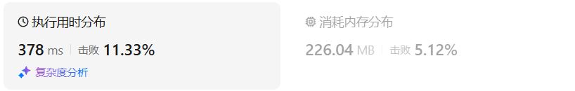

# 121买卖股票的最佳时机

[121. 买卖股票的最佳时机 - 力扣（LeetCode）](https://leetcode.cn/problems/best-time-to-buy-and-sell-stock/description/)

## 题目描述

给定一个数组 `prices` ，它的第 `i` 个元素 `prices[i]` 表示一支给定股票第 `i` 天的价格。

你只能选择 **某一天** 买入这只股票，并选择在 **未来的某一个不同的日子** 卖出该股票。设计一个算法来计算你所能获取的最大利润。

返回你可以从这笔交易中获取的最大利润。如果你不能获取任何利润，返回 `0` 。

 

**示例 1：**

```
输入：[7,1,5,3,6,4]
输出：5
解释：在第 2 天（股票价格 = 1）的时候买入，在第 5 天（股票价格 = 6）的时候卖出，最大利润 = 6-1 = 5 。
     注意利润不能是 7-1 = 6, 因为卖出价格需要大于买入价格；同时，你不能在买入前卖出股票。
```

**示例 2：**

```
输入：prices = [7,6,4,3,1]
输出：0
解释：在这种情况下, 没有交易完成, 所以最大利润为 0。
```

 

**提示：**

- `1 <= prices.length <= 105`
- `0 <= prices[i] <= 104`

## 我的C++解法

### 普通遍历

```cpp
class Solution {
public:
    int maxProfit(vector<int>& prices) {
        int minPrice = prices[0];
        int ans = 0;
        for(int i=1;i<prices.size();i++){
            if(prices[i]<minPrice){
                minPrice = prices[i];
                continue;
            }
            else{
                ans = max(ans,prices[i]-minPrice);
            }
        }
        return ans;
    }
};
```

结果：


### 递推

```cpp
class Solution {
public:
    int maxProfit(vector<int>& prices) {
        vector<vector<int>> dp(prices.size(),vector<int>(2,0));
        dp[0][0] = prices[0];
        dp[0][1] = prices[0];
        int ans = 0;
        for(int i=1;i<prices.size();i++){
            if(prices[i]<dp[i-1][0]){
                dp[i][0] = dp[i][1] = prices[i];
                continue;
            }
            else if(prices[i]>dp[i-1][1]){
                dp[i][0] = dp[i-1][0];
                dp[i][1] = prices[i];
                ans = max(ans,dp[i][1]-dp[i][0]);
                continue;
            }
            else{
                dp[i][0] = dp[i-1][0];
                dp[i][1] = dp[i-1][0];
            }
        }
        return ans;
    }
};
```

结果：


### 空间优化

```cpp
class Solution {
public:
    int maxProfit(vector<int>& prices) {
        vector<vector<int>> dp(2,vector<int>(2,0));
        dp[0][0] = prices[0];
        dp[0][1] = prices[0];
        int ans = 0;
        for(int i=1;i<prices.size();i++){
            if(prices[i]<dp[(i-1)%2][0]){
                dp[i%2][0] = dp[i%2][1] = prices[i];
                continue;
            }
            else if(prices[i]>dp[(i-1)%2][1]){
                dp[i%2][0] = dp[(i-1)%2][0];
                dp[i%2][1] = prices[i];
                ans = max(ans,dp[i%2][1]-dp[i%2][0]);
                continue;
            }
            else{
                dp[i%2][0] = dp[(i-1)%2][0];
                dp[i%2][1] = dp[(i-1)%2][0];
            }
        }
        return ans;
    }
};
```

结果：


## C++参考答案

### 贪心

取最左最小值，取最右最大值，那么得到的差值就是最大利润。

```cpp
class Solution {
public:
    int maxProfit(vector<int>& prices) {
        int low = INT_MAX;
        int result = 0;
        for (int i = 0; i < prices.size(); i++) {
            low = min(low, prices[i]);  // 取最左最小价格
            result = max(result, prices[i] - low); // 直接取最大区间利润
        }
        return result;
    }
};
```

- 时间复杂度：O(n)
- 空间复杂度：O(1)

### 动态规划

dp\[i][0] 表示第i天持有股票所得最多现金

一开始现金是0，那么加入第i天买入股票现金就是 -prices[i]， 这是一个负数。dp\[i][1] 表示第i天不持有股票所得最多现金

**这里说的是“持有”，“持有”不代表就是当天“买入”！也有可能是昨天就买入了，今天保持持有的状态**


如果第i天持有股票即dp\[i][0]， 那么可以由两个状态推出来

- 第i-1天就持有股票，那么就保持现状，所得现金就是昨天持有股票的所得现金 即：dp\[i - 1][0]
- 第i天买入股票，所得现金就是买入今天的股票后所得现金即：-prices[i]

那么dp[i][0]应该选所得现金最大的，所以dp\[i][0] = max(dp\[i - 1][0], -prices[i]);

如果第i天不持有股票即dp\[i][1]， 也可以由两个状态推出来

- 第i-1天就不持有股票，那么就保持现状，所得现金就是昨天不持有股票的所得现金 即：dp\[i - 1][1]
- 第i天卖出股票，所得现金就是按照今天股票价格卖出后所得现金即：prices[i] + dp\[i - 1][0]

同样dp\[i][1]取最大的，dp\[i][1] = max(dp\[i - 1][1], prices[i] + dp\[i - 1][0]);


dp\[0][0]表示第0天持有股票，此时的持有股票就一定是买入股票了，因为不可能有前一天推出来，所以dp\[0][0] -= prices[0];dp\[0][1]表示第0天不持有股票，不持有股票那么现金就是0，所以dp\[0][1] = 0;


从前向后遍历

```cpp
class Solution {
public:
    int maxProfit(vector<int>& prices) {
        int len = prices.size();
        if (len == 0) return 0;
        vector<vector<int>> dp(len, vector<int>(2));
        dp[0][0] -= prices[0];
        dp[0][1] = 0;
        for (int i = 1; i < len; i++) {
            dp[i][0] = max(dp[i - 1][0], -prices[i]);
            dp[i][1] = max(dp[i - 1][1], prices[i] + dp[i - 1][0]);
        }
        return dp[len - 1][1];
    }
};
```

- 时间复杂度：O(n)
- 空间复杂度：O(n)

```cpp
class Solution {
public:
    int maxProfit(vector<int>& prices) {
        int len = prices.size();
        vector<vector<int>> dp(2, vector<int>(2)); // 注意这里只开辟了一个2 * 2大小的二维数组
        dp[0][0] -= prices[0];
        dp[0][1] = 0;
        for (int i = 1; i < len; i++) {
            dp[i % 2][0] = max(dp[(i - 1) % 2][0], -prices[i]);
            dp[i % 2][1] = max(dp[(i - 1) % 2][1], prices[i] + dp[(i - 1) % 2][0]);
        }
        return dp[(len - 1) % 2][1];
    }
};
```

- 时间复杂度：O(n)
- 空间复杂度：O(1)

0x3f:

```cpp
class Solution {
public:
    int maxProfit(vector<int>& prices) {
        int ans = 0;
        int min_price = prices[0];
        for (int p : prices) {
            ans = max(ans, p - min_price);
            min_price = min(min_price, p);
        }
        return ans;
    }
};
```

## C++收获


## 我的python解答

### 记忆化搜索

```python
class Solution:
    def maxProfit(self, prices: List[int]) -> int:
        n = len(prices)
        # dfs(i)表示前i天可以得到的最大利润
        # 对于第i天，可以选择买或者不买，卖或者不卖
        # 这样考虑的话情况就太多了
        # 从昨天那个题目中得到的启示：返回两个值，返回值代表前i天最低价和最高价
        # 两个值好像不够用，比如7,6,4,5,1 如果是两个值的话，最后得到的是1，1而不是期望的4，5
        @cache
        def dfs(i:int):
            if i<0: return inf,inf, 0
            left, right, res = dfs(i-1)
            if prices[i]<left:
                return prices[i],prices[i],max(res,0)
            if prices[i]>right:
                return left,max(prices[i],right),max(res,max(prices[i],right)-left)
            return left,right,res
        _,_,ans = dfs(n-1)
        return ans
```

结果：



### 普通遍历

```python
class Solution:
    def maxProfit(self, prices: List[int]) -> int:
        minPrice = prices[0]
        ans = 0
        for price in prices:
            if price<minPrice:
                minPrice = price
                ans = max(ans,0)
            else:
                ans = max(ans,price-minPrice)
        return ans
```

结果:


### 递推

```python
class Solution:
    def maxProfit(self, prices: List[int]) -> int:
        n = len(prices)
        f = [[0]*2 for _ in range(n)]
        f[0][0] = f[0][1] = prices[0]
        ans = 0
        for i in range(1,n):
            if prices[i]<f[i-1][0]:
                f[i][0] = f[i][1] = prices[i]
                continue
            elif prices[i]>f[i-1][1]:
                f[i][0] = f[i-1][0]
                f[i][1] = prices[i]
                ans = max(ans,f[i][1]-f[i][0])
                continue
            else:
                f[i][0], f[i][1] = f[i-1][0],f[i-1][1]
        return ans
```

结果：


### 优化空间：

```python
class Solution:
    def maxProfit(self, prices: List[int]) -> int:
        n = len(prices)
        f = [[0]*2 for _ in range(2)]
        f[0][0] = f[0][1] = prices[0]
        ans = 0
        for i in range(1,n):
            if prices[i]<f[(i-1)%2][0]:
                f[i%2][0] = f[i%2][1] = prices[i]
                continue
            elif prices[i]>f[(i-1)%2][1]:
                f[i%2][0] = f[(i-1)%2][0]
                f[i%2][1] = prices[i]
                ans = max(ans,f[i%2][1]-f[i%2][0])
                continue
            else:
                f[i%2][0], f[i%2][1] = f[(i-1)%2][0],f[(i-1)%2][1]
        return ans
```

结果：


## python参考答案

```python
class Solution:
    def maxProfit(self, prices: List[int]) -> int:
        low = float("inf")
        result = 0
        for i in range(len(prices)):
            low = min(low, prices[i]) #取最左最小价格
            result = max(result, prices[i] - low) #直接取最大区间利润
        return result
```

```python
class Solution:
    def maxProfit(self, prices: List[int]) -> int:
        length = len(prices)
        if length == 0:
            return 0
        dp = [[0] * 2 for _ in range(length)]
        dp[0][0] = -prices[0]
        dp[0][1] = 0
        for i in range(1, length):
            dp[i][0] = max(dp[i-1][0], -prices[i])
            dp[i][1] = max(dp[i-1][1], prices[i] + dp[i-1][0])
        return dp[-1][1]
```

```python
class Solution:
    def maxProfit(self, prices: List[int]) -> int:
        length = len(prices)
        dp = [[0] * 2 for _ in range(2)] #注意这里只开辟了一个2 * 2大小的二维数组
        dp[0][0] = -prices[0]
        dp[0][1] = 0
        for i in range(1, length):
            dp[i % 2][0] = max(dp[(i-1) % 2][0], -prices[i])
            dp[i % 2][1] = max(dp[(i-1) % 2][1], prices[i] + dp[(i-1) % 2][0])
        return dp[(length-1) % 2][1]
```

```python
class Solution:
    def maxProfit(self, prices: List[int]) -> int:
        length = len(prices)
        dp0, dp1 = -prices[0], 0 #注意这里只维护两个常量，因为dp0的更新不受dp1的影响
        for i in range(1, length):
            dp1 = max(dp1, dp0 + prices[i])
            dp0 = max(dp0, -prices[i])
        return dp1
```

0x3f:

```py
class Solution:
    def maxProfit(self, prices: List[int]) -> int:
        ans = 0
        min_pirce = prices[0]
        for p in prices:
            ans = max(ans, p - min_pirce)
            min_pirce = min(min_pirce, p)
        return ans
```

## python收获