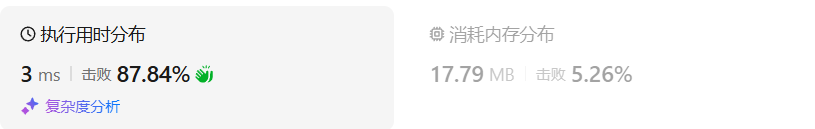
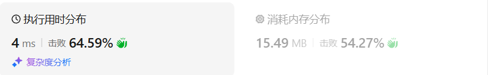
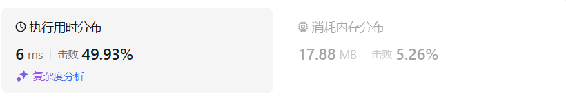
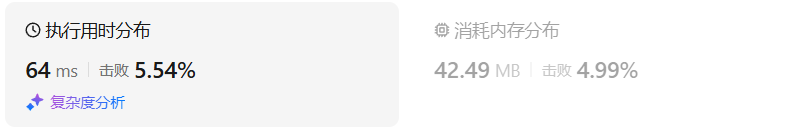
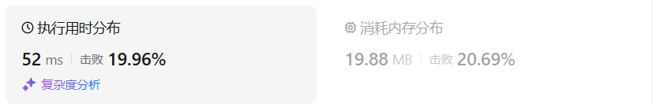
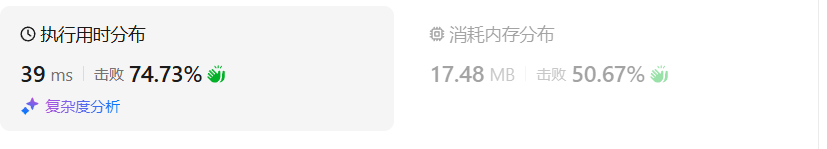
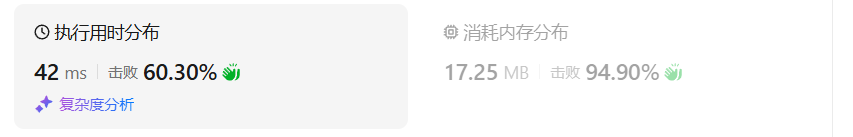

# 122买卖股票的最佳时机（中等）

[122. 买卖股票的最佳时机 II - 力扣（LeetCode）](https://leetcode.cn/problems/best-time-to-buy-and-sell-stock-ii/description/)

## 题目描述

给你一个整数数组 `prices` ，其中 `prices[i]` 表示某支股票第 `i` 天的价格。

在每一天，你可以决定是否购买和/或出售股票。你在任何时候 **最多** 只能持有 **一股** 股票。你也可以先购买，然后在 **同一天** 出售。

返回 *你能获得的 **最大** 利润* 。

 

**示例 1：**

```
输入：prices = [7,1,5,3,6,4]
输出：7
解释：在第 2 天（股票价格 = 1）的时候买入，在第 3 天（股票价格 = 5）的时候卖出, 这笔交易所能获得利润 = 5 - 1 = 4。
随后，在第 4 天（股票价格 = 3）的时候买入，在第 5 天（股票价格 = 6）的时候卖出, 这笔交易所能获得利润 = 6 - 3 = 3。
最大总利润为 4 + 3 = 7 。
```

**示例 2：**

```
输入：prices = [1,2,3,4,5]
输出：4
解释：在第 1 天（股票价格 = 1）的时候买入，在第 5 天 （股票价格 = 5）的时候卖出, 这笔交易所能获得利润 = 5 - 1 = 4。
最大总利润为 4 。
```

**示例 3：**

```
输入：prices = [7,6,4,3,1]
输出：0
解释：在这种情况下, 交易无法获得正利润，所以不参与交易可以获得最大利润，最大利润为 0。
```

## 我的C++解法

### 递推

```cpp
class Solution {
public:
    int maxProfit(vector<int>& prices) {
        int n = prices.size();
        vector<vector<int>> dp(n+1,vector<int>(2,0));
        dp[0][1] = INT_MIN;
        for(int i=0;i<n;i++){
            dp[i+1][0] = max(dp[i][0],dp[i][1]+prices[i]);
            dp[i+1][1] = max(dp[i][0]-prices[i],dp[i][1]);
        }
        return dp[n][0];
    }
};
```

结果：



### 空间优化

```cpp
class Solution {
public:
    int maxProfit(vector<int>& prices) {
        int n = prices.size();
        vector<int> dp(2,0);
        dp[1] = INT_MIN;
        for(int i=0;i<n;i++){
            dp[0] = max(dp[0],dp[1]+prices[i]);
            dp[1] = max(dp[0]-prices[i],dp[1]);
        }
        return dp[0];
    }
};
```

结果：



## C++参考答案

### 记忆化搜索

```cpp
class Solution {
public:
    int maxProfit(vector<int>& prices) {
        int n = prices.size();
        vector<array<int, 2>> memo(n, {-1, -1}); // -1 表示还没有计算过
        auto dfs = [&](auto&& dfs, int i, bool hold) -> int {
            if (i < 0) {
                return hold ? INT_MIN : 0;
            }
            int& res = memo[i][hold]; // 注意这里是引用
            if (res != -1) {
                return res; // 之前计算过
            }
            if (hold) {
                return res = max(dfs(dfs, i - 1, true), dfs(dfs, i - 1, false) - prices[i]);
            }
            return res = max(dfs(dfs, i - 1, false), dfs(dfs, i - 1, true) + prices[i]);
        };
        return dfs(dfs, n - 1, false);
    }
};
```



- 时间复杂度：O(*n*)，其中 *n* 为 *prices* 的长度。
- 空间复杂度：O(*n*)。

### 递推

```cpp
class Solution {
public:
    int maxProfit(vector<int>& prices) {
        int n = prices.size();
        vector<array<int, 2>> f(n + 1);
        f[0][1] = INT_MIN;
        for (int i = 0; i < n; i++) {
            f[i + 1][0] = max(f[i][0], f[i][1] + prices[i]);
            f[i + 1][1] = max(f[i][1], f[i][0] - prices[i]);
        }
        return f[n][0];
    }
};
```

- 时间复杂度：O(*n*)，其中 *n* 为 *prices* 的长度。
- 空间复杂度：O(*n*)。

### 空间优化

```cpp
class Solution {
public:
    int maxProfit(vector<int>& prices) {
        int f0 = 0, f1 = INT_MIN;
        for (int p: prices) {
            int new_f0 = max(f0, f1 + p);
            f1 = max(f1, f0 - p);
            f0 = new_f0;
        }
        return f0;
    }
};
```

- 时间复杂度：O(*n*)，其中 *n* 为 *prices* 的长度。
- 空间复杂度：O(1)。仅用到若干额外变量。

实际上，必须定义一个new_f0来存储新的d0，在上面的作答中没有这个new_f0，但是正常运行是瞎猫碰到死耗子，也不能体现出严谨的思维模式。

## C++收获


## 我的python解答

贪心做法略，是上一个专题的

### 记忆化搜索

从后向前考虑，方便翻译为递推

对于当前的状态i：

1.如过没有持有股票：

- 若前一天持有股票，则说明i天卖出，结果+price
- 若前一天不持有股票，则不进行变化

2.如果持有股票：

- 若前一天持有股票，则不变化
- 若前一天没有股票，说明i天买入，结果-price

```python
class Solution:
    def maxProfit(self, prices: List[int]) -> int:
        n = len(prices)
        # 对于当前的prices[i]可以有如下的考虑：
        # 如果当前i状态是持有股票，则：
        # 前一天持有股票，则不进行变化；前一天没有持有股票，则减去price表示买入花钱
        # 对于当前i状态是未持有股票，则：
        # 前一天持有股票，说明i卖出，结果加上price表示收入；没有股票，则不变
        @cache
        def dfs(i,hold):
            if i<0:
                return -inf if hold else 0
            if hold:
                return max(dfs(i-1,False)-prices[i],dfs(i-1,True))
            return max(dfs(i-1,False),dfs(i-1,True)+prices[i])
        return dfs(n-1,False)
```

结果：



### 递推

```python
class Solution:
    def maxProfit(self, prices: List[int]) -> int:
        n = len(prices)
        f = [[0]*2 for _ in range(n+1)]
        f[0][1] = -inf
        for i in range(n):
            f[i+1][0] = max(f[i][0],f[i][1]+prices[i])
            f[i+1][1] = max(f[i][0]-prices[i],f[i][1])
        return f[n][0]
```

结果：



### 空间优化

```python
class Solution:
    def maxProfit(self, prices: List[int]) -> int:
        n = len(prices)
        f = [0]*2
        f[1] = -inf
        for i in range(n):
            f[0] = max(f[0],f[1]+prices[i])
            f[1] = max(f[0]-prices[i],f[1])
        return f[0]
```

结果：



使用两个常量：

```python
class Solution:
    def maxProfit(self, prices: List[int]) -> int:
        n = len(prices)
        f0 = 0
        f1 = -inf
        for i in range(n):
            f0, f1 = max(f0,f1+prices[i]),max(f0-prices[i],f1)
        return f0
```

结果：


```python
class Solution:
    def maxProfit(self, prices: List[int]) -> int:
        n = len(prices)
        f0 = 0
        f1 = -inf
        for i in range(n):
            # f0, f1 = max(f0,f1+prices[i]),max(f0-prices[i],f1)
            f0 = max(f0,f1+prices[i])
            f1 = max(f0-prices[i],f1)
        return f0
```

结果：



## python参考答案

```py
class Solution:
    def maxProfit(self, prices: List[int]) -> int:
        n = len(prices)
        @cache  # 缓存装饰器，避免重复计算 dfs 的结果
        def dfs(i: int, hold: bool) -> int:
            if i < 0:
                return -inf if hold else 0
            if hold:
                return max(dfs(i - 1, True), dfs(i - 1, False) - prices[i])
            return max(dfs(i - 1, False), dfs(i - 1, True) + prices[i])
        return dfs(n - 1, False)
```


```py
class Solution:
    def maxProfit(self, prices: List[int]) -> int:
        n = len(prices)
        f = [[0] * 2 for _ in range(n + 1)]
        f[0][1] = -inf
        for i, p in enumerate(prices):
            f[i + 1][0] = max(f[i][0], f[i][1] + p)
            f[i + 1][1] = max(f[i][1], f[i][0] - p)
        return f[n][0]
```


```py
class Solution:
    def maxProfit(self, prices: List[int]) -> int:
        f0, f1 = 0, -inf
        for p in prices:
            f0, f1 = max(f0, f1 + p), max(f1, f0 - p)
        return f0
```

## python收获