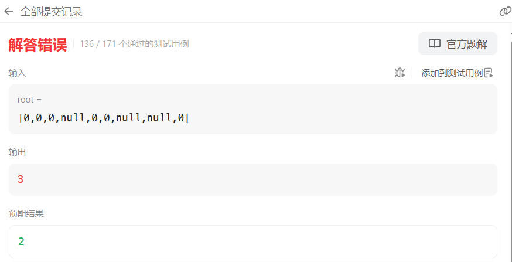
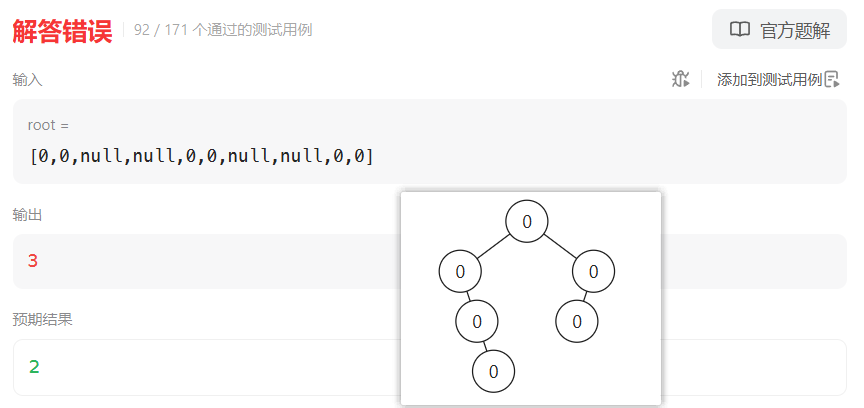

# 968监控二叉树（困难）

[968. 监控二叉树 - 力扣（LeetCode）](https://leetcode.cn/problems/binary-tree-cameras/description/)

## 题目描述

给定一个二叉树，我们在树的节点上安装摄像头。

节点上的每个摄影头都可以监视**其父对象、自身及其直接子对象。**

计算监控树的所有节点所需的最小摄像头数量。

 

**示例 1：**


```
输入：[0,0,null,0,0]
输出：1
解释：如图所示，一台摄像头足以监控所有节点。
```

**示例 2：**


```
输入：[0,0,null,0,null,0,null,null,0]
输出：2
解释：需要至少两个摄像头来监视树的所有节点。 上图显示了摄像头放置的有效位置之一。
```


**提示：**

1. 给定树的节点数的范围是 `[1, 1000]`。
2. 每个节点的值都是 0。

## 我的C++解法

```cpp
/**
 * Definition for a binary tree node.
 * struct TreeNode {
 *     int val;
 *     TreeNode *left;
 *     TreeNode *right;
 *     TreeNode() : val(0), left(nullptr), right(nullptr) {}
 *     TreeNode(int x) : val(x), left(nullptr), right(nullptr) {}
 *     TreeNode(int x, TreeNode *left, TreeNode *right) : val(x), left(left), right(right) {}
 * };
 */
class Solution {
private:
    int count = 0;
    bool isleaf(TreeNode* root){
        // 判断是否为叶节点
        if(root->left == nullptr && root->right==nullptr)   return true;
        return false;
    }
    void preorder(TreeNode* root,int father){
        if(!root)   return;
        if(root->val==2){
            // 本身是监控
            if(root->left){
                root->left->val = 1;
                preorder(root->left,root->val);
            }
            if(root->right){
                root->right->val = 1;
                preorder(root->right,root->val);
            }
        }
        else if(root->val==0){
            root->val = 1;
            if(isleaf(root)){
                count++;
                root->val = 2;
                return;
            }
            if(root->left && !root->right){
                // 只有左子树没有右子树
                root->left->val = 2;
                count++;
                preorder(root->left,1);
            }
            else if(root->right && !root->left){
                // 只有右子树没有左子树
                root->right->val = 2;
                count++;
                preorder(root->right,1);
            }
            else if(root->left && root->right){
                // 左右子树都有
                if(isleaf(root->left) || isleaf(root->right)){
                    // 有叶节点
                    root->val = 2;
                    root->left->val = 1;
                    root->right->val = 1;
                    count++;
                }
                else{
                    root->left->val = 2;
                    root->right->val = 2;
                    count += 2;
                }
                preorder(root->left,root->val);
                preorder(root->right,root->val);
            }
        }
        else{
            // root->val = 1
            // 唯一需要变更当前节点的只有：当前节点有左右子树，且均为叶节点
            if(root->left && root->right && isleaf(root->left) && isleaf(root->right)){
                root->val = 2;
                count++;
                root->left->val = 1;
                root->right->val = 1;
            }
            preorder(root->left,root->val);
            preorder(root->right,root->val);
        }
    }


public:
    int minCameraCover(TreeNode* root) {
        // 要想结果尽可能的小，那么就应该尽可能让监控点在分叉上，而不是根节点或者叶节点上
        // 对二叉树进行一下先序遍历，既然所有非空节点都是0元素，那么直接修改元素即可用来标识是否监视
        // 定义：0为初始；1为可达；2为count++的点（监视点）
        count = 0;
        preorder(root,-1);
        return count;
    }
};
```

结果：



现在给我的感觉是从底向上，遇见叶子节点了就去找父节点，

```cpp
/**
 * Definition for a binary tree node.
 * struct TreeNode {
 *     int val;
 *     TreeNode *left;
 *     TreeNode *right;
 *     TreeNode() : val(0), left(nullptr), right(nullptr) {}
 *     TreeNode(int x) : val(x), left(nullptr), right(nullptr) {}
 *     TreeNode(int x, TreeNode *left, TreeNode *right) : val(x), left(left), right(right) {}
 * };
 */
class Solution {
private:
    int sum = 0;
    int count = 0;
    void preorder(TreeNode* root,int father){
        if(!root)   return;
        sum++;
        if(father!=0){
            if(root->left){
                root->left->val -= 1;
                count++;
                preorder(root->left,root->val);
            }
            if(root->right){
                root->right->val -= 1;
                count++;
                preorder(root->right,root->val);
            }
        }
        else{
            preorder(root->left,root->val);
            preorder(root->right,root->val);
        }
    }

    void turn0(TreeNode* root){
        if(!root)   return;
        root->val = 0;
        turn0(root->left);
        turn0(root->right);
    }

public:
    int minCameraCover(TreeNode* root) {
        if(!root->left && !root->right) return 1;
        count = 0;
        sum = 0;
        preorder(root,-1);
        int ans = min(count,sum-count);
        sum = 0;
        count = 1;
        turn0(root);// 重置为全0
        root->val = -1;
        preorder(root,0);
        ans = min(ans,count);
        ans = min(ans,sum-count);
        return ans;
    }
};
```

结果：



A不出来，战略性放弃

肯定是从底向上的，要从第向上就一定是回溯，今天有点晚了，明天再战吧

## C++参考答案


## C++收获


