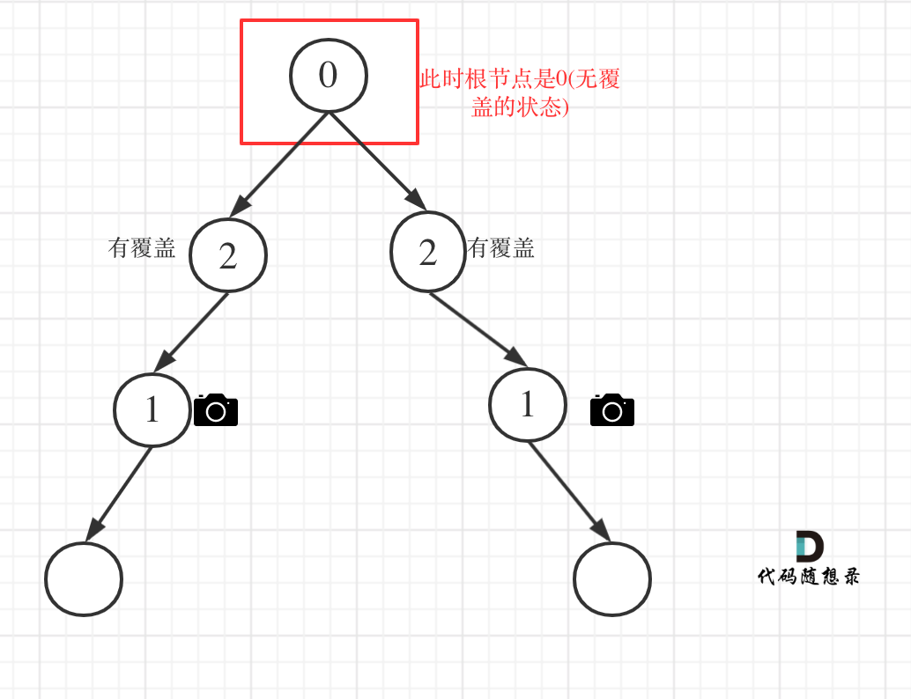

# 968监控二叉树（困难）

[968. 监控二叉树 - 力扣（LeetCode）](https://leetcode.cn/problems/binary-tree-cameras/description/)

## 题目描述

给定一个二叉树，我们在树的节点上安装摄像头。

节点上的每个摄影头都可以监视**其父对象、自身及其直接子对象。**

计算监控树的所有节点所需的最小摄像头数量。

 

**示例 1：**


```
输入：[0,0,null,0,0]
输出：1
解释：如图所示，一台摄像头足以监控所有节点。
```

**示例 2：**


```
输入：[0,0,null,0,null,0,null,null,0]
输出：2
解释：需要至少两个摄像头来监视树的所有节点。 上图显示了摄像头放置的有效位置之一。
```


**提示：**

1. 给定树的节点数的范围是 `[1, 1000]`。
2. 每个节点的值都是 0。

## 我的C++解法

从底层往上进行判断，要想在树中实现，必须是用回溯

```cpp
/**
 * Definition for a binary tree node.
 * struct TreeNode {
 *     int val;
 *     TreeNode *left;
 *     TreeNode *right;
 *     TreeNode() : val(0), left(nullptr), right(nullptr) {}
 *     TreeNode(int x) : val(x), left(nullptr), right(nullptr) {}
 *     TreeNode(int x, TreeNode *left, TreeNode *right) : val(x), left(left), right(right) {}
 * };
 */
class Solution {
public:
    int result = 0;
    int backtrack(TreeNode* node){
        // 定义：1表示是监控点，2表示背监控到
        if(!node)   return 2;

        int left = backtrack(node->left);
        int right = backtrack(node->right);

        if(left==2 && right==2) return 0;
        // if(left==1 || right==1) return 2;
        if(left==0 || right==0){
            result++;
            return 1;
        }
        if(left==1 || right==1) return 2;
        // 顺序还不能换，必须先判断0，再判断1
        return -1;
    }


    int minCameraCover(TreeNode* root) {
        // 从底向上，三种类型的数值
        result = 0;
        if(backtrack(root)==0){
            result++;
        }
        return result;
    }
};
```

结果：


## C++参考答案

**局部最优：让叶子节点的父节点安摄像头，所用摄像头最少，整体最优：全部摄像头数量所用最少！**

大体思路就是从低到上，先给叶子节点父节点放个摄像头，然后隔两个节点放一个摄像头，直至到二叉树头结点。

此时这道题目还有两个难点：

1. 二叉树的遍历
2. 如何隔两个节点放一个摄像头

可以使用后序遍历也就是左右中的顺序，这样可以在回溯的过程中从下到上进行推导

后序遍历代码如下：

```cpp
int traversal(TreeNode* cur) {

    // 空节点，该节点有覆盖
    if (终止条件) return ;

    int left = traversal(cur->left);    // 左
    int right = traversal(cur->right);  // 右

    逻辑处理                            // 中
    return ;
}
```

**在以上代码中取了左孩子的返回值，右孩子的返回值，即left 和 right， 以后推导中间节点的状态**

每个节点可能有几种状态：

有如下三种：

- 该节点无覆盖
- 本节点有摄像头
- 本节点有覆盖

我们分别有三个数字来表示：

- 0：该节点无覆盖
- 1：本节点有摄像头
- 2：本节点有覆盖

尽量让叶子节点的父节点安装摄像头，这样才能摄像头的数量最少。那么空节点不能是无覆盖的状态，这样叶子节点就要放摄像头了，空节点也不能是有摄像头的状态，这样叶子节点的父节点就没有必要放摄像头了，而是可以把摄像头放在叶子节点的爷爷节点上。

**所以空节点的状态只能是有覆盖，这样就可以在叶子节点的父节点放摄像头了**

递归的终止条件应该是遇到了空节点，此时应该返回2（有覆盖）

```cpp
// 空节点，该节点有覆盖
if (cur == NULL) return 2;
```

- 情况1：左右节点都有覆盖


```cpp
// 左右节点都有覆盖
if (left == 2 && right == 2) return 0;
```

- 情况2：左右节点至少有一个无覆盖的情况

```cpp
if (left == 0 || right == 0) {
    result++;
    return 1;
}
```

- 情况3：左右节点至少有一个有摄像头

```cpp
if (left == 1 || right == 1) return 2;
```

- 情况4：头结点没有覆盖



所以递归结束之后，还要判断根节点，如果没有覆盖，result++，代码如下：

```cpp
int minCameraCover(TreeNode* root) {
    result = 0;
    if (traversal(root) == 0) { // root 无覆盖
        result++;
    }
    return result;
}
```

C++代码如下：

```cpp
class Solution {
private:
    int result;
    int traversal(TreeNode* cur) {

        // 空节点，该节点有覆盖
        if (cur == NULL) return 2;

        int left = traversal(cur->left);    // 左
        int right = traversal(cur->right);  // 右

        // 情况1
        // 左右节点都有覆盖
        if (left == 2 && right == 2) return 0;

        // 情况2
        // left == 0 && right == 0 左右节点无覆盖
        // left == 1 && right == 0 左节点有摄像头，右节点无覆盖
        // left == 0 && right == 1 左节点有无覆盖，右节点摄像头
        // left == 0 && right == 2 左节点无覆盖，右节点覆盖
        // left == 2 && right == 0 左节点覆盖，右节点无覆盖
        if (left == 0 || right == 0) {
            result++;
            return 1;
        }

        // 情况3
        // left == 1 && right == 2 左节点有摄像头，右节点有覆盖
        // left == 2 && right == 1 左节点有覆盖，右节点有摄像头
        // left == 1 && right == 1 左右节点都有摄像头
        // 其他情况前段代码均已覆盖
        if (left == 1 || right == 1) return 2;

        // 以上代码我没有使用else，主要是为了把各个分支条件展现出来，这样代码有助于读者理解
        // 这个 return -1 逻辑不会走到这里。
        return -1;
    }

public:
    int minCameraCover(TreeNode* root) {
        result = 0;
        // 情况4
        if (traversal(root) == 0) { // root 无覆盖
            result++;
        }
        return result;
    }
};
```

在以上代码的基础上，再进行精简，代码如下：

```cpp
class Solution {
private:
    int result;
    int traversal(TreeNode* cur) {
        if (cur == NULL) return 2;
        int left = traversal(cur->left);    // 左
        int right = traversal(cur->right);  // 右
        if (left == 2 && right == 2) return 0;
        else if (left == 0 || right == 0) {
            result++;
            return 1;
        } else return 2;
    }
public:
    int minCameraCover(TreeNode* root) {
        result = 0;
        if (traversal(root) == 0) { // root 无覆盖
            result++;
        }
        return result;
    }
};
```

## C++收获


## 我的python解答

```python
# Definition for a binary tree node.
# class TreeNode:
#     def __init__(self, val=0, left=None, right=None):
#         self.val = val
#         self.left = left
#         self.right = right
class Solution:
    def minCameraCover(self, root: Optional[TreeNode]) -> int:
        ans = 0
        def backtrack(node):
            if not node:    return 2
            left = backtrack(node.left)
            right = backtrack(node.right)
            if left==2 and right==2:
                return 0
            elif left==0 or right==0:
                nonlocal ans
                ans += 1
                return 1
            else:   return 2
        if backtrack(root)==0:
            ans+=1
        return ans
```

结果：


## python参考答案

```python
class Solution:
         # Greedy Algo:
        # 从下往上安装摄像头：跳过leaves这样安装数量最少，局部最优 -> 全局最优
        # 先给leaves的父节点安装，然后每隔两层节点安装一个摄像头，直到Head
        # 0: 该节点未覆盖
        # 1: 该节点有摄像头
        # 2: 该节点有覆盖
    def minCameraCover(self, root: TreeNode) -> int:
        # 定义递归函数
        result = [0]  # 用于记录摄像头的安装数量
        if self.traversal(root, result) == 0:
            result[0] += 1

        return result[0]

        
    def traversal(self, cur: TreeNode, result: List[int]) -> int:
        if not cur:
            return 2

        left = self.traversal(cur.left, result)
        right = self.traversal(cur.right, result)

        # 情况1: 左右节点都有覆盖
        if left == 2 and right == 2:
            return 0

        # 情况2:
        # left == 0 && right == 0 左右节点无覆盖
        # left == 1 && right == 0 左节点有摄像头，右节点无覆盖
        # left == 0 && right == 1 左节点无覆盖，右节点有摄像头
        # left == 0 && right == 2 左节点无覆盖，右节点覆盖
        # left == 2 && right == 0 左节点覆盖，右节点无覆盖
        elif left == 0 or right == 0:
            result[0] += 1
            return 1

        # 情况3:
        # left == 1 && right == 2 左节点有摄像头，右节点有覆盖
        # left == 2 && right == 1 左节点有覆盖，右节点有摄像头
        # left == 1 && right == 1 左右节点都有摄像头
        else:
            return 2
```


## python收获
