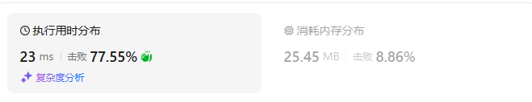

# 1143最长公共子序列（中等）

[1143. 最长公共子序列 - 力扣（LeetCode）](https://leetcode.cn/problems/longest-common-subsequence/description/)

## 题目描述

给定两个字符串 `text1` 和 `text2`，返回这两个字符串的最长 **公共子序列** 的长度。如果不存在 **公共子序列** ，返回 `0` 。

一个字符串的 **子序列** 是指这样一个新的字符串：它是由原字符串在不改变字符的相对顺序的情况下删除某些字符（也可以不删除任何字符）后组成的新字符串。

- 例如，`"ace"` 是 `"abcde"` 的子序列，但 `"aec"` 不是 `"abcde"` 的子序列。

两个字符串的 **公共子序列** 是这两个字符串所共同拥有的子序列。

 

**示例 1：**

```
输入：text1 = "abcde", text2 = "ace" 
输出：3  
解释：最长公共子序列是 "ace" ，它的长度为 3 。
```

**示例 2：**

```
输入：text1 = "abc", text2 = "abc"
输出：3
解释：最长公共子序列是 "abc" ，它的长度为 3 。
```

**示例 3：**

```
输入：text1 = "abc", text2 = "def"
输出：0
解释：两个字符串没有公共子序列，返回 0 。
```

 

**提示：**

- `1 <= text1.length, text2.length <= 1000`
- `text1` 和 `text2` 仅由小写英文字符组成。

## 我的C++解法

### 记忆化搜索

```cpp
class Solution {
public:
    int longestCommonSubsequence(string text1, string text2) {
        int m = text1.size(), n = text2.size();
        vector<vector<int>> memo(m,vector<int>(n,-1));// -1表示未使用
        auto dfs = [&](auto&& dfs,int i, int j)->int{
            if(i<0 || j<0)  return 0;
            int& res = memo[i][j];
            if(res!=-1) return res;
            if(text1[i]==text2[j])  return res = dfs(dfs,i-1,j-1)+1;
            return res = max(dfs(dfs,i-1,j),dfs(dfs,i,j-1));
        };
        return dfs(dfs,m-1,n-1);
    }
};
```

结果：


### 递推

```cpp
class Solution {
public:
    int longestCommonSubsequence(string text1, string text2) {
        int m = text1.size(), n = text2.size();
        vector<vector<int>> dp(m+1,vector<int>(n+1,0));
        for(int i=0;i<m;i++){
            for(int j=0;j<n;j++){
                text1[i]==text2[j]? dp[i+1][j+1] = dp[i][j]+1 : dp[i+1][j+1]=max(dp[i][j+1],dp[i+1][j]);
            }
        }
        return dp[m][n];
    }
};
```

结果：



### 空间优化

```cpp
class Solution {
public:
    int longestCommonSubsequence(string text1, string text2) {
        int m = text1.size(), n = text2.size();
        vector<vector<int>> dp(2,vector<int>(n+1,0));
        for(int i=0;i<m;i++){
            for(int j=0;j<n;j++){
                text1[i]==text2[j]? dp[(i+1)%2][j+1] = dp[i%2][j]+1 : dp[(i+1)%2][j+1]=max(dp[i%2][j+1],dp[(i+1)%2][j]);
            }
        }
        return dp[m%2][n];
    }
};
```

结果：


### 滚动数组

```cpp
class Solution {
public:
    int longestCommonSubsequence(string text1, string text2) {
        int m = text1.size(), n = text2.size();
        vector<int> dp(n+1,0);
        for(int i=0;i<m;i++){
            int pre = 0;
            for(int j=0;j<n;j++){
                int tmp = dp[j+1];
                text1[i]==text2[j]? dp[j+1] = pre+1 : dp[j+1]=max(dp[j+1],dp[j]);
                pre = tmp;
            }
        }
        return dp[n];
    }
};
```

结果：


## C++参考答案

二维数组压缩为一维数组的时候，有的题看题解会说什么内部循环要倒序遍历，这道题用的是正序遍历。 应该什么时候用正序什么时候用倒序遍历？

核心思路是把 f[i] 和 f[i+1] 两个数组的数据保存到**同一个数组**中，但一个萝卜一个坑，f[j] 要么保存的是 f\[i][j]，要么保存的是 f\[i+1][j]，怎么妥当地处理新旧数据


## C++收获


## 我的python解答

### 记忆化搜索

对于每对比较的字符，四种考虑：选/不选 的排列组合

```python
class Solution:
    def longestCommonSubsequence(self, text1: str, text2: str) -> int:
        m,n = len(text1), len(text2)
        @cache
        def dfs(i:int, j:int):
            if i<0 or j<0:  return 0
            # 选或不选
            if text1[i] == text2[j]:
                return max(dfs(i-1,j-1)+1,dfs(i-1,j),dfs(i,j-1))
            return max(dfs(i-1,j-1),dfs(i-1,j),dfs(i,j-1))
        return dfs(m-1,n-1)
```

结果：


优化：

既然这个问题可以考虑删除，那么如果匹配了，由贪心思想，必定是都选择得到的结果更大

同样，如果不匹配，不需要考虑都不选的问题（因为丢失数据，可能导致结果下降但是绝对不会提高）

```python
class Solution:
    def longestCommonSubsequence(self, text1: str, text2: str) -> int:
        m,n = len(text1), len(text2)
        @cache
        def dfs(i:int, j:int):
            if i<0 or j<0:  return 0
            # 选或不选
            if text1[i] == text2[j]:
                return dfs(i-1,j-1)+1
            return max(dfs(i-1,j),dfs(i,j-1))
        return dfs(m-1,n-1)
```

结果：


### 递推

```python
class Solution:
    def longestCommonSubsequence(self, text1: str, text2: str) -> int:
        m,n = len(text1), len(text2)
        f = [[0]*(n+1) for _ in range(m+1)]
        for i in range(m):
            for j in range(n):
                f[i+1][j+1] = f[i][j] + 1 if text1[i]==text2[j] else max(f[i][j+1],f[i+1][j])
        return f[m][n]
```

结果：


### 空间优化

```python
class Solution:
    def longestCommonSubsequence(self, text1: str, text2: str) -> int:
        m,n = len(text1), len(text2)
        f = [[0]*(n+1) for _ in range(2)]
        for i in range(m):
            for j in range(n):
                f[(i+1)%2][j+1] = f[i%2][j] + 1 if text1[i]==text2[j] else max(f[i%2][j+1],f[(i+1)%2][j])
        return f[m%2][n]
```

结果：


### 继续空间优化

```python
class Solution:
    def longestCommonSubsequence(self, text1: str, text2: str) -> int:
        m,n = len(text1), len(text2)
        f = [0]*(n+1)
        for i in range(m):
            pre = 0
            for j in range(n):
                tmp = f[j+1]
                f[j+1] = pre + 1 if text1[i]==text2[j] else max(f[j+1],f[j])
                pre = tmp
        return f[n]
```

结果：


## python参考答案


## python收获