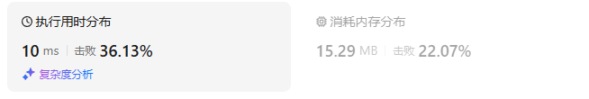
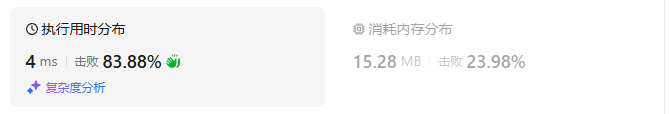
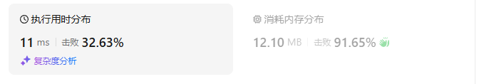
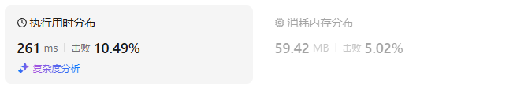
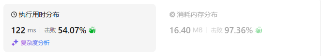

# 1035不相交的线（中等）

[1035. 不相交的线 - 力扣（LeetCode）](https://leetcode.cn/problems/uncrossed-lines/description/)

## 题目描述

在两条独立的水平线上按给定的顺序写下 `nums1` 和 `nums2` 中的整数。

现在，可以绘制一些连接两个数字 `nums1[i]` 和 `nums2[j]` 的直线，这些直线需要同时满足：

-  `nums1[i] == nums2[j]`
- 且绘制的直线不与任何其他连线（非水平线）相交。

请注意，连线即使在端点也不能相交：每个数字只能属于一条连线。

以这种方法绘制线条，并返回可以绘制的最大连线数。

 

**示例 1：**


```
输入：nums1 = [1,4,2], nums2 = [1,2,4]
输出：2
解释：可以画出两条不交叉的线，如上图所示。 
但无法画出第三条不相交的直线，因为从 nums1[1]=4 到 nums2[2]=4 的直线将与从 nums1[2]=2 到 nums2[1]=2 的直线相交。
```

**示例 2：**

```
输入：nums1 = [2,5,1,2,5], nums2 = [10,5,2,1,5,2]
输出：3
```

**示例 3：**

```
输入：nums1 = [1,3,7,1,7,5], nums2 = [1,9,2,5,1]
输出：2
```

 

**提示：**

- `1 <= nums1.length, nums2.length <= 500`
- `1 <= nums1[i], nums2[j] <= 2000`

## 我的C++解法

### 记忆化搜索

```cpp
class Solution {
public:
    int maxUncrossedLines(vector<int>& nums1, vector<int>& nums2) {
        int m = nums1.size(), n = nums2.size();
        // 记忆化搜索
        vector<vector<int>> memo(m+1,vector<int>(n+1,-1));
        auto dfs = [&](auto& dfs, int i,int j){
            if(i<0 || j<0)  return 0;
            int& res = memo[i][j];
            if(res!=-1) return res;
            if(nums1[i]==nums2[j])  return res = dfs(dfs,i-1,j-1)+1;
            return res = max(dfs(dfs,i-1,j),dfs(dfs,i,j-1));
        };
        return dfs(dfs,m-1,n-1);
    }
};
```

结果：



### 递推

```cpp
class Solution {
public:
    int maxUncrossedLines(vector<int>& nums1, vector<int>& nums2) {
        int m = nums1.size(), n = nums2.size();
        vector<vector<int>> dp(m+1,vector<int>(n+1,0));
        for(int i=0;i<m;i++){
            for(int j=0;j<n;j++){
                dp[i+1][j+1] = nums1[i]==nums2[j]? dp[i][j]+1: max(dp[i][j+1],dp[i+1][j]);
            }
        }
        return dp[m][n];
    }
};
```

结果：



### 空间优化

```cpp
class Solution {
public:
    int maxUncrossedLines(vector<int>& nums1, vector<int>& nums2) {
        int m = nums1.size(), n = nums2.size();
        vector<vector<int>> dp(2,vector<int>(n+1,0));
        for(int i=0;i<m;i++){
            for(int j=0;j<n;j++){
                dp[(i+1)%2][j+1] = nums1[i]==nums2[j]? dp[i%2][j]+1: max(dp[i%2][j+1],dp[(i+1)%2][j]);
            }
        }
        return dp[m%2][n];
    }
};
```

结果：


### 滚动数组

```cpp
class Solution {
public:
    int maxUncrossedLines(vector<int>& nums1, vector<int>& nums2) {
        int m = nums1.size(), n = nums2.size();
        vector<int> dp(n+1,0);
        for(int i=0;i<m;i++){
            int pre = 0;
            for(int j=0;j<n;j++){
                int tmp = dp[j+1];
                dp[j+1] = nums1[i]==nums2[j]? pre+1: max(dp[j+1],dp[j]);
                pre = tmp;
            }
        }
        return dp.back();
    }
};
```

结果：



## C++参考答案


## C++收获


## 我的python解答

### 记忆化搜索

和之前的几乎一样

```python
class Solution:
    def maxUncrossedLines(self, nums1: List[int], nums2: List[int]) -> int:
        # 说白了就是同种方向找相等的元素，且走到哪里就不再考虑前面的元素
        m, n = len(nums1), len(nums2)
        @cache
        def dfs(i:int, j:int):
            if i<0 or j<0:
                return 0
            if nums1[i] == nums2[j]:
                return dfs(i-1,j-1)+1
            return max(dfs(i-1,j),dfs(i,j-1))
        return dfs(m-1,n-1)
```

结果：



### 递推

```python
class Solution:
    def maxUncrossedLines(self, nums1: List[int], nums2: List[int]) -> int:
        m, n = len(nums1), len(nums2)
        f = [[0]*(n+1) for _ in range(m+1)]
        for i,x in enumerate(nums1):
            for j,y in enumerate(nums2):
                f[i+1][j+1] = f[i][j]+1 if x==y else max(f[i][j+1],f[i+1][j])
        return f[m][n]
```

结果：


### 空间优化

```python
class Solution:
    def maxUncrossedLines(self, nums1: List[int], nums2: List[int]) -> int:
        m, n = len(nums1), len(nums2)
        f = [[0]*(n+1) for _ in range(2)]
        for i,x in enumerate(nums1):
            for j,y in enumerate(nums2):
                f[(i+1)%2][j+1] = f[i%2][j]+1 if x==y else max(f[i%2][j+1],f[(i+1)%2][j])
        return f[m%2][n]
```

结果：


### 使用一个滚动数组：

```python
class Solution:
    def maxUncrossedLines(self, nums1: List[int], nums2: List[int]) -> int:
        m, n = len(nums1), len(nums2)
        f = [0]*(n+1)
        # 数据是由左上角、上方、左方元素推导得到的
        for x in nums1:
            pre = 0
            for j,y in enumerate(nums2):
                tmp = f[j+1]
                f[j+1] = pre+1 if x==y else max(f[j+1],f[j])
                pre = tmp
        return f[n]
```

结果：



## python参考答案


## python收获