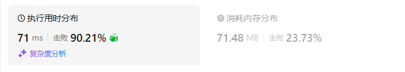

# 53最大子数组和（中等）

[53. 最大子数组和 - 力扣（LeetCode）](https://leetcode.cn/problems/maximum-subarray/description/)

## 题目描述

给你一个整数数组 `nums` ，请你找出一个具有最大和的连续子数组（子数组最少包含一个元素），返回其最大和。


**子数组**

是数组中的一个连续部分。


 

**示例 1：**

```
输入：nums = [-2,1,-3,4,-1,2,1,-5,4]
输出：6
解释：连续子数组 [4,-1,2,1] 的和最大，为 6 。
```

**示例 2：**

```
输入：nums = [1]
输出：1
```

**示例 3：**

```
输入：nums = [5,4,-1,7,8]
输出：23
```

 

**提示：**

- `1 <= nums.length <= 105`
- `-104 <= nums[i] <= 104`

 

**进阶：**如果你已经实现复杂度为 `O(n)` 的解法，尝试使用更为精妙的 **分治法** 求解。

## 我的C++解法

### 记忆化搜索

```cpp
class Solution {
public:
    int maxSubArray(vector<int>& nums) {
        // 记忆化搜索
        int n = nums.size();
        vector<int> memo(n,-1);
        auto dfs = [&](auto& dfs, int i)->int{
            if(i<0) return INT_MIN/2;
            int& res = memo[i];
            if(res!=-1) return res;
            return res = max(dfs(dfs,i-1)+nums[i],nums[i]);
        };
        dfs(dfs,n-1);
        return ranges::max(memo);
    }
};
```

结果：


### 递推

```cpp
class Solution {
public:
    int maxSubArray(vector<int>& nums) {
        int n = nums.size();
        vector<int> dp(n+1,0);
        dp[0] = INT_MIN/2;
        for(int i=0;i<n;i++){
            dp[i+1] = max(dp[i]+nums[i],nums[i]);
        }
        return ranges::max(dp);
    }
};
```

结果：



### 空间优化

```cpp
class Solution {
public:
    int maxSubArray(vector<int>& nums) {
        int f0 = INT_MIN/2, f1=0;
        int ans = INT_MIN;
        for(int x:nums){
            f0 = f1;
            f1 = max(f0+x,x);
            if(f1>ans)  ans = f1;
        }
        return ans;
    }
};
```

结果：


## C++参考答案

实际上不需要f0和f1，只需要一个f即可

```cpp
class Solution {
public:
    int maxSubArray(vector<int>& nums) {
        int f=0;
        int ans = INT_MIN;
        for(int x:nums){
            f = max(f+x,x);
            if(f>ans)  ans = f;
        }
        return ans;
    }
};
```

结果：


## C++收获


## 我的python解答

### 记忆化搜索

```python
class Solution:
    def maxSubArray(self, nums: List[int]) -> int:
        n = len(nums)
        # if n==1:    return nums[0]
        @cache
        def dfs(i:int):
            if i<0: return -inf
            return max(dfs(i-1)+nums[i],nums[i])
        return max(dfs(i) for i in range(n))
```

结果：


### 递推

```python
class Solution:
    def maxSubArray(self, nums: List[int]) -> int:
        n = len(nums)
        f = [0]*(n+1)
        f[0] = -inf
        ans = -inf
        for i,x in enumerate(nums):
            f[i+1] = max(f[i]+x,x)
            if f[i+1]>ans:  ans = f[i+1]
        return ans
```

结果：


### 空间优化

```python
class Solution:
    def maxSubArray(self, nums: List[int]) -> int:
        n = len(nums)
        f0 = -inf
        f1 = 0
        ans = -inf
        for x in nums:
            f0 = f1
            f1 = max(f1+x,x)
            if f1>ans:  ans = f1
        return ans
```

结果：


## python参考答案


## python收获