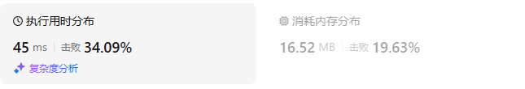

# 392判断子序列

[392. 判断子序列 - 力扣（LeetCode）](https://leetcode.cn/problems/is-subsequence/description/)

## 题目描述

给定字符串 **s** 和 **t** ，判断 **s** 是否为 **t** 的子序列。

字符串的一个子序列是原始字符串删除一些（也可以不删除）字符而不改变剩余字符相对位置形成的新字符串。（例如，`"ace"`是`"abcde"`的一个子序列，而`"aec"`不是）。

**进阶：**

如果有大量输入的 S，称作 S1, S2, ... , Sk 其中 k >= 10亿，你需要依次检查它们是否为 T 的子序列。在这种情况下，你会怎样改变代码？

**致谢：**

特别感谢 [@pbrother ](https://leetcode.com/pbrother/)添加此问题并且创建所有测试用例。

 

**示例 1：**

```
输入：s = "abc", t = "ahbgdc"
输出：true
```

**示例 2：**

```
输入：s = "axc", t = "ahbgdc"
输出：false
```

 

**提示：**

- `0 <= s.length <= 100`
- `0 <= t.length <= 10^4`
- 两个字符串都只由小写字符组成。

## 我的C++解法

### 不用动态规划

```cpp
class Solution {
public:
    bool isSubsequence(string s, string t) {
        int n = s.size();
        if(n==0)    return true;
        int i=0;
        for(char x:t){
            if(x==s[i]){
                i++;
                if(i==n)    return true;
            }
        }
        return false;
    }
};
```

结果：


## C++参考答案

```cpp
class Solution {
public:
    bool isSubsequence(string s, string t) {
        if (s.empty()) {
            return true;
        }
        int i = 0;
        for (char c : t) {
            if (s[i] == c && ++i == s.length()) { // 所有字符匹配完毕
                return true; // s 是 t 的子序列
            }
        }
        return false;
    }
};
```

## C++收获


## 我的python解答

如果是以前的我，那就只能想到：外层遍历s字符串，内层遍历t字符串，如果能够匹配，则i和j都加，否则只加j

### 记忆化搜索

```python
class Solution:
    def isSubsequence(self, s: str, t: str) -> bool:
        m,n = len(s), len(t)
        if  m>n:    return False
        @cache
        def dfs(i:int,j:int):
            if i<0:
                return True
            if j<0:
                return False
            if s[i]==t[j]:
                return dfs(i-1,j-1)
            return dfs(i,j-1)
        return dfs(m-1,n-1)
```

结果：


### 递推

```python
class Solution:
    def isSubsequence(self, s: str, t: str) -> bool:
        m,n = len(s), len(t)
        f = [[False]*(n+1) for _ in range(m+1)]
        for i in range(n+1):
            f[0][i] = True
        for i in range(m):
            for j in range(n):
                if s[i] == t[j]:    f[i+1][j+1] = f[i][j]
                else:   f[i+1][j+1] = f[i+1][j]
        return f[m][n]
```

结果：


### 不用动态规划：

```python
class Solution:
    def isSubsequence(self, s: str, t: str) -> bool:
        n = len(s)
        if not s:   return True
        i = 0
        for x in t:
            if s[i]==x:
                i += 1
                if i==n:
                    return True
        return False
```

结果：



## python参考答案

```python
class Solution:
    def isSubsequence(self, s: str, t: str) -> bool:
        it = iter(t)
        return all(c in it for c in s)  # in 会消耗迭代器
```

- 时间复杂度：O(*m*)，其中 *m* 是 *t* 的长度。代码只有一个循环，至多循环 O(*m*) 次。
- 空间复杂度：O(1)。

## python收获