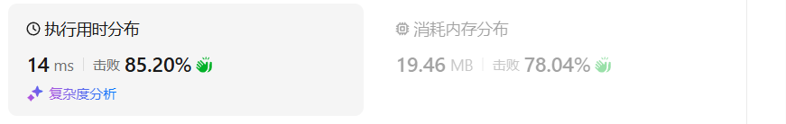
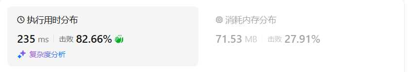
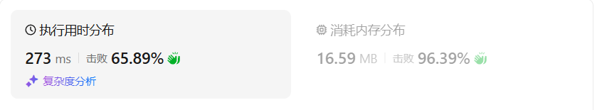

# 115不同的子序列（困难）

[115. 不同的子序列 - 力扣（LeetCode）](https://leetcode.cn/problems/distinct-subsequences/description/)

## 题目描述

给你两个字符串 `s` 和 `t` ，统计并返回在 `s` 的 **子序列** 中 `t` 出现的个数，结果需要对 109 + 7 取模。

 

**示例 1：**

```
输入：s = "rabbbit", t = "rabbit"
输出：3
解释：
如下所示, 有 3 种可以从 s 中得到 "rabbit" 的方案。
rabbbit
rabbbit
rabbbit
```

**示例 2：**

```
输入：s = "babgbag", t = "bag"
输出：5
解释：
如下所示, 有 5 种可以从 s 中得到 "bag" 的方案。 
babgbag
babgbag
babgbag
babgbag
babgbag
```

 

**提示：**

- `1 <= s.length, t.length <= 1000`
- `s` 和 `t` 由英文字母组成

## 我的C++解法

### 记忆化搜索

```cpp
class Solution {
public:
    int numDistinct(string s, string t) {
        int m = s.size(), n = t.size();
        // 记忆化搜索
        vector<vector<int>> memo(m,vector<int>(n,-1));
        auto dfs = [&](auto& dfs, int i, int j)->int{
            if(i<j) return 0;
            if(j<0) return 1;
            if(i<0) return 0;
            int& res = memo[i][j];
            if(res!=-1) return res;
            if(s[i] == t[j]){
                return res = dfs(dfs,i-1,j-1)+dfs(dfs,i-1,j);
            }
            return res = dfs(dfs,i-1,j);
        };
        return dfs(dfs,m-1,n-1);
    }
};
```

结果：


### 递推

```cpp
class Solution {
public:
    int numDistinct(string s, string t) {
        int m = s.size(), n = t.size();
        vector<vector<int>> dp(m+1,vector<int>(n+1,0));
        for(int i=0;i<m;i++){
            dp[i][0] = 1;
        }
        for(int i=0;i<m;i++){
            for(int j=0;j<n;j++){
                if(s[i]==t[j]){
                    dp[i+1][j+1] = dp[i][j]+dp[i][j+1];
                }
                else{
                    dp[i+1][j+1] = dp[i][j+1];
                }
            }
        }
        return dp[m][n];
    }
};
```

结果：溢出

解决方案：数组定义的时候不用int，使用无符号整数

```cpp
class Solution {
public:
    int numDistinct(string s, string t) {
        int m = s.size(), n = t.size();
        vector<vector<unsigned int>> dp(m+1,vector<unsigned int>(n+1,0));
        for(int i=0;i<m;i++){
            dp[i][0] = 1;
        }
        for(int i=0;i<m;i++){
            for(int j=0;j<n;j++){
                if(s[i]==t[j]){
                    dp[i+1][j+1] = dp[i][j]+dp[i][j+1];
                }
                else{
                    dp[i+1][j+1] = dp[i][j+1];
                }
            }
        }
        return dp[m][n];
    }
};
```

结果：



### 空间优化

```cpp
class Solution {
public:
    int numDistinct(string s, string t) {
        int m = s.size(), n = t.size();
        vector<vector<unsigned int>> dp(2,vector<unsigned int>(n+1,0));
        for(int i=0;i<2;i++){
            dp[i][0] = 1;
        }
        for(int i=0;i<m;i++){
            for(int j=0;j<n;j++){
                if(s[i]==t[j]){
                    dp[(i+1)%2][j+1] = dp[i%2][j]+dp[i%2][j+1];
                }
                else{
                    dp[(i+1)%2][j+1] = dp[i%2][j+1];
                }
            }
        }
        return dp[m%2][n];
    }
};
```

结果：


### 继续优化

```cpp
class Solution {
public:
    int numDistinct(string s, string t) {
        int m = s.size(), n = t.size();
        vector<unsigned int> dp(n+1,0);
        dp[0] = 1;
        for(int i=0;i<m;i++){
            for(int j=n-1;j>=0;j--){
                if(s[i]==t[j]){
                    dp[j+1] = dp[j]+dp[j+1];
                }
            }
        }
        return dp[n];
    }
};
```

结果：


## C++参考答案


## C++收获


## 我的python解答

### 记忆化搜索

```python
class Solution:
    def numDistinct(self, s: str, t: str) -> int:
        # 从题目的描述上来看，还是用记忆化搜索的递归更好判断
        m,n = len(s), len(t)
        ans = 0
        @cache
        def dfs(i:int,j:int):
            if i<0 or j<0:
                return 0
            if s[i]==t[j]:
                return max(dfs(i-1,j-1)+1,dfs(i-1,j)) # 分别对应选和不选
            return dfs(i-1,j)
        dfs(m-1,n-1)
        return ans    
```

这个思路是错误的，重新考虑

这个题就不是用max求最值的，它求的是总共的组合个数，那就应该用加法

其次，在初始判断的时候可以直接依据i<j返回0，大幅度减小开销

```python
class Solution:
    def numDistinct(self, s: str, t: str) -> int:
        # 从题目的描述上来看，还是用记忆化搜索的递归更好判断
        m,n = len(s), len(t)
        @cache
        def dfs(i:int,j:int):
            if i<j: return 0
            if j<0: return 1
            if i<0: return 0
            if i<0 or j<0:
                return 0
            if s[i]==t[j]:
                return dfs(i-1,j-1)+dfs(i-1,j) # 分别对应选和不选
            return dfs(i-1,j)
        return dfs(m-1,n-1)
```

结果：


### 递推

```python
class Solution:
    def numDistinct(self, s: str, t: str) -> int:
        m,n = len(s), len(t)
        f = [[0]*(n+1) for _ in range(m+1)]
        for i in range(m):
            f[i][0] = 1
        for i,x in enumerate(s):
            for j,y in enumerate(t):
                # if i<j: f[i+1][j+1] = 0
                if x==y:
                    f[i+1][j+1] = f[i][j]+f[i][j+1]
                else:
                    f[i+1][j+1] = f[i][j+1]
        return f[m][n]
```

结果：



### 空间优化

```python
class Solution:
    def numDistinct(self, s: str, t: str) -> int:
        m,n = len(s), len(t)
        f = [[0]*(n+1) for _ in range(2)]
        f[0][0] = f[1][0] = 1
        for i,x in enumerate(s):
            for j,y in enumerate(t):
                if x==y:
                    f[(i+1)%2][j+1] = f[i%2][j]+f[i%2][j+1]
                else:
                    f[(i+1)%2][j+1] = f[i%2][j+1]
        return f[m%2][n]
```

结果：



### 继续优化空间

使用一维数组，目标是通过左上角元素和左侧元素推导得到的，因此在内部遍历采用倒叙遍历

```python
class Solution:
    def numDistinct(self, s: str, t: str) -> int:
        m,n = len(s), len(t)
        f = [0]*(n+1)
        f[0] = 1
        for x in s:
            for j in range(n-1,-1,-1):
                if x==t[j]:
                    f[j+1] = f[j]+f[j+1]
        return f[n]
```

结果：


## python参考答案


## python收获