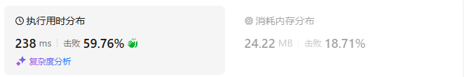

# 647回文子串（中等）

[647. 回文子串 - 力扣（LeetCode）](https://leetcode.cn/problems/palindromic-substrings/description/)

## 题目描述

给你一个字符串 `s` ，请你统计并返回这个字符串中 **回文子串** 的数目。

**回文字符串** 是正着读和倒过来读一样的字符串。

**子字符串** 是字符串中的由连续字符组成的一个序列。

 

**示例 1：**

```
输入：s = "abc"
输出：3
解释：三个回文子串: "a", "b", "c"
```

**示例 2：**

```
输入：s = "aaa"
输出：6
解释：6个回文子串: "a", "a", "a", "aa", "aa", "aaa"
```

 

**提示：**

- `1 <= s.length <= 1000`
- `s` 由小写英文字母组成

## 我的C++解法


## C++参考答案

### 动态规划

- 确定dp数组（dp table）以及下标的含义

如果我们定义，dp[i] 为 下标i结尾的字符串有 dp[i]个回文串的话，我们会发现很难找到递归关系。

dp[i] 和 dp[i-1] ，dp[i + 1] 看上去都没啥关系。

所以我们要看回文串的性质。 如图：


我们在判断字符串S是否是回文，那么如果我们知道 s[1]，s[2]，s[3] 这个子串是回文的，那么只需要比较 s[0]和s[4]这两个元素是否相同，如果相同的话，这个字符串s 就是回文串。那么此时我们是不是能找到一种递归关系，也就是判断一个子字符串（字符串下标范围[i,j]）是否回文，依赖于，子字符串（下标范围[i + 1, j - 1]）） 是否是回文。

所以为了明确这种递归关系，我们的dp数组是要定义成一位二维dp数组。

布尔类型的dp\[i][j]：表示区间范围[i,j] （注意是左闭右闭）的子串是否是回文子串，如果是dp\[i][j]为true，否则为false。

- 确定递推公式

当s[i]与s[j]不相等，那没啥好说的了，dp[i][j]一定是false。

当s[i]与s[j]相等时，这就复杂一些了，有如下三种情况

1. 情况一：下标i 与 j相同，同一个字符例如a，当然是回文子串
2. 情况二：下标i 与 j相差为1，例如aa，也是回文子串
3. 情况三：下标：i 与 j相差大于1的时候，例如cabac，此时s[i]与s[j]已经相同了，我们看i到j区间是不是回文子串就看aba是不是回文就可以了，那么aba的区间就是 i+1 与 j-1区间，这个区间是不是回文就看dp\[i + 1][j - 1]是否为true。

```cpp
if (s[i] == s[j]) {
    if (j - i <= 1) { // 情况一 和 情况二
        result++;
        dp[i][j] = true;
    } else if (dp[i + 1][j - 1]) { // 情况三
        result++;
        dp[i][j] = true;
    }
}
```

result就是统计回文子串的数量。

- dp数组如何初始化

初始化为false。

- 确定遍历顺序

从递推公式中可以看出，情况三是根据dp\[i + 1][j - 1]是否为true，在对dp[i][j]进行赋值true的。

dp\[i + 1][j - 1] 在 dp[i][j]的左下角，如图：


如果这矩阵是从上到下，从左到右遍历，那么会用到没有计算过的dp\[i + 1][j - 1]，也就是根据不确定是不是回文的区间[i+1,j-1]，来判断了[i,j]是不是回文，那结果一定是不对的。

**所以一定要从下到上，从左到右遍历，这样保证dp\[i + 1][j - 1]都是经过计算的**。

有的代码实现是优先遍历列，然后遍历行，其实也是一个道理，都是为了保证dp[i + 1][j - 1]都是经过计算的。

- 举例推导dp数组

举例，输入："aaa"，dp[i][j]状态如下：


图中有6个true，所以就是有6个回文子串。

**注意因为dp\[i][j]的定义，所以j一定是大于等于i的，那么在填充dp\[i][j]的时候一定是只填充右上半部分**

```cpp
class Solution {
public:
    int countSubstrings(string s) {
        vector<vector<bool>> dp(s.size(), vector<bool>(s.size(), false));
        int result = 0;
        for (int i = s.size() - 1; i >= 0; i--) {  // 注意遍历顺序
            for (int j = i; j < s.size(); j++) {
                if (s[i] == s[j]) {
                    if (j - i <= 1) { // 情况一 和 情况二
                        result++;
                        dp[i][j] = true;
                    } else if (dp[i + 1][j - 1]) { // 情况三
                        result++;
                        dp[i][j] = true;
                    }
                }
            }
        }
        return result;
    }
};
```

结果：


简洁写法：

```cpp
class Solution {
public:
    int countSubstrings(string s) {
        vector<vector<bool>> dp(s.size(), vector<bool>(s.size(), false));
        int result = 0;
        for (int i = s.size() - 1; i >= 0; i--) {
            for (int j = i; j < s.size(); j++) {
                if (s[i] == s[j] && (j - i <= 1 || dp[i + 1][j - 1])) {
                    result++;
                    dp[i][j] = true;
                }
            }
        }
        return result;
    }
};
```

结果：


- 时间复杂度：O(n^2)
- 空间复杂度：O(n^2)

### 双指针法

首先确定回文串，就是找中心然后向两边扩散看是不是对称的就可以了。

**在遍历中心点的时候，要注意中心点有两种情况**。

一个元素可以作为中心点，两个元素也可以作为中心点。

那么有人同学问了，三个元素还可以做中心点呢。其实三个元素就可以由一个元素左右添加元素得到，四个元素则可以由两个元素左右添加元素得到。

所以我们在计算的时候，要注意一个元素为中心点和两个元素为中心点的情况。

**这两种情况可以放在一起计算，但分别计算思路更清晰，我倾向于分别计算**，代码如下：

```cpp
class Solution {
public:
    int countSubstrings(string s) {
        int result = 0;
        for (int i = 0; i < s.size(); i++) {
            result += extend(s, i, i, s.size()); // 以i为中心
            result += extend(s, i, i + 1, s.size()); // 以i和i+1为中心
        }
        return result;
    }
    int extend(const string& s, int i, int j, int n) {
        int res = 0;
        while (i >= 0 && j < n && s[i] == s[j]) {
            i--;
            j++;
            res++;
        }
        return res;
    }
};
```

结果：


- 时间复杂度：O(n^2)
- 空间复杂度：O(1)

## C++收获


## 我的python解答

### 记忆化搜索

最开始的想法是全部组合回溯一遍，但是出错了，错因不知道

```python
class Solution:
    def isWhatweNeed(self,s:str):
        # 判断
        n = len(s)
        if n==0:    return False
        if n==1:    return True
        for i in range(n):
            j = n-1-i
            if s[i]!=s[j]:  return False
            if i>j: return True
        return True
    def countSubstrings(self, s: str) -> int:
        n = len(s)
        @cache
        def dfs(i:int,init:str):
            if i<0 and self.isWhatweNeed(init):
                return 1
            if i<0: return 0
            # 选或不选构造新的字符串
            # choose = dfs(i-1,s[i]+init)+1 if self.isWhatweNeed(s[i]+init) else dfs(i-1,s[i]+init)
            # not_choose = dfs(i-1,init)
            return dfs(i-1,s[i]+init) + dfs(i-1,init)
        return dfs(n-1,"")
```

给我搞迷糊了，这不就是回溯吗？我看着也没有问题啊，为什么输入案例aaa的时候返回的结果是7而不是目标的6？？？

烂完了这个题真不会啊

## python参考答案

### 动态规划

```python
class Solution:
    def countSubstrings(self, s: str) -> int:
        dp = [[False] * len(s) for _ in range(len(s))]
        result = 0
        for i in range(len(s)-1, -1, -1): #注意遍历顺序
            for j in range(i, len(s)):
                if s[i] == s[j]:
                    if j - i <= 1: #情况一 和 情况二
                        result += 1
                        dp[i][j] = True
                    elif dp[i+1][j-1]: #情况三
                        result += 1
                        dp[i][j] = True
        return result
```

结果：


```python
class Solution:
    def countSubstrings(self, s: str) -> int:
        dp = [[False] * len(s) for _ in range(len(s))]
        result = 0
        for i in range(len(s)-1, -1, -1): #注意遍历顺序
            for j in range(i, len(s)):
                if s[i] == s[j] and (j - i <= 1 or dp[i+1][j-1]): 
                    result += 1
                    dp[i][j] = True
        return result
```

结果：



### 双指针

```python
class Solution:
    def countSubstrings(self, s: str) -> int:
        result = 0
        for i in range(len(s)):
            result += self.extend(s, i, i, len(s)) #以i为中心
            result += self.extend(s, i, i+1, len(s)) #以i和i+1为中心
        return result
    
    def extend(self, s, i, j, n):
        res = 0
        while i >= 0 and j < n and s[i] == s[j]:
            i -= 1
            j += 1
            res += 1
        return res
```

结果：


## python收获