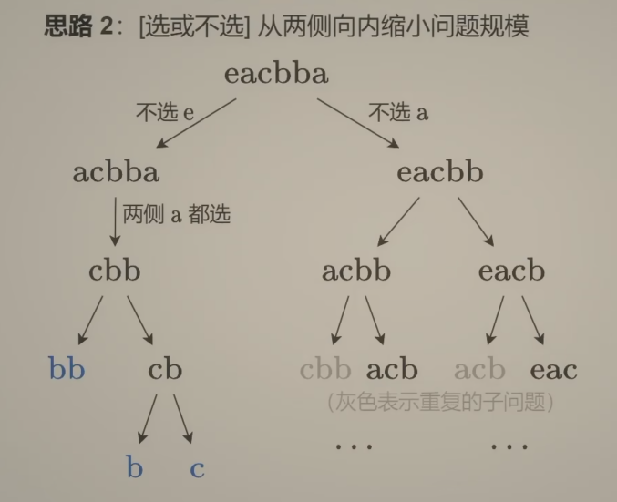
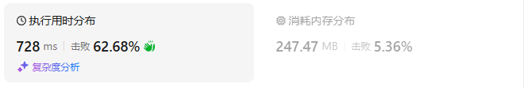

# 516最长回文子序列（中等）

[516. 最长回文子序列 - 力扣（LeetCode）](https://leetcode.cn/problems/longest-palindromic-subsequence/description/)

## 题目描述

给你一个字符串 `s` ，找出其中最长的回文子序列，并返回该序列的长度。

子序列定义为：不改变剩余字符顺序的情况下，删除某些字符或者不删除任何字符形成的一个序列。

 

**示例 1：**

```
输入：s = "bbbab"
输出：4
解释：一个可能的最长回文子序列为 "bbbb" 。
```

**示例 2：**

```
输入：s = "cbbd"
输出：2
解释：一个可能的最长回文子序列为 "bb" 。
```

 

**提示：**

- `1 <= s.length <= 1000`
- `s` 仅由小写英文字母组成

## 须臾之所学

整体思想

### 思路一

转换思想：题目就是在求s和反转后的s的最长公共子序列LCS

`s = eacba`

`s_rev = abbcae`

使用滑动窗口的方式求最长公共子序列

### 思路二

#### 记忆化搜索

从选或者不选的角度考虑：从两侧向内部缩小问题的规模



那么就可以定义dfs(i,j)表示从s[i]到s[j]的最长回文子序列的长度

dfs的定义：
$$
dfs(i,j) = \begin{cases} dfs(i+1,j-1)+2,s[i]=s[j] \\ max(dfs(i+1,j),dfs(i,j-1)),s[i]\neq s[j] \end{cases}
$$
递归边界：

dfs(i,i) = 1

dfs(i+1,i) = 0

例如遇到bb , 会从dfs(i,i+1)递归到dfs(i+1,i)

#### 翻译为递推

$$
f[i][j] = \begin{cases} 0,i>j \\ 1,i==j \\ f[i+1,j-1]+2,s[i]=s[j] \\ max(f[i+1][j],f[i][j-1]),s[i]\neq s[j]    \end{cases}
$$

循环顺序

- f[i]从f[i+1]转移得到，因此倒叙
- f\[i][j]从f\[i][j-1]转移，因此j要正序枚举

最终返回f\[0][n-1]即可

## 我的C++解法

### 记忆化搜索

```cpp
class Solution {
public:
    int longestPalindromeSubseq(string s) {
        int n = s.size();
        // 记忆化搜索
        vector<vector<int>> memo(n,vector<int>(n,-1));
        auto dfs = [&](auto& dfs, int i, int j)->int{
            if(i>j) return 0;
            if(i==j)    return 1;
            int& res = memo[i][j];
            if(res!=-1) return res;
            if(s[i]==s[j])  return res = dfs(dfs,i+1,j-1)+2;
            return res = max(dfs(dfs,i+1,j),dfs(dfs,i,j-1));
        };
        return dfs(dfs,0,n-1);
    }
};
```

结果：


### 递推

```cpp
class Solution {
public:
    int longestPalindromeSubseq(string s) {
        int n = s.size();
        vector<vector<int>> f(n,vector<int>(n,0));
        for(int i=n-1;i>-1;i--){
            f[i][i] = 1;
            for(int j = i+1;j<n;j++){
                if(s[i]==s[j])  f[i][j] = f[i+1][j-1]+2;
                else{
                    f[i][j] = max(f[i+1][j],f[i][j-1]);
                }
            }
        }
        return f[0][n-1];
    }
};
```

结果：


### 空间优化

```cpp
class Solution {
public:
    int longestPalindromeSubseq(string s) {
        int n = s.size();
        vector<vector<int>> f(2,vector<int>(n,0));
        for(int i=n-1;i>-1;i--){
            f[i%2][i] = 1;
            for(int j = i+1;j<n;j++){
                if(s[i]==s[j])  f[i%2][j] = f[(i+1)%2][j-1]+2;
                else{
                    f[i%2][j] = max(f[(i+1)%2][j],f[i%2][j-1]);
                }
            }
        }
        return f[0][n-1];
    }
};
```

结果：


### 一维数组

```cpp
class Solution {
public:
    int longestPalindromeSubseq(string s) {
        int n = s.size();
        vector<int> f(n,0);
        for(int i=n-1;i>-1;i--){
            f[i] = 1;
            int pre = 0;
            for(int j = i+1;j<n;j++){
                int tmp = f[j];
                if(s[i]==s[j])  f[j] = pre+2;
                else{
                    f[j] = max(f[j],f[j-1]);
                }
                pre = tmp;
            }
        }
        return f[n-1];
    }
};
```

结果：


## C++参考答案


## C++收获


## 我的python解答

### 尝试记忆化搜索

尝试使用记忆化搜索来解决问题，但是发现不太妙

```python
class Solution:
    def isSub(self,s:str):
        if len(s)==0:   return False
        if len(s)==1:   return True
        for i in range(len(s)//2):
            j = len(s)-1-i
            if s[i]!=s[j]:  return False
        return True

    def longestPalindromeSubseq(self, s: str) -> int:
        n = len(s)
        @cache
        def dfs(i:int,string:str):
            if i<0:
                return 0
            # 对于字符s[i]，可以选可以不选
            choose = dfs(i-1,s[i]+string)+1 if self.isSub(s[i]+string) else dfs(i-1,s[i]+string)
            not_choose = dfs(i-1,string)
            return max(choose,not_choose)
        return dfs(n-1,"")
```

测试例子可以通过，但是提交后在aabaa上出了错。返回了结果4而不是期望的结果5

原因是应该返回的是本身字符串的长度，而不是累加1

然后想了想，这玩意是回溯啊，尝试使用回溯解法：

```python
class Solution:
    def isSub(self,s:str):
        if len(s)==0:   return False
        if len(s)==1:   return True
        for i in range(len(s)//2):
            j = len(s)-1-i
            if s[i]!=s[j]:  return False
        return True

    def longestPalindromeSubseq(self, s: str) -> int:
        n = len(s)
        @cache
        def backtrack(i:int,string:str):
            if i>=n:    return len(string) if self.isSub(string) else 0
            choose = backtrack(i+1,string+s[i])
            not_choose = backtrack(i+1,string)
            return max(choose,not_choose)
        return backtrack(0,"")
```

别的测试例都通过了，但是有得测试例内存爆了（这是加了cache修饰器的必然结果，如果删去cache修饰器，那么错误变成超时了）

### 记忆化搜索

```python
class Solution:
    def longestPalindromeSubseq(self, s: str) -> int:
        n = len(s)
        @cache
        def dfs(i:int,j:int):
            if i>j: return 0
            if i==j:    return 1
            if s[i]==s[j]:
                return dfs(i+1,j-1)+2
            return max(dfs(i+1,j),dfs(i,j-1))
        return dfs(0,n-1)
```

结果：



### 递推

```python
class Solution:
    def longestPalindromeSubseq(self, s: str) -> int:
        n = len(s)
        f = [[0]*(n) for _ in range(n)]
        for i in range(n-1,-1,-1):
            for j in range(n):
                if i>j:
                    f[i][j] = 0
                elif i==j:
                    f[i][j] = 1
                elif s[i]==s[j]:
                    f[i][j] = f[i+1][j-1]+2
                else:
                    f[i][j] = max(f[i+1][j],f[i][j-1])
        return f[0][n-1]
```

结果：


### 空间优化

```python
class Solution:
    def longestPalindromeSubseq(self, s: str) -> int:
        n = len(s)
        f = [[0]*(n) for _ in range(2)]
        for i in range(n-1,-1,-1):
            f[i%2][i] = 1
            for j in range(i+1,n):
                if s[i]==s[j]:
                    f[i%2][j] = f[(i+1)%2][j-1]+2
                else:
                    f[i%2][j] = max(f[(i+1)%2][j],f[i%2][j-1])
        return f[0][n-1]
```

结果：


### 使用一维数组

必然要存储前一个状态f[j]

## python参考答案

### 递推的更好写法

```python
class Solution:
    def longestPalindromeSubseq(self, s: str) -> int:
        n = len(s)
        f = [[0]*(n) for _ in range(n)]
        for i in range(n-1,-1,-1):
            f[i][i] = 1
            for j in range(i+1,n):
                if s[i]==s[j]:
                    f[i][j] = f[i+1][j-1]+2
                else:
                    f[i][j] = max(f[i+1][j],f[i][j-1])
        return f[0][n-1]
```

直接j从i+1进行遍历这点很好

结果：


### 一维数组

```python
class Solution:
    def longestPalindromeSubseq(self, s: str) -> int:
        n = len(s)
        f = [0]*(n)
        for i in range(n-1,-1,-1):
            f[i] = 1
            pre = 0
            for j in range(i+1,n):
                tmp = f[j]
                if s[i]==s[j]:
                    f[j] = pre+2
                else:
                    f[j] = max(f[j],f[j-1])
                pre = tmp
        return f[n-1]
```

结果：


## python收获