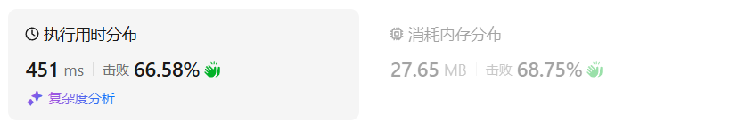

# 123买卖股票的最佳时机III（困难）

[123. 买卖股票的最佳时机 III - 力扣（LeetCode）](https://leetcode.cn/problems/best-time-to-buy-and-sell-stock-iii/description/)

## 题目描述

给定一个数组，它的第 `i` 个元素是一支给定的股票在第 `i` 天的价格。

设计一个算法来计算你所能获取的最大利润。你最多可以完成 **两笔** 交易。

**注意：**你不能同时参与多笔交易（你必须在再次购买前出售掉之前的股票）。

 

**示例 1:**

```
输入：prices = [3,3,5,0,0,3,1,4]
输出：6
解释：在第 4 天（股票价格 = 0）的时候买入，在第 6 天（股票价格 = 3）的时候卖出，这笔交易所能获得利润 = 3-0 = 3 。
     随后，在第 7 天（股票价格 = 1）的时候买入，在第 8 天 （股票价格 = 4）的时候卖出，这笔交易所能获得利润 = 4-1 = 3 。
```

**示例 2：**

```
输入：prices = [1,2,3,4,5]
输出：4
解释：在第 1 天（股票价格 = 1）的时候买入，在第 5 天 （股票价格 = 5）的时候卖出, 这笔交易所能获得利润 = 5-1 = 4 。   
     注意你不能在第 1 天和第 2 天接连购买股票，之后再将它们卖出。   
     因为这样属于同时参与了多笔交易，你必须在再次购买前出售掉之前的股票。
```

**示例 3：**

```
输入：prices = [7,6,4,3,1] 
输出：0 
解释：在这个情况下, 没有交易完成, 所以最大利润为 0。
```

**示例 4：**

```
输入：prices = [1]
输出：0
```

 

**提示：**

- `1 <= prices.length <= 105`
- `0 <= prices[i] <= 105`

## 我的C++解法

```cpp
class Solution {
public:
    int maxProfit(vector<int>& prices) {
        // int n = prices.size();
        vector<vector<int>> dp(3,vector<int>(2,0));
        dp[0][1] = dp[1][1] = dp[2][1] = int(INT_MIN/2);
        for(int price:prices){
            for(int i=2;i>0;i--){
                dp[i][1] = max(dp[i-1][0]-price,dp[i][1]);
                dp[i][0] = max(dp[i][0],dp[i][1]+price);
            }
        }
        return dp[2][0];
    }
};
```

结果：


## C++参考答案

关键在于至多买卖两次，这意味着可以买卖一次，可以买卖两次，也可以不买卖。


一天一共就有五个状态，

- 没有操作 （其实我们也可以不设置这个状态）
- 第一次持有股票
- 第一次不持有股票
- 第二次持有股票
- 第二次不持有股票

dp[i][j]中 i表示第i天，j为 [0 - 4] 五个状态，dp\[i][j]表示第i天状态j所剩最大现金。需要注意：dp\[i][1]，**表示的是第i天，买入股票的状态，并不是说一定要第i天买入股票，这是很多同学容易陷入的误区**。例如 dp[i][1] ，并不是说 第i天一定买入股票，有可能 第 i-1天 就买入了，那么 dp[i][1] 延续买入股票的这个状态。


达到dp[i][1]状态，有两个具体操作：

- 操作一：第i天买入股票了，那么dp\[i][1] = dp\[i-1][0] - prices[i]
- 操作二：第i天没有操作，而是沿用前一天买入的状态，即：dp\[i][1] = dp\[i - 1][1]

那么dp[i][1]究竟选 dp\[i-1][0] - prices[i]，还是dp\[i - 1][1]呢？

一定是选最大的，所以 dp[i][1] = max(dp\[i-1][0] - prices[i], dp\[i - 1][1]);

同理dp[i][2]也有两个操作：

- 操作一：第i天卖出股票了，那么dp\[i][2] = dp\[i - 1][1] + prices[i]
- 操作二：第i天没有操作，沿用前一天卖出股票的状态，即：dp\[i][2] = dp\[i - 1][2]

所以dp[i][2] = max(dp\[i - 1][1] + prices[i], dp\[i - 1][2])

同理可推出剩下状态部分：

dp\[i][3] = max(dp\[i - 1][3], dp\[i - 1][2] - prices[i]);

dp\[i][4] = max(dp\[i - 1][4], dp\[i - 1][3] + prices[i]);


第0天没有操作，这个最容易想到，就是0，即：dp\[0][0] = 0;

第0天做第一次买入的操作，dp\[0][1] = -prices[0];

第0天做第一次卖出的操作，这个初始值应该是多少呢？

此时还没有买入，怎么就卖出呢？ 其实大家可以理解当天买入，当天卖出，所以dp\[0][2] = 0;

第0天第二次买入操作，初始值应该是多少呢？应该不少同学疑惑，第一次还没买入呢，怎么初始化第二次买入呢？

第二次买入依赖于第一次卖出的状态，其实相当于第0天第一次买入了，第一次卖出了，然后再买入一次（第二次买入），那么现在手头上没有现金，只要买入，现金就做相应的减少。

所以第二次买入操作，初始化为：dp\[0][3] = -prices[0];

同理第二次卖出初始化dp\[0][4] = 0;


一定是从前向后遍历，因为dp[i]，依靠dp[i - 1]的数值。

红色框为最后两次卖出的状态。最终最大利润是dp\[4][4]

```cpp
class Solution {
public:
    int maxProfit(vector<int>& prices) {
        if (prices.size() == 0) return 0;
        vector<vector<int>> dp(prices.size(), vector<int>(5, 0));
        dp[0][1] = -prices[0];
        dp[0][3] = -prices[0];
        for (int i = 1; i < prices.size(); i++) {
            dp[i][0] = dp[i - 1][0];
            dp[i][1] = max(dp[i - 1][1], dp[i - 1][0] - prices[i]);
            dp[i][2] = max(dp[i - 1][2], dp[i - 1][1] + prices[i]);
            dp[i][3] = max(dp[i - 1][3], dp[i - 1][2] - prices[i]);
            dp[i][4] = max(dp[i - 1][4], dp[i - 1][3] + prices[i]);
        }
        return dp[prices.size() - 1][4];
    }
};
```

- 时间复杂度：O(n)
- 空间复杂度：O(n × 5)

优化空间写法

```cpp
class Solution {
public:
    int maxProfit(vector<int>& prices) {
        if (prices.size() == 0) return 0;
        vector<int> dp(5, 0);
        dp[1] = -prices[0];
        dp[3] = -prices[0];
        for (int i = 1; i < prices.size(); i++) {
            dp[1] = max(dp[1], dp[0] - prices[i]);
            dp[2] = max(dp[2], dp[1] + prices[i]);
            dp[3] = max(dp[3], dp[2] - prices[i]);
            dp[4] = max(dp[4], dp[3] + prices[i]);
        }
        return dp[4];
    }
};
```

- 时间复杂度：O(n)
- 空间复杂度：O(1)

不设置，‘0. 没有操作’ 这个状态，

```cpp
class Solution {
public:
    int maxProfit(vector<int>& prices) {
        if (prices.size() == 0) return 0;
        vector<vector<int>> dp(prices.size(), vector<int>(5, 0));
        dp[0][1] = -prices[0];
        dp[0][3] = -prices[0];
        for (int i = 1; i < prices.size(); i++) {
            dp[i][1] = max(dp[i - 1][1], 0 - prices[i]);
            dp[i][2] = max(dp[i - 1][2], dp[i - 1][1] + prices[i]);
            dp[i][3] = max(dp[i - 1][3], dp[i - 1][2] - prices[i]);
            dp[i][4] = max(dp[i - 1][4], dp[i - 1][3] + prices[i]);
        }
        return dp[prices.size() - 1][4];
    }
};
```

## C++收获


## 我的python解答

### 记忆化搜索

```python
class Solution:
    def maxProfit(self, prices: List[int]) -> int:
        n = len(prices)
        @cache
        def dfs(i:int,left:int,hold:bool):
            # left表示剩余的交易次数
            # 和上一题很像，考虑是否持有股票
            if i<0 or left<=0:
                return -inf if hold else 0
            if hold:
                # 今天持有股票，对昨天进行分类讨论
                return max(dfs(i-1,left,False)-prices[i],dfs(i-1,left,True))
            # 今天没有股票，对昨天进行分类讨论
            return max(dfs(i-1,left,False),dfs(i-1,left-1,True)+prices[i])
        return dfs(n-1,2,False)
```

真是奇了怪了，把left-1放在if hold里面才能通过，放在最后的返回反而不通过，难道不是两次卖出才算两笔交易吗？

```python
class Solution:
    def maxProfit(self, prices: List[int]) -> int:
        n = len(prices)
        @cache
        def dfs(i:int,left:int,hold:bool):
            # left表示剩余的交易次数
            # 和上一题很像，考虑是否持有股票
            if i<0 or left<=0:
                return -inf if hold else 0
            if hold:
                # 今天持有股票，对昨天进行分类讨论
                return max(dfs(i-1,left-1,False)-prices[i],dfs(i-1,left,True))
            # 今天没有股票，对昨天进行分类讨论
            return max(dfs(i-1,left,False),dfs(i-1,left,True)+prices[i])
        return dfs(n-1,2,False)
```

结果：


### 递推

```python
class Solution:
    def maxProfit(self, prices: List[int]) -> int:
        n = len(prices)
        f = [[[0]*2 for _ in range(3)] for _ in range(n+1)]
        # f[0][:][1] = -inf
        for i in range(3):
            f[0][i][1] = -inf
        for i in range(n+1):
            f[i][0][1] = -inf
        for i,price in enumerate(prices):
            for j in range(2,0,-1):
                f[i+1][j][1] = max(f[i][j-1][0]-price, f[i][j][1])
                f[i+1][j][0] = max(f[i][j][0], f[i][j][1]+price)
        return f[-1][2][0]
```

结果：


### 空间优化

```python
class Solution:
    def maxProfit(self, prices: List[int]) -> int:
        n = len(prices)
        f = [[[0]*2 for _ in range(3)] for _ in range(2)]
        # f[0][:][1] = -inf
        for i in range(3):
            f[0][i][1] = -inf
        for i in range(2):
            f[i][0][1] = -inf
        for i,price in enumerate(prices):
            for j in range(2,0,-1):
                f[(i+1)%2][j][1] = max(f[i%2][j-1][0]-price, f[i%2][j][1])
                f[(i+1)%2][j][0] = max(f[i%2][j][0], f[i%2][j][1]+price)
        return f[(n)%2][2][0]
```

结果：


### 继续优化空间：

```python
class Solution:
    def maxProfit(self, prices: List[int]) -> int:
        n = len(prices)
        f = [[0]*2 for _ in range(3)]
        # f[0][:][1] = -inf
        for i in range(3):
            f[i][1] = -inf
        for price in prices:
            for j in range(2,0,-1):
                f[j][1] = max(f[j-1][0]-price, f[j][1])
                f[j][0] = max(f[j][0], f[j][1]+price)
        return f[2][0]
```

结果：



## python参考答案

```python
class Solution:
    def maxProfit(self, prices: List[int]) -> int:
        if len(prices) == 0:
            return 0
        dp = [[0] * 5 for _ in range(len(prices))]
        dp[0][1] = -prices[0]
        dp[0][3] = -prices[0]
        for i in range(1, len(prices)):
            dp[i][0] = dp[i-1][0]
            dp[i][1] = max(dp[i-1][1], dp[i-1][0] - prices[i])
            dp[i][2] = max(dp[i-1][2], dp[i-1][1] + prices[i])
            dp[i][3] = max(dp[i-1][3], dp[i-1][2] - prices[i])
            dp[i][4] = max(dp[i-1][4], dp[i-1][3] + prices[i])
        return dp[-1][4]
```

```python
class Solution:
    def maxProfit(self, prices: List[int]) -> int:
        if len(prices) == 0:
            return 0
        dp = [0] * 5 
        dp[1] = -prices[0]
        dp[3] = -prices[0]
        for i in range(1, len(prices)):
            dp[1] = max(dp[1], dp[0] - prices[i])
            dp[2] = max(dp[2], dp[1] + prices[i])
            dp[3] = max(dp[3], dp[2] - prices[i])
            dp[4] = max(dp[4], dp[3] + prices[i])
        return dp[4]
```

## python收获