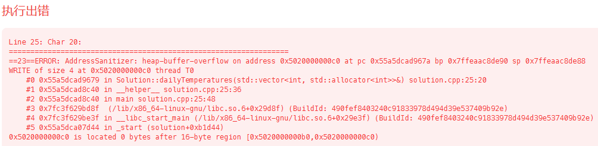
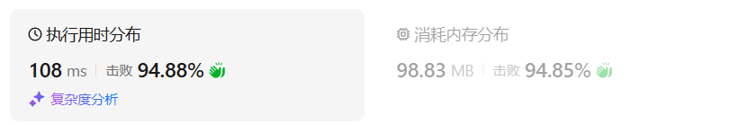
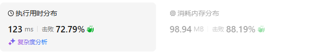
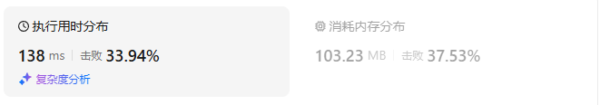
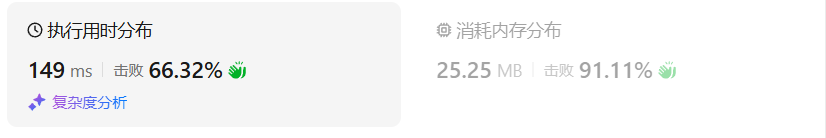
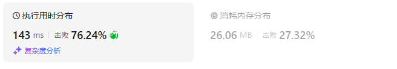

# 739每日温度（中等）

[739. 每日温度 - 力扣（LeetCode）](https://leetcode.cn/problems/daily-temperatures/description/)

## 题目描述

给定一个整数数组 `temperatures` ，表示每天的温度，返回一个数组 `answer` ，其中 `answer[i]` 是指对于第 `i` 天，下一个更高温度出现在几天后。如果气温在这之后都不会升高，请在该位置用 `0` 来代替。

 

**示例 1:**

```
输入: temperatures = [73,74,75,71,69,72,76,73]
输出: [1,1,4,2,1,1,0,0]
```

**示例 2:**

```
输入: temperatures = [30,40,50,60]
输出: [1,1,1,0]
```

**示例 3:**

```
输入: temperatures = [30,60,90]
输出: [1,1,0]
```

 

**提示：**

- `1 <= temperatures.length <= 105`
- `30 <= temperatures[i] <= 100`

## 我的C++解法

```cpp
class Solution {
public:
    vector<int> dailyTemperatures(vector<int>& temperatures) {
        // 我觉得倒着遍历，塞到栈里面会比较好
        // 出栈元素就是当前的max，还要记录一个整数，表示连续几天，始终是这个最高温度
        // 如果出战元素大于当前的max，则更新max，该位置返回0即可
        // 使用vector容器模拟栈
        int n = temperatures.size();
        vector<int> ans(n,0);
        vector<int> stack;
        for(int x:temperatures){
            stack.push_back(x);
        }// 所有元素压栈
        int max_t = 0;
        int count = 0;
        for(int i=n-1;i>=0;i++){
            if(stack.back()>=max_t){
                count = 0;
                max_t = stack.back();
                stack.pop_back();
            }
            else{
                count++;
            }
            ans[i] = count;
        }
        return ans;
    }
};
```

我觉得思路很对啊，但是说栈溢出了？？？



仔细想了想发现这个思路是错误的，比如给出案例`3,1,2,6`目标是`[3,1,1,0]`，可是上面做法会输出`[3,2,1,0]`，不合题意，需要重新考虑

单调栈的思想我给忘了我擦

 

```cpp
class Solution {
public:
    vector<int> dailyTemperatures(vector<int>& temperatures) {
        // 我觉得倒着遍历，塞到栈里面会比较好
        // 出栈元素就是当前的max，还要记录一个整数，表示连续几天，始终是这个最高温度
        // 如果出战元素大于当前的max，则更新max，该位置返回0即可
        // 使用vector容器模拟栈
        int n = temperatures.size();
        vector<int> ans;
        vector<int> stack;
        stack.push_back(temperatures.back());
        ans.push_back(0);
        int count = 0;
        for(int i=n-2;i>=0;i--){
            if(temperatures[i]<stack.back()){
                count++;
                stack.push_back(temperatures[i]);
                ans.insert(ans.begin(),1);
            }
            else{
                count = 0;
                while(stack.size()!=0 && temperatures[i]>=stack.back()){
                    stack.pop_back();
                    count++;
                }
                stack.size()==0? count = 0:count = count;
                stack.push_back(temperatures[i]);
                ans.insert(ans.begin(),count);
            }
        }
        return ans;
    }
};
```

还是错误了，错因在于存储了具体的数据，而不是下标。存储下标的好处：可以很方便地计算两个下标之间的差值，从而得到所谓的count

```cpp
class Solution {
public:
    vector<int> dailyTemperatures(vector<int>& temperatures) {
        // 使用vector容器模拟栈
        int n = temperatures.size();
        vector<int> ans;
        vector<int> stack;
        stack.push_back(n-1);
        ans.push_back(0);
        for(int i=n-2;i>=0;i--){
            if(temperatures[i]<temperatures[stack.back()]){
                stack.push_back(i);
                ans.insert(ans.begin(),1);
            }
            else{
                while(stack.size()!=0 && temperatures[i]>=temperatures[stack.back()]){
                    stack.pop_back();
                }
                int count;
                stack.size()==0? count = 0:count = stack.back() - i;
                stack.push_back(i);
                ans.insert(ans.begin(),count);
            }
        }
        return ans;
    }
};
```

别的挺好，就是有案例超时了

```cpp
class Solution {
public:
    vector<int> dailyTemperatures(vector<int>& temperatures) {
        // 使用vector容器模拟栈
        int n = temperatures.size();
        vector<int> ans(n,0);
        vector<int> stack;
        stack.push_back(n-1);
        for(int i=n-2;i>=0;i--){
            if(temperatures[i]<temperatures[stack.back()]){
                stack.push_back(i);
                ans[i] = 1;
            }
            else{
                while(stack.size()!=0 && temperatures[i]>=temperatures[stack.back()]){
                    stack.pop_back();
                }
                int count;
                stack.size()==0? count = 0:count = stack.back() - i;
                stack.push_back(i);
                ans[i]= count;
            }
        }
        return ans;
    }
};
```

结果：



## C++参考答案

### 从右向左

```cpp
class Solution {
public:
    vector<int> dailyTemperatures(vector<int> &temperatures) {
        int n = temperatures.size();
        vector<int> ans(n);
        stack<int> st;
        for (int i = n - 1; i >= 0; i--) {
            int t = temperatures[i];
            while (!st.empty() && t >= temperatures[st.top()]) {
                st.pop();
            }
            if (!st.empty()) {
                ans[i] = st.top() - i;
            }
            st.push(i);
        }
        return ans;
    }
};
```

结果：



- 时间复杂度：O(*n*)，其中 *n* 为 *temperatures* 的长度。虽然我们写了个二重循环，但站在每个元素的视角看，这个元素在二重循环中最多入栈出栈各一次，因此循环次数**之和**是 O(*n*)，所以时间复杂度是 O(*n*)。
- 空间复杂度：O(min(*n*,*U*))，其中 *U*=max(*temperatures*)−min(*temperatures*)+1。返回值不计入，仅考虑栈的最大空间消耗

### 从左到右

栈中记录还没算出「下一个更大元素」的那些数（的下标）。

```cpp
class Solution {
public:
    vector<int> dailyTemperatures(vector<int> &temperatures) {
        int n = temperatures.size();
        vector<int> ans(n);
        stack<int> st;
        for (int i = 0; i < n; i++) {
            int t = temperatures[i];
            while (!st.empty() && t > temperatures[st.top()]) {
                int j = st.top();
                st.pop();
                ans[j] = i - j;
            }
            st.push(i);
        }
        return ans;
    }
};
```

结果：



- 时间复杂度：O(*n*)，其中 *n* 为 *temperatures* 的长度。虽然我们写了个二重循环，但站在每个元素的视角看，这个元素在二重循环中最多入栈出栈各一次，因此循环次数**之和**是 O(*n*)，所以时间复杂度是 O(*n*)。
- 空间复杂度：O(*n*)。注意这种写法栈中可以有重复元素。

## C++收获


## 我的python解答

```python
class Solution:
    def dailyTemperatures(self, temperatures: List[int]) -> List[int]:
        n = len(temperatures)
        stack = []
        ans = [0]*n
        for i in range(n-1,-1,-1):
            t = temperatures[i]
            while stack and t>=temperatures[stack[-1]]:
                stack.pop()
            if stack:
                ans[i] = stack[-1] - i
            stack.append(i)
        return ans
```

结果：



## python参考答案

### 从右往左

```py
class Solution:
    def dailyTemperatures(self, temperatures: List[int]) -> List[int]:
        n = len(temperatures)
        ans = [0] * n
        st = []
        for i in range(n - 1, -1, -1):
            t = temperatures[i]
            while st and t >= temperatures[st[-1]]:
                st.pop()
            if st:
                ans[i] = st[-1] - i
            st.append(i)
        return ans
```

### 从左往右

```py
class Solution:
    def dailyTemperatures(self, temperatures: List[int]) -> List[int]:
        n = len(temperatures)
        ans = [0] * n
        st = []
        for i, t in enumerate(temperatures):
            while st and t > temperatures[st[-1]]:
                j = st.pop()
                ans[j] = i - j
            st.append(i)
        return ans
```

结果：



## python收获